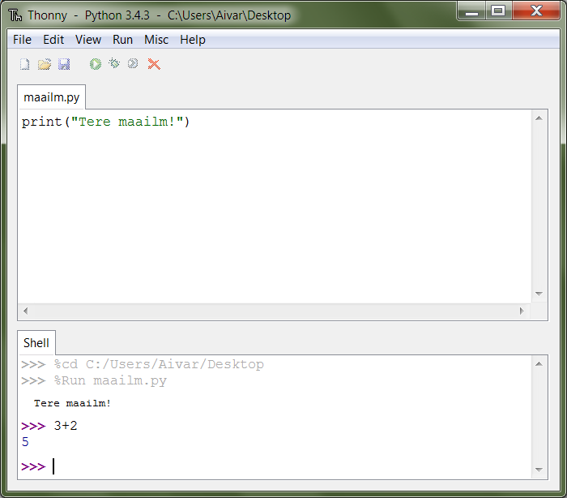

1. Sissejuhatus
***************

.. todo::

    quotes: http://www.marcofolio.net/tips/27_inspiring_top_notch_programming_quotes.html
    http://quotes.cat-v.org/programming/

.. todo::

    Näita, et programmeerimine ei ole kellelegi üle mõistuse. Proovi demonstreerida, et ka need, kes arvavad, et ei oska, siiski oskavad.
    
Esimese peatüki eesmärk on tutvustada Pythoni põhilisi töövahendeid ning anda pealiskaudne ülevaade programmeerimise olemusest ja võimalustest. Uurime ka mõningaid keerulisemaid näiteprogramme, kuid need on mõeldud vaid andmaks aimu õpiku edasisest käigust -- täpsemad selgitused ning süstemaatilise harjutamise jätame järgmistesse peatükkidesse.

.. todo::

    arutulusega programmi kirjapanek ülesande püstitusest alustades

.. index::
    single: installeerimine

Arenduskeskkonna Thonny paigaldamine
====================================
Thonny on algajatele mõeldud Pythoni programmeerimiskeskkond, mille paigaldusfailid ja -juhised leiad aadressilt http://thonny.cs.ut.ee.

Lihtsuse huvides on Thonnysse Pythoni interpretaator juba sisse ehitatud, seega piisab ainult Thonny installimisest.

Thonnyga seotud probleemide korral kirjuta aadressile aivar.annamaa@ut.ee. 

Alternatiiv: Pythoni paigaldamine
=================================
Kui soovid kasutada mingit muud arenduskeskkonda, siis tuleks kõigepealt paigaldada arvutisse Python.

Pythoni paigaldamiseks Windowsiga arvutisse lae leheküljelt http://www.python.org/downloads/ alla esimesena pakutav, värskeim paigaldusfail Windowsi jaoks (selle teksti kirjutamise hetkel oli värskeim versioon 3.4.1) ja käivita see.

Mac-is on tavaliselt Python küll olemas, aga see on Python 2, mis meile ei sobi. Python 3 paigaldamiseks kasuta mainitud lehel pakutavat Python 3 paigaldusfaili Mac-i jaoks.

Ka Linuxis on tõenäoliselt olemas Python 2. Python 3 on kõige kindlam paigaldada paketihalduri abil. Vajaminevad paketid on populaarsemates distributsioonides nimedega `python3`, `python3-tk` ja `idle3`. Nt Ubuntus piisab käsust ``sudo apt-get install idle3`` (see peaks sõltuvustena paigaldama ka ülejäänud 2 paketti). 

Pythoni versioon ei pea olema tingimata kõige uuem, aga on oluline, et versiooni number algab 3-ga. Versioonides, mis algavad 2-ga, töötavad mõned asjad teisiti, kui on kirjeldatud selles õpikus.

Esimene programm
================
Alustuseks kirjutame ühe väga lihtsa programmi, mis ei tee muud, kui kirjutab ekraanile ``Tere maailm!`` (vt ka http://en.wikipedia.org/wiki/Hello_world_program). 

Pythoni programme võiks vabalt kirjutada näiteks Notepadi või mõne muu üldotstarbelise tekstiredaktoriga, kuid Thonny on selle töö jaoks palju sobivam.

Thonny esmakordsel avamisel peaks olema kohe tühi redaktor uue programmi kirjutamiseks. Esimeseks katsetuseks kirjuta või kopeeri sinna järgnev üherealine programmitekst:

.. sourcecode:: py3

    print("Tere maailm!")
    
Salvesta fail (`Ctrl+S`) kasutades failinime lõpus laiendit `py`, nt `teremaailm.py`. (NB! Soovitatav on juba praegu teha oma programmeerimisharjutuste jaoks eraldi kaust.) Taolist Pythoni programmi sisaldavat tekstifaili nimetame edaspidi *skriptiks*.

**Programmi käivitamiseks** vajuta klaviatuuril `F5`. Akna allservas olevasse käsurea paneeli peaks tekkima uus rida tekstiga ``Tere maailm!``.

Selgitused:

* nagu võid järeldada, tähendab ``print`` Pythoni jaoks teksti ekraanile kuvamist, mitte printerisse saatmist;
* selleks, et Python suudaks teha vahet käskudel ja tavalisel tekstil, kirjutatakse tekst jutumärkide vahele.

.. admonition:: Õpinipp. Eksperimenteeri!

    Programmeerimise õppimisel on kasulik võtta uudishimulik hoiak. Kui õpik ütleb, et selle ja selle jaoks tuleb teha nii ja nii, siis küsi endalt "Aga mis siis, kui ..." ja proovi järele.
    
Kasutajaga suhtlemine
=====================
Meie esimene programm polnud just kõige põnevam. Proovime nüüd programmi, mis suhtleb kasutajaga dialoogi, mitte monoloogi vormis. Tekita uus programmifail (Thonnys `File -> New`) ja kopeeri sinna järgnev programm. *NB! Ära praegu veel oma nime kuhugi kirjuta!*

.. sourcecode:: py3

    nimi = input("Palun sisesta oma nimi ja vajuta ENTER: ")
    print("Tere " + nimi + "!")

Salvesta ja käivita programm. Ilmub taas käsurea aken palvega sisestada oma nimi. Enne oma nime kirjutamist (kooloni järele) proovi ennustada, milline tekst ilmub ekraanile, kui sa oled nime sisestanud. Katseta! Kui arvasid õigesti, siis vaata programmi tekst uue pilguga üle ja mõtle, milline otstarve võiks olla igal programmielemendil.

Selgitused:

* käsk ``input`` võimaldab kasutajal midagi sisestada ning edastab saadud teksti Pythonile;
* konstruktsioon ``nimi = ...`` salvestab selle teksti mällu, edaspidi saab sellele tekstile viidata kirjutades lihtsalt ``nimi``;
* konstruktsioon ``"Tere " + nimi + "!"`` kombineerib etteantud tekstijupid ja kasutaja nime uueks tekstiks.

Harjutus. Programmi muutmine
----------------------------
Tee programmis mingeid muudatusi, salvesta ja käivita. Katseta ka selliseid muudatusi, mis võiksid sinu arvates Pythoni segadusse ajada.

.. note:: 

    Ära karda teha vigu! Kui Python annab mingi veateate, siis kontrolli kõigepealt oma viimast muudatust -- võibolla on puudu lõpetav sulg vms. Veateadetest arusaamine on tavaliselt algajate jaoks küll raske, kuid sellega tuleb ennast harjutada -- vigadeta ei suuda töötada ükski programmeerija.

Arvutamine
==========
Järgmine näiteprogramm demonstreerib, et Python tunneb aritmeetikat. Enne katsetamist uuri programmi hoolikalt ning mõtle, milline tähendus võiks igal programmikomponendil olla:

.. sourcecode:: py3

    a = float(input("Palun sisesta esimene arv: "))
    b = float(input("sisesta teine arv: "))
    
    print("Arvude summa:", a + b)
    print("Arvude korrutis:", a * b)
    print("Esimese ja teise jagatis:", a / b)
    print("25% esimesest arvust:", a * 0.25)
    
    if a == b:
        print("Arvud on võrdsed")
    else:
        print("Arvud on erinevad")
        if a > b:
            print("Esimene arv on suurem")
        else:
            print("Teine arv on suurem")
    
Selgitused: 

* ``input``-i abil saab Python kätte kasutaja poolt sisestatud teksti (nii nagu eelmises näites);
* ``float`` teisendab saadud teksti arvuks;
* konstruktsioon ``a = ...`` salvestab saadud arvu mällu, edaspidi saab selle arvu kätte kirjutades lihtsalt ``a``;
* ``print`` käsule võib ette anda mitu asja korraga;
* konstruktsioon ``if-else`` valib täitmisele minevad käsud vastavalt etteantud tingimustele.

.. note::

    Selles peatükis anname programmidele väga põgusad selgitused. Kõikide konstruktsioonide täpsed tähendused ja kasutusjuhised toome välja järgnevates peatükkides.

Matemaatilised funktsioonid
---------------------------
Python tunneb ka matemaatilisi funktsioone ja konstante, nagu näiteks ``sin`` ja ``pi``. Kuna paljudes programmides neid vaja ei lähe, on nad esialgu peidetud. Nende kasutamiseks tuleb neid ``import`` lause abil eraldi küsida:

.. sourcecode:: py3

    from math import sin, cos, pi
    
    print(pi)
    print(cos(0.5))
    
    x = sin(4)
    print(x)
    
    y = 123 
    print(round(x + y, 2))

Harjutus. Puu läbimõõdu arvutamine
----------------------------------
Proovi kirjutada eelnevate näidete põhjal programm, mis küsib kasutaja käest puu ümbermõõdu ning teatab selle peale puu läbimõõdu.

.. note::
    Kui jääd veateadetega hätta, siis kontrolli kõigepealt, kas sul on sulud tasakaalus, st iga alustava sulu jaoks on õiges kohas ka lõpetav sulg.

.. index::
    single: turtle
    single: kilpkonn; turtle
    
Kilpkonn
========
Programmeerimise puhul on etteantud käskude hulk piiratud – arvuti mõistab vaid üksikuid väga lihtsaid käske. Neid kombineerides ja õigesti järjestades on aga võimalik arvutit panna tegema väga keerulisi asju. 

Demonstreerimaks käskude kombineerimist toome siinkohal sisse ühe pedagoogilise abimehe – kilpkonna. Meie virtuaalne kilpkonn oskab kõndida edasi ja tagasi ning ennast pöörata. Tal on hambus ka pliiats, millega ta ringi kõndides enda all olevale pinnale jälje jätab. Vajadusel võib ta seda pliiatsit paberilt tõsta ning siis taas langetada. Järgnevalt vaatame, kuidas kilpkonnale sobivas järjekorras käske andes saame joonistada huvitavaid kujundeid.

.. note:: 
    
    Sellise kilpkonna mõtlesid aastal 1967 esmakordselt välja W. Feurzeig ja S. Papert, kes kasutasid seda lastele programmeerimise õpetamiseks Logo programmeerimiskeeles. Praeguseks on kilpkonnast saanud programmeerimise õpetamise klassika.

Kilpkonn Pythonis
-----------------
Kilpkonna juhtimiseks kasutame 5 erinevat käsku:

* ``forward(n)`` -- liigu edasi `n` pisikese sammu võrra (ühe sammu pikkus on 1 *piksel*);
* ``left(d)``, ``right(d)`` -- pööra vasakule / paremale `d` kraadi;
* ``up()``, ``down()`` -- tõsta pliiats üles / langeta pliiats vastu paberit.

Esimese käskluse andmisel avaneb uus aken, kus kilpkonna tähistab väike nooleke.

Nii nagu matemaatilised funktsioonidki, pole antud käsud mitte kohe kättesaadavad, vaid on peidetud `moodulisse` ``turtle``. Nende kasutamiseks ütleme seekord Pythonile ``from turtle import *`` (see impordib kõik kilpkonna käsud korraga).

Proovi järgnevat näiteskripti, mis joonistab kilpkonna abil kolmnurga:

.. note::
    
    Ära pane oma skripti nimeks `turtle.py` -- see ajab Pythoni `import` käsu segadusse.
    
.. sourcecode:: py3
    
    from turtle import *
    
    forward(100)
    left(120)
    forward(100)
    left(120)
    forward(100)
    left(120)
    
    exitonclick() # see võimaldab akna sulgemist hiireklõpsuga

Harjutus. Ruut
--------------
Kirjuta skript, mis joonistab kilpkonnaga ruudu.

Kontrollküsimus. Mis see on?
----------------------------
Mida joonistab järgmine programm? NB! Proovi vastata enne programmi käivitamist! Vajadusel mängi programm paberi ja pliiatsiga läbi. 

.. sourcecode:: py3

    from turtle import *
    
    forward(100)
    right(90)
    forward(20)
    
    left(120)
    forward(60)
    left(120)
    forward(60)
    left(120)
    
    forward(20)
    right(90)
    forward(100)
    
    left(90)
    forward(20)
    
    exitonclick()
    
Näide. Sisendi ja muutujate kasutamine joonistamisel
----------------------------------------------------
Tuleta meelde ülalpool toodud kasutaja nime küsimise programmi ja proovi selle põhjal ennustada järgneva näiteprogrammi käitumist:

.. sourcecode:: py3

    from turtle import *
    
    nipitiri = int(input("Sisesta mingi täisarv: "))
    
    forward(nipitiri)
    left(120)
    forward(nipitiri)
    left(120)
    forward(nipitiri)
    left(120)
    
    exitonclick() 
   

Selle programmi katsetamisel tuleb toimetada kahes aknas -- kõigepealt on vaja sisestada käsureal küsitud arv ning seejärel jälgida graafikaaknas toimuvat. Proovi programmi käivitada mitu korda, sisestades igal korral erineva arvu.

Nagu näed, joonistatakse alati võrdkülgne kolmnurk, mille küljepikkus sõltub sisestatud arvust. Seda aitab saavutada *muutuja* kasutamine -- 3. real salvestame kasutaja sisestatud arvu muutujasse nimega ``nipitiri`` ja järgnevalt kasutame sama muutujat kolmes kohas, mis annabki kõigile külgedele sama pikkuse. Käsk ``int`` muutuja salvestamise juures teisendab kasutaja sisestatud teksti arvuks (tekst ``"150"`` ja arv ``150`` on Pythoni jaoks täiesti erinevad asjad). 

Harjutus. Ümbrik
----------------
Kirjuta skript, mis joonistab kilpkonnaga mõne huvitava kujundi, näiteks ümbriku. 

.. hint::
    
    Diagonaali pikkuse leidmiseks tuleta meelde üht tuntud koolimatemaatika teoreemi. Kui jääd sellega hätta, siis proovi leida paras pikkus katsetamise teel.

.. index::
    single: veaotsing

.. index::
    single: käsurida
    single: shell; käsurida

Pythoni käsurida
================
Programmeerida saab ka käsureal, ilma et programmi peaks skriptina salvestamata. Selline programmeerimise viis sobib väiksemate ülesannete lahendamiseks ning Pythoni võimaluste katsetamiseks. Kuna käske antakse ühekaupa ja tulemus näidatakse kohe järgmisel real, nimetatakse seda ka *interaktiivseks programmeerimiseks*. 

Thonnys on käsurida alati nähtav, IDLE'is saad käsurea avada menüüvalikuga `Windows -> Python shell`. Käsuviip ``>>>`` näitab kohta, kuhu saab kirjutada Pythoni käsu -- vajutades ENTER, see käsk täidetakse. Järgnev näide on kopeeritud käsurealt, kuhu sisestati 2 käsku ``print("Tere maailm!")`` ja ``print(23*454)``:

.. sourcecode:: py3

    >>> print("Tere maailm!")
    Tere maailm!
    >>> print(23*454)
    10442

.. note::

    Edaspidi tuleb meil näiteid nii käsurea kui ka skriptide (st faili salvestatud programmide) kohta. Kui näide algab käsuviibaga (``>>>``), siis esitab see käsurea dialoogi. Vastasel juhul on tegemist skriptiga.
    
    NB! Käsureal kasutatakse käsuviiba märki vaid selleks, et oleks kergem eristada, millistel ridadel on käsud ja millistel on vastused. Seda ei ole vaja kunagi ise kirjutada. Skriptis ei kasutata seda märki kunagi.

.. note::

    Thonny käsureal saab varasema käsu uuesti aktiivseks vajutades nool-üles klahvi. IDLE'is tuleb liikuda nooleklahvidega soovitud käsuni ja vajutada ENTER (veidi kiirem variant on klahvikombinatsioon Alt+P (P nagu *previous*)).

Harjutus. Interaktiivne programmeerimine
----------------------------------------
Katseta erinevaid siiani nähtud käske ka käsureal. Proovi muuhulgas ka Pythoni mälu kasutamist.

Python kui kalkulaator
----------------------
.. note::
    
    Siin ja edaspidi on käsurea näidete juures soovitatav ise läbi proovida mõned sarnased, aga mitte samad näited (kui proovid täpselt samu näiteid, siis usu, sa saad ka samad tulemused). Ürita Pythonit (või iseennast) üllatada!

Nagu nägid, oskab Python arvutada, seega saaks Pythoni käsurida kasutada võimsa kalkulaatorina. Kuna ``print``-i kirjutamine iga arvutuse juures on liiga tüütu, näidatakse käsureal tulemust ka siis, kui avaldis kirjutada ilma ``print`` käsuta: 

.. sourcecode:: py3  
    
    >>> 3 / 2
    1.5
    >>> 5 * 5
    25
    >>> 4 + 9 - 1
    12
    >>> 10 / 3
    3.3333333333333335
    >>> round(10 / 3)
    3

.. note::
    
    Selline trikk toimib ainult käsureal. Kui soovid skriptis midagi ekraanil näidata, tuleb kasutada ikkagi ``print``-käsku.
    

Arve saab mällu salvestada samamoodi nagu skriptis:

.. sourcecode:: py3

    >>> a = 2 * 3 
    >>> b = 1
    >>> a + b + 2
    9

Ka matemaatiliste funktsioonide importimine toimib samal põhimõttel nagu skripti puhul:

.. sourcecode:: py3

    >>> from math import sin, pi
    >>> sin(1)
    0.8414709848078965
    >>> pi
    3.141592653589793

Harjutus. Ruutjuur
------------------
.. todo::

    See peaks olema enne ümbrikku

#. Uuri Pythoni matemaatikamooduli dokumentatsiooni aadressilt http://docs.python.org/3/library/math.html.
#. Proovi aru saada, kuidas arvutatakse Pythonis ruutjuurt.
#. Arvuta Pythoni käsureal, kui pikk on ristkülikukujulise maatüki (mõõtmetega 50m x 75m) diagonaal.

.. hint::

    .. sourcecode:: py3
    
        >>> from math import sqrt
        >>> sqrt(4)
        2.0    

Vigadest
========
Nagu sa ehk eelnevaid ülesandeid lahendades juba märkasid, annab Python märku, kui sa tema arvates midagi valesti oled teinud. Veateateid võiks kõige üldisemalt jaotada kahte liiki:

**Süntaksivea** (ingl *syntax error*) korral ei saa Python programmi tekstist aru ja seetõttu ei hakka ta programmi üldse käivitama. Veateate ütleb Python selle rea kohta, kust ta enam edasi lugeda ei osanud, tegelik vea põhjus on tihti hoopis eelneval real. Üks tüüpilisemaid süntaksivigu on puuduv lõpetav sulg -- kuigi iga programmeerija saab aru, mida on mõeldud lausega ``x = 3 + (4 * 5``, on see Pythoni jaoks täiesti mõttetu tekst, sest see ei vasta Pythoni reeglitele. Teisiti öeldes, Python (nagu ka iga teine programmeerimiskeel) on suur tähenärija ning sellega tuleb arvestada -- programmi kirjutamisel tuleb olla täpne!

**Täitmisaegse vea** (ingl *runtime error*) puhul programm küll käivitati, aga mingi konkreetse käsu täitmine ebaõnnestus. Vigaseks käsuks võis olla näiteks nulliga jagamine, valesti kirjutatud funktsiooninime kasutamine, olematu faili lugemine vms. Kui sa pole siiani ühtki täitmisaegset veateadet näinud, siis sisesta käsureal käsk ``prin("Tere!")``. Täitmisaegseid vigu nimetatakse tihti ka **erinditeks** (ingl *exception*).

.. note::

    Täitmisaegses veateates on tavaliselt mitme rea jagu infot, mis on abiks kogenud programmeerijale, aga võib algajal silme eest kirjuks võtta. Sellest ei tasu lasta ennast heidutada -- enamasti piisab vaid veateate viimase rea lugemisest. Lisaks probleemi kirjeldusele on veateates alati ka reanumber, mis viitab vea tekitanud reale programmi tekstis. (Käsureal töötades on aktiivse käsu reanumber alati 1.)

    Paraku tuleb algajatel vahel ka veateate viimase rea üle pead murda -- hea näide on see, kui sulle öeldakse käsu ``cos(pi)`` peale ``NameError: name "cos" not defined``. Sisuline põhjus pole siin mitte see, et käsk ``cos`` vale oleks, vaid see, et sa unustasid eelnevalt ``cos`` funktsiooni importida. (Ei, Python ei soovi programmeerijaid segaste teadetega kiusata -- kui õpid tundma Pythoni tööpõhimõtteid, siis paistab ka sulle antud veateate sõnastus täiesti loomulik.)

.. note::

    Veateate põhjust on kergem leida, kui sa kirjutad programmi järk-järgult ja katsetad poolikut lahendust iga täienduse järel. Kui programm töötas korralikult enne viimase rea lisamist, aga nüüd annab veateate, siis tõenäoliselt on viga viimases reas ja sa ei pea tervet programmi läbi vaatama.

Veateateid näed sa oma programmeerimise karjääri jooksul väga palju, seega ei maksa neid karta. Lähtu sellest, et iga veateade on mõeldud programmeerija abistamiseks -- loe teate tekst (või vähemalt viimane rida) alati hoolikalt läbi ja mõtle, milles võis probleem olla. Nii märkad varsti, et Pythoni veateadete salakiri on muutunud arusaadavaks ja kasulikuks informatsiooniks.

Loogikavead
-----------
Programmeerimises on veel üks liik vigasid, mis on kõige raskemini avastatavad -- need on **loogikavead**. Nende vigade puhul võib kõik olla Pythoni seisukohast korrektne (st mingit veateadet ei tule), aga programm ei tee seda, mida programmeerija silmas pidas.

Harjutus. Loogikaviga
---------------------
Leia järgnevast näiteprogrammist loogikaviga:

.. sourcecode:: py3

    aeg = float(input("Mitu tundi kulus sõiduks? "))
    teepikkus = float(input("Mitu kilomeetrit sõitsid? "))
    kiirus = aeg / teepikkus
    
    print("Sinu kiirus oli", kiirus, "km/h")

.. todo::

    TODO: Näide koos arutlusega
    TODO: Video!

Programmeerimisest üldisemalt
=============================
Astume nüüd sammu tagasi ja vaatame üle mõningad üldisemad programmeerimisega seotud küsimused.

Mis on programm?
----------------
`Programm`, nii nagu me seda selles õpikus mõistame, on mingi tegevuse kirjeldus. Selle poolest on programmi mõiste väga sarnane teatris ja kinos kasutatavale käsikirja e stsenaariumi mõistele (inglise keeles saab kasutada mõlema mõiste kohta lausa sama sõna `script`).

Oluline erinevus teatri käsikirja ning programmi vahel on see, et programm pannakse kirja mingis `programmeerimiskeeles` (nt `Python` või `Java`), mitte loomulikus keeles (nt eesti või inglise keel). Programmeerimiskeeled on palju primitiivsemad ja rangemad kui loomulikud keeled (seda nii sõnavara kui ka reeglite poolest), seetõttu on võimalik neid keeli õpetada ka arvutile. See omakorda võimaldab meil lasta arvutil oma käsikirja etendada (st programmi käivitada e jooksutada). 

Tavapärases kirjas või kõnes on iga mõte tavaliselt väljendatud liiaga -- kui mõnes lauses on kirjaviga või keelevääratus, siis järgnevad sõnad ja laused aitavad mõttest siiski õigesti aru saada. Programmeerimiskeeles kirjutatud tekstid on seevastu tihedad, seal ei ole midagi üleliigset, mille abil saaks vigaselt väljendatud mõtet õigesti mõista -- kui programmeerija kirjutab kasvõi ühe tähe valesti, on tulemuseks vigane või vale tähendusega programm. See tähendab, et *programmides mängivad pisikesed detailid palju suuremat rolli kui loomulikus kõnes või kirjas*.

Veel üks erinevus: kuigi kaasaegses teatris kaasatakse mõnikord etendusse ka publikut, on etenduse kulg enamasti siiski ette teada. Programmidesse on seevastu peaaegu alati sisse kirjutatud ka publikuga (kasutajaga) suhtlemine, mis võib edasist programmi käiku väga oluliselt mõjutada. Lisaks kasutajalt saadud infole (mis on edastatud nt hiire või klaviatuuri abil) võib programm hankida infot ka näiteks kõvakettalt või internetist.

Mis on programmeerimine?
------------------------

.. todo::

    TODO: kunst? teadus? inseneritöö?

Kõige lihtsam oleks öelda, et programmeerimine on programmi kirjapanemine. Tehniliselt võttes see nii ongi, aga mängu tulevad ka mõned inimlikud aspektid.

Kuna lähteülesanne on alati püstitatud loomulikus keeles, võivad paljud olulised nüansid jääda esialgu tähelepanuta. Seetõttu ei õnnestu tavaliselt programmi oma peast lihtsalt "maha kirjutada" -- enamasti tuleb alustada mõne fragmendiga, mille kirjapanek annab parema arusaamise ülesande olemusest. Parem arusaamine omakorda võimaldab näha, mida tuleks veel täpsustada, mida järgmisena kirja panna jne. Teisiti öeldes peab programmeerija pidevalt ülesannet `analüüsima`. Analüüsi ning programmi kirjutamise tsükkel kordub suuremate ülesannete juures palju kordi.

Teiseks, programmeerija on inimene ja inimene teeb vigu. Seetõttu loetakse üheks programmeerimise osaks ka programmi `silumist` st juba kirjapandud programmist vigade otsimist ja nende parandamist. Suurem osa vigu avastatakse eespool kirjeldatud kirjutamise ja analüüsimise protsessis, aga tähelepanelik maksab olla ka siis, kui programm on sinu arvates juba valmis.

Kokkuvõtteks võib öelda, et *programmeerimine on mitmekesine protsess*, kuhu on muuhulgas põimitud ülesande analüüsimine, lahenduse kirjapanek, selle kontrollimine ja parandamine.

.. todo:: 

    Kas programmeerimine on "kuiv"? Kas on olemas 1 õige lahendus?

.. todo::

    Esimene kirjutis ei pea olema lõplik

Mis on Python?
--------------
Python on programmeerimiskeel ning samas ka programm, mis `interpreteerib` keeles Python kirjutatud programme. 

.. note::

    Mõne programmeerimiskeele puhul (nt. `C` või `C++`) tõlgitakse e kompileeritakse programmid enne käivitamist masinkoodi (st arvuti keelde). Selliselt ettevalmistatud programmide käivitamiseks pole eraldi interpretaatorprogrammi tarvis -- arvuti ise on interpretaator.
    
    Taolisel lähenemisel on omad eelised ja omad puudused, aga on leitud, et vähemalt programmeerimise õppimisel on interpreteeritava keele (nt Pythoni) kasutamine mugavam.
    

Mõtteharjutus. Tehisintellekt
-----------------------------
Kuidas võiks arvutite ja tehisintellekti areng mõjutada programmeerijate elu? Kas tulevikus saab programmeerida eesti või inglise keeles? Millised takistused tuleks selleks ületada? Kas kunagi hakkavad arvutid arvestama sellega, et programmeerija võib teha vigu? ("Hmm... siin on küll kirjas ``2 / x``, aga see ei klapi siin mitte, küllap ta mõtles ``x / 2``.")

Programmeerimise õppimine
=========================
Programmeerimist ei saa ära õppida selles mõttes nagu saab selgeks õppida teatud hulka võõrkeelseid väljendeid. Kuigi kõik Pythonis programmeerimise reeglid saaks vabalt mahutada ühele A4-le, ei piisa ainult nende meeldejätmisest, sest võimalusi nende reeglite kombineerimiseks on lõputult. Lisaks reeglite teadmisele tuleb osata näha ülesande sisse, märgata selle nüansse, kujutleda otsitavat lahendust ning lõpuks tõlkida oma nägemus programmeerimiskeelde. See on protsess, mis nõuab samaaegselt loovust ja täpsust, üldistusvõimet ja konkreetsust. 

Et suuta taolist protsessi oma peas läbi viia ka raskete (st huvitavate) ülesannete puhul, on vaja harjutada järjest raskemate ülesannetega, ainult teooria lugemisest ja näiteülesannete läbiproovimisest ei piisa. Seetõttu on järgnevates peatükkides hulk ülesandeid, mis nõuavad äsja loetud materjali praktilist rakendamist.

.. admonition:: NB!

    Eespool mainitud täpsuse ja konkreetsuse aspekt ütleb muuhulgas seda, et ülesande lahendus tuleks panna kirja isegi siis, kui sa suudad selle oma peas valmis konstrueerida. Keel, mida me kasutame mõtlemiseks, on palju hägusam ja vähem range kui programmeerimiskeeled, seetõttu on alati võimalus, et pealtnäha korralik lahendus meie peas on tegelikult puudulik või vigane.

Kui sa tunned, et mõne õpikus antud ülesande lahendamiseks pole piisavalt juhtnööre, siis tea, et see on taotluslik -- need ülesanded õpetavad sulle tehniliste probleemide lahendamist kõige üldisemal tasemel. Proovi taolist ülesannet enda jaoks ümber sõnastada, otsi seoseid ja sarnasusi teiste ülesannetega, lihtsusta ülesannet, otsi abi internetist või kaaslastelt, võta väike puhkepaus, vaata ülesannet värske pilguga ja proovi jälle. Läbi raskuste saavutatud kogemused ja oskused on sulle edaspidi kõige rohkem abiks!

Programmeerimiseks vajalikku ettevalmistust on mõnel inimesel rohkem ja teisel vähem, aga harjutamisega on kõigil võimalik end selles osas arendada!

.. topic:: Kui palju aega lugemisele kulutada?

    Mõnikord heidavad programmeerimise õppijad meelt, kui neil ei õnnestu mõnest lõigust esimese lugemisega aru saada. Tehniliste tekstide puhul on aga täiesti normaalne, kui mõnda osa tuleb mitu korda lugeda, sest tekst on harilikust proosatekstist tihedam. Kui ka mitu korda lugedes jääb asi segaseks, siis maksab kelleltki abi küsida. Aidata võib ka see, kui minna materjaliga ikkagi edasi ning hiljem segase koha juurde tagasi tulla.

Mõtlemise stiilid
-----------------
Osa inimesi (sh suur osa programmeerijatest) eelistavad õppida ja mõelda abstraktselt -- nad ei tunne ennast kindlalt enne, kui nad on suutnud käsitletava teema formuleerida enda peas võimalikult üldiselt. Sellise mõtlemisstiili märksõnad on loogika, ratsionaalsus, abstraktsus, formaalsus ja üldistamine. Nende märksõnadega seotud mõtteprotsessid pidavat toimuma peamiselt vasakus ajupooles.

Teistele (nt suurele osale kunstnikest) lähevad rohkem korda konkreetsed situatsioonid või kombinatsioonid. Uue teema õppimisel ei tunne nad ennast kindlalt enne, kui nad on suutnud selle seostada millegi konkreetse või elulisega. Öeldakse, et nemad suudavad paremini kasutada oma paremat ajupoolt, mis pidavat muuhulgas vastutama intuitsiooni ja loova mõtlemise eest.

Kuigi tavaliselt rõhutatakse programmeerimise juures abstraktse mõtlemise vajalikkust, peab edukas programmeerija kasutama siiski tervet oma aju. Keeruliste süsteemide loomine nõuab tõepoolest head üldistamisvõimet, aga parimad programmiideed sünnivad tihti hoopis konkreetsetest, elulistest või ka täiesti mitteratsionaalsetest mõtetest ja tunnetest.

Loomulikult ei ole kõik must ja valge -- inimene mõtleb erinevates situatsioonides erinevalt ning erinevaid mõtlemise stiile on võimalik endas arendada. Siiski on erinevatel inimestel programmeerimise õppimisel erinevad lähtepositsioonid ja seega ka erinevad väljakutsed. Kui sa ei tunne ennast abstraktsete teemadega mugavalt, siis tuleb sul lihtsalt rohkem konkreetseid ülesandeid lahendada, enne kui õnnestub mingist teemast üldistatud ettekujutus saada. Neil, kes kalduvad abstraktsust eelistama, on mõtet iga teema juures võtta endale lisaaega märkamaks võimalikke seoseid igapäevase eluga.

Mõtteharjutus. Sina ja programmeerimine
---------------------------------------
* Kas sa eelistad mõelda pigem abstraktselt või konkreetselt? Miks sa nii arvad?
* Milliseid oma tugevaid külgi saaksid sa programmeerimisel rakendada? Tähelepanelikkust? Loovust? Järjekindlust? Täpsust? Julgust väljakutseid vastu võtta? Head üldistusvõimet? Uudishimu? Korrektsust? Seoste ja mustrite märkamise oskust?
* Milliseid nimetatud omadustest pead sa veel arendama?

Programmeerimine vs maagia
--------------------------

.. todo::

    TODO: ära jäta muljet, et katsetamine on halb!!!!!
    TODO: viita tagasi mõtlemise stiilidele

Algajatel programmeerijaltel võib kergesti tekkida mulje, et programmeerimiseks tuleb teada mingit komplekti "loitse" (programmilõike), mille on välja mõelnud vanad ja targad mehed ning neid tuleb rituaali korras "sõnuda" (st oma programmi kopeerida), ja loota, et kokku sattusid õiged loitsud, mis annavad soovitud tulemuse. Taolist lähenemist nimetatakse inglise keeles `cargo cult programming` (vt http://en.wikipedia.org/wiki/Cargo_cult) ja see lähenemine ei vii praktikas kuigi kaugele.

On täiesti arusaadav, kui mõned selle peatüki näited või ülesanded jäid praegu sinu jaoks segaseks või lausa müstiliseks. Pole hullu, peatüki eesmärk oli anda lihtsalt esimene ettekujutus Pythoni programmidest. Tegelikult pole programmeerimises aga midagi müstilist -- iga programmilõigu tööpõhimõte on võimalik alati täielikult ära seletada.

Keerulisemate programmide loomine, täiendamine ja muutmine on võimalik vaid siis, kui saad programmist lõpuni aru. Seetõttu *on oluline, et järgmisest peatükist alates mõistaksid sa enda kirjutatud programmides iga sümboli otstarvet ja tähendust*.  Kui sa lepid sellega, et mingi koht programmis jääbki segaseks, siis tõenäoliselt raskendab see ka järgnevate teemade mõistmist. Vajadusel küsi julgelt nõu kaaslaste või juhendajate käest, aga *ära pea oma tööd lõpetatuks, kui su programmis on mõni rida, mille tähendust sa täpselt ei mõista! Katse-eksitus meetodil (e lotomängija stiilis) programmeerimine on tupiktee!*

.. note::
    
    Viimase lause juurde võiks siiski lisada väikese möönduse: katsetamine on OK, kui su eesmärk on katsetamise teel asja põhimõttest aru saada. Peaasi, et sa ei loeks oma tööd lõpetatuks enne, kui sa tunned, et saad programmist väga hästi aru.

Kokkuvõte
=========
See peatükk on oma eesmärgi täitnud, kui:

* sa oskad Thonny või mõne muu keskkona abil Pythoni programme avada ja käivitada;
* sa oskad Pythoni käsureal aritmeetikat teha;
* sul on üldine ettekujutus, mida programmeerimine endast kujutab;
* sa tahad programmeerimise õppimisega jätkata.
    
Iga peatüki lõpus on soovitatav teha iseenda jaoks mõttes (või kirjalikult) olulistest punktidest kokkuvõte, aga toome siinkohal välja ka selle, mis on tähtis õpiku autorite arvates:

* Pythonis programmeerimiseks on kaks viisi -- skripti kirjutamine ning käsureal toimetamine;
* programmeerimiskeeled on ranged, seetõttu tuleb programmeerimisel olla täpne;
* programmeerimise õppimine nõuab harjutamist;
* vigade tegemist ei maksa karta;
* enda kirjutatud programmi tuleks lubada vaid need laused, mille otstarbest sa täielikult aru saad.

Ülesanded
=========
.. note ::

    Peatükkide lõpus olevad ülesanded on mahukamad kui teksti sees antud ülesanded ja õpetavad seega paremini probleemi lahendamise oskust. Esimeses peatükis on soenduseks vaid üks ülesanne, edaspidi tuleb neid rohkem.

.. _maja:

1. Maja
-------
Kirjuta programm, mis joonistab kilpkonnaga lihtsa otsevaates maja (võib olla ka pseudo-3D vaatega). 

.. hint::

    Vaja võib minna kilpkonna käske ``up()`` ja ``down()``. Vaata nende tähendust ülaltpoolt.

Projekt
=======
Selle õpiku näited ja ülesanded on valdavalt keskendatud mingile kindlale teemale, mida vastavas peatükis käsitletakse. Reaalse elu programmeerimisülesannetel aga pole taolisi teemalipikuid küljes -- programmeerija peab ise selgusele jõudma, milliseid vahendeid antud ülesande lahendamiseks tarvis läheb.

Teine paratamatu puudus õpikunäidete ja ülesannete juures on see, et need ei pruugi olla kõigi lugejate jaoks ühtviisi huvitavad. Seetõttu on programmeerimise õppimisel väga kasulik valida endale mõni suuremat sorti huvipakkuv ülesanne -- projekt, ning tegelda sellega paralleelselt uute teemade õppimisega. Tuleb välja, et õppimine on palju ladusam ja huvitavam, kui sul on iga uue teema jaoks oma projektiidees juba valmis paras auk, kus õpitut saab kohe rakendada!

Huvitavate ideede realiseerimiseks läheb aga tavaliselt vaja rohkem abivahendeid kui õpikunäidete jaoks. Nende abivahendite tutvustamiseks on mõeldud õpiku kolmas osa, kus vaadeldakse spetsiifilisemate `teekide` (ingl `library`) kasutamist, mille abil saaks luua midagi põnevat ja/või praktilist.

Järgneva osa eesmärk on aidata sind projektiideede genereerimisel. Siin on toodud välja kolm küllalt erinevat programmi, mida on võimalik kirjutada antud õpiku materjali põhjal. Lae need programmid oma arvutisse ja käivita samamoodi nagu ülalpool toodud näiteprogrammid. 

.. note::

    Arvatavasti jääb nende programmide kood praegu arusaamatuks, kuid proovi siiski seda lugeda, kasvõi selleks, et saada aimu, mis sind ees ootab.

Mis toimub?
-----------
:download:`mistoimub.py <downloads/mistoimub.py>`

See küllalt lihtne programm loeb ja esitab andmeid kahelt veebilehelt. Ühel juhul loetakse info sisse spetsiaalses XML formaadis (XML-i töötlemisest tuleb põgusalt juttu ühes hilisemas projektiplokis), teisel juhul otsitakse soovitud info üles Pythoni tekstitöötlusvahenditega (seda õpetab juba järgmine peatükk).

Eurokalkulaator
---------------
:download:`eurokalkulaator.py <downloads/eurokalkulaator.py>`

See programm demonstreerib standardse graafilise kasutajaliidese loomise võimalusi Pythonis. Programmi loogika on siin väga lihtne, põhitöö on kulunud kasutajaliidese elementide paikasättimisele. Sellele teemale on pühendatud õpiku lisa `tkinter`.

Minesweeper
-----------
Selle programmi katsetamiseks tuleb alla laadida 3 faili. Kõik need tuleks salvestada samasse kausta.

* :download:`minesweeper.py <downloads/minesweeper/minesweeper.py>`
* :download:`plain_cover.gif <downloads/minesweeper/plain_cover.gif>`
* :download:`flagged_cover.gif <downloads/minesweeper/flagged_cover.gif>`
    

Siin on tegemist vabas vormis graafilise kasutajaliidesega, mis sobib hästi just mängude tegemiseks. Rohkem selgitusi on lisas `tkinter`.

Sinu enda projekt
-----------------
Vali välja mõned esialgsed programmiideed, mida sa sooviksid Pythonis realiseerida. Uute teemade õppimisel mõtle, kas ja kuidas saaksid antud teemat rakendada enda programmi juures.

Lisalugemine
============
    
Pythoni kasutamine süsteemi käsureal
------------------------------------
Nagu eespool mainitud, on Pythoni programmid tavalised tekstifailid ja nende käivitamiseks läheb vaja vaid Pythoni interpretaatorit. Selle demonstreerimiseks kirjutame oma esimese "Tere maailm!" programmi nüüd Notepadis (Linuxi ja Mac-i puhul kasuta mõnd suvalist tekstiredaktorit) ning käivitame selle *operatsioonisüsteemi käsureal*.

.. note:: 
    Neile, kes pole arvutiga veel päris sinasõbrad, võib alljärgnev protseduur tunduda keeruline. Nagu eespool nägid, saab edukalt programmeerida ka ilma süsteemi käsurida puutumata (selles õpikus me seda rohkem ei puutugi), aga kuna arvutispetsialistide jaoks on käsurea kasutamise oskus väga oluline, siis näitame siinkohal kiirelt ära, kuidas Python toimib OP-süsteemi "kapoti all".

Ava Notepad (või mõni muu tekstiredaktor, mis salvestab *plain text*-i). Kopeeri sinna meie esimese programmi tekst (``print("Tere maailm!")``) ja salvesta, nagu ikka, laiendiga ``.py``.
    
.. note::

    Notepad on laiendite osas kangekaelne -- kui sa paned laiendiks ``.py``, siis lisatakse tõenäoliselt salvestamisel sinna otsa veel ``.txt``. Selle vältimiseks pane salvestusdialoogis failinime ümber veel jutumärgid, nt. ``"teremaailm.py"``. See annab Notepadile märku, et sa tõesti soovid just sellist failinime.

Programmi käivitamiseks avame kõigepealt süsteemi käsurea ja liigume sellesse kausta, kus meie programm asub. Windowsi puhul ava Start-menüü, sisesta otsingulahtrisse *cmd.exe* ja vajuta ENTER. Mac-is ja Linuxis tuleb avada *Terminal*.

Õigesse kausta liikumiseks sisesta ``cd``, tühik ja täielik kausta nimi. Näiteks kui sinu programmeerimise kaust asub sinu kodukaustas, siis võiks kausta vahetamise käsk näha välja midagi sellist:

* ``cd C:\Users\Peeter\Documents\progemine`` (Windows 7 ja Vista);
* ``cd "C:\Documents and Settings\Peeter\My Documents\progemine"`` (Windows XP. Kui kausta nimes esineb tühikuid, tuleb see ümbritseda jutumärkidega);
* ``cd ~/progemine`` (Mac ja Linux).

Programmi käivitamiseks tuleb pöörduda Pythoni interpretaatori poole, öeldes talle jooksutatava programmi nime: 

* ``c:\python32\python teremaailm.py`` (Windowsis, eeldades, et sul on Python 3.2 ja see on paigaldatud vaikimisi määratud kausta);
* ``python3 teremaailm.py`` (Mac ja Linux).

Kui kõik läks kenasti, siis ilmus ekraanile uus rida ``Tere maailm!`` ja selle järel uuesti süsteemi käsuviip. 

Mis selle käsu peale tegelikult toimus:

* OP-süsteem käivitas Pythoni interpretaatori, andes talle *argumendiks* programmi failinime (*teremaailm.py*);
* Pythoni interpretaator luges etteantud faili sisu mällu, vaatas teksti üle (kontrollides muuhulgas, et seal poleks süntaksivigu) ning hakkas käske ükshaaval täitma e *interpreteerima*; 
* esimene käsk ütles, et ekraanile tuleb kirjutada tekst "Tere maailm!". Seda interpretaator ka tegi;
* kuna selles programmis rohkem käske polnud, siis interpretaator lõpetas töö ning käsurida läks tagasi OP-süsteemi kätte.
    
Kui käivitad Pythoni interpretaatori ilma programmi argumendita, siis avaneb Pythoni käsurida, mis on peaaegu identne IDLE'i või Thonny käsureaga.

.. note::

    Kui soovid ka Windowsis käivitada Pythoni interpretaatorit ilma tema asukohta mainimata (olgu interaktiivselt või skripti jooksutamiseks), siis loe edasisi juhiseid siit: http://docs.python.org/3/using/windows.html#configuring-python.
    
    Windowsis saab Pythoni skripte käivitada ka nagu tavalisi programme, nt topeltklõpsuga `Windows Exploreris`.

..
    TODO:
    `Edit with IDLE`
    ----------------
    Üks mugav viis, kuidas Windowsis avada olemasolevaid Pythoni faile IDLE'is, on teha Windows Exploreris soovitud failil paremklõps ning valida `Edit with IDLE`.
        
    Kui arvutis on mitu Pythoni versiooni, siis ei pruugi fail avaneda õiges IDLE'i versioonis. Sel puhul on abiks järgneval aadressil jagatav programm: http://defaultprogramseditor.com/. Sellega saab määrata, millise programmiga peaks mingi failitüüp avanema.
    
Kommentaarid
============
.. disqus::
    :disqus_identifier: sissejuhatus