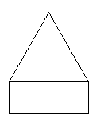
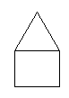

**************************
2. Avaldised ja lihtlaused
**************************

.. todo::

    * konstantsete listide kasutamine siia (kuu nimed, nädalapäevade nimed)

Tuleta meelde eelmises peatükis nähtud programme.

* Millest need programmid koosnesid? Teisisõnu, kui sa peaksid mingi programmiteksti jaotama väiksemateks osadeks, siis kuidas sa seda teeksid?
* Milliseid erinevaid tegevusi nendes programmides tehti? Teisisõnu, mida Python teha oskab?

.. admonition:: NB! 

    Need on kaunis olulised küsimused. Võta aeg maha, vaata mõned programmid uuesti üle ja paku välja oma vastus!
    

See peatükk tegeleb just nende kahe küsimusega.

Programmi komponentideks jaotamist käsitleme sarnaselt filoloogidele, kes jagavad teksti lauseteks ja laused omakorda fraasideks. Pythonil on siiski kohati oma terminoloogia, sellest tuleb juttu esimeses plokis.

Seejärel vaatame üle Pythoni oskused. Esmalt uurime sisemisi toiminguid nagu arvude ja tekstijuppidega arvutamine, teisendamine, meelespidamine jms. Lõpuks katsetame erinevaid viise, kuidas panna oma programme välismaailmaga suhtlema (s.o teksti kuvamine ekraanile, failide lugemine jms).  

.. todo::

    Soovita näited ümber *tippida*, et treenida tähelepanelikkust ja et konstruktsioonidega lähemalt tuttavaks saada.

Programmeerimise põhimõisted
============================
Et teha järgnevat juttu konkreetsemaks, võtame ette 4 lühikest programmi eelmisest peatükist (tuleta meelde, mida need tegid):

.. sourcecode:: py3

    print("Tere maailm!")
    
.. sourcecode:: py3

    from math import sin, cos, pi
    
    print(pi)
    print(cos(0.5))
    
    x = sin(4)
    print(x)
    
    y = 123 
    print(round(x + y, 2))

.. sourcecode:: py3
    
    from turtle import *
    
    forward(100)
    left(120)
    forward(100)
    left(120)
    forward(100)
    left(120)
    
    exitonclick() 

.. sourcecode:: py3

    from turtle import *
    
    nipitiri = int(input("Sisesta mingi täisarv: "))
    
    forward(nipitiri)
    left(120)
    forward(nipitiri)
    left(120)
    forward(nipitiri)
    left(120)
    
    exitonclick()  

Neist programmidest ilmneb, et kuigi Python on tähenärija, on ta mõnes mõttes jällegi väga paindlik. Nagu näha, on ``print``-käsku võimalik kasutada mitut moodi: andes ette kas mingi konkreetse tekstijupi (``print("Tere maailm")``), mingi arvutuse (``print(cos(0.5))``) või hoopis *muutuja* (``print(x)``). Samuti võisime kilpkonna liigutada kas mingi konkreetse teepikkuse jagu (``forward(100)``) või vastavalt sellele, milline arv on parasjagu etteantud muutujas (``forward(nipitiri)``). Isegi muutuja defineerimisel lubatakse võrdusmärgist paremale kirjutada nii lihtsat asja nagu üksik arv (``y = 123``) või nii keerulist asja nagu kasutaja sisendi küsimine koos vastuse teisendamisega (``nipitiri = int(input("Sisesta mingi täisarv: "))``).
    
Taoline paindlikkus on Pythoni (ja ka teiste programmeerimiskeelte) juures oluline joon. See võimaldab üsna väikese hulga mõistete ja reeglite põhjal koostada ükskõik kui keerulisi programme. Nüüd vaatamegi põgusalt üle kõige olulisemad programmeerimise mõisted. 

Laused ja avaldised
-------------------
Pythoni programmid koosnevad **lausetest**, mis on olemuselt väga sarnased loomuliku keele käskiva kõneviisi lausetega -- iga lausega (nt ``y = 123`` või ``left(90)``) annab programmeerija Pythonile mingi korralduse. Lihtsamate lausete puhul tähendab üks Pythoni koodi rida ühte lauset ja programmi käivitamisel täidab Python laused sellises järjekorras, nagu need on programmitekstis esitatud (edaspidi tutvume ka lausetega, mis võivad võtta enda alla palju ridu ja võimaldavad keerulisemaid käskude järjestamise skeeme).  

Nii nagu loomulikus keeles moodustatakse laused omakorda sõnadest ja fraasidest, pannakse ka Pythoni laused kokku väiksematest keele elementidest, millest kõige olulisemad on  **avaldised**.

Avaldised on näiteks:

* lihtne arvutustehe, nt ``2 + 3`` või ``sin(0.5)``;
* "arvutustehe" teksti ja muutujaga, nt ``"Tere " + nimi + "!"``;
* lihtsalt muutuja, nt ``x`` või ``nipitiri``;
* lihtsalt arv, nt ``123`` või ``3.987``;
* lihtsalt tekst, nt ``"Tere maailm!"``;
* mingi käsk, mis annab mingi tulemuse, nt ``input("Sisesta mingi täisarv: ")``; 
* ükskõik kui keeruline kombinatsioon eelnevatest, nt ``sin(int(y) * x / 1.76)``.

Avaldised esinevad enamasti mingi lause komponendina -- nt avaldist ``2 + 3`` võib kasutada lauses ``x = 2 + 3`` või lauses ``print(2 + 3)``.

Kui me eespool demonstreerisime Pythoni paindlikkust loetledes erinevaid võimalikke ``print`` käsu kasutamise vorme, siis uue terminoloogia abil saame seda väljendada palju lühemalt: *print-käsu järel olevatesse sulgudesse võime kirjutada suvalise avaldise*. Samamoodi saab öelda muutuja defineerimise kohta: *võrdusmärgist paremale võib kirjutada suvalise avaldise*.

Iga avaldist, ükskõik kui keerulist, saab kasutada veel keerulisema avaldise moodustamiseks, nt avaldistest ``1`` ja ``x * 3`` saab moodustada avaldise ``x * 3 - 1``. Sama põhimõtet teiselt poolt vaadates võime öelda, et iga keeruline avaldis koosneb lihtsamatest avaldistest e *alamavaldistest*.  

.. index::
    single: väärtus

Väärtused
---------
Tähelepanelikul lugejal võib tekkida õigustatud küsimus: miks ilmub lause ``print(2 + 3)`` käivitamisel ekraanile ``5``, mitte ``2 + 3``? Asi on selles, et avaldist sisaldava lause käivitamisel arvutab Python kõigepealt tulemuse välja ja kasutab siis seda esialgse avaldise asemel. Arvutuse tulemust nimetatakse **väärtuseks** (ingl `value`) ning arvutusprotsessi avaldise **väärtustamiseks** (ingl `evaluation`). 

Väärtused (nt arv *5*, arv *3.141592653589793*, tekst *Tere!*) on need reaalsed andmed, mida programm oma töö käigus kasutab, loob, arvutab, teisendab vms. Võib öelda, et avaldised tähistavad mingisuguseid asju (arve, tekstijuppe) programmi tekstis, aga väärtused on need asjad programmi jooksutamise ajal. Väärtustamine genereerib avaldisele vastava väärtuse.

.. topic:: Avaldised käsureal

   Üldjuhul ei ole eraldiseisev avaldis (nt ``2 + 3``) Pythoni jaoks mõistlik lause (nii nagu eesti keeles ei saa üksikut fraasi, nt "suur mets", pidada lauseks). Seetõttu, nagu eespool mainitud, on avaldised harilikult mingi lause komponendid (nt ``vastus = 2 + 3``). Pythoni käsurida aga võimaldab avaldisi väärtustada ka ilma neid mingi lause konteksti panemata -- see on mugav viis erinevate tehete katsetamiseks. Kuna antud peatüki esimeses pooles keskendumegi just avaldiste ja väärtuste teemale, siis eelistame praegu skripti koostamise asemel käsurea kasutamist:
   
   .. sourcecode:: py3
   
      >>> 2 + 3
      5
   

.. index::
    single: andmetüüp; tüüp
    single: tüüp
    
.. index::
    single: tehe; operatsioon
    single: operatsioon

Andmetüübid ja tehted
---------------------
Eelnevatest näidetest tuli välja, et Python oskab kasutada erinevat liiki andmeid e väärtusi nagu teksti, täisarve ja murdarve. Andmete liiki nimetatakse programmeerimisel **andmetüübiks** või lihtsalt **tüübiks**.

Iga andmetüübi juures on esimene küsimus, kuidas panna kirja selle andmetüübi konkreetseid väärtusi. Siin tuleb lihtsalt teada vastavaid reegleid, nt kümnendmurru esitamisel tuleb koma asemel kasutada punkti ning tekst tuleb panna ülakomade vahele või jutumärkidesse. Sedasi programmi teksti sisse kirjutatud konkreetseid väärtusi nimetatakse peenemas keeles **literaalideks**, aga neid võib nimetada ka **konstantideks**.

Teine küsimus on, mida antud tüüpi andmetega teha saab. Siin tuleb jällegi teada Pythoni võimalusi -- näiteks arve saab omavahel liita, teksti saab teisendada suurtähtedesse ning kõiki andmetüüpe saab ``print`` käsuga ekraanile kuvada. Selliseid toiminguid nimetatakse **teheteks** e **operatsioonideks**. Allpool vaatame täpsemalt arvude ja tekstiga tehtavaid tehteid.

Arvud
=====
Pythonis (nagu ka enamikus teistes programmeerimiskeeltes) käsitletakse täisarve ja reaalarve veidi erinevalt.

.. index::
    single: täisarvud

Täisarvud
---------
Pythoni **täisarvu** andmetüübi nimi on `int` (lühend ingliskeelsest sõnast *integer*). Erinevalt paljudest teistest keeltest ei ole Python 3-s piiratud, kui suuri (või kui väikseid) täisarve saab esitada. 

.. index::
    single: ujukomaarvud
    
Ujukomaarvud
------------
Reaalarvudele vastavad Pythonis (ja paljudes teistes keeltes) nn **ujukomaarvud** (ingl `floating point number`, lühemalt `float`). 

.. note::
    Nimetus `ujukomaarvud` tuleb nende esitusviisist arvuti mälus -- lihtsustatult võib öelda, et kõigepealt on toodud välja arvu numbrite jada (ingl `significant digits`) ning eraldi on öeldud, millisele positsioonile käib koma (seega koma on numbrijadast sõltumatu, "ujuv").

Ujukomaarvude literaalid võivad esineda järgmistel kujudel:

* ``3.0``, ``1.165``, ``-4.25`` on näited tavalisest kirjapildist. NB! Koma asemel kasutatakse punkti!
* ``6.1529e+18``, ``1.253e-12`` on `teadusliku notatsiooni` näited. Seda kirjapilti kasutatakse väga suurte või nullilähedaste arvude esitamiseks. Traditsioonilises matemaatilises notatsioonis võiks need arvud kirjutada vastavalt 6.1529×10\ :sup:`18` ja 1.253×10\ :sup:`-12`.

.. admonition:: Ujukomaarvude ligikaudsus

    Proovi läbi järgnev lihtne näide:

    .. sourcecode:: py3
        
        >>> 0.1 * 3.0
        0.30000000000000004

    Ootuspärane vastus oleks `0.3`, kuid Python tagastas midagi muud.

    Asi on selles, et arvutis esitatakse ujukomaarvud kahendkujul, kasutades piiratud arvu bitte ja seetõttu polegi võimalik teatud kümnendmurde (nende hulgas `0.1`) täpselt esitada (analoogiliselt pole kümnendmurruna võimalik täpselt esitada näiteks `10 / 3`). Taolistel juhtudel ümardatakse sisestatud arv lihtsalt lähima võimaliku kahendmurruni ja see ongi põhjus, miks antud näites oli tulemus ebatäpne. 

    Kui ujukomaarvu on tarvis esitada kümnendmurruna (nt ekraanile kuvamisel), siis toimub jälle ümardamine -- see on põhjus, miks käsureale ``0.1`` sisestades antakse vastuseks tagasi ``0.1``, kuigi Python sisimas ei suuda seda arvu täpselt esitada. Kui korrutasime ``0.1`` 3-ga, siis muutus viga juba piisavalt suureks, et saadud tulemusele lähim võimalik kümnendmurd oli ``0.30000000000000004``, mitte ``0.3``

    Tegelikult tekitab ujukomaarvude ligikaudsus probleeme vaid siis, kui me eeldame reaalarvude absoluutselt täpset esitamist (nt kümnendmurruna esitatud rahasummad, kus murdosa tähistatab sente). Praktikas kasutatakse ujukomaarve peamiselt kõikvõimalike mõõtmistulemuste esitamiseks ja selle jaoks on Pythoni `float` tüübi ulatus ning täpsus enam kui piisav.

Tehted arvudega
---------------
+--------------------+----------+---------------------------------------------------------+
| Avaldis            | Väärtus  | Selgitus                                                |
+====================+==========+=========================================================+
| ``6 / 3``          | ``2.0``  | Tavalise jagamise tulemus on alati ujukomaarv           |
+--------------------+----------+---------------------------------------------------------+
| ``5 // 3``         | ``1``    | Täisarvuline jagamine                                   |
+--------------------+----------+---------------------------------------------------------+
| ``5 % 3``          | ``2``    | Jagamise jäägi leidmine                                 |
+--------------------+----------+---------------------------------------------------------+
| ``5 ** 3``         | ``125``  | Astendamine                                             |
+--------------------+----------+---------------------------------------------------------+
| ``4 ** 0.5``       | ``2.0``  | Juurimine astendamise kaudu                             |
+--------------------+----------+---------------------------------------------------------+
|``round(2.6375, 2)``| ``2.64`` | Ümardamine nõutud täpsusega                             |
+--------------------+----------+---------------------------------------------------------+
|``round(2.6375)``   | ``3``    | Ümardamine lähima täisarvuni                            |
+--------------------+----------+---------------------------------------------------------+
|``int(2.6375)``     | ``2``    | Täisarvuks teisendades ei ümardata                      |
+--------------------+----------+---------------------------------------------------------+
| ``3 + 5 * 2``      | ``13``   |                                                         |
+--------------------+----------+ Python arvestab tehete järjekorda                       |
| ``(3 + 5) * 2``    | ``16``   |                                                         |
+--------------------+----------+---------------------------------------------------------+
| ``6 - 3 - 1``      | ``2``    |                                                         |
+--------------------+----------+ Sama prioriteediga tehted tehakse vasakult paremale ... |
| ``6 - (3 - 1)``    | ``4``    |                                                         |
+--------------------+----------+---------------------------------------------------------+
| ``2 ** 3 ** 2``    | ``512``  |                                                         |
+--------------------+----------+ ... v.a astendamised, mis tehakse paremalt vasakule     |
| ``(2 ** 3) ** 2``  | ``64``   |                                                         |
+--------------------+----------+---------------------------------------------------------+

.. note::
    Kui avaldis on keeruline, siis võiks kaaluda sulgude kasutamist ka seal, kus Python neid ei nõua, et teha lugemist lihtsamaks. Lisaks on loetavuse huvides siin ja edaspidistes näidetes pandud tehtemärkide ümber tühikud, aga need võib ka ära jätta.

.. topic:: Kas ``2`` või ``2.0``?

    Kas Pythoni literaalid ``2`` ja ``2.0`` tähistavad sama väärtust? Jah ja ei (aga pigem ei). Pythoni aritmeetika vaatenurgast on nad võrdsed -- selles veendumiseks sisesta käsureale ``2 == 2.0`` (topeltvõrdusmärk tähistab Pythonis võrdsust). Samas teeb Python neil siiski vahet: võrdle kasvõi programme ``print(2)`` ja ``print(2.0)`` -- üks neist kuvab ekraanile 1 märgi, teine 3 märki. 
    
    Matemaatikast on teada, et iga täisarv on ühtlasi ka reaalarv, miks ei võiks siis programmeerimisel kasutada ainult ujukomaarve?
    
    Üks põhjustest on pragmaatiline: täisarvudega arvutamine on tavaliste protsessorite jaoks palju lihtsam ja kiirem kui ujukomaarvudega arvutamine. 
    
    Teine põhjus on sisuline: teatud suurused, näiteks laste arv konkreetses perekonnas, on alati täisarvulised ning me saame seda rõhutada kirjutades ``2`` (mitte ``2.0``). Samas, kui me räägime näiteks korvpallurite pikkustest meetrites, siis oleks korrektsem kirjutada mõõtmise tulemuseks ``2.0`` (mitte lihtsalt ``2``). Seega, valides täisarvu ja ujukomaarvu vahel, tuleks arvestada ka esitatava suuruse olemust. 
    

Harjutus. Puuduvad tehtemärgid
------------------------------
Kirjuta järgnevatesse võrdustesse allkriipsude (``_``) asemele sobivad tehtemärgid. Topeltvõrdusmärk (``==``) tähistab Pythonis võrdsust.

* ``8 _ 4 == 2``
* ``8 _ 4 == 2.0``
* ``14 _ 7 == 0``
* ``3 _ 2 == 1`` (3 varianti)
* ``(6 _ 4) _ 8 == 256``

Harjutus. Tundide lugemine
--------------------------
Juku läks magama kell 23:00 ja pani väsinud peaga äratuse helisema 88 tunni pärast. Mis kell kostab äratushelin (eeldades, et Juku vahepeal äratust ei tühista)?

Vastuse saab kätte ühe Pythoni avaldisega.

Moodul ``math``
---------------
Suur hulk matemaatilisi funktsioone ja konstante on kättesaadavad peale seda, kui need importida moodulist nimega ``math``:

.. sourcecode:: py3

    >>> from math import *
    >>> cos(pi * 1.5)
    -1.8369701987210297e-16
    >>> atan(0.5)   
    0.4636476090008061
    >>> radians(360)
    6.283185307179586
    >>> 2 * pi
    6.283185307179586
    >>> degrees(2*pi)
    360.0
    >>> log(10.0)
    2.302585092994046
    >>> log(e)      
    1.0
    >>> log(100,10)
    2.0
    >>> sqrt(9)     
    3.0

.. note::
    Nagu võibolla märkasid, töötavad Pythoni trigonomeetrilised funktsioonid radiaanide, mitte kraadidega. Kraadide teisendamisel radiaanideks on abiks funktsion ``radians``, vastupidises suunas ``degrees``.
    
Kõikide mooduli ``math`` võimalustega saad tutvuda vastaval Pythoni dokumentatsiooni leheküljel: http://docs.python.org/3/library/math.html.

Harjutus. Matemaatilised avaldised
----------------------------------
Väärtusta järgnevad matemaatilised avaldised Pythoni käsureal:

.. centered::
    :math:`(2^{89} + 5^{70})^2`
    
.. centered::
    :math:`6 + \sqrt[4]{6 \times 5 + 12}`

.. centered::
    :math:`\ln(e^{27} + 2^{30}) + \sin(\arccos(\frac{3\pi}{4}))`

.. note::
    Teise ülesande vastus peaks olema ``8.54572989502183``.

.. note::
    Kui viimase avaldisega tekib probleeme, siis mõtle, milliste argumentide korral on arkuskoosinus üldse defineeritud. Veateade ``math domain error`` tähendab, et funktsiooni kasutati ebasobiva argumendiga. Muuda mõnda avaldises esinevat konstanti nii, et ``acos`` saab sobiva argumendi ja proovi uuesti.

Harjutus. Maksimaalne väärtus
-----------------------------
Kirjuta 5 sümboli pikkune Pythoni avaldis, mis annaks väärtustamisel võimalikult suure arvu. 

      
.. index::
    single: sõne
    single: string; sõne

Sõned
=====
Programmeerimine pole ainult arvudega manipuleerimine, paljudes programmides on tähtsamal kohal töö tekstiga (tuleta meelde näiteks esimese peatüki programmi, mis kuvas ekraanile teksti "Tere maailm!"). Selle tarvis on Pythonis olemas eraldi andmetüüp **sõne** (ingl `string`, lühend `str`), mida kasutatakse justnimelt teksti esitamiseks.

Konkreetsed tekstijupid pannakse programmi tekstis kirja *sõneliteraalidena*. Enamasti piisab sõneliteraali kirjapanekuks sellest, kui soovitud tekst piiritletakse ülakomade või jutumärkidega, nt ``'Tartu'`` või ``"Kauneim linn on Eestis Tartu"``.

Pane tähele, et tekst, mida antud sõneliteraalid esitavad, on *Tartu* ja *Kauneim linn on Eestis Tartu*, st piiritlejana kasutatud ülakomad/jutumärgid ei kuulu sõne sisu juurde. Demonstreerime seda ``print`` käsu abil, mis toob ekraanile alati sõne tegeliku sisu hoolimata sellest, kuidas ta programmi tekstis kirja on pandud:

.. sourcecode:: py3

    >>> print("Tartu")
    Tartu

.. admonition:: NB!

    Kui unustad sõneliteraali kirjutades piiritlejaid kasutada, siis peab Python vastavat tekstijuppi muutuja nimeks (või kui tekstis oli tühik, siis ei oska ta sellest midagi arvata). Proovi käivitada laused ``print(Tere)`` ja ``print(Tere maailm)`` ning uuri, millised veateated neil juhtudel antakse -- siis on edaspidi taolisi näpuvigu kergem tuvastada.
    

.. topic:: "Aga kui mu tekst sisaldab jutumärke või ülakomasid?"

    Asi läheb veidi keerulisemaks, kui sõne sees on vaja kasutada jutumärke, ülakomasid või muid erisümboleid. Järgnevalt demonstreerime erinevaid viise selle probleemi lahendamiseks.

    * Kui tekstis on ülakomasid, siis kõige lihtsam on kasutada piiritlejaks jutumärke ja vastupidi:
    
        .. sourcecode:: py3
        
            >>> print("Rock 'n' roll")
            Rock 'n' roll
            >>> print('Jim ütles vaid: "Siin see on."')
            Jim ütles vaid: "Siin see on."
            
    * Kui tekstis on vaja kasutada nii jutumärke kui ka ülakomasid, siis pole eelmisest soovitusest abi. Sellisel juhul tuleb üks neist (nt jutumärgid) ikkagi valida piiritlejaks, aga nende kasutamisel tekstis tuleb need spetsiaalselt märgistada langkriipsuga (seda nimetatakse inglise keeles *escaping*) -- see annab Pythonile märku, et tegemist pole veel teksti lõpuga, vaid sooviti kirja panna piiritlejaks valitud sümbolit ennast:
    
        .. sourcecode:: py3
        
            >>> print("Jack vastas: \"Rock 'n' roll\".")
            Jack vastas: "Rock 'n' roll".
            >>> print('Jack vastas: "Rock \'n\' roll".')
            Jack vastas: "Rock 'n' roll".
            
    * Langkriipsu saab kasutada ka muul otstarbel, nt reavahetusi saab esitada kombinatsiooniga ``\n`` (tavalist reavahetust Python siin ei lubaks):
    
        .. sourcecode:: py3
        
            >>> print("Seda kuupaistet!\nOh muutuksin sündides\nmänniks mäetipul!\n--Ryota")
            Seda kuupaistet!
            Oh muutuksin sündides
            männiks mäetipul!
            --Ryota
            
    * Nagu näha, on langkriips tekstiliteraalis spetsiaalse tähendusega. Kuidas aga esitada langkriipsu ennast? Lihtne, see tuleb ära märgistada ... langkriipsuga!:
    
        .. sourcecode:: py3
        
            >>> print("C:\\kaustanimi\\failinimi.txt")
            C:\kaustanimi\failinimi.txt

            
    * Kui tekstis on vaja kasutada palju reavahetusi, ülakomasid või jutumärke, siis võib tulemus muutuda kõigi nende ``\n``-de, ``\'``-d või ``\"``-de tõttu väga kirjuks. Seetõttu on Pythonis veel üks sõne kirjapaneku viis -- kolmekordsete ülakomade või jutumärkide vahel saab vabalt kasutada tavalisi reavahetusi, ülakomasid ja jutumärke:
    
        .. sourcecode:: py3
        
            >>> print("""Jack vastas: "Rock 'n' roll".""")
            Jack vastas: "Rock 'n' roll".
            >>> print('''Jack vastas: "Rock 'n' roll".''')
            Jack vastas: "Rock 'n' roll".
            >>> print("""Seda kuupaistet!
            Oh muutuksin sündides
            männiks mäetipul!
            --Ryota""")
            Seda kuupaistet!
            Oh muutuksin sündides
            männiks mäetipul!
            --Ryota
            >>> print("""
               _____                                            
              / ____|                                           
             | |  __  __ _ _ __ ___   ___    _____   _____ _ __ 
             | | |_ |/ _` | '_ ` _ \ / _ \  / _ \ \ / / _ \ '__|
             | |__| | (_| | | | | | |  __/ | (_) \ V /  __/ |   
              \_____|\__,_|_| |_| |_|\___|  \___/ \_/ \___|_|
            """)

               _____                                            
              / ____|                                           
             | |  __  __ _ _ __ ___   ___    _____   _____ _ __ 
             | | |_ |/ _` | '_ ` _ \ / _ \  / _ \ \ / / _ \ '__|
             | |__| | (_| | | | | | |  __/ | (_) \ V /  __/ |   
              \_____|\__,_|_| |_| |_|\___|  \___/ \_/ \___|_|
              
              

            
            
    * On oluline mõista, et piiritlejad ning langkriipsud on vaid selleks, et Python suudaks teksti õigesti sisse lugeda -- peale sisselugemist muutub ``'Rock\'n\'roll'`` tekstiks `Rock'n'roll`.

    * Neid sõneliteraale Pythoni käsureale sisestades (ilma ``print``-i kasutamata) saad piiritlejad ja mõnel juhul langkriipsud ka väljundis. See on tingitud sellest, et Pythoni käsurida näitab avaldise väärtust alati Pythoni süntaksile vastavalt. Kui soovid näha sõne tegelikku väärtust, siis kuva see ``print`` käsuga ekraanile.

Tehted sõnedega
---------------

.. note::

   Nii nagu arvude puhul, tutvustame ka sõnetehteid konkreetsete väärtuste abil, aga neid saab vabalt kasutada ka sõnemuutujatega. (Tegelikult kohtabki sõnemuutujaid reaalsetes programmides palju rohkem kui konkreetseid sõnekonstante.)

+-------------------------------------+--------------------+---------------------------------------------------------------------+
| Avaldis                             | Väärtus            | Selgitus                                                            |
+=====================================+====================+=====================================================================+
| ``'Tere' + 'Madis!'``               |``'TereMadis!'``    | ``+`` loob kahe sõne põhjal uue sõne                                |
+-------------------------------------+--------------------+---------------------------------------------------------------------+
| ``'Tere' + ' Madis!'``              |``'Tere Madis!'``   | Tühikud tuleb vajadusel ise vahele panna                            |
+-------------------------------------+--------------------+---------------------------------------------------------------------+
| ``'Tere' + ' ' + 'Mad' + 'is!'``    |``'Tere Madis!'``   | Kokku võib liita ka mitu sõnet                                      |
+-------------------------------------+--------------------+---------------------------------------------------------------------+
| ``'nr.' + 1``                       | Viga!!!            | Sõnet ja arvu ei saa niisama ühendada                               |
+-------------------------------------+--------------------+---------------------------------------------------------------------+
| ``'nr.' + str(1)``                  | ``'nr.1'``         | ``str`` annab arvule vastava sõne                                   |
+-------------------------------------+--------------------+---------------------------------------------------------------------+
| ``'5' + '3'``                       | ``'53'``           | Sõnena esitatud arve ei käsitleta arvudena                          |
+-------------------------------------+--------------------+---------------------------------------------------------------------+
| ``int('5')``                        | ``5``              | ``int`` annab sõnele vastava täisarvu                               |
+-------------------------------------+--------------------+---------------------------------------------------------------------+
| ``float('5.3')``                    | ``5.3``            | ``float`` annab sõnele vastava ujukomaarvu                          |
+-------------------------------------+--------------------+---------------------------------------------------------------------+
| ``'xo' * 3``                        | ``'xoxoxo'``       | Sõne dubleerimine                                                   |
+-------------------------------------+--------------------+---------------------------------------------------------------------+
| ``len('tere')``                     | ``4``              | Sõne pikkuse (`length`) küsimine                                    |
+-------------------------------------+--------------------+---------------------------------------------------------------------+
| ``'tere'.upper()``                  | ``'TERE'``         | Mõnede käskude korral kirjutatakse sõne käsu ette.                  |
+-------------------------------------+--------------------+ Taolisi käske nimetatakse *meetoditeks*.                            |
| ``'TeRe'.lower()``                  | ``'tere'``         |                                                                     |
+-------------------------------------+--------------------+                                                                     |
| ``'jäääär'.count('ä')``             | ``4``              |                                                                     |
+-------------------------------------+--------------------+---------------------------------------------------------------------+
| ``'tere'.rjust(10)``                | ``'      tere'``   | Sõne paigutamine etteantud "ruumi", see on abiks nt tabelite        |
+-------------------------------------+--------------------+ moodustamisel. Selle meetodi paariliseks on ``ljust``, katseta ise, |
| ``'terekest'.rjust(12)``            | ``'    terekest'`` | mida see teeb!                                                      |
+-------------------------------------+--------------------+ Teise argumendiga saab määrata, millist sümbolit ruumi täitmiseks   | 
| ``'terekest'.rjust(12, '~')``       | ``'~~~~terekest'`` | kasutatakse.                                                        |
+-------------------------------------+--------------------+---------------------------------------------------------------------+
| ``' tere '.strip()``                | ``'tere'``         | Meetod ``strip`` annab sõne ilma alguses ja lõpus olevate tühikute  |
+-------------------------------------+--------------------+ ja reavahetusteta                                                   +
| ``'tere'.strip()``                  | ``'tere'``         |                                                                     |
+-------------------------------------+--------------------+---------------------------------------------------------------------+
| ``'tere'.replace('e','ö')``         | ``'törö'``         | Meetod ``replace`` genereerib uue sõne, kus näidatud tähed või      |
+-------------------------------------+--------------------+ *alamsõned* on asendatud millegi muuga.                             |
| ``'tere'.replace('a', 'b')``        | ``'tere'``         |                                                                     |
+-------------------------------------+--------------------+                                                                     |
| ``'isamaa'.replace('isa', 'ema')``  | ``'emamaa'``       |                                                                     |
+-------------------------------------+--------------------+---------------------------------------------------------------------+
| ``'abc'[0]``                        | ``'a'``            | Kirjutades sõne järele nurksulgudesse mingi numbri, antakse         |
+-------------------------------------+--------------------+ vastuseks vastava järjekorranumbriga e *indeksiga* täht.            +
| ``'abc'[1]``                        | ``'b'``            | NB! Indeksid algavad 0-ga.                                          |
+-------------------------------------+--------------------+                                                                     +
| ``'abc'[2]``                        | ``'c'``            |                                                                     |
+-------------------------------------+--------------------+---------------------------------------------------------------------+
| ``'tere'[0:3]``                     | ``'ter'``          | Kui nurksulgudesse kirjutada kooloniga eraldatult kaks indeksit,    |
+-------------------------------------+--------------------+ siis antakse sõnest lõik alates esimesest indeksist (kaasaarvatud)  +
| ``'tere'[2:4]``                     | ``'re'``           | kuni viimase indeksini (väljaarvatud).                              |
+-------------------------------------+--------------------+---------------------------------------------------------------------+
| ``'tere'.replace('e','ö').upper()`` | ``'TÖRÖ'``         | Käske saab kombineerida                                             |
+-------------------------------------+--------------------+---------------------------------------------------------------------+

Kõikide sõnemeetoditega saab tutvuda aadressil http://docs.python.org/3/library/stdtypes.html#string-methods.

Kontrollküsimus. Tehted sõnedega
--------------------------------
Mis on järgnevate avaldiste väärtused? Proovi algul vastata ilma Pythoni abita, aga lõpuks kontrolli oma oletused üle ka Pythoni käsureal.

* ``len(Kosmoselaev)``
* ``len(KoSMoSeElaev.upper())``
* ``Kosmoselaev[2:4]``
* ``Kosmoselaev.count(u)``
* ``len(karu + ott)``

.. hint::

    Ilmselt andis käsurida kõigile neile avaldistele vastuseks veateate, sest Python pidas kasutatud sõnu (``Kosmoselaev``, ``ott`` jt) muutujateks, aga selliste nimedega muutujaid ei olnud defineeritud. Sõneliteraalidel on alati ümber ülakomad või jutumärgid!

.. todo::

   Keerulisemad andmetüübid: TODO

.. index::
    single: muutujad
    
.. _muutujad:

Muutujad
========
.. todo::

   Muutujatega joonistamine

Kõik levinud programmeerimiskeeled võimaldavad konkreetseid väärtusi või arvutuste tulemusi salvestada **muutujatesse**. Uuri järgnevat näiteskripti, mis demonstreerib muutujate defineerimist ja kasutamist. Kuna eespool on möödaminnes muutujatest juba juttu olnud, siis tõenäoliselt oskad juba enne käivitamist ennustada, mis ilmub ekraanile: 

.. sourcecode:: py3
    
    x = 2 + 3
    y = 10
    print(x)
    print(y)
    print(x + y)
    print(x * 2 + y)
    print(x)
    print(y)
    
    z = "Peeter"
    print(z + " " + "Paan")
    print(z + " " + "Esimene")
    print(z.upper())
    print(z + z)
    print(z * x)
    print(z)

Selgitus: esimese rea käivitamisel teeb Python kaks erinevat toimingut -- kõigepealt väärtustab avaldise ``2 + 3`` ning seejärel salvestab saadud tulemuse muutujasse ``x``. Programmeerijate kõnepruugis: muutujale ``x`` **omistatakse** avaldise ``2 + 3`` väärtus. Peale seda on võimalik muutuja nime **kasutada** vastava väärtuse asemel. Seega, antud näiteprogrammis tähistavad kõik ``x`` esinemised alates teisest reast arvu `5`.

Muutuja defineerimist (nt. ``x = 2 + 3``, üldisemalt *<muutuja nimi> = <avaldis>*) nimetakse **omistuslauseks**. Kuna tegemist on lausega, siis kirjutatakse ta omaette reale. Seevastu muutuja kasutamine (nt. ``x`` lauses ``print(x)``) on avaldis, mis esineb mingi lause või suurema avaldise sees. 

.. note::
    Muutujaid on võimalik defineerida ja kasutada ka käsureal -- kuigi käsurida kasutatakse enamasti avaldiste katsetamiseks, aktsepteerib ta rõõmuga ka lauseid sh omistuslauseid:
    
    .. sourcecode:: py3

        >>> eesnimi = "Peeter"
        >>> eesnimi * 3
        'PeeterPeeterPeeter'
        >>> eesnimi.upper()
        'PEETER'
        >>> eesnimi
        'Peeter'

Harjutus. Pythagorase teoreem
-----------------------------
Ilmselt on sulle tuttav valem :math:`c = \sqrt{a^2 + b^2}`, mis näitab ära täisnurkse kolmnurga küljepikkuste seosed. Ülesandeks on kirjutada selle põhjal programm, mis kuvab ekraanile hüpotenuusi pikkuse, kui kaatetite pikkused on 2cm ja 3cm. 

Üks võimalus selle valemi kasutamiseks oleks enne tehte Pythonis kirjapanekut asendada `a` ja `b` nõutud arvudega (*2* ja *3*), aga sel juhul ei oleks programmile peale vaadates enam nii ilmne, et tegu on Pythagorase teoreemi rakendamisega. Seetõttu proovi muutujaid kasutades säilitada enda programmis valemi üldine kuju!

Muutujate nimed
---------------
Pythoni jaoks on ükskõik, millise nime sa mingi muutuja jaoks valid, aga programmi loetavuse huvides peaks nimi kirjeldama muutuja tähendust antud ülesande kontekstis (nt ``brutopalk`` või ``isikukood``). Kui on tarvis kasutada mitmest sõnast koosnevat muutuja nime, siis tuleks kasutada tühikute asemel allkriipse, nt ``laste_arv``. Muutuja nimes võib kasutada ka numbreid, aga esimene sümbol peab olema täht (või allkriips).

Mõttepaus
---------
Kas järgnev programm töötab õigesti?

.. sourcecode:: py3

    pikkus = float(input("Sisesta maatüki laius meetrites: "))
    laius = float(input("Sisesta maatüki pikkus meetrites: "))
    
    print("Maatüki pindala on", pikkus*laius, "ruutmeetrit")

Milleks muutujad?
-----------------
Eelnev harjutus näitas, et muutujate abil saame teatud kohti programmis kirja panna üldisemalt, aga see pole ainus põhjus nende kasutamiseks.

Muutujaid kasutatakse tihti samal põhjusel, nagu loomuliku keele tekstides kasutakse mingite spetsiifiliste mõistete definitsioone -- see võimaldab mingi (potentsiaalselt keerulise) asja panna kirja ühekordselt ning viidata sellele edaspidi erinevates kohtades kasutades vaid ühte sõna. Oleks ju üpris tüütu kirjutada trigonomeetrilistes avaldistes alati ``3.141592653589793``. Selle asemel saame importida moodulist ``math`` muutuja ``pi``, (mille väärtuseks on mooduli loojad juhtumisi omistanud 3.141592653589793) ning kasutada oma arvutustes seda.

Vaatame nüüd ühte näiteprogrammi, mis väljastab 60.25 cm raadiusega ringi diameetri, ümbermõõdu ja pindala. Esimese versiooni kirjutame ilma muutujaid kasutamata:

.. sourcecode:: py3

    from math import pi
    
    print('Ringi diameeter on ' + str(2 * 60.25) + ' cm')
    print('Ümbermõõt on ' + str(pi * 2 * 60.25) + ' cm')
    print('Pindala on ' + str(pi * (60.25 ** 2)) + ' cm2')
    
.. topic:: Meeldetuletus: 
    
    Käsku ``str`` kasutame selleks, et arvulise arvutuse tulemust teisendada sõneks.

See programm arvutab, mida me soovisime, kuid kui me hiljem tahame selle programmiga arvutada mõne teise raadiusega ringi infot, siis peaksime tegema vastava muudatuse kolmes kohas. Nii väikese programmi puhul ei ole see küll probleem, kuid reaalsetes programmides on taolisel juhul suur oht, et mõnes kohas ununeb muudatus tegemata. 

Kirjutame nüüd sama programmi ümber kasutades raadiuse hoidmiseks muutujat:

.. sourcecode:: py3

    from math import pi
    
    raadius = 60.25
    print('Ringi diameeter on ' + str(2 * raadius) + ' cm')
    print('Ümbermõõt on ' + str(pi * 2 * raadius) + ' cm')
    print('Pindala on ' + str(pi * (raadius ** 2)) + ' cm2')

Siin on konkreetset raadiust mainitud vaid ühes kohas -- muutuja ``raadius`` defineerimisel. Edaspidi on valemites kasutatud muutuja nime. Programmi jooksutamisel asendab Python muutuja nimed muutuja väärtusega ja seetõttu annab see versioon sama tulemuse, mis eelminegi. Samas, kui meil on vaja programmi edaspidi kohandada mõne muu ringi jaoks, siis on muudatus vaja teha vaid ühes kohas. Seega, muutuja kasutamine aitas meil teha programmis olevad arvutused üldisemaks, konkreetsest väärtusest sõltumatuks.

.. topic :: Analoogia

    Mõtle Eesti Vabariigi põhiseadusele -- kui seal räägitakse presidendi rollist, siis ei nimetata ühegi konkreetse presidendi nime, vaid kasutatakse väljendit *Vabariigi President*. Seaduse rakendamisel tõlgendatakse seda väljendit vastavalt sellele, kes on antud hetkel president. Selline lähenemine teeb seaduse teksti üldisemaks, konkreetsetest isikutest sõltumatuks.

.. note::

    Mõnikord on muutuja kasutamine lausa hädavajalik, näiteks programmides, mis küsivad kasutaja käest mingit infot ja kasutavad seda siis mitmes kohas:

    .. sourcecode:: py3

        nimi = input('Palun ütle, mis on sinu nimi: ')
        print(nimi + '?!! Oo, milline ilus nimi!')
        print('Ma tahaksin seista mäetipul ja hüüda "' + nimi.upper() + '!!!!"')
        print('ning kuulda, kuidas kaja vastab: "' + ((nimi.lower() + ' ') * 3) + '..."')
        
    Ilmselt nõustud, et sellise programmi puhul oleks maitsetu küsida kasutajalt tema nime mitu korda.

Kontrollküsimus. Puuduv lause
-----------------------------
Järgnev on väljavõte ühest käsurea katsetusest:

.. sourcecode:: py3

    >>> kapsas * 9
    Traceback (most recent call last):
      File "<pyshell#11>", line 1, in <module>
        kapsas * 9
    NameError: name 'kapsas' is not defined

Mida tuleks käsureale eelnevalt sisestada, et avaldis ``kapsas * 9`` annaks veateate asemel tulemuseks ``18.0``?

Harjutus. Nime analüüs
----------------------
Kirjuta programm, mis küsib kasutaja käest tema nime ja vastab, mitu sulghäälikut tema nimes esineb.

.. hint::

    Mitme abimuutujaga variant:
    
    .. sourcecode:: py3
        
        ...
        g_arv = nimi.count('g')
        ...
        sulghäälikuid_kokku = ... + g_arv + ...
        ...

    Alternatiivne võimalus:
    
    .. sourcecode:: py3
        
        ...
        sulghäälikuid_kokku = ... + nimi.count('g') + ...
        ...

Kontrollküsimus. Puuduv avaldis
-------------------------------
Järgneva käsureasessiooni esimesel real on puudu omistamise parem pool. Milline avaldis peaks seal olema?

.. sourcecode:: py3

    >>> s = _______
    >>> len(s)
    3
    >>> str(len(s)) * 2
    '33'
    >>> s[2] + s[1] + s[0]
    'cba'
    >>> s.upper() * 3
    'ABCABCABC'

Sisend ja väljund
=================
.. todo::

    siinsetes harjutustes kasuta ohtrasti ka sõnede ja arvude tehteid.

Pythoni käsureal toimub avaldiste sisestamine ning tulemuste väljastamine ilma et sellele peaks eriti mõtlema. Kui soovime aga programmi käivitada skriptina, siis tuleb sisendi ja väljundiga eraldi tegeleda. 

.. index::
    single: väljund
    single: print
    
Käsk ``print``
--------------
Nagu võisid eelnevatest näidetest järeldada, saab skriptina esitatud programmis väärtusi ekraanile kuvada käsuga ``print``. Nüüd uurime seda käsku veidi lähemalt.

Esimesena võiks ära märkida, et kui siiani keskendusime põhiliselt avaldistele, mida kasutatakse mingi lause koosseisus, siis ``print`` käsuga moodustatatakse juba päris lauseid. Seetõttu on järgnev lihtne programmijupp täisväärtuslik Pythoni lause ja seega ka täisväärtuslik Pythoni programm:

.. sourcecode:: py3

    print(32 * 57)

Sulgudes olevat avaldist ``32 * 57`` nimetatakse siinkohal käsu ``print`` **argumendiks**. Kui kõik läheb ilusti, siis programm kuvab ekraanile ``1824`` ja lõpetab töö.

.. admonition:: Meeldetuletus
    
    Avaldise väärtuse automaatne kuvamine toimib ainult käsureal. Kui skripti kirjutada lihtsalt ``32 * 57``, siis midagi ekraanile ei ilmu -- Python küll arvutab antud avaldise väärtuse, aga midagi rohkemat sellega ette ei võta.

Käsule ``print`` võib anda ka mitu argumenti, sel juhul trükitakse samale reale mitu asja järjest, tühikutega eraldatuna. Järgnev näide demonstreerib kahte samaväärset viisi, kuidas trükkida ekraanile mitu infokildu korraga. Esimene variant kombineerib komponendid kõigepealt üheks avaldiseks ja kasutab seda ``print``-i argumendina, teine variant annab kõik komponendid eraldi argumentidena:

.. sourcecode:: py3

    >>> eesnimi = "Peeter"
    >>> perenimi = "Paan"
    >>> vanus = 21
    >>> print(eesnimi + " " + perenimi + " vanus: " + str(vanus))
    Peeter Paan vanus: 21
    >>> print(eesnimi, perenimi, "vanus:", vanus)
    Peeter Paan vanus: 21

Eraldi argumentidega variant on küll lühem kirja panna (eriti mugav on see, et arve ei pea ise ``str`` käsuga sõneks teisendama), aga mõnikord see siiski ei sobi, näiteks kui me ei soovi väljundis argumentide vahele tühikut.
    
``print`` ilma reavahetuseta
----------------------------

Vaikimisi lisab ``print`` väljundi lõppu alati ka reavahetuse. Kui sa seda ei soovi, siis tuleks kasutada lisaargumenti ``end``:

.. sourcecode:: py3

    print('Vastus on: ', end='')    
    print(32 * 57)                  
    

``end`` on "peidetud" argument, mis määrab, mida kuvatakse väljundi lõppu. Vaikimisi on selle argumendi väärtus reavahetus (``'\n'``), aga meie seadsime selle väärtuseks *tühja sõne*, seetõttu kuvatakse antud näite väljund ühel real (mis lõpeb siiski reavahetusega, sest teine ``print``-käsk toimib ikka tavaliselt).

Tegelikult oleks saanud sama tulemuse ka lihtsamalt:

.. sourcecode:: py3

    print('Vastus on: ' + str(32 * 57))    

.. index::
    single: sisend
    single: input
    
Käsk ``input``
--------------
Kuigi ka see käsk on sulle juba tuttav, maksab sedagi põhjalikumalt uurida.

Meie ringi programmi viimases versioonis mainisime konkreetset raadiust vaid ühes kohas, kuid me peame ikkagi programmi muutma, kui soovime arvutada mõne teise ringi näitajaid. Alternatiivina võiks programm küsida ringi raadiuse kasutajalt.

Kasutajalt andmete küsimiseks ongi kõige lihtsam viis käsk ``input``, mis kõigepealt kuvab ekraanile teksti selle kohta, milliseid andmeid programm ootab ning seejärel võimaldab kasutajal sisestada vastavad andmed klaviatuurilt. Kolmas versioon ringi arvutuste programmist kasutabki käsku ``input`` raadiuse küsimiseks:

.. sourcecode:: py3

    from math import pi
    
    raadius_tekstina = input('Sisesta ringi raadius: ')
    raadius = float(raadius_tekstina)
    
    print('Ringi diameeter on ' + str(2 * raadius) + ' cm')
    print('Ümbermõõt on ' + str(pi * 2 * raadius) + ' cm')
    print('Pindala on ' + str(pi * (raadius ** 2)) + ' cm2')

See versioon on väga sarnane eelmise versiooniga -- viimasel kolmel real ei pidanud me midagi muutma. Erinevus on vaid selles, kuidas saab muutuja ``raadius`` oma väärtuse. Abimuutuja ``raadius_tekstina`` viitab sellele, et ``input`` annab sisestatud info alati teksti kujul. Enne kui me saame sisestatud andmeid kasutada numbrilistes arvutustes, tuleb sisestatud tekst teisendada arvuks (antud juhul ujukomaarvuks, kasutades käsku ``float``).

Harjutus. Kasutaja tervitamine
------------------------------
Nüüd peaks olema täiesti arusaadav eelmises peatükis esitatud tervitamise programm:

.. sourcecode:: py3

    nimi = input("Palun sisesta oma nimi ja vajuta ENTER: ")
    print("Tere " + nimi + "!")

Muuda seda programmi nii, et see küsiks eraldi kasutaja eesnime ja perekonnanime ning tervitaks teda tema täisnimega.

Harjutus. Eurokalkulaator
-------------------------
Kirjuta programm, mis küsib kasutajalt rahasumma Eesti kroonides ja väljastab sellele vastava rahasumma eurodes.

Kontrollküsimus. Avaldis või lause?
-----------------------------------
Kas eelneva näiteprogrammi fragment ``input('Sisesta ringi raadius: ')`` on avaldis või lause?

.. hint::

    Tuleta meelde, millest koosnes omistuslause.

.. hint:: 

    Vastus: mainitud fragment on avaldis, kuna ta genereerib mingi väärtuse. Pealegi, omistuslause parem pool on alati avaldis. Siiski on tegemist üpris omamoodi avaldisega, kuna tema väärtus võib olla igal korral erinev.
    
    Terve rida ``raadius_tekstina = input('Sisesta ringi raadius: ')`` moodustab aga lause.

Andmete teisendamine sisendi ja väljundi kasutamisel
----------------------------------------------------
Teema kinnistamiseks uuri veel ühte näidet muutujate, ``input``-i ja teksti teisendamise kohta. Selles näites soovime arvutustes kasutada täisarve, seetõttu kasutame teisendamiseks käsku ``int``:

.. sourcecode:: py3

    tekst1 = input('Palun sisesta esimene täisarv: ')
    arv1 = int(tekst1)
    
    tekst2 = input('Palun sisesta teine täisarv: ')
    arv2 = int(tekst2)
    
    summa = arv1 + arv2
    print('Nende arvude summa on: ' + str(summa))

.. topic:: Meeldetuletus

    Ära unusta, et avaldis ``int(tekst1)`` mitte ei muuda muutujat ``tekst1`` arvuks, vaid genereerib vastava uue arvulise väärtuse.

Harjutus. Celsius-Fahrenheit teisendus
--------------------------------------
Kirjuta programm, mis küsib kraadide arvu Celsiuse järgi ja väljastab sellele vastava temperatuuri Fahrenheiti skaalas.

.. index::
    single: failid; failist lugemine
    single: sisend; failist lugemine

.. _sisendi-lugemine-failist:

Failide lugemine reakaupa
-------------------------
Nüüd õpime ära ühe viisi tekstifailidest sisendi lugemiseks. Alustuseks koosta ja salvesta tekstifail nimega `andmed.txt`, mille esimesel real on inimese nimi, teisel real vanus (täisarvuna) ning kolmandal real e-maili aadress (lihtsuse mõttes ära praegu täpitähti kasuta). NB! See peab olema *plain-text* kujul, st Wordi fail ei sobi. Seejärel salvesta loodud failiga *samasse kausta* järgnev skript ning käivita see. 

.. sourcecode:: py3

    f = open('andmed.txt')
    
    nimi = f.readline()
    vanus = f.readline()
    aadress = f.readline()
    
    print("Nimi:", nimi)
    print("Vanus:", vanus, "aastat")
    print("Aadress:", aadress)
    
    f.close()

Selgituseks 

* Käsk ``open`` otsib failisüsteemist üles soovitud faili ja tagastab viite sellele (antud näites salvestasime selle viite muutujasse ``f``, mis on levinud nimi failide tähistamiseks). NB! Kui on antud ainult failinimi ilma teeta, siis otsitakse seda ainult sellest kaustast, kus asub skript.
* Avaldis ``f.readline()`` loeb failist ühe rea ning annab selle sõnena. See käsk liigutab edasi ka failist lugemise järjehoidjat, st järgmisel korral sama käsku kasutades loetakse järgmine rida. See käsk on kaunis sarnane ``input`` käsuga, kuna kummalgi juhul ei tea me programmi kirjutades, millise konkreetse väärtuse me tulemuseks saame.
* ``f.close()`` ütleb failisüsteemile, et me oleme selle faili kasutamise lõpetanud. 

Kui seda programmi katsetad, siis märkad, et väljundis tekib iga sisestatud andmejupi järele üks üleliigne tühi rida. Põhjus on just selles, et failist lugedes jäetakse iga rea lõppu alles ka reavahetuse sümbol (faili viimase rea puhul võib see puududa vastavalt sellele, kas failis on viimase rea lõpus reavahetus või mitte). Käsk ``print`` lisab omaltpoolt veel ühe reavahetuse.

.. note::
    Kui Python ütleb sulle (Windowsi arvutis), et ta ei leia faili, aga sa oled veendunud, et fail on õiges kaustas olemas, siis tuleks kontrollida, ega failinimele pole saanud eksikombel kaks faililaiendit. Segadust võib tekitada asjaolu, et Windows Explorer varjab vaikimisi teatud faililaiendid.
    
    Kõige kindlam on muuta Windowsi seadeid nii, et alati näidataks kõiki faililaiendeid. Selleks tuleks Windows Exploreris valida menüüribalt `Tools -> Folder options...` (kui menüüriba pole näha, siis vajutada korraks klahvi `Alt`). Avanenud dialoogis vali lehekülg `View` ning eemalda linnuke valiku `Hide extensions for known file types` eest.

.. note::
    Kui proovid lugeda sisse täpitähtedega teksti, siis võib juhtuda, et saad veateate ``UnicodeDecodeError``. Sel juhul tuleks ``open`` käsu rakendamisel öelda, millises kodeeringus on sinu tekst, nt ``open('andmed.txt', encoding='UTF-8')``. ``'UTF-8'`` asemel võid proovida ka ``'cp1257'``.

Harjutus. Reavahetuste eemaldamine
----------------------------------
Tuleta meelde, mida tegi sõnemeetod ``strip()``. Modifitseeri eelnevat näiteprogrammi selliselt, et programmi väljundisse ei tekiks üleliigseid reavahetusi.

Faili sisu lugemine ühekorraga
------------------------------
Koosta veel üks mitmerealine, suvalise sisuga tekstifail ning salvesta see nimega *tekst.txt*. Seejärel käivita (samas kaustas) järgnev näiteprogramm:

.. sourcecode:: py3

    f = open('tekst.txt')
    faili_sisu = f.read()
    print(faili_sisu)
    f.close()

Siin kasutasime ``readline``'i asemel meetodit ``read``, mis luges sisse kogu faili sisu.

Harjutus. Tehete kombineerimine
-------------------------------
Muuda eelmist näidet selliselt, et kogu failis olev tekst kuvatakse ekraanile suurtähtedes. Proovi ka lahti saada abimuutujast ``faili_sisu``. Muutuja ``f`` võib jääda alles.

.. hint::

    Abimuutuja ärakaotamiseks tuleb lugemine, teisendamine ja kuvamine panna kirja ühe lausega.
    
.. hint::

    Ühe sõneoperatsioonide kombineerimise näite leiad sõnede teema juurest, tehete tabelist.

Failide kirjutamine
-------------------
Järgnev programm demonstreerib andmete kirjutamist tekstifaili:

.. sourcecode:: py3

    nimi = input("Palun sisesta oma nimi: ")
    vanus = input("vanus: ")
    aadress = input("aadress: ")
    
    f = open("andmed2.txt", "w")
    f.write(nimi + "\n")
    f.write(vanus + "\n")
    f.write(aadress + "\n")
    f.close()

Selgituseks:

* failide kirjutamiseks tuleb funktsioonile ``open`` anda ka teine argument väärtusega ``"w"`` (nagu `write`);
* kui antud fail juba eksisteerib, siis ``open(..., "w")`` teeb selle tühjaks;
* erinevalt ``print`` käsust ei tekita faili meetod ``write`` automaatselt reavahetust. Selleks, et saada eri andmeid eri ridadele, lisasime reavahetuse sümboli käsitsi.

.. admonition:: Kapoti all: *stdin* ja *stdout*

    Ilmselt märkasid teatud sarnasust ``print`` ja ``write`` ning ``input`` ja ``readline`` vahel. Tegelikult on nende kahe käsupaari seosed palju tihedamad kui paistab. Nimelt käsitletakse operatsioonisüsteemi tasemel kasutaja sisendit justkui mingit virtuaalset faili, millesse tekivad uued read iga kord kui kasutaja klaviatuuril midagi tipib ja vajutab ENTER-it -- seda faili nimetatakse *stdin*-iks e *standarsisendiks*. Analoogselt on olemas virtuaalne fail, kuhu kirjutades ilmuvad read kasutaja konsoolile -- seda faili nimetatakse *stdout*-iks e *standarväljundiks*. Need failid ei asu tegelikult failisüsteemis ja viited neile organiseeritakse iga programmi jaoks operatsioonisüsteemi poolt, seetõttu pole neid kunagi vaja ise avada ega sulgeda. 
    
    Pythonis saab viited neile failidele kätte moodulist ``sys`` ja nende kasutamist demonstreerib järgnev näide:
    
    .. sourcecode:: py3

        from sys import stdout, stdin

        stdout.write("Palun sisesta oma nimi ja vajuta ENTER: ")
        nimi = stdin.readline().strip()
        stdout.write("Tere " + nimi + "!")

    Käsud ``print`` ja ``input`` ongi lihtsalt mugavamad viisid nende failide kasutamiseks.

.. index::
    single: import
    single: moodulid

Lugemine veebist
----------------
Ka veebist teksti lugemine pole eriti raske -- käsu ``open`` asemel tuleb kasutada käsku ``urlopen``, mis on vaja eelnevalt importida moodulist ``urllib.request``:

.. sourcecode:: py3

    from urllib.request import urlopen
    
    vastus = urlopen("http://artscene.textfiles.com/asciiart/simpsons.txt")
    
    baidid = vastus.read()
    # veebist lugemisel annab käsk read() meile tavalise sõne asemel hunniku baite,
    # mis on vaja veel sõneks "dekodeerida"
    tekst = baidid.decode()
    
    print(tekst)
    
    vastus.close()

Harjutus. Teksti asendamine
---------------------------
Täienda eelnevat näiteprogrammi nii, et ekraanile ilmuks kirja ``The Whole Damn Family`` asemel midagi muud (näiteks ``Minu pere`` või mingi tekst, mille programm küsib kasutajalt).

.. hint::

    Selle ülesande jaoks läheb vaja ühte sõnemeetodit, mille kasutamist on demonstreeritud plokis "Tehted sõnedega".

.. _import_lause:

``import``-lause
================
Ilmselt oled nüüdseks juba saanud intuitiivse ettekujutuse ``import`` käsu olemusest, aga vaatame kindluse mõttes asja siiski üle.

Python mõistab tuhandeid erinevaid käske. Nende paremaks organiseerimiseks on nad jaotatud teemade kaupa gruppidesse, mida nimetatakse `mooduliteks`. ``import``-lause teeb moodulis olevad funktsioonid programmi jaoks kättesaadavaks. Meeldetuletuseks näide, kus me soovime kasutada ainult kahte funktsiooni moodulist ``math``:

.. sourcecode:: py3

    from math import sin, cos
    
    print(sin(0.3))
    print(cos(sin(0.3)))

Kui soovime moodulist kõiki funktsioone, siis võime kasutada import lauses funktsiooninime(de) asemel tärni:

.. sourcecode:: py3

    from turtle import *
    
    forward(100)
    left(90)
    forward(100)

.. note::

    Kui meil kõiki funktsioone (või vähemalt enamikku neist) vaja ei lähe, siis pole tärniga importimine soovitatav, sest Thonny muutujate tabel täitub ebavajalike ridadaga, ning huvipakkuvaid muutujaid on raskem leida. Samuti on oht, et kogemata valesti kirjutatud muutujanime korral Python mitte ei anna veateadet vaid kasutab meie teadmata mõnd imporditud muutujat. 
    
Importida saab ka moodulit ennast, sel juhul tuleb soovitava funktsiooni nimi kirjutada koos mooduli nimega:
    
.. sourcecode:: py3

    >>> import math
    >>> print(math.sin(0.5))
    0.479425538604203
    >>> print(math.cos(0.5))
    0.8775825618903728    

Mõned funktsioonid, nagu ``int`` ja ``float``, on alati kättesaadavad, neid pole vaja importida.

Koodiridade murdmine
====================
Pythoni koodis on reavahetus tavaliselt kahe lause eraldajaks. Mõnikord aga lähevad laused nii pikaks, et ei mahu enam hästi redaktori ekraanile ära. Sel juhul on võimalik ridu murda, st kirjutada ühe lause kood mitmele reale. Selleks, et Python saaks aru, et lause jätkub järgmisel real, tuleks rea lõppu kirjutada langkriips (``\``):

.. sourcecode:: py3
    
    ...
    sissetulek = palk + preemia + alimendid + pension + autoritasud + intressid \
               + kingitused + taskuraha + stipendiumid + lotovõidud + maast_leitud_raha \
               + ämma_käest_saadud_raha
    ...
    
Jätkuread on kombeks nihutada pisut paremale.

Langkriipsu võib ära jätta, kui reamurdmise koht jääb sulgude sisse:

.. sourcecode:: py3

    ...
    print(palk, preemia, alimendid, pension, autoritasud, intressid,
          kingitused, taskuraha, stipendiumid, lotovõidud, maast_leitud_raha,
          ämma_käest_saadud_raha)
    ...
    
NB! Ka käsureal eeldab Python, et sulgemata sulgude korral sisestus veel jätkub, seega jääb ta ootama käsu lõpetamist ka siis, kui sa lihtsalt unustasid lõpetava sulu sisestada.

.. index::
    single: kommentaarid
    
Kommentaarid
============
Lisaks Pythoni jaoks mõeldud käskudele saab programmi kirjutada kommentaare, mis on mõeldud vaid programmi lugemise hõlbustamiseks. Järgnevas näites kasutatakse kommentaare koodi osade pealkirjadena:

.. sourcecode:: py3
    
    # Küsin kasutaja nime
    nimi = input('Kuidas on sinu nimi? ')
    
    # Tervitan kasutajat
    print('No tere ' + nimi)
    print('Kuidas läheb?')
    
    # Praktikas keegi nii lihtsa programmi puhul tegelikult
    # kommentaare ei kasutaks :p
    
Kommentaar esitatakse sümboliga ``#`` -- Python ignoreerib kogu teksti, mis kirjutatakse sellest sümbolist kuni rea lõpuni.

Lisaks kommentaaridele võib koodi loetavuse parandamiseks kasutada ka tühje ridu, mis mõjuvad justkui lõiguvahed tavalise teksti puhul.

.. todo::
    
    Kokkuvõte
    
    .. admonition:: Õpinipp: võta aega mõtlemiseks!
    
        Programmeerimise õppimiseks läheb sul vaja väga vähe infot, aga see info on pungil tähendust ja võimalusi. **On täiesti normaalne, kui kulutad loetu peale mõtlemiseks mitu korda rohkem aega kui lugemisele endale.**
     
    
    
    Terminoloogia kokkuvõte
    
    Selle teema kokkuvõtteks analüüsime järgmist lihtsat käsurea näidet:
    
    .. sourcecode:: py3
    
        >>> 2 + 3
        5
    
    Antud juhul teostas Python liitmisoperatsiooni arvudega *2* ja *3*, mille tulemusena konstrueeriti uus väärtus *5*. Programmeerimise terminitega saame seda näidet kirjeldada järgnevalt:
    
    .. index::
        single: operaator
        single: argumendid; operaatori argumendid
        single: operaator; operaatori argumendid
        single: avaldis; avaldise väärtustamine
        single: avaldis
        single: literaalid
        
        
    * ``2 + 3`` on **avaldis**
    *  ``+`` on **operaator**
    * ``2`` ja ``3`` on selle operaatori **argumendid** (öeldakse ka `operandid`). Antud juhul on mõlemad argumendid **literaalid** (st konkreetsed väärtused)
    * `5` on antud **avaldise väärtus**
    * toiming, mille käigus ``2 + 3``- st saadakse `5`, on **avaldise väärtustamine**
    
    Mõtteharjutus. Mis on mis?
    
    Proovi oma sõnadega selgitada mõistete *väärtus* ja *avaldis* põhiolemust. Mille poolest on nad erinevad? Mille poolest sarnased?
    
    .. note::
        
        Isegi kui praegu tunduvad need mõisted veidi abstraktsed ja hägusad, siis pole põhjust muretsemiseks -- järgneva mõistmiseks piisab tegelikult ka umbkaudsest ettekujutusest. Täielik selgus saabub töö käigus.
    
    
    
    .. note:: 
    
        Siin ja edasipidi proovi kõigepealt ise lahenduseni jõuda. Mõnikord see õnnestub, mõnikord mitte, aga alati treenib see sinu probleemilahendamise oskust.

Suur näide Juhuslik tsitaat
===========================
Aadressil http://programmeerimine.cs.ut.ee/tsitaadid/ on hulk tekstifaile, millest igaüks sisaldab ühte tsitaati mõnest tuntud Eesti filmist. Ma üritan nüüd kirjutada programmi, mis valib juhuslikult ühe neist failidest ja kuvab selle sisu ekraanile. Seejuures ei hüppa ma kohe lõpptulemuse juurde, vaid katsun esitada kogu programmeerimise protsessi koos katsetuste ja ebaõnnestumistega.

Enne päriselt ülesande kallale asumist on vaja teha üks asjakohane kõrvalepõige.
 
.. admonition:: Juhuslikud arvud

    Juhuslike täisarvude genereerimiseks tuleb importida käsk ``randint`` moodulist ``random``. Järgnev lühike programm kuvab ekraanile ühe juhusliku arvu vahemikust 1..100: 

    .. sourcecode:: py3
    
        from random import randint
        print(randint(1, 100))

.. admonition:: Väljakutse!

    Nüüd oled sa näinud kõiki Pythoni võimalusi, mida on vaja selle ülesande lahendamiseks. Jah, see ülesanne on pisut keerulisem kui eelnevad, aga proovi siiski ise lahenduseni jõuda! Kui jääd hätta, siis loe edasi.
    

Enne keerulise ülesande lahendamist on kasulik proovida lahendada ülesande lihtsustatud variant. Antud juhul tahan ma kõigepealt proovida, kas mul õnnestub kuvada ekraanile mingi konkreetne fail. Õnneks on selle kohta ülalpool analoogne näide olemas, seetõttu läheb see samm lihtsalt, vaja on muuta vaid ühte rida:

.. sourcecode:: py3
    :emphasize-lines: 3    

    from urllib.request import urlopen
    
    vastus = urlopen("http://programmeerimine.cs.ut.ee/tsitaadid/026.txt")
    
    baidid = vastus.read()
    tekst = baidid.decode()
    
    print(tekst)
    
    vastus.close()

Kuigi ma olen täiesti kindel, et see programm töötab õigesti, siis proovin ta ikkagi praegu järele. Töötab.

Lähen edasi. Kuidas valida nende 119 faili hulgast juhuslikult üks? Käsk ``randint`` annab ainult arvu, samas kui mul on vaja pikemat sõne, mille põhiline sisu on fikseeritud, aga üks väike jupp tuleks tekitada juhuslikult. Nagu sõnede plokis demonstreeriti, võimaldab Python sõnesid mitmest jupist kokku panna. Proovin nüüd genereerida ühe uue URL-i, kus tsitaadi number on juhuslikult valitud. Enne kui hakkan oma skripti muutma, proovin selle järele käsureal -- nii saan keskenduda just sellele alamülesandele.

.. sourcecode:: py3

    >>> from random import randint
    >>> "http://programmeerimine.cs.ut.ee/tsitaadid/" + randint(1, 119) + ".txt"
    Traceback (most recent call last):
      File "<pyshell#7>", line 1, in <module>
        "http://programmeerimine.cs.ut.ee/tsitaadid/" + randint(1, 119) + ".txt"
    TypeError: Can't convert 'int' object to str implicitly
   
Nojah, unustasin, et sõnet ja arvu ei saa niisama lihtsalt ühendada, enne on vaja arv teisendada sõneks. Proovin uuesti:

.. sourcecode:: py3

    >>> "http://programmeerimine.cs.ut.ee/tsitaadid/" + str(randint(1, 119)) + ".txt"
    'http://programmeerimine.cs.ut.ee/tsitaadid/15.txt'

Palju parem! (Sina said tõenäoliselt teise arvu, aga olen kindel, et see jäi siiski vahemikku 1..119.)

Nüüd võin selle järeleproovitud avaldise kirjutada skripti:

.. sourcecode:: py3
    :emphasize-lines: 3,4

    from urllib.request import urlopen
    
    vastus = urlopen("http://programmeerimine.cs.ut.ee/tsitaadid/" \
                     + str(randint(1, 119)) + ".txt")
    
    baidid = vastus.read()
    tekst = baidid.decode()
    
    print(tekst)
    
    vastus.close()

Katsetan ja ... saan jälle veateate:

.. sourcecode:: none

    Traceback (most recent call last):
      File "C:/Users/Aivar/Desktop/kala.py", line 4, in <module>
        + str(randint(1, 119)) + ".txt")
    NameError: name 'randint' is not defined

Veateate viimane rida ütleb sisuliselt, et Python ei saa aru käsust ``randint``. Asi on selles, et unustasin skripti lisada vastava ``import``-lause. Käsureal tehtud import skriptile ei mõju. Proovin uuesti:

.. sourcecode:: py3
    :emphasize-lines: 2

    from urllib.request import urlopen
    from random import randint
    
    vastus = urlopen("http://programmeerimine.cs.ut.ee/tsitaadid/" \
                     + str(randint(1, 119)) + ".txt")
    
    baidid = vastus.read()
    tekst = baidid.decode()
    
    print(tekst)
    
    vastus.close()

... käivitan ja saan järjekordse veateate, mis lõpeb sõnadega ``urllib.error.HTTPError: HTTP Error 404: Not Found``. (On võimalus, et sina ei saanud siin veateadet. Miks? Loe edasi!) See tähendab, et server ei leidnud küsitud URL-iga resurssi. Selleks, et probleemi edasi uurida, oleks hea, kui ma teaks, millise URL-iga proovitakse, st ma tahaks sama URL-i kuvada kõigepealt ekraanile ja siis proovida seda avada. Appi tulevad muutujad: 

.. sourcecode:: py3
    :emphasize-lines: 4-8

    from urllib.request import urlopen
    from random import randint
    
    url = "http://programmeerimine.cs.ut.ee/tsitaadid/" \ 
        + str(randint(1, 119)) + ".txt"
        
    print(url)    
    vastus = urlopen(url)
    
    baidid = vastus.read()
    tekst = baidid.decode()
    
    print(tekst)
    
    vastus.close()

Käivitasin ja sain jälle veateate, aga enne seda jõudis programm ekraanile kuvada genereeritud URL-i. Seekord tuli ``http://programmeerimine.cs.ut.ee/tsitaadid/9.txt``. Kopeerin ja proovin seda avada otse brauseris. Sama jama: ``The requested URL /tsitaadid/9.txt was not found on this server``. Vaatan üle tsitaatide nimekirja (http://programmeerimine.cs.ut.ee/tsitaadid/) ja saan aru, milles asi -- õige URL on ``http://programmeerimine.cs.ut.ee/tsitaadid/009.txt`` mitte ``http://programmeerimine.cs.ut.ee/tsitaadid/9.txt``, kõigi ühe- ja kahekohaliste arvude ees on veel null(id). 

Pole hullu, võin URL-i genereerimisel need nullid sinna lisada. Hmm, siin on ebamugav situatsioon -- mõnikord on vaja lisada 1 null, mõnikord 2 tükki ja mõnikord mitte ühtegi. Järgmises peatükis küll tutvustatakse konstruktsiooni, millega saab panna programmi vastavalt mingile tingimusele käituma üht- või teistmoodi, aga praegu tahaks ma läbi saada lihtsamalt. Õnneks tuleb mulle meelde üks sobiv sõnemeetod, mida tutvustati plokis "Tehted sõnedega" olevas tabelis.

.. note::

    Proovi enne edasi lugemist leida üles see meetod, millele ma praegu vihjasin!

Muudan oma skripti veelkord: 

.. sourcecode:: py3
    :emphasize-lines: 5

    from urllib.request import urlopen
    from random import randint
    
    url = "http://programmeerimine.cs.ut.ee/tsitaadid/" \ 
        + str(randint(1, 119)).rjust(3, "0") + ".txt"
        
    print(url)    
    vastus = urlopen(url)
    
    baidid = vastus.read()
    tekst = baidid.decode()
    
    print(tekst)
    
    vastus.close()

... katsetan ja tundub, et asi töötab. Katsetan veel mõned korrad veendumaks, et töötab hoolimata sellest, kas valitud arv on ühe-, kahe- või kolmekohaline. Lõpuks eemaldan lause ``print(url)``, mida ma vajasin vaid programmeerimise ajal. Valmis!

.. note::

    Näidatud lahenduses on küll vähe lauseid, aga seevastu on mõned avaldised kaunis keerulised. Võibolla sulle sobib paremini, kui teed keerulisemad operatsioonid mitme sammuga, kasutades vahetulemuste salvestamiseks abimuutujaid nagu järgnevas, eelmise lahendusega samaväärses programmis:
    
    .. sourcecode:: py3
        :emphasize-lines: 4-9
    
        from urllib.request import urlopen
        from random import randint
        
        tsitaadi_number = randint(1, 119)
        tsitaadi_number_tekstina = str(tsitaadi_number)
        kolmekohaline_number_tekstina = tsitaadi_number_tekstina.rjust(3, "0")
         
        url = "http://programmeerimine.cs.ut.ee/tsitaadid/" \ 
            + kolmekohaline_number_tekstina + ".txt"
            
        print(url)    
        vastus = urlopen(url)
        
        baidid = vastus.read()
        tekst = baidid.decode()
        
        print(tekst)
        
        vastus.close()

    Sellise lähenemise eelis on veel see, et probleemide korral saab iga vahetulemuse ekraanile ``print``-ida, et näha, millise sammu juures viga sisse tuli.     

Ülesanded
=========
.. note::
    Kuigi mõned järgnevad ülesanded nõuavad programmi vormistamist koos kasutajalt sisendi küsimisega, on soovitatav esialgu kirjutada ``input``-käskude asemele mingid konkreetsed väärtused -- sedasi läheb võimalike arvutusvalemite katsetamine kiiremini. Kui oled saanud kätte õige valemi, siis asenda need ajutised algandmed ``input``-käskudega.

1. Pythoni dokumentatsioon
--------------------------
* Uuri jällegi Pythoni dokumentatsioonist ``math`` mooduli kohta käivat infot (http://docs.python.org/3/library/math.html). Otsi välja käskude ``floor`` ja ``ceil`` tähendus -- neid võib edaspidi ülesannete lahendamisel tarvis minna.
* Vaata üle ka sõnemeetodite dokumentatsioon (http://docs.python.org/3/library/stdtypes.html#string-methods). 

.. note ::
    Nurksulud Pythoni funktsioonide dokumentatsioonis näitavad, et sellele parameetrile ei pea väljakutsel tingimata väärtust andma, sest tal on olemas vaikeväärtus. Nt kui meetodi kirjeldus on kujul ``str.center(width[, fillchar])``, siis see tähendab, et seda võib kasutada kas 1 argumendiga (nt ``kliendi_nimi.center(80)``) või 2 argumendiga (``kliendi_nimi.center(80, '~')``).

2. Pangaarve intress
--------------------
Kirjuta programm, mis küsib kasutajalt tema pangaarvel olevat summat ning intressi protsenti, mida pank talle igal aastal maksab. Vastuseks peab programm väljastama pangaarvel oleva summa 5 aasta pärast.

**Testi** oma programmi erinevate summa ja intressi kombinatsioonidega!

.. topic:: Lisaülesanne

    Kui oled saanud õige valemi paika, siis modifitseeri oma programmi nii, et kasutajalt küsitakse vaid intressi protsent ja algsumma loetakse tekstifailist.

3. Küpsisetort
--------------
Küpsisetordi tegemisel laotakse küpsised ristkülikukujulisele kandikule mitmes kihis nii, et igas kihis on sama palju küpsiseid. Küsida kasutajalt, mitu küpsist mahub kandikule laiuses ja mitu pikkuses ning kui mitme kihilist torti ta teha soovib. Seejärel küsida, kui mitu küpsist on ühes pakis.

Lõpuks väljastada, mitu küpsisepakki tuleb sellise tordi tegemiseks osta. NB! Eeldame, et poolikut küpsisepakki osta ei saa.

**Testi** oma programmi! Vali vähemalt üks komplekt algandmeid nii, et küpsistest jätkub täpselt, ja vähemalt üks komplekt nii, et osa ostetud küpsiseid jääb üle.

4. Nimede korrastamine
----------------------
Modifitseeri veelkord kasutaja tervitamise programmi, kus kasutaja sisestab eraldi ees- ja perenime ning programm tervitab teda täisnimega. 

Seekord peaks programm vastama alati selliselt, et nii eesnimi kui ka perenimi algavad suure tähega ja ülejäänud tähed on väikesed hoolimata sellest, kuidas nimi sisestati (olgu ainult väikeste tähtedega, ainult suurtega või segamini).

.. hint::

    .. sourcecode:: py3
    
        >>> "pEEteR".capitalize()
        'Peeter'

.. todo::

    "Väljakutset" on liiga lihtne lahendada str.title-ga.
    
.. admonition:: Väljakutse

    Praegu on aktsepteeritav, kui programm ei esita sidekriipsuga nimesid ootuspäraselt (nt kui kasutaja sisestas eesnimeks "Mari-Liis", siis on OK, kui programm muudab selle "Mari-liis"-iks). Aga kui see ülesanne oli sinu jaoks liiga lihtne, siis proovi kirjutada programmist ka selline variant, mis töötaks õigesti nimede puhul, mis sisaldavad ühte sidekriipsu, st mis muudaks "Mari-Liis"-i, "mari-liis"-i ja "mAri-liiS"-i kõik "Mari-Liis"-iks.
    
    .. hint::
    
        .. sourcecode :: py3
        
            >>> x = "tere"
            >>> x[0]
            't'
            >>> x[1]
            'e'
            >>> x[2]
            'r'
            >>> x.find("r")
            2
            >>> x[0:2]
            'te'
            >>> x[2:4]
            're'

    Kui oled ka sellega hakkama saanud, siis proovi kaks programmi varianti ühendada, st uus programm peaks töötama nii lihtsate kui ka liitnimedega. Selle jaoks on tõenäoliselt vaja ühte Pythoni konstruktsiooni, mida selles peatükis ei käsitletud, aga mis käis läbi esimese peatüki näidetes.
    
5. Kujund
---------
Täienda järgnevat poolikut programmi selliselt, et selle käivitamisel ilmuks ekraanile järgnev kujund, kus ridades ja veergudes olev ``#`` sümbolite arv sõltub kasutaja sisendist. Kui võimalik, siis kirjuta kolme punkti asemele üksainus avaldis, kui vaja, siis võid ka uusi lauseid lisada.

Poolik programm:

.. sourcecode:: py3

    x = int(input("Palun sisesta 2-st suurem täisarv: "))
    print(...)

Ekraanile kuvatav kujund, kui kasutaja sisestab ``7``:

.. sourcecode:: none

    # # # # # # #
    #           #
    #           #
    #           #
    #           #
    #           #
    # # # # # # #

.. hint::
    
    Tuleta meelde, mida tähendab ``'Tere' * 4``.

6. Failide teisendamine
-----------------------
Kirjuta programm, mis küsib kasutajalt kaks failinime. Esimene neist peaks tähistama mingit olemasolevat tekstifaili. Teine failinimi võib olla uus, st selle nimega faili ei pruugi eksisteerida.

Programmi ülesanne on võtta esimese faili sisu, teisendada see suurtähtedesse ning kirjutada teise faili. Ekraanile tuleks kuvada teisendatud failis olevate sümbolite arv.

.. todo::

    anna vihjed

7. Maja
-------
Eelmises peatükis oli :ref:`maja joonistamise ülesanne <maja>`. Nüüd tuleks lahendada see ülesanne nii, et programm küsib maja mõõtmed kasutajalt. Näiteks kui kasutaja sisestab laiuseks 100 ja seina kõrguseks 40, siis ilmub

aga kui kasutaja sisestab laiuseks 50 ja seina kõrguseks 40, siis ilmub

8. Redeli pikkus
----------------
Kirjuta programm, mis arvutab, mitme pulgaga redelit läheb vaja mingile kõrgusele ronimiseks. Programm peaks küsima kasutajalt soovitud kõrguse ning väljastama minimaalse ja maksimaalse pulkade arvu, mis peaks sobival redelil olema. Arvestame, et:
 
* redeli alumine ja ülemine pulk on redeli otstest 15 cm kaugusel;
* redeli pulkade vahekaugus on 25 cm;
* redeli ülemine ots peab toetuma etteantud kõrgusele;
* nurk redeli ja maapinna vahel peab olema vahemikus 50° - 80°.

.. hint::

    Selleks, et arvutused ei läheks liiga keeruliseks, on soovitatav vahetulemused salvestada abimuutujatesse.

9. Pentagramm
-------------
Kirjuta programm, mis küsib kasutajalt positiivse arvu vahemikus 10 .. 300 ja joonistab kilpkonna abil vastava diagonaalipikkusega pentagrammi:

.. hint::

    Kuna iga haru tipus on vaja pöörata sama palju, siis on soovitatav arvutada pöördenurk ühekordselt, salvestada see muutujasse ning kasutada hiljem seda muutujat:

    .. sourcecode:: py3

        from turtle import *
        
        ...
        ...
        tipunurk = ... 
        pöördenurk = ... tipunurk ...
        ...
        ...
        right(pöördenurk)
        ...
        ...
        
        exitonclick()

.. hint::
    Mõned abistavad küsimused juhuks, kui jäid hätta nurkade arvutamisega:
    
    * Kui sa peaksid joonistama ainult kujundi keskel olevat viisnurka, mitu kraadi peaks kilpkonn iga nurga juures pöörama? Mitu kraadi ta peaks 5 nurga peale kokku pöörama?
    * Mitu kraadi on pentagrammi igas harus oleva kolmnurga nurgad? Eelmine punkt aitab leida joonise keskmesse jäävate nurkade suurused.
    * Mitu kraadi on kolmnurga kolmas nurk, kui on teada kahe nurga suurused?
    * Mitu kraadi peab kilpkonn iga haru tipus pöörama?

Projekt
=======
Kuna sinu projektiidee jaoks võib minna vaja vahendeid, mille jaoks Pythoni standardteegis moodulit ei leidu, vaatame siinkohal järele, kuidas võtta kasutusele internetist leitud mooduleid.

.. index::
    single: kolmanda osapoole moodulid
    single: moodulid; kolmanda osapoole moodulid

Kolmandate osapoolte moodulid
-----------------------------
Neid mooduleid, mis ei kuulu Pythoni standardteeki, ja mida sa pole ise kirjutanud, vaid internetist alla laadinud, nimetatakse tavaliselt *kolmandate osapoolte* mooduliteks (ingl `third party modules`).  Siinkohal demonstreerime ühe lihtsa kolmanda osapoole mooduli kasutamist.

Lae alla moodul :download:`bingtrans <downloads/bingtrans.py>`, mis võimaldab kasutada Microsoft Bing tõlketeenust (NB! Salvesta see nimega ``bingtrans.py``). Seejärel salvesta samasse kausta järgnev programm ja katseta seda:

.. sourcecode:: py3
    
    from bingtrans import translate
    
    eesti_keeles = input("Palun sisesta eestikeelne sõna (või lause): ")
    ing_vaste = translate(eesti_keeles, 'et', 'en')
    print("Inglise keelne vaste: " + ing_vaste)

Me importisime moodulist ``bingtrans`` funktsiooni nimega ``translate``, mis võtab argumentideks tõlgitava teksti, lähtekeele koodi (eesti keele kood on ``'et'``) ning sihtkeele koodi. Proovi ka teisi keelekoode (nt. ``'ru'``, ``'fr'``, ``'ko'``).

.. admonition:: Harjutus

    Proovi nüüd kohandada antud näidet nii, et tõlgitav sõna või lause ning keelekood loetakse tekstifailist.

``bingtrans.py`` on lihtsustatud versioon Byung Gyu Ahni kirjutatud moodulist, mis asub aadressil https://github.com/bahn/bingtrans. 

Selle näite moraal on see, et internetis on saadaval Pythoni mooduleid, mis võivad väga tehnilise programmeerimisülesande muuta väga lihtsaks. Selleks, et saada aimu, milliseid võimalusi veel leidub, külasta aadressi http://pypi.python.org/pypi.
    
Tavaliselt on kolmandate osapoolte moodulid pakendatud koos installeerimisskriptidega ja nende paigaldamine võib nõuda pisut tehnilist tööd. Vastavaid juhiseid saab huvi korral lugeda siit: http://docs.python.org/3/install/index.html.

.. admonition:: Väljakutse

    Proovi leida internetist Pythoni moodul (või moodulite kogum e `pakett`, ingl `package`), mille abil saab Twitteri sõnumeid kirjutada ja lugeda. Ürita selle abil midagi postitada.
    
    NB! Varu piisavalt aega ja kannatust, et võimalike tehniliste katsumustega hakkama saada. Võibolla pead valitud paketi installimiseks töötama ka operatsioonisüsteemi käsureal (selle kohta leiab juhiseid eelmise peatüki lisalugemises). Samas, läbi taolise "mässamise" saab oma OP-süsteemi kõige paremini tundma õppida.

Kommentaarid
============
.. disqus::
    :disqus_identifier: lihtlaused