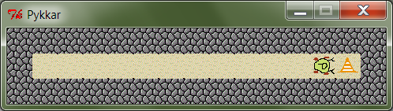

****************************
3. Tingimus- ja korduslaused
****************************

.. attention::

    Selle peatüki materjali veel täiendatakse

.. todo::

    TODO: meeldetuletuseks üks näide eelmisest peatükist
    
    TODO: Kas pykkari osa valmistab ette pinnase funktsioonideks? Kas on kindel, et lugeja teeb siin piisavalt vasakule pööramisi ja seinani kõndimisi?

Eelmise peatüki programmidega töötas Python täiesti "tuimalt" -- alustas esimesel real oleva lausega, iga rea täitmise järel võttis ette järgmise rea, kuni jõudis programmi lõppu -- programmi käik oli täielikult ette ennustatav. Taolisest lähenemisest piisab paraku vaid väga lihtsate ülesannete puhul. 

Antud peatükis vaatame, kuidas panna Python valikuid tegema. Selleks täiendame oma arsenali kahe uue lausetüübiga, mille abil on võimalik määrata mingite teiste lausete käivitamise tingimused.

 

.. admonition:: Õpinipp: Ole aktiivne!

    Proovi olla materjalist sammu võrra ees, märgates seoseid ja võimalusi enne, kui õpik neid mainib. Iga näite juures loe esimese asjana programmi tekst hoolikalt läbi ja ennusta, mida iga rida teeb.
    
    Teisisõnu, eelista värsket mõttetoitu -- see annab parema vormi, kui juba läbimälutud tarkuseterad! 

.. index::
    single: tingimuslaused
    single: tingimuslaused; if-lause

Tingimuslause e. ``if``-lause
=============================
Praktiliselt kõikides mittetriviaalsetes programmides tuleb mingil hetkel teha valikuid, kas jätkata üht- või teistmoodi. Python võimaldab programmeerijal taolised dilemmad panna kirja **tingimuslause** e. **valikulause** e. **if-lause** abil.

Järgnevas näiteskriptis kasutatakse tingimuslauset arvu absoluutväärtuse arvutamiseks:

.. sourcecode:: py3

    arv_tekstina = input('Palun sisesta mingi arv: ')
    arv = float(arv_tekstina)
    
    if arv < 0:
        # kui oli tegemist negatiivse arvuga, 
        # siis salvestan vastuse jaoks mõeldud muutujasse antud arvu vastandväärtuse
        vastus = -arv
    else:
        # vastasel juhul on vastuseks esialgne väärtus ise
        vastus = arv
    
    print('Selle arvu absoluutväärtus on ' + str(vastus))

Selles programmis ei täida Python enam kõiki käske -- see, kas täidetakse käsk ``vastus = -arv`` või ``vastus = arv``, sõltub konkreetsest kasutaja poolt sisestatud arvust. Antud näites on mõlemas tingimuslause *harus* vaid üks käsk, aga neid võib seal olla ka rohkem.

Tingimuslause komponendid on *päis* (so. ``if``-i ja tingimusega rida), ``then``-haru (so. päisele järgnevad paremale nihutatud read), võtmesõna ``else``, ning ``else``-haru (jällegi paremale nihutatud).

Tingimusi saab (muuhulgas) moodustada järgmiste operaatoritega: 

* ``<``, ``>``, ``<=``, ``>=`` sobivad arvude võrdlemiseks
* Topeltvõrdusmärk (``==``) tähistab võrdsust nii arvude kui sõnede puhul
* ``!=`` tähistab mittevõrdsust nii arvude kui sõnede puhul

.. note::
    
    Ära unusta, et üksikut võrdusmärki (``=``) kasutatakse Pythonis muutujale väärtuse omistamiseks, seetõttu on võrdsuse kontrollimiseks ette nähtud topeltvõrdusmärk (``==``).

Harjutus 1. Jaguvus
-------------------
Kirjuta programm, mis küsib kasutajalt kaks arvu ning vastab, kas esimene arv jagub teisega või mitte.

.. hint::

    Tuleta meelde, mida teeb operaator ``%``.

.. hint::

    >>> 6 % 4
    2
    >>> 6 % 3
    0
    >>> 4 % 3
    1
    >>> 4 % 2
    0    
    >>> 4 % 4
    0
    >>> 4 % 1
    0

Treppimine
----------
``if``-lause kasutamisel on vaja pöörata tähelepanu tühikutele -- tühikutega joondamine e. *treppimine* määrab, millised käsud kuuluvad tingimuslause alla ja millised mitte: 

.. sourcecode:: py3

    nimi = input("Mis su nimi on? ")
    if nimi == "Imelik":
        print("Tõesti?")
        print("Imelik nimi!")
    else:
        print("Tere " + nimi + "!")
    print("Meeldiv tutvuda!")

Antud näites kuuluvad tingimuslause *then*-harusse laused ``print("Tõesti?")`` ja ``print("Imelik nimi!")`` ning *else*-harusse üksainus lause ``print("Tere " + nimi + "!")``. Võib ka öelda, et need joondatud laused kuuluvad ``if``-lause *alla* -- nende käivitamine sõltub ``if``-lausest.

Programmi viimane lause ei ole trepitud ja seetõttu ei ole ta millegi "alluvuses" vaid on täiesti "iseseisev". (Kontrollküsimus: Kuidas muutuks programmi käitumine, kui ka viimase rea ette panna 4 tühikut?)

Edaspidi näeme, et treppimist kasutatakse ka teistes Pythoni konstruktsioonides ning põhimõte on alati selles, et sama kaugele joondatud järjestikused read moodustavad mingi terviku. 

.. admonition:: NB!

    Trepitud plokile eelnev rida lõpeb alati kooloniga (see on Pythonile lisakinnituseks, et programmeerija soovib järgmisel real alustada trepitud plokki).

.. admonition:: Katsetus
    
    Proovi järgi, kuidas Python käitub, kui unustad kasutada koolonit või jätad ära mõne taandrea. Sellega saad end taoliseks situatsiooniks juba ette valmistada.

.. note::

    Kuigi Python on treppimise osas võrdlemisi paindlik, tuleks segaduste vältimiseks alati kasutada joondamiseks 4 tühikut. IDLE-s kirjutades võib treppimiseks vajutada ka TAB klahvi -- IDLE genereerib sellepeale TAB sümboli asemel 4 tühikut.
    Tegelikult pole enamasti vaja IDLE-s isegi TAB klahvi kasutada -- kui vajutada kooloniga lõppeval real uue rea saamiseks ENTER-it, taipab redaktor ise, et järgmine rida tuleb treppida ja lisab uue rea algusesse vajaliku arvu tühikuid. Ka järgmistele ridadele paneb IDLE usinalt tühikud ette. Andmaks märku, et uus rida enam tingimuse alla ei kuulu, tuleb need tühikud ära kustutada ja alustada käsu kirjutamist jälle ekraani vasakust servast.

Harjutus 2. Eurokalkulaator, vol. 2
-----------------------------------
Eelmises peatükis oli ülesanne, kus tuli kirjutada eurokalkulaator, mis teisendas kroone eurodeks.

Täienda seda programmi nüüd nii, et see küsiks kasutajalt lisaks rahasummale ka selle, kas ta soovib teisendada Eesti kroone eurodeks või vastupidi.

.. hint::

    .. sourcecode:: py3
        
        ...
        algyhik = input("Kas sinu summa on eurodes (EUR) või kroonides (EEK) ?")
        ...

Proovi kirjutada sellest programmist kaks varianti erinevate kitsendustega: 

    * esimeses programmis kasutatakse muutujale omistamist ainult ühes kohas
    * teises programmis kasutatakse ``print`` käsku ainult ühes kohas

.. hint::

    .. sourcecode:: py3
        
        ...
        if ... :
            print(...)
        else:
            print(...)
        ...
    
    vs.

    .. sourcecode:: py3
        
        ...
        if ... :
            tulemus = ...
        else:
            tulemus = ...
        
        print(...)

.. index:: 
    single: tsükkel

Näide. Tingimuslaused üksteise sees
-----------------------------------
Tingimuslauseid võib panna üksteise sisse:

.. sourcecode:: py3
    
    arv1 = int(input("Sisesta esimene arv: "))
    arv2 = int(input("Sisesta teine arv: "))
    
    if arv1 > arv2:
        print("Esimene arv on suurem")
    else:
        if arv2 > arv1:
            print("Teine arv on suurem")
        else:
            print("Arvud on võrdsed")

Põhimõte on sama nagu lihtlausete "allutamisel" -- alluvuse tähistamiseks lisatakse vastavate ridade algusesse 4 tühikut. Kui alluvatel endal on alluvaid, siis võibki mõne rea ette sattuda 8, 12, üldisemalt `n * 4` tühikut. 

.. note::

    Nüüd peaks olema ka näha, miks treppimist nimetatakse treppimiseks -- kui joondamine toimub mitmel tasemel, siis paistab nagu programmi tekst paikneks trepiastmetel.

Harjutus. Tiitlid
-----------------
Kirjuta programm, mis küsib kasutajalt tema nime, perekonnaseisu (vallaline või abielus), sugu ja vanust. Väljasta nende andmete põhjal sobiv tervitus (nt. abielus naiste puhul kasuta tiitlit *proua*, teatud vanusest vanemate meeste puhul *härra* jne.)

Lisavõimalus. Üheharuline ``if``-lause
--------------------------------------
Tingimuslauses võib ``else`` osa ära jätta -- seda kasutatakse siis, kui tingimuse mittekehtimise puhul ei ole vaja midagi teha:

.. sourcecode:: py3

    x = int(input("Sisesta esimene arv: "))
    y = int(input("Sisesta teine arv: "))
    
    print("Arvude erinevus on " + str(abs(x-y)))
    if x == y:
        print("... järelikult on nad võrdsed")

Harjutus. Miks on ronk nagu kirjutuslaud?
-----------------------------------------
Kirjuta järgnev programm ümber nii, et ta töötaks samamoodi nagu enne, aga et seal kasutataks vaid üheharulist ``if`` lauset:

.. sourcecode:: py3

    vastus = input("Miks on ronk nagu kirjutuslaud? ")
    
    if vastus.lower() == 'ei tea':
        print("Hmm ...")
        print("Ma ka ei tea!")
    else:
        print("Hmm ...")

Lisavõimalus: Mitmeharuline ``if``-lause
----------------------------------------
Üritame panna kirja programmi, mis küsib kasutajalt kuu numbri ja väljastab sellele vastava kuu nime:

.. sourcecode:: py3

    kuu = int(input("Sisesta kuu number: "))
    
    if kuu == 1:
        print("jaanuar")
    else:
        if kuu == 2:
            print("veebruar")
        else:
            if kuu == 3:
                print("märts")
            else:
                if kuu == 4:
                    print("aprill")
                else:
                    if kuu == 5:
                        print("mai")
                    else:
                        if kuu == 6:
                            print("juuni")
                        else:
                            if kuu == 7:
                                print("juuli")
                            else:
                                if kuu == 8:
                                    print("august")
                                else:
                                    if kuu == 9:
                                        print("september")
                                    else:
                                        if kuu == 10:
                                            print("oktoober")
                                        else:
                                            if kuu == 11:
                                                print("november")
                                            else:
                                                if kuu == 12:
                                                    print("detsember")
                                                else:
                                                    print("vale kuu number!")

Selles koodis kõik õige ja loogiline, aga nii kaugele trepitud koodiga on ebamugav toimetada. Õnneks on Pythonis taoliste juhtumite jaoks olemas altenatiivne esitusviis:

.. sourcecode:: py3

    kuu = int(input("Sisesta kuu number: "))
    
    if kuu == 1:
        print("jaanuar")
    elif kuu == 2:
        print("veebruar")
    elif kuu == 3:
        print("märts")
    elif kuu == 4:
        print("aprill")
    elif kuu == 5:
        print("mai")
    elif kuu == 6:
        print("juuni")
    elif kuu == 7:
        print("juuli")
    elif kuu == 8:
        print("august")
    elif kuu == 9:
        print("september")
    elif kuu == 10:
        print("oktoober")
    elif kuu == 11:
        print("november")
    elif kuu == 12:
        print("detsember")
    else:
        print("vale kuu number!")

Appi tuli võtmesõna ``elif``, mis on nii kirjapildi, kui tähenduse poolest kombinatsioon ``else``-st ja talle järgnevast ``if``-ist.

Kogu ``if-elif-...-else`` konstruktsioon moodustab Pythoni jaoks ühe terviku -- niipea, kui ülevalt alla liikudes leitakse tingimus, mis kehtib, täidetakse vastav haru ja sellega on ka kogu konstruktsioon täidetud. Teisisõnu, ``if-elif-...-else``-s täidetakse alati täpselt üks haru, just nagu ``if-else`` puhul. (Kui ``else`` haru kirjutamata jätta, siis võib muidugi juhtuda, et ei täideta ühtegi haru.) 

.. note::

    Kuigi antud näites on igas ``elif`` plokis ainult üks lause, võib seal olla ükskõik kui keeruline kood, just nagu ``if`` või ``else`` plokis. 
 

Harjutus. Hinde arvutamine
--------------------------
Ülikoolis on tavaks panna hindeid järgmise skeemi järgi:

+---------------+--------+
| Tulemus (%)   | Hinne  |
+===============+========+
| >90 .. 100    | A      |
+---------------+--------+
| >80 .. 90     | B      |
+---------------+--------+
| >70 .. 80     | C      |
+---------------+--------+
| >60 .. 70     | D      |
+---------------+--------+
| >50 .. 60     | E      |
+---------------+--------+
| <=50          | F      |
+---------------+--------+

Kirjuta programm, mis küsib kasutajalt mitu punkti võis aines saada ning mitu punkti tudeng sai, ning väljastab vastava hinde.

.. hint::
    
    Näitelahendus
    
    .. sourcecode:: py3
    
        punkte = int(input("Sisesta punktide arv"))
        
        if punkte > 90:
            hinne = 'A'
        elif punkte > 80:
            hinne = 'B'
        elif punkte > 70:
            hinne = 'C'
        elif punkte > 60:
            hinne = 'D'
        elif punkte > 50:
            hinne = 'E'
        else:
            hinne = 'F'
    
        print("Nende punktidega saab hindeks " + hinne)

Tingimusega korduslause e. ``while``-lause
==========================================
Kui meil on vaja teha sama toimingut mitu korda järjest, siis võiks arvata, et programmi tuleb lihtsalt kirjutada laused lihtsalt mitmekordselt, nagu järgmises programmis, mis joonistab kilpkonnaga ruudu:

.. sourcecode:: py3
    
    from turtle import *
    
    küljepikkus = 100
    forward(küljepikkus)
    left(90)
    forward(küljepikkus)
    left(90)
    forward(küljepikkus)
    left(90)
    forward(küljepikkus)
    left(90)
    
    exitonclick()
    

Selline lahendus muutub väga kohmakaks, kui korduste arv läheb suureks. Pealegi, kui sooviksime kirjutada üldisema programmi, mis joonistab *n* küljega hulknurga vastavalt kasutaja poolt sisestatud *n* väärtusele, siis jääksime hätta, kuna me ei tea, mitu korda tuleks ühe külje joonistamise ja pööramise käske kirjutada.

Siinkohal tulevad appi **tsüklid** (e. korduslaused), mis on programmikonstruktsioonid käskude kordamiseks. Selles peatükis vaatame **while-lauset**, mis kordab tema alluvusse paigutatud lauseid niikaua, kuni teatud tingimus kehtib. 

.. index:: 
    single: while tsükkel
    single: tsükkel; while tsükkel
    

``while``-lausega saaksime ruudu joonistamise programmi panna kirja järgnevalt:

.. sourcecode:: py3
    
    from turtle import *
    
    # selle muutuja abil peame arvet, mitu külge on juba joonistatud
    joonistatud_kylgi = 0               
    
    while joonistatud_kylgi < 4:
        forward(100)
        left(90)
        joonistatud_kylgi = joonistatud_kylgi + 1   # suurendame muutuja väärtust

    exitonclick()

``while``-lause keha täidetakse vaid siis kui päises antud tingimus kehtib. Selles suhtes on ``while`` väga sarnane üheharulisele ``if``-lausele. Erinevus on selles, et kui kehas olevad laused on täidetud, siis minnakse uuesti päises näidatud tingimust kontrollima -- kui tingimus kehtib ikka veel, siis täidetakse kehas olevad laused uuesti jne. Kui lõpuks tingimus enam ei kehti (antud näites peale 4 kordust), minnakse edasi ``while``-lausele järgnevate lausetega (antud juhul ``exitonclick()``).

Selleks, et taoline tsükkel ei jääks lõputult tööle, peab tsükli kehas olema midagi, mis mõjutab tingimuse kehtivust -- antud näites on selleks lause ``joonistatud_kylgi = joonistatud_kylgi + 1``. Kuju poolest on siin tegemist täiesti tavalise omistuslausega, ainuke veider asi on see, et paremal pool mainitakse sedasama muutujat, mida parasjagu defineeritakse. Kas siin ei lähe miskit "sõlme"?

Muutuja muutmine
----------------
Pythoni muutujate süsteem on ehitatud selliselt, et muutuja väärtust on võimalik *üle defineerida* või lihtsamalt öeldes *muuta*. Iga muutuja viitab tegelikult ühele pesale või lahtrile kuskil Pythoni sisemuses olevas tabelis, ja selles lahtri sisu on võimalik omistuslausega muuta.
    
Antud näites genereerisime muutujale ``joonistatud_kylgi`` uue väärtuse tema eelmise väärtuse põhjal. Selles pole Pythoni jaoks midagi erilist -- nagu eelmises peatükis mainitud, väärtustab Python omistuslause käivitamisel kõigepealt parema poole ja salvestab saadud tulemuse vasakul pool näidatud muutujasse. Seega, kui ``joonistatud_kylgi`` väärtuseks oli ``0``, siis kõigepealt arvutati välja parema poole väärtus ``1`` ning alles seejärel uuendati muutuja sisu.

.. topic:: Tähelepanu!!!

    Kui arvu- või sõneoperatsioonides (e. tehetes) kasutada muutujaid (nt. ``n + 1`` või ``tekst.upper()``), siis võib avaldise kujust jääda mulje, et operatsiooni käigus muudetakse muutuja väärtust. Tegelikult genereeritakse tehte tulemusena hoopis *uus väärtus* ja kasutatud muutujaga midagi ei juhtu.
    
    Selles veendumiseks uuri järgmisi käsurea näiteid, kus kõigepealt omistatakse muutujale mingi väärtus, seejärel kasutatakse muutujat mingis tehtes (mis konstrueerib uue väärtuse), ning lõpuks demonstreeritakse, et see ei mõjutanud muutuja väärtust:
    
    .. sourcecode:: py3
    
        >>> n = 3
        >>> n + 2
        5
        >>> n
        3
        
    .. sourcecode:: py3
    
        >>> sõna = '  kala  '
        >>> sõna.strip()
        'kala'
        >>> sõna
        '  kala  '
        
    .. sourcecode:: py3
    
        >>> tekst = '3'
        >>> int(tekst)
        3
        >>> tekst
        '3'

Lühem kirjapilt muutuja kasvatamiseks / kahandamiseks
-----------------------------------------------------
Muutuja väärtuse suurendamist mingi arvu võrra saab Pythonis ka lühemalt kirjutada: ``x = x + 1`` asemel võime kirjutada ``x += 1``. Muutuja väärtuse vähendamiseks võib analoogselt kirjutada ``x -= 1``. 

.. admonition:: Terminoloogia

    Muutujaid, mille väärtust suurendatakse igal tsükli sammul ühe võrra, nimetatakse *loenduriteks*. Selliseid tsükleid, kus korduste arv on tsükli alustamise hetkel teada, nimetatakse *määratud tsükliteks*.

.. admonition:: Katsetus

    Nagu mäletad, on ``+`` defineeritud ka sõnede jaoks. Mida võiks ``+=`` tähendada sõnede puhul?

Harjutus 3. Programm *n*-nurga joonistamiseks
---------------------------------------------
Kirjuta ruudu näite põhjal programm, mis joonistab *n*-küljega hulknurga (*n* väärtus ja küljepikkus küsitakse kasutajalt). 

.. hint::
    Iga nurga juures peab kilpkonn pöörama 360/n kraadi.
    
    
Näide. Tsükli ja tingimuslause kombineerimine
------------------------------------------------------------------------------------------------------- 
Nii ``if``-lause, kui ``while``-lause keha võib koosneda suvalistest Pythoni lausetest. Järelikult võib panna ka ``if``-lause ``while``-lause sisse (ja vastupidi):

.. sourcecode:: py3

    i = 1

    while i <= 10:
        print("Vaadeldav arv on", i)
        if i % 2 == 0:
            print("Tegemist on paarisarvuga")
        else:
            print("Tegemist on paaritu arvuga")

        ruut = i * i
        if ruut % 2 == 0:
            print("Tema ruut", ruut, "on paarisarv")
        else:
            print("Tema ruut", ruut, "on paaritu arv")

        print("--------------------------------")
        i += 1
    
    print("Sellega on meie arvuteoreetiline uurimus lõppenud")

.. note::

    Eelmises peatükis soovitati valida muutujatele nimed, mis kirjeldavad nende tähendust. Selles näites on aga muutuja nimega ``i``, mis ei paista midagi tähedavat. Milles asi?
    
    Asi on selles, et nime ``i`` kasutamine tsüklimuutuja jaoks lihtsalt väga levinud. Nähes muutujat nimega ``i`` kusagil tsükli läheduses, eeldab iga vähegi kogenud programmeerija, et seda muutujat kasvatatakse igal tsükli sammul ühe võrra. Seega ei rikkunud me antud näites tähendusrikka muutujanime reeglit -- sellele  nimele lihtsalt ongi kujunenud oma tähendus.

Harjutus 4. Loendamine
----------------------
Täienda eelnevat programmi veel ühe loenduriga, mille abil loetakse kokku 3-ga jaguvate ruutude arv. Kui kõik arvud on läbi vaadatud, siis väljasta saadud tulemus.

Määramata tsükkel
-----------------
Alati pole võimalik ette öelda, kui mitu korda midagi kordama peab enne, kui jõutakse soovitud tulemuseni. ``while`` lause sobib ka neil juhtudel, sest tsükli päises võime kasutada suvalist tingimust. Järgmine näiteprogramm laseb kasutajal arvata juhuslikult valitud arvu niikaua, kuni ta jõuab õige vastuseni:

.. sourcecode:: py3

    from random import randint 
    
    arv = randint(1, 999) # randint annab juhusliku täisarvu näidatud vahemikust
    arvamus = int(input("Arva, millist tuhandest väiksemat arvu ma mõtlen: "))

    # Kuni pakutud arv erineb arvuti valitust
    while arvamus != arv :
        if arv > arvamus:
            print("Minu arv on suurem!")
        else:   
            print("Minu arv on väiksem!")
            
        arvamus = int(input("Arva veelkord: "))
        
    print("Ära arvasid! Tubli!")

Harjutus 5. Kolmeaastase lapse simulaator
-----------------------------------------
Kirjuta programm, mis küsib kasutajalt mingi küsimuse ja seejärel küsib iga sisestuse peale "Aga miks?" niikaua, kuni kasutaja sisestab mingi kindla "võlusõna".

Harjutus 6. Algandmete kontrollimine tsükliga
---------------------------------------------
Tsükleid saab kasutada algandmete sisestamise juures -- me võime vigase sisendi puhul lasta kasutajal sisestamist korrata niikaua, kuni oleme sistatud infoga rahul.

Kirjuta ruutjuure arvutamise programm, mis enne ruutjuure võtmist kontrollib, kas sisestati positiivne arv. Niikaua kuni sisestati mittepositiivne arv, tuleb sisendi küsimist jätkata.

Lisavõimalus: Käsk ``break``
----------------------------
Tsükli lõpetamise määrab tavaliselt tsükli päises olev tingimus. Sellele lisaks on Pythonis veel üks võimalus tsükli töö lõpetamiseks -- selleks tuleb tsükli kehas anda sobival hetkel käsk ``break``.

Järgnevas näites on arvamismängu täiendatud selliselt, et ühte tsükli lõpetamise tingimust (arvu ära arvamine) kontrollitakse tsükli päises ning teist tingimust (10 ebaõnnestunud arvamist) kontrollitakse tsükli kehas:

.. sourcecode:: py3
    :emphasize-lines: 14 

    from random import randint
    
    arv = randint(1,999) # randint annab juhusliku täisarvu näidatud vahemikust
    arvamus = int(input("Arva, millist tuhandest väiksemat arvu ma mõtlen: "))
    arvamise_kordi = 1
    
    while arvamus != arv :
        if arv > arvamus:
            print("Minu arv on suurem!")
        else:
            print("Minu arv on väiksem!")
            
        if arvamise_kordi == 10:
            break 
        
        arvamus = int(input("Arva veelkord: "))
        arvamise_kordi += 1 # lühem kirjapilt muutuja väärtuse suurendamiseks
    
    # kuna tsükkel võis lõppeda ka edutult, siis peame enne kiitmist kontrollima...
    if arv == arvamus:
        print("Ära arvasid! Tubli!")
    else:
        print("Kümnest arvamisest ei piisanud, äkki peaksid taktikat muutma?")

Tegelikult pole ``break`` lause Pythoni programmides hädavajalik - tsükli saab alati ümber kirjutada nii, et kõiki jätkamise/lõpetamise tingimusi kontrollitakse tsükli päises, aga vahel on ``break``-iga lahendus lihtsam.

Mõnikord on mugav tsükli lõpetamise tingimust kontrollida *ainult* tsükli kehas, sel juhul pannakse tsükli päisesse alati kehtiv tingimus ``True``. Järgnev programm küsib kasutajalt arve ja näitab nende ruute niikaua, kuni kasutaja sisestab *tühisõne* (st. vajutab ENTER ilma midagi tegelikult sisestamata):

.. sourcecode:: py3

    while True:
        tekst = input("Sisesta arv ja vajuta ENTER (lõpetamiseks vajuta ainult ENTER): ")
        
        if tekst == "":  
            print("OK, lõpetan")
            break
        else: # ei olnud ei arv ega tühisõne
            arv = float(tekst)
            print("Selle arvu ruut on", arv * arv)

Harjutus 7. Juhuslikud arvud
----------------------------
Kirjuta programm, mis väljastab iga ENTER vajutuse järel (st. tühisõne sisestamisel) ekraanile juhusliku täisarvu vahemikus 1..999. Tsükli töö tuleks lõpetada (kasutades ``break``-i) siis, kui kasutaja sisestab tühisõne asemel sõne ``'aitab'``.

Harjutus 8. Algandmete kontrollimine ja ``break``
-------------------------------------------------
Kui sa enne kasutasid algandmete kontrollimise ülesandes ``input`` käsku mitmes kohas, siis proovi nüüd kirjutada lahendus ümber nii, et programmis on vaid üks ``input`` käsk.

Näide. Summa arvutamine tsüklis
-------------------------------
Senistes näidetes kasvatasime igal kordusel loenduri väärtust 1 võrra. Tegelikult ei ole Pythonil mingit põhjust piirata, kuidas me muutuja väärtust suurendame (või vähendame). Uuri ja proovi mõista järgmist näidet: 

.. sourcecode:: py3

    n = int(input("Sisesta naturaalarv: "))
    
    summa = 0
    i = 0
    
    while i <= n:
        summa += i
        i += 1
    
    print(n, "esimese naturaalarvu summa on", summa)

Antud juhul suurendasime igal tsükli kordusel ühe muutuja väärtust teise muutuja väärtuse võrra.

Harjutus 9. Faktoriaali arvutamine
----------------------------------
Kirjuta programm, mis arvutab etteantud arvu faktoriaali.

.. note:: 

    Kuidas käitub sinu programm negatiivse arvu korral?

Näide. Kahekordne tsükkel
-------------------------
Nii, nagu me võime ``while``-lause kehas kasutada ``if``-lauseid, võime seal kasutada ka ``while``-lauseid. Järgnev programm kasutab kahekordset tsüklit korrutustabeli kuvamiseks:

.. sourcecode:: py3

    # välimine tsükkel teeb ühe korduse iga rea jaoks
    rea_nr = 1
    while rea_nr < 10:
        
        # sisemine tsükkel genereerib arvud käesolevasse ritta
        veeru_nr = 1 # iga uue rea puhul alustame jälle veerust nr. 1
        while veeru_nr < 10:
            korrutis = rea_nr * veeru_nr
            print(str(korrutis) + " ", end="") # end="" abil väldime väljundisse reavahetuse panemist
            
            # suurendame veeru numbrit
            veeru_nr += 1 
        
        # reavahetuse paneme alles siis, kui kõik käesoleva rea numbrid on väljastatud
        print() 
        
        # suurendame rea numbrit
        rea_nr += 1

.. note::

    Ära muretse, kui see programm tundub hetkel liiga keeruline! Mitmekordsete tsüklitega hakkame tõsisemalt tegelema alles mitme peatüki pärast. Praegu on oluline vaid meelde jätta, et Python ei sea kitsendusi sellele, mida võib ``while`` või ``if``-lause sisse panna.

Ülesanne. Korrutustabeli korrastamine
------------------------------------------------------------------------------------------------------- 
Eelmise näiteprogrammi väljund jäi natuke kipakas, sest osad korrutised olid ühekohalised, osad kahekohalised ja seetõttu ei jäänud veerud kohakuti. Täienda nüüd programmi nii, et see väljastaks umbes taolise tabeli: 

.. sourcecode:: none

     1  2  3  4  5  6  7  8  9 
     2  4  6  8 10 12 14 16 18 
     3  6  9 12 15 18 21 24 27 
     4  8 12 16 20 24 28 32 36 
     5 10 15 20 25 30 35 40 45 
     6 12 18 24 30 36 42 48 54 
     7 14 21 28 35 42 49 56 63 
     8 16 24 32 40 48 56 64 72 
     9 18 27 36 45 54 63 72 81     
        

.. hint::

    Üks võimalus on teatud *tingimusel* printida korrutise ette üks lisatühik.

.. hint::

    Teine võimalus on kasutada ühte sõneoperatsiooni, mille kohta on ühes 2. peatüki tabelis.
    

Näide. Failist lugemine tsükliga
--------------------------------
Meie senised failist lugemise näiteprogrammid teadsid (õigemini eeldasid), mitu rida antud failis on. Praktikas tuleb aga palju sagedamini ette situatsioone, kus faili ridade arv pole teada. Järgnev näide demonstreerib faili kõikide ridade lugemist:

.. sourcecode:: py3

    f = open('nimed.txt')
    
    while True:
        nimi = f.readline()
        # kui jõuti faili lõppu, siis readline tagastab "tühja sõne"
        if nimi == "":
            break
            
        if nimi.strip() == 'Margus':  # strip eemaldab reavahetuse sümboli
            print('Hommik!')
            print('Kuis kulgeb?')
        else:
            print('Tervist, lugupeetud ' + nimi.strip() + '!')
    
    f.close()

.. admonition:: Veaotsingu nipp

    Selles näites kasutasime ``strip`` meetodit seepärast, et failist ridade lugemisel jäetakse rea lõppu ka reavahetuse sümbol. Selline nüanss aga ei pruugi alati meelde tulla ja sel juhul programm lihtsalt ei tööta õigesti.
    
    Kui tekib selline situatsioon, kus programm ei tööta nii nagu sa soovid, siis võiks kõigepealt uurida, kas sisendandmed loeti sisse selliselt nagu sa arvasid. Antud programmis võiks tsüklis esimese asjana (enne tingimuslauset) kuvada ekraanile loetud nime. Selleks, et oleks näha ka tühikute ning reavahetuste paiknemine, võib kuvamist teha nt. selliselt: ``print('>' + nimi + '<')``.

Harjutus 10. Failis olevate temperatuuride teisendamine
-------------------------------------------------------
Kirjuta programm, mis loeb tekstifailist temperatuure Fahrenheiti skaalas ja väljastab ekraanile vastavad temperatuurid Celsiuse skaalas.

.. hint::

    Ära unusta, et ``readline`` tagastab sõne. Arvutamiseks on vaja see teisendada arvuks.

Kontrollküsimus
---------------
TODO: lugemiskontroll

.. index::
    single: bool; tõeväärtustüüp
    single: boolean; tõeväärtustüüp

Tõeväärtustüüp ``bool``
=======================
Nagu varem mainitud, koosneb iga Pythoni programmi lausetest ja lause komponentideks on avaldised. Tuleb välja, et Python peab ka ``if`` või ``while`` lause päises olevat tingimust avaldiseks. Aga kui igal avaldisel on väärtus, siis millised näevad välja tingimuse väärtused? Proovime järgi:

.. sourcecode:: py3

    >>> 3 > 2
    True
    >>> 3 > 3
    False
    >>> 3 >= 3
    True
    >>> x = 4
    >>> y = 5
    >>> x == y
    False
    >>> y > x
    True
    >>> toit = "Kapsas"   # NB! ühe võrdusmärgiga on omistamine
    >>> toit == "kapsas"  # kahe võrdusmärgiga on võrduse kontrollimine
    False
    >>> toit.lower() == "kapsas"
    True

Selgitus: Tingimuste jaoks on Pythonis eraldi andmetüüp nimega ``bool``, milles on vaid kaks võimalikku väärtust -- ``True`` ja ``False``. Eesti keeles nimetatakse seda andmetüüpi **tõeväärtustüübiks** (``bool`` on lühend sõnast ``boolean``, mis tuleb omakorda matemaatiku George Boole'i nimest).

Pole kokkusattumus, et me käsitleme seda andmetüüpi just tingimuslausete peatükis -- kõik avaldised, mis annavad väärtustamisel tulemuseks ``True`` või ``False`` sobivad ``if`` või ``while``-lause päisesse ning nende lausete päised on põhiline koht, kus tõeväärtusi kohtab. 

.. note::

    Just nagu iga avaldise puhul, saab ka tõeväärtusavaldise põhjal defineerida muutujaid. Kuna ``if``-lause päises võib tõeväärtus olla antud mistahes kujul, siis võiksime mingi kontrolli tulemuse salvestada eelnevalt muutujasse ning hiljem kasutada seda muutujat tingimusena:

    .. sourcecode:: py3

        arv = int(input("Sisesta arv: "))
        jagub_kahega = arv % 2 == 0 # salvestame tõeväärtuse abimuutujasse
        
        if jagub_kahega:
            print("Sisestati paarisarv")
        else:
            print("Sisestati paaritu arv")

    Antud näites ei andnud abimuutuja kasutamine küll midagi juurde -- samaväärse programmi võiksime panna kirja ka lihtsamalt:

    .. sourcecode:: py3

        arv = int(input("Sisesta arv: "))
        
        if arv % 2 == 0:
            print("Sisestati paarisarv")
        else:
            print("Sisestati paaritu arv")

    Keerulisemate tingimuste korral võib aga abimuutuja kasutamine teha koodi paremini loetavaks.

Tõeväärtustehted
----------------
Kuigi tõeväärtustüübis on vaid kaks väärtust ``True`` ja ``False``, on olemas palju erinevaid viise nende genereerimiseks. Järgnev tabel demonstreerib mõnesid neist:

+----------------------------------+---------+---------------------------------------------------------------------+
| Avaldis                          | Väärtus | Selgitus                                                            |
+==================================+=========+=====================================================================+
| ``2 == 2.0``                     |``True`` | ``==`` sobib nii sõnede, kui arvude võrduse kontrollimiseks         |
+----------------------------------+---------+                                                                     +
| ``'tere' == 'tere'``             |``True`` |                                                                     |
+----------------------------------+---------+---------------------------------------------------------------------+
| ``2 == '2'``                     |``False``| Ükski sõne pole ühegi arvuga võrdne                                 |
+----------------------------------+---------+---------------------------------------------------------------------+
| ``2 != '2'``                     |``True`` | ``!=`` annab ``True`` neil juhtudel kus ``==`` annaks ``False``     |
+----------------------------------+---------+ ja vastupidi                                                        +
| ``2 != 2``                       |``False``|                                                                     |
+----------------------------------+---------+---------------------------------------------------------------------+
| ``3 > 3``                        |``False``| Arvude võrdlemine toimub ootuspäraselt                              |
+----------------------------------+---------+                                                                     +
| ``3 >= 3``                       | ``True``|                                                                     |
+----------------------------------+---------+                                                                     +
| ``2 < 3``                        | ``True``|                                                                     |
+----------------------------------+---------+                                                                     +
| ``2 <= 3``                       | ``True``|                                                                     |
+----------------------------------+---------+---------------------------------------------------------------------+
| ``'koer' < 'kirp'``              | ``True``| Sõnede võrdlemine toimub tähestiku järgi                            |
+----------------------------------+---------+---------------------------------------------------------------------+
| ``'r' in 'tore'``                | ``True``| ``in`` kontrollib tähe või *alamsõne* leidumist sõnes               |
+----------------------------------+---------+                                                                     +
| ``'r' in 'tobe'``                |``False``|                                                                     |
+----------------------------------+---------+                                                                     +
| ``'art' in 'Tartu'``             | ``True``|                                                                     |
+----------------------------------+---------+---------------------------------------------------------------------+
| ``'Tallinn'.endswith('linn')``   | ``True``| Sõnemeetodid ``startswith`` ja ``endswith`` teevad seda, mida võiks |
+----------------------------------+---------+ nende nimedest arvata                                               +
| ``'Tallinn'.startswith('reha')`` |``False``|                                                                     |
+----------------------------------+---------+---------------------------------------------------------------------+
| ``'10203'.isnumeric()``          | ``True``| ``isnumeric`` annab ``True`` kui sõne sisaldab ainult numbreid      |
+----------------------------------+---------+---------------------------------------------------------------------+

Loomulikult saab kõiki mainitud operatsioone kasutada ka muutujatega.

Harjutus x. Mitte-tõstutundlik sõnede võrdlemine
------------------------------------------------
TODO

Harjutus 1. Arvu ruut koos kontrolliga
--------------------------------------
Kirjuta programm, mis küsib kasutajalt positiivse täisarvu ning kontrollib, kas sisestatud tekst on numbriline. Kui jah, siis kuvatakse antud arvu ruut, vastasel juhul kuvatakse veateade. 

.. index::
    single: loogilised avaldised

Tõeväärtuste kombineerimine
---------------------------
Nägime, et tõeväärtused on paljude arvu- ja sõnetehete tulemuseks. Kas on olemas mineid mõistlikke tehteid, mida saab teha tõeväärtuste endiga?

Kõige tähtsamad tehted, mille argumentideks on tõeväärtused, so. **loogilised tehted**, on ``and``, ``or`` ja ``not``. Nende operaatorite tähendus on arvatavasti intuitiivselt arusaadav, kuid vajadusel saab kõik kombinatsioonid Pythoni käsureal järgi proovida:

    * ``True and False``
    * ``True and True``
    * ...
    * ``True or False``
    * ``True or True``
    * ...
    * ``not True``
    * ``not False``

Loomulikult ei hakka keegi kirjutama programmi, mis arvutaks välja avaldise ``True and False`` väärtuse -- loogilisi tehteid kasutatakse üldjuhul teiste tõeväärtusavaldiste kombineerimiseks, just nagu järgmises kahes näites:

.. sourcecode:: py3

    parool = input("Sisesta oma uus parool: ")
    
    if len(parool) >= 8 and parool != "password":
        print("Hea valik!")
    else:
        print("See parool jääb lahjaks!")
    

.. sourcecode:: py3

    kuu = int(input("Sisesta kuu number: "))
    if kuu == 1 or kuu == 3 or kuu == 5 or kuu == 7 or kuu = 8 or kuu == 10 or kuu == 12:
        print("Selles kuus on 31 päeva")
    else:
        print("Selles kuus on vähem, kui 31 päeva")

Tehete järjekord
-------------------------------------------------------------------------------------------------------     
Keerulisemate loogiliste avaldiste puhul tuleb arvestada, et ``not`` on kõrgema prioriteediga kui ``and`` ning ``and`` on kõrgema prioriteediga kui ``or``, seega ``not x or not y and z`` tähendab ``(not x) or ((not y) and z)``.

Kuna ühes avaldises võivad olla koos aritmeetilised tehted, võrdlustehted ja loogilised tehted, siis selleks, et vähendada sulgude vajadust, on aritmeetilised tehted kõrgema prioriteediga (st. tehakse esimesena) ning loogilised tehted on madalama prioriteediga (tehakse viimasena), seega ``a > b and b > c`` tähendab ``(a > b) and (b > c)``.

Harjutus 2. Samaväärne loogiline avaldis
----------------------------------------
Kirjuta järgneva avaldisega samaväärne avaldis, milles poleks kasutatud ``not`` tehet:

.. sourcecode:: none

    not (x < 0 and x > 100)
    
Kontrollküsimus
---------------
TODO: lugemiskontroll

Pykkar
======
Nagu eespool veendusime, saab robotkilpkonna juhtimisel tsüklitega teha päris lahedaid asju (TODO: kas oli ikka lahe?). Nüüd tutvustame aga järgmist programmeeritavat tegelast, kes lisaks käskude vastuvõtmisele annab ka infot teda ümbritseva keskkonna kohta. Saage tuttavaks, Pykkar!

Pykkar on virtuaalne robot, kes tegutseb oma virtuaalses maailmas. Ta oskab liikuda, värvida, asju kanda ja tal on ka sensorid, mis suudavad näiteks anda märku kui otse ees asub sein. See omadus sobib antud peatükki oivaliselt, sest sensoritelt saadud info ning ``if`` ja ``while``-lausete abil saame panna Pykkari tegevuse sõltuma konkreetsest situatsioonist.

Esimese näitena laseme Pykkaril liikuda otse edasi, kuni ta jõuab seinani ning pöörata siis ümber. See programm (nagu ka kõik meie järgnevad Pykkari programmid) vajab oma tööks moodulit ``pykkar`` (failis :download:`pykkar.py <downloads/pykkar.py>`), mis ei kuulu Pythoni standardteeki, ja tuleb seega enne näiteprogrammi käivitamist salvestada enda arvutisse, näiteprogrammiga samasse kausta.

.. sourcecode:: py3

    from pykkar import *
    
    # create_world võtab argumendiks mitmerealise sõne, mis esitab roboti "maailma"
    # Trellid tähistavad seinu, nooleke tähistab robotit.
    # Noole suund (>, <, v või ^) tähistab roboti suunda
    create_world("""
    ########
    #  >   #
    #      #
    #      #
    #      #
    #      #
    ########
    """)
    
    # liigu seinani
    while not is_wall(): # is_wall() annab True, kui Pykkar on ninaga vastu seina
        step()
    
    # pööra ringi
    right()
    right()

Loodetavasti nägid programmi käivitamisel umbes sellist pilti, millele järgnes roboti liikumise animatsioon:

.. image:: images/pykkar.png

Harjutus. Maksimaalselt 4 sammu
-------------------------------
Muutke eelmist näidet selliselt, et Pykkar üritab kõndida 4 sammu, aga kui sein tuleb varem vastu, siis jääb ta seisma seina ääres. Lõpuks pöörab ta ennast ümber.

Programm peaks töötama suvalise maailma ja suvalise Pykkari alguspositsiooni korral.

.. hint::

    Üks võimalik lahendus:
    
    .. sourcecode:: py3

        from pykkar import *
        
        create_world("""
        ########
        #  >   #
        #      #
        #      #
        #      #
        #      #
        ########
        """)

        samme_jäänud = 4
        while samme_jäänud > 0:
            if is_wall(): 
                break
            else:
                step() 
                samme_jäänud -= 1
        
        # pöörame ringi
        right()
        right()

Pykkari maailm ja käsud 
------------------------------------------------------------------------------------------------------- 
Vaatame nüüd üle, millises maailmas Pykkar tegutseb ja milliseid käske ta tunneb.

Maailm luuakse käsuga ``create_world``, mille argumendiks on mitmerealine sõne, mis esitab "maailma kaarti", kus iga sümbol tähistab ühte ruutu. Järgnev tabel võtab kokku, milliseid ruute on võimalik kasutada:

+----------------------------+--------------------------------------------------------+-----------------------------------------+
| Ruudu sümbol               | Tähendus                                               | Näide                                   |
+============================+========================================================+=========================================+
| (tühik)                    | Hele põrand                                            |.. image:: images/pykkar_floor_light.png |
+----------------------------+--------------------------------------------------------+-----------------------------------------+
| ``.``                      | Tume põrand                                            |.. image:: images/pykkar_floor_dark.png  |
+----------------------------+--------------------------------------------------------+-----------------------------------------+
| ``#``                      | Sein                                                   |.. image:: images/pykkar_wall.png        |
+----------------------------+--------------------------------------------------------+-----------------------------------------+
| ``^``, ``>``, ``v``, ``<`` | Pykkar heledal põrandal, nool näitab suunda            |.. image:: images/pykkar_n_light.png     |
+----------------------------+--------------------------------------------------------+-----------------------------------------+
| ``N``, ``E``, ``S``, ``W`` | Pykkar tumedal põrandal, ilmakaare täht näitab suunda  |.. image:: images/pykkar_n_dark.png      |
+----------------------------+--------------------------------------------------------+-----------------------------------------+
| ``1``, ``2``, ..., ``9``   | Vastav arv liiklustorbikuid heledal põrandal           |.. image:: images/pykkar_cone_5.png      |
+----------------------------+--------------------------------------------------------+-----------------------------------------+
| ``C``                      | Üks liiklustorbik tumedal põrandal                     |.. image:: images/pykkar_cone_dark.png   |
+----------------------------+--------------------------------------------------------+-----------------------------------------+
| ``b``                      | Kast heledal põrandal                                  |.. image:: images/pykkar_box_light.png   |
+----------------------------+--------------------------------------------------------+-----------------------------------------+
| ``B``                      | Kast tumedal põrandal                                  |.. image:: images/pykkar_box_dark.png    |
+----------------------------+--------------------------------------------------------+-----------------------------------------+

NB! Maailmas on ruumu vaid ühele Pykkarile, st. kaardile on võib valida ``^``, ``>``, ``v``, ``<``, ``N``, ``E``, ``S``, ``W`` hulgast vaid ühe sümboli.

Pykkar saab aru järgnevatest käskudest:

+---------------------+-----------------------------------------------------------------------------------------------+
| Käsk                | Tähendus                                                                                      |
+=====================+===============================================================================================+
| ``step()``          | Liigu üks samm edasi                                                                          |
+---------------------+-----------------------------------------------------------------------------------------------+
| ``right()``         | Pööra 90° paremale                                                                            |
+---------------------+-----------------------------------------------------------------------------------------------+
| ``take()``          | Korja üles järgmisel ruudul olev torbik. Pykkar suudab liikuda koos ühe torbikuga             |
+---------------------+-----------------------------------------------------------------------------------------------+
| ``put()``           | Pane ülesvõetud torbik maha järgmisele ruudule (seal võib olla juba kuni 8 torbikut ees)      |
+---------------------+-----------------------------------------------------------------------------------------------+
| ``push()``          | Lükka järgmisel ruudul olevat kasti või torbikut                                              |
+---------------------+-----------------------------------------------------------------------------------------------+
| ``paint()``         | Värvi enda all olev ruut tumedaks                                                             |
+---------------------+-----------------------------------------------------------------------------------------------+
| ``is_wall()``       | Ütle, kas ees on sein (vastab ``True`` või ``False``)                                         |
+---------------------+-----------------------------------------------------------------------------------------------+
| ``is_cone()``       | Ütle, kas ees on torbik                                                                       |
+---------------------+-----------------------------------------------------------------------------------------------+
| ``is_box()``        | Ütle, kas ees on kast                                                                         |
+---------------------+-----------------------------------------------------------------------------------------------+
| ``is_painted()``    | Ütle, kas enda all olev ruut on tume                                                          |
+---------------------+-----------------------------------------------------------------------------------------------+
| ``get_direction()`` | Ütle, millisesse suunda oled hetkel pööratud (vastab ``'N'``, ``'E'``, ``'S'`` või ``'W'``)   |
+---------------------+-----------------------------------------------------------------------------------------------+

NB! Pykkar ei oska tõepoolest vasakule pöörata! Õnneks on võimalik sama effekt siiski saavutada. Kuidas?

Harjutus. Torbiku kandmine
--------------------------
Kirjuta programm, mis loob allolevale pildile vastava maailma:

Lisa Pykkari käsud, mis muudavad maailma seisu selliseks:

NB! Programm peaks töötama ka laiemate ja kitsamate maailmade korral.

.. todo::

    Vihjed!

Kontrollküsimus
---------------
TODO: mida teeb järgmine Pykkari programm?

Suur näide
==========
TODO tulp-graafiku joonistamine kilpkonnaga

Kontrolli, kas on tegemist ainult kasvamisega?

Kokkuvõte
=========
Selles peatükis nägime, et Pythoni programm ei pruugi olla vaid lihtsate käskude jada, mida täidetakse üksteise järel kuni jõutakse programmi lõppu. Vaatlesime kolme programmikonstruktsiooni, millel kõigil on **päis** ja tühikutega veidi paremale nihutatud **keha**, kusjuures kehas olevate lausete täitmise viis on kõigil kolmel juhul erinev:

* **Tingimuslause** e. ``if``-lause peaharus olevad laused täidetakse ainult siis, kui päises esitatud tingimus kehtib. Kui tingimuslauses on olemas ka ``else`` haru, siis seal olevad laused täidetakse siis, kui tingimus *ei* kehti. Sellise konstruktsiooniga saab muuta programme paindlikumaks, pannes selle käituma üht- või teistmoodi vastavalt olukorrale.
* **Korduslause** e. tsükli puhul täidetakse kehas olevad laused 0 või rohkem korda, vastavalt päisele. Selles peatükis vaadeldud ``while``-lause korral kontrollitakse enne kehas olevate lausete täitmist, kas päises antud tingimus kehtib, justnagu tingimuslausegi puhul. Erinevalt tingimuslausest, minnakse peale keha täitmist uuesti tingimust kontrollima ja kui see kehtib endiselt, siis täidetakse kehas olevad laused uuesti jne. Seda protsessi korratakse niikaua, kuni tingimus enam ei kehti. Korduslausega saame kirjeldada protsesse, kus sama toimingut tuleb teha mitu korda järjest (ja seejuures ei pruugi me korduste arvu programmi kirjutamisel ette teada).
    
Kõiki vaadeldavaid programmikonstruktsioone nimetatakse Pythonis **liitlauseteks**, kuna nende kehad koosnevad teistest (suvalist liiki) lausetest. See võimaldab näiteks tingimuslause kehas lisaks lihtlausetele kasutada ka korduslauset, mille kehas on omakorda kasutatud tingmuslauset, mille kehas on veel üks tingimuslause jne.

Taolist lausete üksteise sisse panemist esitatakse Pythonis **treppimisega** -- samasse kehasse (e. plokki) kuuluvate lausete vasakud servad joondatakse tühikute abil sama kaugele. Liitlausete puhul joondatakse eelnevate ja järgnevate lausetega vaadeldava lause päis, keha (``if ... else`` puhul mõlemad harud) nihutatakse päisega võrreldes veel rohkem paremale.

Kõikide nimetatud programmikonstruktsioonide kohta andsime selles peatükis vaid kõige olulisema info, neist kõigist tuleb edaspidi veel palju juttu.

Ülesanded
=========

1. Paaris või paaritu
---------------------
Koosta tekstifail, mis sisaldab täisarve erinevatel ridadel. Kirjuta programm, mis loeb antud failist ükshaaval arve ning kuvab iga arvu kohta ekraanile info, kas tegemist oli paaris või paaritu arvuga.

.. _pere_sissetulek_vol1:

2. Pere sissetulek
------------------

Kirjuta programm, mis küsib isa brutopalga, ema brutopalga ning alaealiste laste arvu ja arvutab selle põhjal pere kuusissetuleku. (Oletame, et iga alaealise lapse kohta makstakse toetust 20€ kuus.) 

Esialgu võid eeldada, et mõlema vanema kuupalk on vähemalt sama suur kui maksuvaba miinimum. (Siiamaani saaksid selle ülesande lahendada ka ilma selle peatüki vahenditeta).

Lõpuks korralda nii, et programm töötab õigesti ka siis, kui ema või isa brutopalk on maksuvabast miinimumist väiksem.

3. Busside logistika
--------------------
Olgu meil vaja transportida teatud arv inimesi bussidega, milles on teatud arv kohti. Mitu bussi on vaja selleks, et kõik inimesed kohale saaksid ja mitu inimest on viimases bussis (eeldusel, et eelmised on kõik täiesti täis)? Kirjuta programm, mis küsib inimeste arvu ja busside suuruse ning lahendab seejärel selle ülesande. 

    
**Testi** oma programmi muuhulgas järgmiste algandmetega:

* inimeste arv: 60, kohtade arv: 40
* inimeste arv: 80, kohtade arv: 40
* inimeste arv: 20, kohtade arv: 40
* inimeste arv: 40, kohtade arv: 40

Ürita mõista, miks valiti taolised testiandmed.

.. admonition:: Küsimus

    Kas seda ülesannet saab lahendada ka ilma ``if``-lauset kasutamata? Kui jah, siis kuidas?

5. Liigu nurka
------------------------------------------------------------------------------------------------------- 
Kirjuta Pykkari programm, mis suvalise ristkülikukujulise maailma puhul liigutab Pykkari loodenurka (NW). Programm võib eeldada, et robot vaatab alguses lõunasse, aga tema algne asukoht võib olla suvaline. Katseta programmi näiteks selliste algseisudega:

.. sourcecode:: none

    ########
    #      #
    #      #
    #    v #
    #      #
    #      #
    ########    

ja

.. sourcecode:: none

    ##########
    #        #
    #        #
    #        #
    # v      #
    ##########

Kas su programm töötab õigesti ka siis, kui Pykkar juba on loodenurgas?

.. admonition:: Väljakutse

    Muuda programmi nii, et ka roboti algse suuna kohta ei eeldata midagi.

4. projecteuler.net, problem 1
------------------------------
Kirjuta programm, mis lahendab esimese ülesande aadressilt http://projecteuler.net/problems.

.. note::

    Soovitame otsida sellelt saidilt endale huvipakkuvaid ülesandeid ka edaspidi! Kui teete endale seal konto, siis saad oma progressi salvestada ja tulemusi kontrollida.

5. Ringi joonistamine
---------------------
Kirjuta programm, mis joonistab kilpkonnaga pisikestest sirglõikudest koosneva ringitaolise kujundi. Ringi suurus pole praegu oluline.

.. hint::

    Sarnane ülesanne on ülalpool juba antud, aga natuke teises sõnastuses.

6. Kolmnurk
-----------

Kirjutage programm, mis küsib kasutajalt ridade arvu ning väljastab ekraanile vastava kõrgusega kolmnurga:

.. sourcecode:: none

    * 
    * * 
    * * * 
    * * * * 
    * * * * * 
    * * * * * * 
    * * * * * * * 

.. hint::
    
    Tuletage meelde, mida tähendab ``'Tere' * 4``

6. Horisontaalsed tulbad
------------------------

Kirjuta programm, mis kuvaks failis olevate arvude põhjal tekstilisi, horisontaalsete tulpadega tulpdiagramme. Näiteks, kui faili sisu on

.. sourcecode:: none

    3
    2
    13
    6
    9
    4
    7

siis ekraanile peaks ilmuma

.. sourcecode:: none

    * * * 
    * * 
    * * * * * * * * * * * * * 
    * * * * * *  
    * * * * * * * * *  
    * * * * 
    * * * * * * * 

7. Raskem. Risttahukas
-------------------------------------------------------------------------------------------------------  
Kirjuta programm, mis kuvab kasutaja antud mõõtmete põhjal umbes sellise kujundi:

.. sourcecode:: none

         ___________
        /          /\
       /          /  \
      /__________/   /
      \          \  /  
       \__________\/    
    

    

7. Kivi-paber-käärid
--------------------
Kirjuta programm, mis väljastab iga ENTER-klahvi vajutuse peale ühe juhuslikult valitud sõna loetelust "kivi", "paber", "käärid". Programmi töö lõpetamiseks tuleb kasutajal enne ENTERi vajutamist sisestada "aitab".

.. hint::

    ENTER-i vajutamine on Pythoni jaoks sama, mis tühja sõne sisestamine

.. hint::

    >>> from random import randint
    >>> randint(1,3)
    3
    >>> randint(1,3)
    1

Pentagramm vol. 2
-----------------
Kui lahendasid eelmises peatükis pentagrammi ülesande, siis proovi nüüd oma programmi tsükli abil lühemaks teha.

8. Raskem: Redeli asendid
-------------------------
Ülesandeks on genereerida Pythoni kilpkonnaga joonistus, mis kujutab redelit (esitatud lihtsalt sirgjoonena) seina najal erinevate nurkade all. Joonista redel kõigepealt horisontaalasendis ning seejärel mitmes asendis järjest suurema nurga all, kuni lõpuks jõuab redel vertikaalasendisse.

.. hint::

    Abiks võib olla ``turtle`` käsk ``back``, mis liigutab kilpkonna senise suunaga võrreldes tagurpidi. (Aga see pole ülesande lahendamiseks tingimata vajalik).

9. Raskem: Ruudustik
--------------------
Kirjuta programm mis küsib ruutude arvu vertikaalsuunal, ruutude arvu horisontaalsuunal, ning joonistab kilpkonna abil vastava ruudustiku, nt:

.. image:: images/ruudustik.png

.. topic:: Lisaülesande lisa
    
    Uuri kilpkonna dokumentatsioonist, kuidas värvida soovitud ala (http://docs.python.org/3/library/turtle.html). Seejärel proovi joonistada malelaud.

    

Ülesanne. mp3
-------------
TODO
Loe mp3 metadatat
mingi olemasoleva parseriga / ise parsides vt. struct module

Üks ülesanne segatud ülesannete pangast
------------------------------------------------------------------------------------------------------- 
TODO:

Praktilisi näpunäiteid
======================
Veaotsingust
------------
Esimeses peatükis sai juba veidi tutvustatud Pythoni veateadete hingeelu. (Kuna nüüd oled veateateid juba rohkem näinud, on soovitav see osa uuesti, uue pilguga üle lugeda.)

Nagu ilmselt juba oled kogenud, on kõige problemaatilisemad vead aga need, mille kohta Python veateadet ei taipa anda. Selleks, et taolisi vigu väiksema närvikuluga avastada, soovitame lugeda läbi lihtsad ja kasulikud retseptid järgnevalt aadressilt: http://openbookproject.net/thinkcs/python/english3e/app_a.html

Lisalugemine
============

.. admonition:: Matemaatika ja programmeerimine

    Loodetavasti veendute järgnevat lugedes, et matemaatikat ja programmeerimist (ning matemaatika ja programmeerimise õppimist) saab omavahel väga edukalt siduda. Tegelikult ongi väga kasulik mingi uue matemaatilise mõiste õppimisel proovida väljendada seda mõnes programmeerimiskeeles. Erinevalt tavakeelest peab programmeerimiskeeles väljendama ennast alati absoluutselt täpselt, seetõttu toob taoline harjutus välja need aspektid, mille osas sinu arusaamine antud mõistest on jäänud veidi hägusaks.

    Loomulikult ei pruugi alati tulla head ideed, kuidas mingit matemaatilist teemat programmeerimisega siduda. Selles osas on tavaliselt abi Wikipediast (nt http://en.wikipedia.org/wiki/Square_root#Computation)

Ruutjuure leidmine
------------------
Kuidas arvutada ruutjuurt? Kui importida moodul ``math``, on asi muidugi lihtne. Tegelikult ei vasta see aga küsimusele, vaid lükkab selle lihtsalt meist kaugemale – me teame, et seda funktsiooni välja kutsudes saame me õige tulemuse, kuid me ei tea, kuidas arvuti selleni jõuab. Järgnevalt vaatame ühte viisi ruutjuure leidmiseks kus kasutatakse vaid lihtsaid aritmeetilisi tehteid.

Olgu meil antud arv `y`. Otsime sellist `x` et `x * x = y`. Siis aga `x = y / x`. Seega, kui võtta mingi lähend x\ :sub:`0` selle ruutjuure jaoks, võiks x\ :sub:`0` ja y/x\ :sub:`0` aritmeetiline keskmine olla tegelikule ruutjuure väärtusele juba lähemal, kui x\ :sub:`0` ise seda on. Tuleb välja, et nii enamasti ka on. See lubab ruutjuure leidmiseks kirjutada järgmise programmi:

.. sourcecode:: py3

    y = float(input("Sisesta arv, mille ruutjuurt tahate leida: "))

    x0 = 1
    while True :
        eelmine_x0 = x0
        
        x0 = (x0 + y / x0 ) / 2.0

        print("Lähend on " + str(x0))

        # Lõpeta arvutamine, kui lähend enam eriti ei muutu
        if abs(x0-eelmine_x0) < 0.0000001:
            break

    print("Ruutjuur on ligikaudu: " + str(x0))

``while True`` tähendab lõpmatut kordust. Tsükli kehas on aga siiski ``if``-lause, mille täidetuse korral kordus break-käsuga lõpetatakse. ``if``-lause kontrollib sisuliselt seda, kas eelmise lähendi ja uue lähendi erinevus on väiksem, kui 0,0000001. Peale natukest katsetamist peaks olema selge, et enamasti jõutakse sellise täpsuseni väga väheste korduste arvuga. Võiksite kontrollimise huvides võrrelda selle programmi ja näiteks ``math.sqrt`` tulemusi. Sellist lähendi leidmise meetodit nimetatakse Newtoni iteratsioonimeetodiks, inglise matemaatiku ja füüsiku Isaac Newtoni auks.

.. admonition:: Katsetamise teel arvutamine

   Ruutjuure leidmise ülesande võiksime me panna kirja ka võrrandina, nt. `x² = 762`. Nagu eelnevast selgus, saame arvuti abil lahendada taolise võrrandi ka lihtsalt proovides `x` asemele erinevaid väärtusi. Kas sellise taktikaga saaks lahendada suvalisi võrrandeid? 

π leidmine
----------
Järgmisena kirjeldaksime aga hästi kavalat viisi kuidas leida π (ringi ümbermõõdu ja diameetri vahelise suhte) väärtust. Kui joonistada ruut ja selle sisse ring, siis kui ringi raadius on `r`, on ruudu pindala `(2*r)*(2*r) = 4*r**2` ja ringi pindala `pi*r**2`. Seega ringi pindala moodustab `pi/4` kogu ruudu pindalast. Seega, valides juhusliku punkti ruudu seest, asub ta ringi sees tõenäosusega `pi/4`. Seega, kui valida juhuslikult palju punkte ruudu seest, peaks ligikaudu `pi/4` osa neist olema ringi sees. Neid kokku lugedes saame seega hinnata `pi/4` väärtust suhtega `ringi sees olevate arv` / `katsete koguarv`.

Teame, et ringi moodustavad kõik punktid, mis on tema keskpunktile lähemal kui raadius. Seega, kui keskpunkt on (0,0), siis on ringi sees täpselt need punktid (x,y) mille korral 
`sqrt(x**2 + y**2) ≤  r`, st. `x**2 + y**2 ≤  r**2`. Valides `r=1`, saame koostada järgmise programmi:

.. sourcecode:: py3

    import random

    n = int(input("Sisesta katsete arv: "))
    c = 0

    i = 0
    while i < n:
        # Genereeri juhuslik punkt
        x = random.uniform(-1,1)
        y = random.uniform(-1,1)

        # Kontrolli, kas ta on ringi sees
        if (x**2 + y**2 < 1):
            c=c+1
        
        i += 1

    print("Hinnanguks on "+ str((4.0*c) / n))

Funktsioon ``random.uniform`` valib ühtlase jaotuse põhjal juhuslikult ühe reaalarvu etteantud vahemikust. Kõik muu programmi juures peaks olema juba tuttav.

Katsetamine erinevate katsete arvudega (10,100,1000,...,1000000) peaks veenma, et kuigi tulemused on reeglina π-le lähedased, on see siiski suhteliselt halb meetod π kohtade leidmiseks sest vähegi mõistliku täpsuse saamiseks tuleb teha väga palju katseid.

.. admonition:: Graafiline versioon

    Kui selle lahenduskäigu põhimõte jäi hägusaks, siis lae alla järgnev programm, mis demonstreerib sama asja graafiliselt: :download:`pi_demo.py <downloads/pi_demo.py>`. Juhuslike täppide genereerimiseks tee programmi aknas hiireklõpse (hiirekursori asukoht pole tähtis). Iga uue täpi lisandumisel korrigeeritakse arvutatud pi väärtust vastavalt sellele, kas täpp sattus ringi sisse või mitte. Jooksvat tulemust näidatakse käsurea aknas.

Selliseid arvutusmeetodeid nimetatakse Monte Carlo meetoditeks (kuulsa kasiinolinna järgi Monakos). Antud näide on taas pigem illustratiivne – praktikas kasutatakse seda reeglina ülesannete puhul, mida muud moodi lahendada ei osata. π arvutamiseks teatakse aga palju teisi ja oluliselt paremaid meetodeid.

Collatzi jada
-------------
TODO