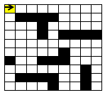
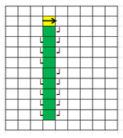

.. admonition:: Muudatused

    * 1. okt - lisatud projektiplokk; plokkskeemi teemad viidud kokku ühe jaotuse alla.
    * 3. nov - lisatud lokaalsete muutujate osa.

4. Alamprogrammid e. funktsioonid
====================================


Funktsioonid e. uute käskude loomine
-----------------------------------------
.. note::

    Siin on tegemist väga põgusa sissejuhatusega funktsioonide defineerimisest. Sellel teemal tuleb edaspidi palju rohkem juttu.
    
Oletame, et meil on vaja joonistada kilpkonnaga 3 ruutu, kõik küljepikkusega 30, aga nad peavad olema erinevates kohtades: esimene ruut ekraani keskel, teine üleval-paremal, kolmas üleval-vasakul ja teisest natuke allpool. Mitu rida läheks sellise programmi kirjutamiseks vaja? Kas programmi lühendamiseks oleks abi tsüklist, mis teeb 3 kordust ja joonistab igal kordusel ühe ruudu?

Kui see programm kirjutada "jõumeetodil", siis sisalduks programmis ruudu joonistamise kood kolmes kohas:

.. sourcecode:: py3

    from turtle import *

    küljepikkus = 30

    i = 0
    while i < 4:
        forward(küljepikkus)
        left(90)
        i += 1 

    up()
    forward(100)
    left(90)
    forward(100)
    down()

    i = 0
    while i < 4:
        forward(küljepikkus)
        left(90)
        i += 1 

    up()
    left(90)
    forward(200)
    down()

    i = 0
    while i < 4:
        forward(küljepikkus)
        left(90)
        i += 1 

    exitonclick()    

Lahendus oleks palju lihtsam, kui ruudu joonistamiseks oleks olemas eraldi käsk. ``turtle`` moodulis sellist käsku küll pole, aga õnneks võimaldab Python programmeerijal uusi käske e. *funktsioone* ise *defineerida*.

Funktsiooni defineerimine ja kasutamine
~~~~~~~~~~~~~~~~~~~~~~~~~~~~~~~~~~~~~~~~~~~~
Jätame hetkeks kilpkonna kõrvale ja vaatleme ühte väga lihtsat näidet funktsioonide defineerimisest. Järgnevas näiteprogrammis defineeritakse funktsioon nimega ``tere``:

.. sourcecode:: python

    def tere():
        print("Tere")
        print("Kuidas läheb?")

Esimest rida, mis algab ``def``-iga, nimetame funktsiooni **päiseks**, järgnevad read, mis on tühikutega paremale nihutatud, moodustavad funktsiooni **keha**. 

Proovige seda kolmerealist programmi käivitada. Kui kõik läks õigesti, ei ilmu ekraanile midagi. Nimelt on programmis antud juhul toodud vaid teatud tegevuse kirjeldus, kuid seal pole käsku seda (ega ühtegi teist) tegevust täita.

Sisuliselt me defineerisime uue käsu ``tere``, mille rakendamisel peab Python käivitama laused ``print("Tere")`` ja ``print("Kuidas läheb?")``. Kõik need "käsud", mida olete siiani kasutanud (nt. ``print`` ja ``sin``) on samuti kuskil funktsioonidena defineeritud. Edaspidi kasutame sõna `käsk` asemel põhiliselt sõna `funktsioon`. 

Nagu ikka, tuleb funktsiooni (käsu) kasutamiseks kirjutada selle nimi koos sulgudega e. programmeerijate kõnepruugis: funktsioon tuleb **välja kutsuda** (või *rakendada*). Proovige järgmist, täiendatud programmi:

.. sourcecode:: python

    def tere():
        print("Tere")
        print("Kuidas läheb?")
    
    # funktsiooni defineerimise ja väljakutse vahel võib olla
    # ükskõik kui palju muid lauseid
    print("blaa, blaa, blaa")
    # ...
    
    tere() # funktsiooni väljakutse e. rakendamine

.. note::

    Antud näites on nii funktsiooni definitsioonis, kui ka väljakutses kirjutatud *tühjad* sulud, kuna see funktsioon *ei võta argumente*. Argumentidega funktsioonidest tuleb juttu alamprogrammide peatükis.

    
Tavaliselt pannakse funktsioonidesse need laused, mida on vaja käivitada rohkem, kui ühel korral. Proovige programmi, kus funktsiooni ``tere`` on kaks korda välja kutsutud. Programmi käivitamisel peaks nüüd tulema kaks järjestikust tervitust.

.. note:: 

    Samamoodi nagu ``if`` ja ``while`` lausete puhul, on ka funktsiooni kehas ridade ees olevad tühikud olulised -- selle järgi saab Python aru, kus lõpeb funktsiooni definitsioon ja algavad järgmised laused. Selles veendumiseks kustutage ``print("Kuidas läheb?")`` rea eest tühikud ära ning proovige siis programmi uuesti käivitada. Miks ilmusid laused ekraanile sellises järjekorras?

Harjutus 11. Ruudu joonistamine
~~~~~~~~~~~~~~~~~~~~~~~~~~~~~~~~
Nüüd on paras aeg tulla tagasi selle teema alguses käsitletud probleemi juurde.
Kirjutage funktsioon ``ruut``, mis joonistaks kilpkonna abil ruudu (küljepikkusega 30).  Kasutage seda funktsiooni mitu korda, joonistades ruute erinevatesse kohtadesse.

.. note::

    Justnagu tsükli või tingimuslause kehas, saab ka funktsiooni kehas kasutada ükskõik kui keerulisi ``if``- või ``while`` lauseid (ja nende kombinatsioone):
    
    .. sourcecode:: py3
    
        def mitu_teret():
            n = 0
            
            while n < 10:
                print("Tere!")
                n += 1
        
        mitu_teret()

.. note::

    Kui kilpkonna rahulik tempo teid ärritab, siis andke talle käsk ``speed(10)``.


Eelmise peatüki lõpus läksid mõned programmid võrdlemisi keeruliseks -- näiteks põranda värvimise ülesandes tuli teil tõenäoliselt läbi mõelda ja kirja panna kuidas teha vahet, milline veerg värvida ja milline mitte, kuidas korraldada liikumise ja värvimise vaheldumine, millal ja kuhupoole tuleks pöörata, millal on ülesanne täidetud jne. Kõikide nende probleemide lahendused kokku kirjutatuna võivad esialgu silme eest kirjuks võtta. Kui keegi küsiks teilt praegu, millise eesmärgiga on teie programmis mingi konkreetne rida või plokk, siis ilmselt peaksite enne vastamist omajagu süvenema.

Kuna enamus praktikas kasutatavaid programme on palju keerulisemad kui põranda värvimise programm, peab eksisteerima mingi nipp taolise keerukusega toimetulekuks. Käesolev peatükk ongi mõeldud selle nipi selgitamiseks ja harjutamiseks.


Alamülesannete tuvastamine ja alamprogrammide loomine
---------------------------------------------------------
Tuleb välja, et programmeerimises kasutatakse keeruliste ülesannete lahendamisel sama nippi nagu "päris elus" -- esmalt jaotatakse ülesanne parajateks osadeks e. alamülesanneteks, seejärel lahendatakse alamülesanded (keskendudes korraga vaid ühele) ning lõpuks kombineeritakse alamülesannete lahendused. Seejuures juhtub küllalt tihti (nii programmeerimises, kui päris elus), et mõni alamülesanne on juba mingi teise probleemi kontekstis varem lahendatud, sel juhul saab vastavat lahendust taaskasutada.

Programmeerimises nimetatakse alamülesande lahendust **alamprogrammiks** (see on üldisem nimetus) või ka **funktsiooniks** (Pythoni programmeerijad eelistavad seda nimetust). Pythoni funktsioonide defineerimist sai tegelikult juba liitlausete peatükis veidi tutvustatud (vt. Uute käskude loomine), aga selles peatükis käsitleme funktsioonide kasutusvõimalusi palju sügavamalt ja laiemalt.

.. note::

    Erinevalt teistest siiani tutvustatud Pythoni põhikonstruktsioonidest (hargnemine ja tsükkel), ei ole alamprogrammid tehniliselt võttes programmeerimisel hädavajalikud -- kõik programmid on teoreetiliselt võimalik kirjutada kasutades vaid väikest hulka sisseehitatud käske. Taoliselt kirjutatud praktilised programmid aga läheksid peagi nii suureks ja keeruliseks, et ka parimad programmeerijad ei suudaks neid enam hallata.

Võtame esimeseks näiteks juba mainitud ülesande, kus robot peab värvima põranda triibuliseks (vt. 3. ptk :ref:`triibuliseks`. Kui teil on jäänud see ülesanne lahendamata, siis enne jätkamist on soovitav see ülesanne praeguste teadmiste abil ära teha). 

Toome siinkohal ära ühe võimaliku lahenduse, kus pole alamprogramme kasutatud:

.. sourcecode:: py3

    from pykkar import *

    create_world("""
    ########
    #      #
    #      #
    #  ^   #
    #      #
    #      #
    ########
    """)

    # eeldame, et robot alustab alati näoga põhjasuunas

    # liigu põhjaseinani
    while not is_wall():
        step()

    # pööra läänesuunda
    right()
    right()
    right()

    # liigu lääneseinani
    while not is_wall():
        step()

    # pööra lõunasuunda
    right()
    right()
    right()

    # välimine tsükkel käib üle veergude (kaks veergu korraga, üks allaminnes, 
    # koos värvimisega ja teine üles tulles, ilma värvimiseta)
    while True:

        # allaminek ja värvimine
        paint()
        while not is_wall():
            step()
            paint()

        # liigu järgmisele veerule (kui võimalik)
        right()
        right()
        right()
        
        if is_wall():
            # rohkem veerge pole
            break

        # kui jõudsime siia, siis on järelikult veel veerge
        step()
        # pööra nina põhjasuunda
        right()
        right()
        right()

        # liigu üles
        while not is_wall():
            step()

        # proovime liikuda järgmisele (värvitavale) veerule
        right()
        if is_wall():
            # pole rohkem veerge
            break

        step()
        # pöörame õigesse suunda
        right()

        
        

    


Nagu juba varem mainitud, oskab meie robot pöörata vaid paremale. Seetõttu on näitekoodis koht, kus 90° võrra vasakule pööramise saavutamiseks on antud 3 korda järjest käsklus ``paremale()``. See on üks koht, mis võib programmi lugejale esmapilgul segadust tekitada. Kasutame võimalust ja defineerime uue alamprogrammi (e. funktsiooni või "käsu") vasakule pööramiseks. Selleks lisame esialgse programmi algusse uue *funktsiooni definitsiooni*:

.. sourcecode:: py3

    from pykkar import *

    def left():
        right()
        right()
        right()
    
    ...


Sisuliselt defineerisime ühe uue roboti juhtimise käsu ja me võime algses programmis kolmekordse paremale pööramise asendada käsuga ``left()``. Nii ei jäta me koodi lugejale enam kahtlust, mida me soovime kolmekordse pööramisega saavutada.

Teine korduv motiiv esialgses programmis on seinani liikumine. Ka selle saame vormistada funktsioonina:

.. sourcecode:: py3

    ...
    
    def move_to_wall():
        while not is_wall():
            step()
    
    ...

Kui nüüd mõlemaid uusi käske programmis kasutada, saame juba omajagu lihtsama tulemuse:

.. sourcecode:: py3

    from pykkar import *

    def left():
        right()
        right()
        right()

    def move_to_wall():
        while not is_wall():
            step()

    create_world("""
    ########
    #      #
    #      #
    #  ^   #
    #      #
    #      #
    ########
    """)

    # eeldame, et robot alustab alati näoga põhjasuunas

    # liigu põhjaseinani
    move_to_wall()

    # pööra läänesuunda
    left()

    # liigu lääneseinani
    move_to_wall()

    # pööra lõunasuunda
    left()

    # välimine tsükkel käib üle veergude (kaks veergu korraga, üks allaminnes, 
    # koos värvimisega ja teine üles tulles, ilma värvimiseta)
    while True:

        # allaminek ja värvimine
        paint()
        while not is_wall():
            step()
            paint()

        # liigu järgmisele veerule (kui võimalik)
        left()
        
        if is_wall():
            # rohkem veerge pole
            break

        # kui jõudsime siia, siis on järelikult veel veerge
        step()
        # pööra nina põhjasuunda
        left()

        # liigu üles
        move_to_wall()
        
        # proovime liikuda järgmisele (värvitavale) veerule
        right()
        if is_wall():
            # pole rohkem veerge
            break

        step()
        # pöörame õigesse suunda
        right()


Nende funktsioonide loomine ja kasutuselevõtt tuli kasuks kahel moel. Esiteks, funktsiooni defineerimisega **andsime (potentsiaalselt) keerulisele programmilõigule selgitava nime** ning võisime programmi põhiosas mainida ainult nime -- nii muutsime programmi põhiosa veidi lihtsamaks. Nüüd on meil võimalus analüüsida seda värjaeraldatud koodi põhiprogrammist eraldi ja samuti on võimalik analüüsida põhiprogrammi ilma, et peaks muretsema detailide pärast. Näiteks, põhiprogrammi uurides piisab meile teadmisest, et robot pöörab mingis kohas vasakule, me ei pea muretsema selle pärast, kuidas ta seda teeb. Samas, kui meid detailid siiski huvitavad, siis saame alati otsida üles vastava funktsiooni definitsiooni.

Teiseks, me **defineerisime funktsiooni ühekordselt, aga saime seda kasutada mitmes kohas**, seega hoidsime kokku tippimise vaeva.

.. note::

    Alamprogrammide defineerimine on tihti mõistlik ka siis, kui väljaeraldatud koodi on kasutatud vaid ühes kohas, aga ta on piisavalt keeruline, et programmi mõistmist raskendada. Meie näite puhul võiksime eraldi funktsiooni luua veel kuni seinani värvimise kohta:
    
    .. sourcecode:: py3
    
        def paint_until_wall():
            paint()
            while not is_wall():
                step()
                paint()
    
    Selle funktsiooni kasutamisega saaksime lahti ka kahekordsest tsüklist (tsükkel tsükli sees), mis võib mõnele programmi lugejale tunduda keeruline.
    

Harjutus 1. Liigu nurka
~~~~~~~~~~~~~~~~~~~~~~~~~~
Lisage vaadeldud näiteprogrammi veel ühe funktsiooni definitsioon -- ``liigu_nurka`` peaks liigutama kilpkonna temast vasakule-ettepoole jäävasse nurka (võime eeldada ristküliku kujulist põrandat).

Kasutage seda funktsiooni programmis sobival kohal.

.. _lokaalsed-muutujad:
 
Lokaalsed muutujad
---------------------
Funktsiooni kehas võib võtta kasutusele abimuutujaid, justnagu me oleme siiani neid kasutanud funktsioonidest väljaspool. Toome siinkohal uuesti ära 3. peatükist tuttava ruudu joonistamise funktsiooni:

.. sourcecode:: py3
    
    from turtle import *
    
    def ruut():
        # selle muutuja abil peame arvet, mitu külge on juba joonistatud
        joonistatud_kylgi = 0               
        
        while joonistatud_kylgi < 4:
            forward(100)
            left(90)
            joonistatud_kylgi = joonistatud_kylgi + 1   # suurendame muutuja väärtust
    
    ruut()
    exitonclick()


Kuidas oleks, kui me üritaksime peale funktsiooni ``ruut`` väljakutsumist kontrollida, milline oli ikkagi muutuja ``joonistatud_kylgi`` viimane väärtus? Proovige järgmist, veidi muudetud programmi:

.. sourcecode:: py3
    :emphasize-lines: 13
    
    from turtle import *
    
    def ruut():
        # selle muutuja abil peame arvet, mitu külge on juba joonistatud
        joonistatud_kylgi = 0               
        
        while joonistatud_kylgi < 4:
            forward(100)
            left(90)
            joonistatud_kylgi = joonistatud_kylgi + 1   # suurendame muutuja väärtust
    
    ruut()
    print(joonistatud_kylgi)
    exitonclick()


Ilmselt saite programmi käivitamisel Pythonilt veateate (``"NameError: name 'joonistatud_kylgi' is not defined"``). Asi on selles, et funktsiooni kehas kasutusele võetud muutujad on *lokaalsed*, st nad "elavad" täielikult funktsiooni sees. Lokaalsed muutujad luuakse funktsiooni käivitamisel ja nad kaovad, kui funktsioon oma tööga lõpetab. Nende olemasolu on funktsiooni siseasi, see ei paista kuidagimoodi väljapoole. See asjaolu võimaldab meil lokaalsetele muutujatele vabalt nimesid valida, ilma muretsemata, kas mõnda neist nimedest on juba programmi põhiosas või mõnes teises funktsioonis kasutatud. 

Eelneva jutu kinnituseks demonstreerib järgnev programm, et funktsiooni sees defineeritud muutuja ``x`` ei mõjuta kuidagi programmi põhiosas defineeritud samanimelist muutujat, tegemist on kahe eraldi muutujaga, millele on juhtumisi sama nimi (justnagu kahel erineval inimesel võib olla sama nimi):

.. sourcecode:: py3

    x = 1

    def f():
        x = 2
        print(x)
    
    print(x) # ekraanile kuvatakse 1
    f()      # ekraanile kuvatakse 2
    print(x) # ekraanile kuvatakse 1
        

.. note::

    Programmi põhiosa muutujate (neid nimetakse ka *globaalseteks muutujateks*) ning funktsiooni kehas defineeritud muutujate (e. lokaalsete muutujate) eraldatus ei ole päris samaväärne -- kuigi programmi põhiosal pole ligipääsu funktsiooni muutujatele, saab funktsioonis vajadusel siiski kasutada programmi põhiosa muutujaid. Sellest võimalusest tuleb täpsemalt juttu ühes hilisemas peatükis.


    
Parameetrid
-----------
Täpselt sama tegevuse kordamist on tegelikult vaja siiski üpris harva. Tavaliselt on tarvis igal korral teha midagi sarnast, kuid mingi väikese nüansiga. Sellise nüansi väljatoomiseks kasutatakse programmeerimisel **parameetreid**. Järgnevas näiteprogrammis on defineeritud funktsioon kasutaja tervitamiseks. Selleks muutuvaks nüansiks on siinkohal kasutaja nimi:

.. sourcecode:: python

    def tere(nimi):
        print("Tere " + nimi)
        print("Kuidas läheb?")
        
    tere("Kalle")
    tere("Malle")
    
Funktsiooni ``tere`` definitsiooni päises on lisaks funktsiooni nimele näidatud ära ka üks *parameeter* nimega "nimi". Parameetri näol on sisuliselt tegu spetsiaalse *lokaalse muutujaga*, millele Python annab konkreetse väärtuse funktsiooni väljakutsel. Konkreetsed väärtused (nt. ``"Kalle"``) kirjutatakse väljakutsel funktsiooni nime järel olevatesse sulgudesse. Antud juhul on parameetri ``nimi`` väärtuseks esimesel väljakutsel "Kalle" ning teisel väljakutsel "Malle". Funktsioon töötab aga mõlemal juhul samamoodi – ta võtab parameetri väärtuse ning lisab selle tervitusele. Kuna aga väärtused on kahel juhul erinevad, on ka tulemus erinev.


.. index::
    single: funktsioon; argumendid
    single: argumendid; funktsiooni argumendid

.. admonition:: Terminoloogia: Parameetrid ja argumendid

    Koos parameetritega räägitakse enamasti ka **argumentidest**. Argumendiks nimetakse funktsiooni väljakutses sulgudes antud avaldise väärtust, millest saab vastava parameetri väärtus. Parameetrid on seotud funktsiooni definitsiooniga, argumendid on seotud funktsiooni väljakutsega. Meie viimases näites on ``nimi`` funktsiooni ``tere`` `parameeter`, aga sõneliteraal ``"Kalle"`` on vastav `argument` funktsiooni väljakutses.

    
    `Parameetri` vs. `argumendi` asemel võite mõnikord kohata ka väljendeid `formaalne parameeter` vs. `tegelik parameeter`.  

Harjutus 2. Parameetriseeritud ``ruut``
~~~~~~~~~~~~~~~~~~~~~~~~~~~~~~~~~~~~~~~~
Täiustage 3. peatükis mainitud ruudu joonistamise funktsiooni nii, et ruudu küljepikkuse saab määrata funktsiooni väljakutsel. Kasutage loodud funktsiooni, joonistades mitu erineva suurusega ruutu.

.. note::

    Järgnevas vihjes on antud harjutuse näitelahendus, ärge seda enne vaadake, kui olete ise proovinud!

.. hint::
    
    .. sourcecode:: py3
    
        from turtle import *
        
        def ruut(kylg):
            i = 0
            while i < 4:
                forward(kylg)
                left(90)
                i += 1
        
        ruut(100)
        
        # liigume kuskile mujale
        up()
        forward(200)
        down()
        
        # väiksem ruut
        ruut(20)
        
        exitonclick()


.. _param-vs-input:
.. topic:: Parameetrid vs. ``input``

    Parameetritega funktsioon meenutab oma olemuselt programmi, kus on kasutatud ``input`` käsku -- mõlemal juhul on konkreetsed sisendandmed teadmata. Erinevus on selles, et kui ``input`` puhul on teada, et sisendandmed küsitakse kasutajalt, siis parameetrite kasutamisel jäetakse (funktsiooni seisukohast vaadatuna) sisendi saamise viis lahtiseks. Eelnevas näites andsime funktsiooni väljakutsel parameetri väärtuseks sõneliteraalid, kuid seal oleks võinud kasutada ka muutujat:

    .. sourcecode:: py3

        def tere(nimi):
            print("Tere " + nimi)
            print("Kuidas läheb?")
            
        sisestatud_nimi = input("Kuidas on sinu nimi? ")
        tere(sisestatud_nimi)

    See näide demonstreerib parameetritega funktsioonide universaalsust -- vastavalt vajadusele võime taolist funktsiooni kasutada literaaliga või mõne muutujaga (mille väärtus võib olla saadud ``input``-ist) või ka mingil keerulisemal kujul oleva avaldisega.

    .. note::

        Pange tähele, et eelviimasel real defineeritud muutuja nimeks oleksime võinud panna ka lihtsalt ``nimi``:
        
        .. sourcecode:: py3

            def tere(nimi):
                print("Tere " + nimi)
                print("Kuidas läheb?")
                
            nimi = input("Kuidas on sinu nimi? ")
            tere(nimi)
            
        See, et funktsiooni ``tere`` parameeter on samuti ``nimi``, ei aja Pythonit segadusse, kuna funktsiooni sisemus (sh. tema parameetrid) on ülejäänud programmist eraldatud. Kõlab sarnaselt sektsioonile "Lokaalsed muutujad"? Tegemist ongi sama teemaga -- nagu juba korra mainitud, käsitletakse ka parameetreid justkui (lokaalseid) muutujaid.
        
        Taoline nimede "taaskasutamine" erinevates kontekstides on küllalt levinud, aga kui leiate, et see ajab teid ennast segadusse, siis võite kasutada alati erinevaid muutujanimesid.


Mitu parameetrit
~~~~~~~~~~~~~~~~
Parameetreid (ja vastavaid argumente) võib olla ka rohkem kui üks. Proovige näiteks järgmist programmi:

.. sourcecode:: python

    def tere(nimi, aeg):
        print("Tere, " + nimi)
        print("Pole sind juba " + str(aeg) + " päeva näinud")
	
    tere("Kalle", 3)

Nagu näete, tuleb funktsiooni väljakutsel argumendid anda samas järjekorras nagu on vastavad  parameetrid funktsiooni definitsioonis. Teisisõnu, argumendi *positsioon* määrab, millisele parameetrile tema väärtus omistatakse.

.. note::

    Mõnede funktsioonide puhul on ühe parameetri väärtus tavaliselt sama ja seda on vaja vaid harvadel juhtudel muuta. Sellisel juhul on võimalik see "tavaline" väärtus funktsiooni definitsioonis ära mainida. Kui funktsiooni väljakutsel sellele parameetrile väärtust ei anta, kasutatakse lihtsalt seda vaikeväärtust. Seda võimalust demonstreerime eelmise näite modifikatsiooniga:

    .. sourcecode:: python

        def tere(nimi, aeg = "mitu"):
            print("Tere, " + nimi)
            print("Pole sind juba " + str(aeg) + " päeva näinud")
        
        tere("Kalle", 3)
        tere("Malle")
    
    Eespool juba nägime, et funktsioonil ``print`` on lisaks põhiparameetrile veel parameeter nimega `end`, millele on antud vaikeväärtus ``"\n"`` (so. reavahetus). See on põhjus, miks ``print`` vaikimisi kuvab teksti koos reavahetusega. Kuna selle funktsiooni definitsioonis kasutatakse Pythoni keerulisemaid võimalusi, siis ``print``-i väljakutsel ei olegi võimalik `end` väärtust määrata ilma parameetri nime mainimata, st. seda ei saa anda positsiooniliselt.

Harjutus 3. Värviline ruut
~~~~~~~~~~~~~~~~~~~~~~~~~~~~
Kilpkonna "pliiatsi" värvi saab muuta funktsiooniga ``color``, andes sellele argumendiks sõne ingliskeelse värvinimega, nt. ``color('red')``. Peale seda teeb kilpkonn järgmised jooned nõutud värviga. 

.. note::

    Soovi korral vaadake täpsemat infot siit:
    http://docs.python.org/py3k/library/turtle.html#turtle.color

Lisage funktsioonile ``ruut`` uus parameeter joone värvi määramiseks. Katsetage.

.. index::
    single: funktsioon; väärtusega funktsioon
    single: väärtusega funktsioon
    single: return
    
Väärtusega funktsioonid
-----------------------
.. admonition:: Probleem

    Kolmanda peatüki pere sissetuleku ülesandes kordasite tõenäoliselt netopalga arvutamise valemit kahes kohas -- ema ja isa netopalga arvutamisel. (Kui teil jäi see ülesanne tegemata, siis on väga soovitav see praegu, enne edasi lugemist ära teha). 
    
    Siin polnud õnneks tegemist eriti keerulise valemiga ning copy-paste'ga oli võimalik topelt tippimise vaeva vältida. Aga kui netopalga arvutamise valem peaks muutuma, siis peab olema meeles programmi muuta kõigis kohtades, kus seda valemit on kasutatud. 

    Ilmselt juba aimate, et taolise kordamise vältimiseks on jälle abiks funktsioonid -- netopalga arvutamiseks tuleb defineerida uus funktsioon (nt. nimega ``neto``), valem tuleb kirja panna selle funktsiooni kehas, ning edaspidi tuleb netopalga arvutamiseks kasutada uut funktsiooni. Kuidas aga saada funktsiooni käest vastust kätte? Võib proovida muutujatega, aga kuna antud programmi puhul tuleb ühel juhul salvestatakse tulemus muutujasse ``isa_sissetulek`` ja teisel juhul muutujasse ``ema_sissetulek``, siis pole selge, millist muutujat kasutada. Mis teha siis, kui mõnikord on tarvis tulemus kohe ekraanile näidata ja muutujat polegi tarvis?


Funktsioone ``ruut`` ja ``print`` kasutame käskudena -- meid huvitab see **tegevus**, mida see funktsioon teeb (kilpkonna liigutamine või ekraanile kirjutamine). Seevastu funktsioonide ``sin`` ning ``sqrt`` kasutusviis on hoopis erinev -- meid huvitab hoopis vastava funktsiooni rakendamisel saadav **väärtus**.

Nii ``sin`` kui ``sqrt`` teevad argumentidega mingi arvutuse, ning **tagastavad** saadud väärtuse, mida võime nt. kasutada avaldises, salvestada muutujasse või vaadata käsureal. Taolisi funktsioone nimetame **väärtusega funktsioonideks**.

.. note ::

    Mõnedes keeltes nimetatakse alamprogramme, mis teevad midagi, *protseduurideks* ning väärtusega funktsioone lihtsalt *funktsioonideks*

Järgnev näide defineerib funktsiooni, mis arvutab ja tagastab ristküliku pindala. Seejärel kasutatakse seda funktsiooni konkreetsete argumentidega:

.. sourcecode:: python

    def ristkyliku_pindala(laius, korgus):
        return laius * korgus
        
    pindala = ristkyliku_pindala(4, 5)
    print("Pindala on: " + str(pindala))
    print("Pool pindalast on: " + str(pindala / 2))

Väärtusega funktsioonide puhul on oluline *võtmesõna* ``return`` -- sellele sõnale järgnev avaldis määrab funktsiooni väljakutse väärtuse.

Harjutus 4. Topelt
~~~~~~~~~~~~~~~~~~~~~~
Kirjutage funktsioon, mis võtab argumendiks ühe arvu ning tagastab selle arvu kahega korrutatuna.

Demonstreerige loodud funktsiooni tööd, kirjutades programmi ka mõned funktsiooni väljakutsed erinevate argumentidega. NB! tulemuse ekraanile kuvamine tuleks korraldada funktsiooni väljakutse juures, mitte funktsiooni definitsioonis!

.. topic:: ``return`` lõpetab funktsiooni töö

    Eelmises näites oli ``return`` lause funktsiooni kehas kõige viimane asi. Tegelikult ei pea ``return`` olema tingimata funktsiooni lõpus. Järgnevas absoluutväärtuse arvutamise funktsiooni näites kasutatakse ``return``-i kahes kohas -- funktsiooni lõpus ja tingimuslause sees:

    .. sourcecode:: py3

        def absoluut(x):
            if x < 0:
                return -x
            
            return x

    Kumb neist ``return``-idest siis ikkagi kehtib? Sellele vastamiseks peame teadma, et ``return`` lause käivitamine lõpetab alati funktsiooni töö. Seega, kui kutsume antud funktsiooni välja negatiivse argumendiga, siis käivitub esimene ``return`` ja ``if``-lausele järgnevat rida üldse ei vaadatagi. Kui aga ``if`` lause tingimus osutub vääraks, siis ``if``-lause keha ei vaadata ja Python jätkab sellega, mis tuleb peale ``if``-lauset (so. teine ``return```).
    
    See võimalus kasutada ``return``-i funktsiooni keskel ei ole tegelikult eriti oluline -- alati saab funktsiooni panna kirja nii, et seal on täpselt üks ``return`` lause ja see paikneb funktsiooni lõpus.


.. _return-vs-print:

.. topic:: ``return`` vs. ``print``

    Eelnevalt märkisime, et nii funktsiooni parameetrid kui ``input`` on olemuselt sarnased, kuna mõlemad on seotud sisendi saamisega, kuid parameetrid on paindlikumad, kuna täpne sisendi saamise viis jäetakse lahtiseks.

    Analoogselt võime võrrelda ``print`` ja ``return`` käsku -- mõlemad on seotud väljundi andmisega, kuid ``return`` on paindlikum, kuna *täpne tulemuse kasutamise viis jäetakse lahtiseks*. Kuigi ristküliku pindala näites me lõpuks ikkagi ``print``-isime saadud tulemuse, siis tänu ``return``-ile jäi meie funktsiooni definitsioon universaalseks ja see võimaldas meil tulemust kasutada ka teistes arvutustes.

    Kui me oleks ``print``-imise teinud juba funktsiooni sees ...

    .. sourcecode:: python

        # NB! Ebasoovitav!
        def ristkyliku_pindala(laius, korgus):
            print(laius * korgus)

    ... siis see funktsioon oleks sobinud vaid neil juhtudel, kui me soovime arvutuse tulemust ainult ekraanil näidata, teistes arvutustes poleks me tulemust enam kasutada saanud.

    .. note::
        
        Kuigi ka funktsioon ``print`` näib "tagastavat" oma argumendi (kuvades selle ekraanile), ei ole see siiski ``print`` funktsiooni tagastusväärtus: nt. kirjutades ``x = print("Tere")`` ei jõua sõne ``"Tere"`` muutujasse ``x``.
        
        Sarnane segadus võib tekkida ka Pythoni käsurea kasutamisel -- kui kirjutada sinna avaldis ``sqrt(2)``, siis tulemus ilmub ikkagi ekraanile, kuigi me ei kasutanud ``print`` käsku. Kas see tähendab, et ka "funktsioon" ``sqrt`` kuvab vastuse ekraanile? Ei, tegelikult Pythoni käsurida kuvab ``sqrt`` käest saadud vastuse ekraanile omal algatusel, ``sqrt`` ei tea sellest midagi.

        Kui päris täpne olla, siis tegelikult kõik Pythoni funktsioonid tagastavad midagi, isegi ``print`` ja ``ruut``. Need funktsioonid, mille eesmärk on vaid mingi tegevus, tagastavad alati ühe spetsiifilise (ja suhteliselt ebahuvitava) väärtuse ``None``. Selle väärtusega ei ole üldjuhul midagi peale hakata ning seepärast Python'i käsurida ka ei näita seda automaatselt.


Harjutus 5. Tollid ja sentimeetrid
~~~~~~~~~~~~~~~~~~~~~~~~~~~~~~~~~~
.. note::
    Selle ülesandega saate harjutada ühte levinud võtet uute funktsioonide loomiseks

#. Kirjutage funktsioon, mis võtab argumendiks pikkuse tollides ning tagastab pikkuse sentimeetrites. Salvestage esialgu faili vaid funktsiooni definitsioon, ilma väljakutseta.
#. Testige loodud funktsiooni käsureal (käivitage programm IDLE-ga, ning kirjutage mõned väljakutsed). Kui funktsioon ei tööta õigesti, siis korrigeerige definitsiooni ja proovige uuesti.
#. Lõpuks kasutage funktsiooni programmis, mis küsib kasutajalt tema pikkuse tollides ja väljastab ekraanile vastava pikkuse sentimeetrites ning tema nn. "ideaalkaalu" (so. pikkus sentimeetrites - 100, nt. kui pikkus on 185cm, siis ideaalkaal on 85kg).

Harjutus 6. Sõne dubleerimine
~~~~~~~~~~~~~~~~~~~~~~~~~~~~~
Kirjutage funktsioon ``dubleeri`` , mis võtab argumendiks sõne ning tagastab selle sõne dubleerituna niimitu korda, kui mitu tähte on esialgses sõnes:

.. sourcecode:: py3

    >>> dubleeri('xo')
    'xoxo'
    >>> dubleeri('Tere')
    'TereTereTereTere'

.. hint::

    Abiks on funktsioon ``len`` ja operaator ``*``


"Mugavusfunktsioonid"
~~~~~~~~~~~~~~~~~~~~~
Python'i ``math`` mooduli ``log`` funktsioon arvutab vaikimisi naturaallogaritmi. Selleks, et arvutada logaritmi mõne teise alusega, tuleb alus anda teiseks argumendiks, nt. ``log(8, 2)``. Kui meil on tihti tarvis arvutada just kahendlogaritmi, siis võime defineerida selle jaoks uue funktsiooni, mis kasutab oma definitsioonis tavalist ``log`` funktsiooni:

.. sourcecode:: py3

    from math import *

    def log2(x):
        return log(x, 2)

Nüüd on meil eraldi kahendlogaritmi arvutamise funktsioon, millele peame andma vaid ühe argumendi, nt. ``log2(8)``. Antud näites ei võitnud me sellega just palju, kuid keerulisemate funktsioonide väljakutsete puhul võib taoline trikk teha koodi märgatavalt lühemaks ja selgemaks.


Funktsiooni keha sisu
~~~~~~~~~~~~~~~~~~~~~~~~~~~~~~~~~~~~~
Nagu juba 3. peatükis mainitud, võib funktsiooni definitsioonis (olgu väärtusega või ilma) kasutada ükskõik milliseid lausetüüpe (sh. tingimuslaused ja tsükleid). Järgnev näide esitab absoluutväärtuse arvutamise funktsiooni:

.. sourcecode:: py3

    def abs_vaartus(arv):
        if arv < 0:
            tulemus = -arv
        else:
            tulemus = arv
        
        return tulemus

Kui võrdlete seda funktsiooni kolmandas peatükis näidatud absoluutväärtuse arvutamise programmiga, siis märkate, et erinevus on vaid sisendandmete saamises (parameeter vs. ``input``) ning tulemuse esitamises (``return`` vs. ``print``).

.. note:: 

    Tingimuslausega funktsioonis on mõnikord mugavam kasutada mitut ``return`` lauset. Sama funktsiooni saaksime panna kirja ka järgnevalt:
    
    .. sourcecode:: py3

        def abs_vaartus(arv):
            if arv < 0:
                return -arv
            else:
                return arv


Harjutus 7. Kahest arvust suurim
~~~~~~~~~~~~~~~~~~~~~~~~~~~~~~~~
Kirjuta funktsioon, mis saab parameetritena kaks arvu ning tagastab neist suurima.


.. _milleks-funktsioonid:

Milleks funktsioonid?
---------------------
Vaatame üle peamised põhjused, miks on funktsioonid kasulikud.

.. index::
    single: DRY-printsiip
    
*DRY*-printsiip
~~~~~~~~~~~~~~~
Kolmandas peatükis oli ülesanne pere sissetuleku arvutamiseks. Tõenäoliselt kasutasite programmis netopalga arvutamise valemit kahes kohas (vastavalt isa ja ema palga jaoks).

Kui taoline programm oleks reaalses kasutuses, siis nt. tulumaksuvaba miinimumi muutmise korral tuleks parandused teha kahes kohas. Antud näite puhul oleks see piisavalt lihtne, kuid reaalsetes programmides juhtub tihti, et vajalik parandus unustatakse mõnes kohas tegemata. Seetõttu propageeritakse programmeerimisel nn. **DRY-printsiipi** -- see tuleb ingliskeelsest väljendist *Don't Repeat Yourself*, millega tahetakse öelda, et sarnase koodi kordamist tuleks vältida.

Tuleb välja, et funktsioonid sobivad suurepäraselt *DRY*-printsiibi rakendamiseks -- selle asemel, et samasugust koodi kirjutada erinevatesse kohtadesse, saab selle koodi esitada funktsioonina, ning edaspidi piisab selle kasutamiseks vaid funktsiooni nime mainimisest. Kui midagi on vaja muuta, siis tehakse muudatus vaid funktsiooni kehas ja see mõjub igalpool, kus funktsiooni on kasutatud.

.. index::
    single: abstraktsioon
    
Üldistamine e. *abstraktsioon*
~~~~~~~~~~~~~~~~~~~~~~~~~~~~~~
Kui eri kohtades on vaja sarnast, kuid teatud variatsiooniga koodi (nt. ühel juhul arvutame netopalka ema, aga teisel juhul isa brutopalga põhjal), siis tulevad appi parameetrid, mis võimaldavad meil funktsiooni kehas jätta mõned detailid lahtiseks. Teisiti öeldes -- funktsiooni parameetrid võimaldavad meil kirjutada üldisema e. **abstraktsema** lahenduse, mida saab hiljem konkreetsete argumentidega täpsustada. Nt. netopalga arvutamise funktsioonis saame brutopalga esitada parameetrina, millele antakse väärtus alles konkreetse arvutuse käivitamisel.

.. index::
    single: modulaarsus
    single: must kast
    
Modulaarsus ja *musta kasti* metafoor
~~~~~~~~~~~~~~~~~~~~~~~~~~~~~~~~~~~~~~
Kolmas oluline põhjus tuleb paremini esile suuremate programmide puhul. Kui me koondame teatud alamülesande lahendamiseks vajalikud laused ühte funktsiooni (e. alamprogrammi), siis programmi põhiosas saame selle alamülesande kirja panna vaid vastava funktsiooni nime mainides. Eeldades, et funktsioonide nimed on hoolikalt valitud, piisab meile programmi põhiidee mõistmiseks vaid kasutatud funktsioonide nimede lugemisest -- funktsiooni sisu võime esialgu ignoreerida. Teisiti öeldes: me võime funktsioone soovi korral käsitleda maagiliste **mustade kastidena**, mis *kuidagimoodi* teevad seda, mis nende nimest võib välja lugeda.

Taolisi "musti kaste", mida on võimalik kasutada ilma nende täpset sisu teadmata, nimetatakse tihti *mooduliteks*, ning programme, mis on jagatud alamprogrammideks nimetatakse vastavalt **modulaarseteks**. Kuna Pythonis on sõnal *moodul* spetsiifilisem tähendus, siis meie seda terminit alamprogrammi jaoks ei kasuta.
    
Keskendumine vaid "mustade kastide" *tähendusele*, ignoreerides nende *ehitust*, vabastab osa meie aju töömälust ning võimaldab luua sellevõrra keerulisemaid programme. Kõige keerulisemad programmid on saanud võimalikuks vaid seetõttu, et lihtsatest mustadest kastidest on ehitatud keerulisemad mustad kastid, neist omakorda veel keerulisemad jne.

Kui *DRY*-printsiibi juures rõhutasime seda, et funktsioonid aitavad sama koodi kasutada korduvalt, siis modulaarsuse põhiidee on selles, et me saame funktsiooni kasutada ilma selle täpse sisu peale mõtlemata, toetudes vaid ta nimele. Seetõttu on uue funktsiooni loomine põhjendatud tihti ka siis, kui seda kasutatakse vaid ühes kohas.


.. index::
    single: import
    single: moodulid

Moodulid ja ``import``
----------------------
Pythoniga tuleb kaasa tuhandeid erinevaid funktsioone, lisaks kirjutavad Pythoni programmeerijad üle maailma igapäevaselt tuhandeid funktsioone juurde. Sellises situatsioonis on täiesti loomulik, et mitmele erinevale funktsioonile pannakse sama nimi. Selleks, et erinevatel funktsioonidel oleks siiski võimalik vahet teha, jagatakse need **moodulitesse**.

Eelmistes peatükkides kohtusite juba moodulitega ``math`` ja ``turtle``, ning nägite, et mooduli sisu muutub kättesaadavaks ``import`` käsuga, nt:

.. sourcecode:: py3

    from math import *

Selline variant ``import`` käsust on tegelikult soovitav vaid siis, kui teil on vaja moodulist palju erinevaid funktsioone. Kui te teate, et teil läheb moodulist tarvis vaid mõnda funktsiooni (nt. ``math`` moodulist funktsioone ``sin`` ja ``cos``), siis on soovitav kasutada ``import`` käsu varianti, kus näidatakse ära konkreetsed funktsioonide (või konstantide) nimed, mida tahetakse kasutada: 

.. sourcecode:: py3

    from math import sin, cos

Sellise variandi puhul ei teki segadust, kui tahate mõnd ``math`` moodulis defineeritud nime (nt. ``e``) kasutada mõne enda muutuja nimena.    

``import`` käsust on olemas veel üks variant, mis võimaldab moodulis olevaid funktsioone kasutada ainult koos mooduli nimega:

.. sourcecode:: py3

    >>> import math
    >>> math.sqrt(9)
    3.0
    
Ka selle variandi puhul ei pea oma muutujate nimede valimisel muretsema, kui imporditud moodulis on juba sama nime kasutatud -- antud näites võiksime vabalt luua uue muutuja nimega ``sqrt`` ja see ei läheks segamini funktsiooniga ``math.sqrt``.

.. note:: 
    ``import``-laused tuleks panna programmi algusesse. See pole Pythoni poolt range nõue, vaid lihtsalt tava --  nii on hea näha, milliste teemadega antud programm tegeleb.

.. topic:: Moodulite loomine

    Kõikide selle kursuse ülesannete puhul on aktsepteeritav, kui teie enda programm koosneb ainult ühest failist. Samas, reaalsete programmide juures on peaaegu alati tarvilik organiseerida programmi jaoks loodud funktsioonid eraldi moodulitesse.
    
    Uue mooduli loomine on Pythonis imelihtne -- funktsioonide definitsioonid tuleb lihtsalt salvestada tavalisse *py*-laiendiga faili. Mooduli nimeks saab seejuures tema failinimi ilma *py*-laiendita. Selleks, et neid funktsioone saaks kasutada teistes failides, tuleb seal teha sobiv ``import``, justkui ``math`` või ``turtle`` mooduli puhul. 
    
    Siit tuleb ka välja, miks esimeses peatükis märgiti, et omaloodud faili nimeks ei tohiks panna `turtle.py`. Kui panna, siis hakatakse ``import turtle`` puhul funktsioone ``left()``, ``right()`` jt otsime uuest failist, kus neid aga pole.

    NB! Erinevalt standardmoodulitest, peab enda moodul olema üldjuhul samas kaustas, kus seda kasutav programm (täpsem info siit: http://docs.python.org/py3k/tutorial/modules.html#the-module-search-path)

.. index::
    single: meetodid
    

Meetodid
--------
Teises peatükis nägime, et sõnede puhul kirjutati mõne funktsiooni nimi (nt. ``count``) sõne ja argumentide vahele, nt:

.. sourcecode:: py3

    sõna = "kukununnu"
    u_tähtede_arv = sõna.count("u")

Jääb mulje, et mingil põhjusel on üks funktsiooni argumentidest (antud näites ``sõna``) lihtsalt esile tõstetud. Tuleb välja, et Python seda umbes nii ka käsitleb.

Taolisi funktsioone nimetatakse **meetoditeks**. Lisaks sellele, et meetodite puhul kirjutame esimese argumendi meetodi nime ette, on neil tavaliste funktsioonidega võrreldes veel mõningaid erinevusi, millel me praegu ei peatu. Meetod on väga tähtis mõiste *objekt-orienteeritud programmeerimises*.

.. note::
    Meetodeid ei ole vaja kunagi ``import``-ida.

Veateated ja funktsioonid
---------------------------
Esimeses peatükis soovitasime pikkade veateadete puhul keskenduda veateate viimastele ridadele. Kui täitmisaegne viga tekib mingi funktsiooni sees, siis võib ainult viimaste ridade põhjal olla raske vea põhjust tuvastada. Proovige käivitada järgnevat programmi:

.. sourcecode:: py3

    def arvuta_kuupalk(aastapalk):
        return aastapalk / 12
    
    aastapalk = input("Palun sisesta aastapalk: ")
    print("Kuupalk on", arvuta_kuupalk(aastapalk))    


Kui sisestate nõutud palganumbri, siis saate umbes taolise veateate:

.. sourcecode:: none

    Traceback (most recent call last):
      File "C:/harjutused/vigane.py", line 5, in <module>
        print("Kuupalk on", arvuta_kuupalk(aastapalk))
      File "C:/harjutused/vigane.py", line 2, in arvuta_kuupalk
        return aastapalk / 12
    TypeError: unsupported operand type(s) for /: 'str' and 'int'

Viimaste ridade järgi võiks järeldada, et probleem on real nr 2, funktsioonis ``arvuta_kuupalk``. Tegelikult oli viga aga selles, et funktsiooni kutsuti välja valet tüüpi argumendiga (peaks olema arv, aga oli sõne). Seega tuleb pöörata tähelepanu ka funktsiooni väljakutse kohale. Meie õnneks on ka väljakutse koht veateates ära näidatud -- see on real nr. 5. Kui ka väljakutse ise paiknes kuskil funktsioonis, siis on ka tolle funktsiooni väljakutse koht ära näidatud -- ülevalt alla liikudes saab veateatest välja lugeda, millises kohas kutsuti mida välja.


Ülesanded 
-------------
.. note::

    Kursuse kodulehel loetletud kontrollülesannete all on mõeldud just selle ploki ülesandeid.
    
1. Ristkülik 
~~~~~~~~~~~~
Kirjutage funktsioon ``ristkylik``, mis võtab argumentideks kaks küljepikkust ja joonistab kilpkonnaga neile vastava ristküliku. Joonistage loodud funktsiooni kasutades järgnev kujund:

.. image:: images/rist.png

.. hint::

    Joonis koosneb kolmest ristkülikust
    
.. hint::

    Segaduse vältimiseks on soovitav funktsiooni töö lõppedes pöörata kilpkonn tagasi algsesse suunda.

2. Kolmnurga pindala
~~~~~~~~~~~~~~~~~~~~
Kirjutage funktsioon ``kolmnurga_pindala``, mis võtab argumentideks kolmnurga külgede pikkused, ning tagastab vastava kolmnurga pindala. Eeldame, et argumentide väärtused sobivad kolmnurga küljepikkusteks.

.. hint::

    http://en.wikipedia.org/wiki/Heron%27s_formula

Lisage programmi lõppu (peale funktsiooni definitsiooni) järgmised laused:

.. sourcecode:: py3

    print("a: 1, b: 1, c: 2**0.5, pindala: " + str(kolmnurga_pindala(1, 1, 2**0.5)))
    print("a: 3, b: 2, c: 2,      pindala: " + str(kolmnurga_pindala(3, 2, 2)))
    print("a: 3, b: 4, c: 5,      pindala: " + str(kolmnurga_pindala(3, 4, 5)))
    
Veenduge, et programmi käivitamisel saate järgmised tulemused:

.. sourcecode:: none

    a: 1, b: 1, c: 2**0.5, pindala: 0.49999999999999983
    a: 3, b: 2, c: 2,      pindala: 1.984313483298443
    a: 3, b: 4, c: 5,      pindala: 6.0

NB! tulemused võivad õige pisut ka erineda, sest erinevad Pythoni versioonid ümardavad erineva täpsusega.

3. Kodulaen
~~~~~~~~~~~
Kirjutage funktsioon, mis võtab argumentideks ostetava kinnisvara hinna, sissemakse suuruse ja laenuperioodi aastates ning tagastab intresside kogusumma, mis tuleb ostjal selle laenu eest pangale maksta. Lihtsuse mõttes eeldame, et igal aastal arvestatakse intress algse laenusumma põhjal.

Esimeses versioonis kasutage fikseeritud intressi -- 4% aastas.

Seejärel muutke funktsiooni selliselt, et kui sissemakse on väiksem kui 30% kinnisvara hinnast, siis on intress hoopis 6% aastas.

Lõpuks rakendage loodud funktsiooni programmis, mis küsib kasutajalt soovitud algandmed ja
väljastab antud kinnisvara soetamise kogukulu (sissemakse + laenusumma + intressid) ning eraldi ka intresside kogusumma.

Testige oma programmi ja kontrollige, kas saate järgnevad tulemused:

    * hind: 10000, sissemakse: 3000, aastaid: 10; kogusumma: 12800, intressid: 2800
    * hind: 10000, sissemakse: 2900, aastaid: 10; kogusumma: 14260, intressid: 4260
    * hind: 10000, sissemakse: 2900, aastaid: 0; kogusumma: 10000, intressid: 0

4. Pere sissetulek, ver.2
~~~~~~~~~~~~~~~~~~~~~~~~~~~~~~~~~~~~~
.. note::

    See ülesanne demonstreerib väga hästi *DRY*-printsiibi ning abstraktsiooni olemust.

Võtke aluseks kolmanda peatüki Ülesanne "Pere sissetulek". Muutke lahendust selliselt, et netopalga valem oleks programmis kirja pandud vaid ühes kohas.


Plokkskeemi ülesanded
--------------------------

.. note::

    Neid ülesandeid praktikumis ei kontrollita, aga need on soovitav siiski lahendada. Ülesandeid 1,2,3,4,6 saab lahendada ka Pykkariga.

1. Ring ümber mänguväljaku
~~~~~~~~~~~~~~~~~~~~~~~~~~~~~~~~~~~~~~~

Kilpkonn asub ruudustiku vasakus ülemises nurgas näoga paremale. Ruutude arv ei ole teada. Kilpkonnal on vaja läbi käia suurim ring ja jõuda esialgsesse positsiooni tagasi. Koostada plokkskeem.  Kasutada eelmise ülesande alamprotseduuri. 
 
2. Seinani ja tagasi
~~~~~~~~~~~~~~~~~~~~~~~~~~~~~~~~~
Kilpkonn asub näoga seina poole ja ei ole teada, mitu sammu on seinani. Kilpkonnal on vaja liikuda seinani, pöörata ümber ja liikuda tagasi samasse kohta algasendisse. Koostada plokkskeem.  


3. Liigu ettenähtud kohta
~~~~~~~~~~~~~~~~~~~~~~~~~~~~~~~~~~~~~~

Kilpkonn asub seinaga ümbritsetud ja ilmakaarte järgi orienteeritud ruudustiku mingil ruudul, ninaga itta. Kirjutada plokkskeemi kujul protseduurid, millega kilpkonn
a) liigub ruudustiku kirdenurka ja jääb seal pidama;
b) liigub ruudustiku edelanurka ja jääb seal pidama;
c) liigub ruudustiku äärele ja hakkab äärt pidi päripäeva ringiratast liikuma.


4. Loe tumedad laigud
~~~~~~~~~~~~~~~~~~~~~~~~~~~~~~~~~~
Kilpkonn asub ruudustiku loodenurgas näoga itta. Koostada plokkskeemi kujul funktsioon, mis loendab ruudustikul asuvad tumedad laigud. Ruudustiku mõõtmed pole teada. Kilpkonna juhtimiseks on lisaks veel operatsioon

``KasTumeLaik()`` - Kilpkonn kontrollib, kas ruut, millel asub kilpkonn, on tume.



Koostada abistavaid alamprotseduure.

.. note::

    Pykkari tumeda ruudu kontrollimise funktsioon on ``is_painted()``, tumeda ruudu tekitamiseks maailma kaardil tuleks kasutada sümbolit ``.``.


5. Istuta lilli
~~~~~~~~~~~~~~~~~~~~~~~~~~~~
Kilpkonn asub ruudustiku loodenurgas näoga itta. Koostada plokkskeem protseduuri jaoks, mis istutab ruudustikule lilli. Ruudustiku mõõtmed pole teada. Lill ei kasva äärel ega kontaktis teise lillega. Kilpkonna juhtimiseks on lisaks lille istutamise operatsioon:

``Istuta()`` - Kilpkonn istutab lille samale ruudule, kus ta parajasti asub, kusjuures kilpkonna orientatsioon pole oluline. 

.. image:: images/l05_fig20.png

Koostada abistavaid alamprotseduure.

6. Malelaud
~~~~~~~~~~~~~~~~~~~~~~~~

Kilpkonn asub ruudustiku loodenurgas näoga itta. Koostada plokkskeem protseduuri jaoks, mis värvib ruudustiku malelaua sarnaselt ruuduliseks. Ruudustiku mõõtmed pole teada. Koostada abistavaid alamprogramme.

.. image:: images/l05_fig21.png

7. Bankett
~~~~~~~~~~~~~~~~~~~~~~~

Kilpkonn  peab kontrollima, kas ühe ruudu laiuse,  põhja-lõunasuunaliselt paigutatud pika banketilaua ääres on iga koha juures tool. Kilpkonn seisab banketilaua põhjapoolses otsas. Laua pikkus on talle teadmata. Toolid peavad olema iga ruudu juures, ka laua põhja ja lõunaotsas. Kilpkonna juhtimiseks on lisaks järgmised operatsioonid: 

``KasLaud()`` - Kilpkonn kontrollib, kas kilpkonna nina ees on laud.

``KasTool()`` - Kilpkonn kontrollib, kas sellel ruudul, kus kilpkonn seisab, on tool.




Kilpkonn peab töö lõpetama samal ruudul, kust ta alustas. Koostada plokkskeemi kujul funktsioon. Koostada abistavaid alamprogramme.


Projekt: Graafilised programmid
------------------------------------
Praeguseks tunnete Pythonit juba piisavalt, et alustada graafiliste programmide loomisega. Kõik vajalikud funktsioonid selleks asuvad moodulis ``tkinter`` (ja selle alammoodulites).

Graafiliste programmide loomisel kasutatakse samu baaskonstruktsioone, mida olete siiani õppinud -- avaldised, laused (tingimuslause, tsükkel), funktsioonid. Oluline erinevus on see, et kasutusele võetakse uued, spetsiifilisemad andmetüübid, mis esitavad kasutajaliides komponente (nupud, sisestuskastid jne). Nendega toimetamine nõuab omajagu tähelepanu ja teadmisi detailide osas -- näiteks kuidas mingit nuppu paigutada ekraanil õigesse kohta. Seetõttu tuleb ka arvestada, et graafilised programmid kipuvad olema nende detailide tõttu pikemad kui tekstipõhised programmid.

Nagu ikka, on mõttekas alustada millestki lihtsast. Vaadake üle järgnev näiteprogramm ja katsetage seda:

.. sourcecode:: py3

    # impordi tk vidinad ja konstandid
    from tkinter import *
    # Pythoni moodulisüsteemi ühe nüansi tõttu tuleb ttk importida eraldi
    from tkinter import ttk 

    # loome ühe funktsiooni, mis käivitatakse nupule klõpsamisel
    # (funktsiooni sidumine nupuga tehakse allpool)
    def tervita():
        tervitus = 'Tere ' + nimi.get()
        messagebox.showinfo(message=tervitus)


    # loome akna
    raam = Tk()
    raam.title("Tervitaja")  # määrame pealkirja
    raam.geometry("300x100") # määrame akna suuruse

    # loome tekstikasti jaoks sildi
    # esimene argument (raam) näitab, et silt asub ülalpool loodud akna sees
    silt = ttk.Label(raam, text="Nimi")
    silt.place(x=5, y=5) # paigutame etteantud koordinaatidele

    # loome tekstikasti
    nimi = ttk.Entry(raam)
    nimi.place(x=70, y=5, width=150)

    # loome nupu ja seome selle ülalpool antud funktsiooniga (command=tervita)
    nupp = ttk.Button(raam, text="Tervita!", command=tervita)
    nupp.place(x=70, y=40, width=150)

    # mainloop jälgib kasutaja tegevusi (nt. hiireklõpse)
    # ja kutsub õigel hetkel välja õige funktsiooni (nt. tervita())
    raam.mainloop()
    

Loodetavasti ilmus teie ekraanile aken, kus oli võimalik sisestada mingi tekst ja vajutada nupule. Peale nupuvajutust pidi ilmuma uus väike aken tervitusega.

Kuigi see programm on suhteliselt lihtne ja lühike, illustreerib ta küllalt hästi graafiliste programmide põhimõtteid:

    * kuskil on olemas funktsioonid ja andmetüübid, mis oskavad ekraanile manada nuppe jms. (antud juhul moodulid ``tkinter`` ja ``tkinter.ttk``)
    * erinevaid kasutajaliidese komponente (e. "vidinaid") saab paigutada üksteise sisse (antud näites ``silt``, ``nimi`` ja ``nupp`` asuvad ``raam``-i sees)
    * vidinate juures saab ära näidata, millised funktsioonid tuleb käivitada mingi kasutaja tegevuse korral (``... command=tervita ...``). Vastavates funktsioonides võite teha mida iganes oskate -- lugeda ja kirjutada faile, tõmmata midagi internetist, muuta teiste vidinate sisu või välimust jne.
    * vidinate omadusi saab määrata nende loomisel (``... text="Tervita!" ...) või ka hiljem (``nupp.place(...)``). 
    * peale kasutajaliidese paikasättimist pannakse programm kasutaja tegevusi ootama (``raam.mainloop()``).
    
Järgmine samm oleks uurida välja, milliseid erinevaid kasutajaliidese komponente ``tkinter`` toetab ja kuidas neid kasutada. Kui teil on juba olemas projektiidee, mis vajab graafilist kasutajaliidest, siis tehke oma tulevase programmi väljanägemisest lihtne visand ja proovige seda realiseerida ``tkinter``-i abil.

Veel selgitusi, näiteprogramme ja linke lisainformatsioonile leiate õpiku lisast (:ref:`tkinter`).

Soovitame uurida ka järgnevaid linke, mis tutvustavad ``tkinter``-i erinevaid vidinaid (valige lehekülje paremalt servast `Show: Python`, siis näidatakse näiteid ainult keeles Python):

    * http://www.tkdocs.com/tutorial/widgets.html
    * http://www.tkdocs.com/tutorial/morewidgets.html
