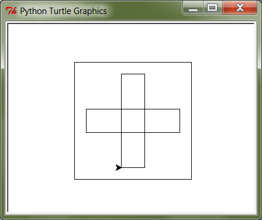

***************
4. Funktsioonid
***************


.. todo::
    
    * Function must make sense on its own
    * Võrdlus mat funktsioonidega    
    * Lisa antipatternite osa ?!! Nt. funktsioon, mis teeb liiga palju või prindib või roundib.
    * pipeline'i näide, kus mitut funktsiooni saab (mitmel moel?) kombineerida
    * oma teegi tegemine
        * kuupäevadega seonduv
        * pikselgraafika
        * turtle
    * kodu- või praksiülesannete komplekt, mis moodustab ühe terviku ja sisaldab moodulit funktsioonidega

.. todo::

    Too näide, kus funktsiooni kasutatakse mitmes programmis. Praegu osad kipuvad nägema funktsiooni rolli vaid konkreetse ülesande vaatenurgast.


.. todo::
    
    * lisa kombinatoorika ülesandeid
    * lisa samaväärsuse küsimusi

    * Wikipedia sirvimise näide funktsiooni väljakutsete mõistmiseks
    * "Let's wrap it in a function to make it easier to use" -- tee selle kohta näide
    * calling a function *generates* a value
    * funktsioonide komponeerimine avaldises & funktsioonid, mis kutsuvad välja teisi funktsioone
    * bool funktsioonid
    * Ülesanded, kus ühe ülesande lahenduses on vaja teise ülesande funktsiooni
    * paaris, paaritu defineerimine vastastikuselt
    * Definitsioonide laadimine käsureale, harjutused, kus on näidatud käsurea sessioon, aga puudu on definitsioonid, Lõpuks Docstringi ja doctest'i tutvustamine
    * roles of variables
    * roles of functions: utility functions, reuse, division, documentation, encapsulation
    * paralleelid muutujate ja funktsioonide vahel -> tadaa

    

Eelmise peatüki :ref:`pere sissetuleku ülesandes <pere_sissetulek_vol1>` tuli sul tõenäoliselt korrata netopalga arvutamise valemit kahes kohas -- ema ja isa netopalga arvutamisel.
    
Õnneks polnud tegemist eriti keerulise valemiga ning copy-paste'iga oli võimalik topelt tippimise vaeva vältida. Aga päris õige see asi siiski ei tundunud -- näiteks kui netopalga arvutamise valem peaks kunagi muutuma, siis peab olema meeles programmi muuta kõigis kohtades, kus seda valemit on kasutatud. 

Kahtlemata oleks pere sissetulekut palju lihtsam arvutada, kui Pythonis oleks olemas spetsiaalne käsk netopalga arvutamiseks. Samas, kust teavad Pythoni loojad, milliseid käske kellelgi vaja võib minna?

Selles peatükis uurime, kuidas pakendada mingi programmijupp *funktsiooniks* ja kuidas seda hiljem erinevates kohtades kasutada. Teisiti öeldes, me hakkame looma uusi Pythoni käske. Alustuseks aga võtame kokku selle, mida me Pythoni käskude kohta juba teame.

Käsud e funktsioonid
====================
Siiani on olnud juttu mitmetest erinevatest Pythoni n-ö käskudest, nagu näiteks ``input``, ``sin``, ``right``, ``is_wall``, ``int``, ``readline``, ``upper``, ``print``. Tegelikult on ametlik termin nende kohta *funktsioon*.

Paljudel juhtudel saab tõmmata selged paralleelid Pythoni funktsioonide ja matemaatikast tuntud funktsioonide vahele, samas on mõnede Pythoni funktsioonide olemus hoopis erinev. Alustuseks ütleme lihtsalt, et funktsioon (e mitteformaalselt *käsk*) on mingi Pythoni maailma "asi", millel on (tavaliselt) nimi ja **mis oskab midagi arvutada või teha**.


Funktsioonide kasutamine
------------------------
Toome meeldetuletuseks mõned koodijupid, kus on kasutatud funktsioone nimedega ``input``, ``int``, ``is_wall``, ``print``, ``sqrt`` ja ``sin``:

* ``sisestatud_vanus = input("Sisesta oma vanus: ")``
* ``vanus_arvuna = int(sisestatud_vanus)``
* ``if is_wall(): ...``
* ``print(sqrt(sin(0.5)))``

Esimene tähelepanek on see, et funktsiooni kasutamiseks tuleb kirjutada tema nimi ja selle järel sulud. Sulgudes võib olla 0 või rohkem **argumenti** s.o miski, millega me saame funktsiooni tööd kuidagi mõjutada. Näiteks lauses ``print("tere")`` tähistab ``print`` funktsiooni, ``"tere"`` on tema argument ja kõik see kokku on funktsiooni **väljakutse** e **rakendamine**  (öeldakse ka *aplikatsioon*). Argumendid võivad olla mingid konkreetsed väärtused, muutujad või mingid muud avaldised (sh funktsioonide rakendused).


.. todo::

    TODO: skeem: funktsioon, argument ja väljakutse


Arvutamine vs tegemine
----------------------
Siiani oli meil kombeks uusi Pythoni konstruktsioone lahterdada avaldiste või lausete hulka. Nüüd tekib küsimus, kas mingi funktsiooni väljakutse (nt ``sqrt(sin(x))`` või ``print('Tere!')``) on avaldis või lause? Tuleb välja, et sellele ei saagi lühidalt vastata.

Mõned funktsioonid (nt ``sin``, ``sqrt`` ja ``int``) on olemuselt küllalt sarnased matemaatiliste funktsioonidega, kuna nad võtavad ühe väärtuse, arvutavad natuke ja annavad vastu e **tagastavad** mingi teise väärtuse (nt avaldisega ``sqrt(4)`` anname funktsioonile ``sqrt`` argumendiks väärtuse ``4`` ning funktsioon annab meile vastu väärtuse ``2.0``). Selliste funktsioonide väljakutsed on oma olemuselt avaldised, mis tähendab, et me võime neid kasutada igal pool, kus avaldised on lubatud, näiteks omistuslauses või mõne teise funktsiooni argumendina. Siia gruppi loeme ka need funktsioonid, mille väljakutse võib anda igal korral erineva väärtuse, näiteks ``input("Sisesta midagi: ")`` või Pykkari ``is_wall()``. Kuigi need pole funktsioonid matemaatilises mõttes, kasutatakse ka neid avaldistes.

Teiste funktsioonide väljakutsel (nt ``print('Tere')``, ``right(90)``, ``step()``) huvitab meid see, mida nad **teevad** -- me tahame, et midagi **juhtuks** (nt et ekraanile ilmuks uus tekstijupp või robot liigutaks ennast). Mingit huvitavat tagastusväärtust nad meile ei paku. Selliste funktsioonide väljakutseid loeme lauseteks ja seetõttu esinevad nad programmides omaette real. Funktsioonide defineerimise õppimist alustame just seda tüüpi funktsioonidega.


.. note::

    Mõnedes keeltes kasutatakse tegevusele orienteeritud funktsioonide jaoks eraldi terminit *protseduur*. Seda, mis taolise funktsiooni käivitamisel juhtub, nimetatakse mõnikord funktsiooni *efektiks* või *kõrvalefektiks*.

.. note::

    Kui nüüd päris täpne olla, siis tegelikult kõik Pythoni funktsioonid tagastavad midagi, isegi ``print`` ja ``step``. Need funktsioonid, mille põhieesmärk on mingi tegevus, tagastavad alati ühe spetsiifilise (ja suhteliselt ebahuvitava) väärtuse ``None``. Selle väärtusega ei ole üldjuhul midagi peale hakata. Õnneks ta meid ka ei sega, seega võime teda vabalt ignoreerida.


.. index::
    single: meetodid

Meetodid
--------
Teises peatükis nägime, et sõnede puhul kirjutati mõne funktsiooni nimi (nt ``count``) sõne ja argumentide vahele, nt:

.. sourcecode:: py3

    sõna = "kukununnu"
    u_tähtede_arv = sõna.count("u")

Jääb mulje, et mingil põhjusel on üks funktsiooni argumentidest (antud näites ``sõna``) lihtsalt esile tõstetud. Tuleb välja, et Python seda umbes nii ka käsitleb.

Taolisi funktsioone nimetatakse **meetoditeks**. Lisaks sellele, et meetodite puhul kirjutame esimese argumendi meetodi nime ette, on neil tavaliste funktsioonidega võrreldes veel mõningaid erinevusi, millel me praegu ei peatu. Meetod on väga tähtis mõiste *objekt-orienteeritud programmeerimises*.

.. note::
    Meetodeid ei ole vaja kunagi ``import``-ida.


Funktsioonide defineerimine
===========================
Enne kui funktsiooni saab kasutada, tuleb ta *defineerida*. Meile tuttavad funktsioonid on defineeritud Pythoni loojate poolt, seepärast ei pidanud me siiani selle peale mõtlema. Paraku pole võimalik ette valmistada kõiki funktsioone, mida kellelgi võiks vaja minna, seepärast lubab Python neid ka programmeerijal ise defineerida.

Oletame, et meil on vaja joonistada kilpkonnaga 3 ruutu, kõik küljepikkusega 30, aga nad peavad olema erinevates kohtades: 

.. image:: images/3_ruutu.png

Võiks ju proovida joonistada ruudud kolme kordusega tsüklis, aga ilmselt jääksime hätta, sest tsükkel teeb igal kordusel sama asja, kuid meil on vaja iga ruudu joonistamise eel liikuda erinevasse kohta.

Kui vastav programm kirjutada jõumeetodil, siis sisalduks ruudu joonistamise kood kolmes kohas:

.. sourcecode:: py3
    :emphasize-lines: 5-9,19-23,32-36 

    # Jõuga programmeeritud variant:
    from turtle import *

    # joonistame esimese ruudu
    joonistatud_külgi = 0
    while joonistatud_külgi < 4:
        forward(30)
        left(90)
        joonistatud_külgi += 1 

    # liigume järgmisesse kohta
    up()
    forward(100)
    left(90)
    forward(100)
    down()

    # joonistame teise ruudu
    joonistatud_külgi = 0
    while joonistatud_külgi < 4:
        forward(30)
        left(90)
        joonistatud_külgi += 1 

    # liigume järgmisesse kohta
    up()
    left(90)
    forward(200)
    down()

    # joonistame kolmanda ruudu
    joonistatud_külgi = 0
    while joonistatud_külgi < 4:
        forward(30)
        left(90)
        joonistatud_külgi += 1 

    exitonclick()    

Lahendus oleks palju lihtsam, kui ruudu joonistamiseks oleks olemas spetsiaalne funktsioon. ``turtle`` moodulis sellist ei leidu, aga me võime selle ise *defineerida* ja seejärel kasutada seda justkui iga teist Pythoni funktsiooni:

.. sourcecode:: py3
    :emphasize-lines: 3-8,11,21,30    
    
    from turtle import *
    
    def ruut():
        joonistatud_kylgi = 0               
        while joonistatud_kylgi < 4:
            forward(30)
            left(90)
            joonistatud_kylgi += 1
    
    # joonistame esimese ruudu
    ruut()
    
    # liigume järgmisesse kohta
    up()
    forward(100)
    left(90)
    forward(100)
    down()
    
    # joonistame teise ruudu
    ruut()
    
    # liigume järgmisesse kohta
    up()
    left(90)
    forward(200)
    down()
    
    # joonistame kolmanda ruudu
    ruut()
    
    exitonclick()


``def``-konstruktsiooni päises antakse funktsioonile nimi, mille järgi saab teda hiljem kasutada. Tühjad sulud nime järel näitavad, et antud funktsioon on mõeldud kasutamiseks ilma argumentideta.

Konstruktsiooni kehas tuuakse välja need laused, mida soovitakse käivitada funktsiooni rakendamisel. Antud juhul kopeerisime funktsiooni kehasse algsest programmist ruudu joonistamise koodi. Seejuures pidime muidugi read pisut paremale nihutama, et oleks aru saada, et need kuuluvad ``def``-konstruktsiooni alla.

Päis ja keha kokku moodustavad *funktsiooni definitsiooni* e ``def``-lause. Pärast selle lause käivitamist on Pythonil üks käsk juures, mida saab edaspidi rakendada samal põhimõttel nagu sisseehitatud funktsioone. (Erinevus on selles, et uus funktsioon kehtib ainult sama programmi piires -- kui tahad seda kasutada ka mõnes muus programmis, siis tuleb see seal uuesti defineerida.)

Pane tähele, et ``def``-konstruktsioon ise ei tee muud, kui jätab enda kehas olevad laused meelde. Laused käivituvad alles funktsiooni rakendamisel.


Harjutus. Täidetud ruudud
-------------------------
Täienda eespool toodud 3 ruudu joonistamise programmi nii, et kõik 3 ruutu oleksid seest värviga täidetud.

.. note::

    Värviga täitmine käib Pythoni kilpkonna puhul nii:
    
    .. sourcecode:: py3
    
        ...
        begin_fill()
        ...
        # joonista mingi kujund
        ...
        end_fill()
        ....


.. hint::

    Antud ülesannet saab lahendada mitmel moel.
     
    Esimeses variandis lisame täitmise käsud otse funktsiooni ``ruut`` definitsiooni:
    
    .. sourcecode:: py3
        :emphasize-lines: 4, 10
        
        from turtle import *
        
        def ruut():
            begin_fill()
            joonistatud_kylgi = 0               
            while joonistatud_kylgi < 4:
                forward(30)
                left(90)
                joonistatud_kylgi += 1
            end_fill()
            
        ruut()
        
        up()
        forward(100)
        left(90)
        forward(100)
        down()
        
        ruut()
        
        up()
        left(90)
        forward(200)
        down()
        
        ruut()
        
        exitonclick()

    Kui me leiame, et definitsioon ``ruut`` peaks siiski jääma täitmise küsimustest sõltumatuks, siis on mõttekam mainida täitmist iga ruudu joonistamise juures eraldi:

    .. sourcecode:: py3
        :emphasize-lines: 10,12,20,22,29,31
        
        from turtle import *
        
        def ruut():
            joonistatud_kylgi = 0               
            while joonistatud_kylgi < 4:
                forward(30)
                left(90)
                joonistatud_kylgi += 1
            
        begin_fill()
        ruut()
        end_fill()
        
        up()
        forward(100)
        left(90)
        forward(100)
        down()
        
        begin_fill()
        ruut()
        end_fill()
        
        up()
        left(90)
        forward(200)
        down()
        
        begin_fill()
        ruut()
        end_fill()
        
        exitonclick()

    See lähenemine annab meile suurema paindlikkuse (vajadusel saame joonistada ka täitmata ruute), aga samas teeb meie programmi pisut pikemaks (esimeses variandis lisasime vaid 2 uut rida).

.. hint::

    Kui soovid täitmise värvi ise valida, siis uuri kilpkonna dokumentatsiooni: http://docs.python.org/3/library/turtle.html.

Kontrollküsimus: mitu kala?
---------------------------
Küllap oled juba märganud, et Python ei soovi programmeerija vabadust piirata, seetõttu on loomulik, et ühes programmis võib defineerida ükskõik kui palju uusi funktsioone ja need võivad ka üksteist kasutada. 

Nüüd küsimus: mitu korda kirjutab järgnev programm ekraanile sõna "kala"? NB! Proovi vastata ilma Pythoni abita programmi enda peas läbi mängides! Lõpuks kontrolli oma vastust Pythoni abil.

.. sourcecode:: py3

    def fun1():
        print("kala")
        print("kala")
    
    def fun2():
        fun1()
        print("kala")
        fun1()

    fun2()
    fun2()

.. hint::

    Kui sulle jäi segaseks, miks tulemus tuli selline nagu ta tuli, siis uuri veidi muudetud, aga enam-vähem sama struktuuriga programmi käitumist:
    
    .. sourcecode:: py3
    
        def fun1():
            print("fun1 esimene rida")
            print("fun1 teine rida")
        
        def fun2():
            print("fun2 algus")
            fun1()
            print("fun2 keskmine rida")
            fun1()
            print("fun2 lõpp")

        print("kogu eksperimendi algus")
        fun2()
        print("----------------")
        fun2()
        print("kogu eksperimendi lõpp")


Kontrollküsimus: mitu tärni?
----------------------------
Mitu tärni ilmub ekraanile järgmise programmi käivitamisel? Paku vastus ja siis kontrolli.

.. sourcecode:: py3

    def fun1():
        print(10 * "*")
    
    def fun2():
        i = 0
        while i < 10:
            fun1()
            i += 1
            
.. hint::

    Nagu Pythonis kontrollimine näitab, ilmub ekraanile 0 tärni, sest programmi välimisel tasemel on ainult funktsioonide definitsioonid, mitte ühtki väljakutset. Funktsioonis ``fun2`` on küll väljakutse funktsioonile ``fun1``, aga kuna ``fun2`` ennast kusagil välja ei kutsuta, siis too väljakutse kunagi ei käivitu.


Harjutus. Pööre vasakule
------------------------
Eelmises peatükis Pykkari käske tutvustades tuli välja, et Pykkaril pole sisseehitatud käsku vasakule pööramiseks. Õnneks oli võimalik saavutada sama efekt 3 korda paremale pöörates.

Proovi nüüd täiendada mõnda eelmises peatükis kirjutatud Pykkari programmi selliselt, et vasakule pööramised näeksid koodis natuke loomulikumad välja. 

.. hint::

    .. sourcecode:: py3
    
        from pykkar import *
        
        ...
        
        def left():
            ...
            ...
            ...
        
        
        ...
        left()
        ...
        ...
        left()
        ...
        ...
        ...

.. _lokaalsed-muutujad:

Lokaalsed vs globaalsed muutujad
================================
Nagu nägime juba funktsiooni ``ruut`` definitsioonist, võib definitsiooni kehas kasutada abimuutujaid (meie näites ``joonistatud_külgi``). Teeme nüüd väikese eksperimendi -- joonistame funktsiooni kasutades ühe ruudu ning üritame seejärel väljastada muutuja ``joonistatud_külgi`` viimase väärtuse:

.. sourcecode:: py3
    :emphasize-lines: 13
    
    from turtle import *
    
    def ruut():
        joonistatud_külgi = 0               
        
        while joonistatud_külgi < 4:
            forward(100)
            left(90)
            joonistatud_külgi += 1
    
    ruut()
    
    print(joonistatud_külgi)
    
    exitonclick()

Programmi käivitades saime oodatud ``4`` asemel hoopis veateate ``NameError: name 'joonistatud_külgi' is not defined``.

Asi on selles, et funktsiooni kehas kasutusele võetud muutujad on **lokaalsed**, st nad toimivad ainult funktsiooni sees. Lokaalsed muutujad luuakse funktsiooni igal käivitamisel ja nad kaovad, kui funktsioon oma töö lõpetab. Nende olemasolu on funktsiooni siseasi, see ei paista kuidagimoodi väljapoole. See asjaolu võimaldab meil funktsiooni sees olevatele e lokaalsetele muutujatele vabalt nimesid valida, ilma muretsemata, kas mõnda neist nimedest on juba programmi põhiosas või mõnes teises funktsioonis kasutatud. 

Programmi põhiosas defineeritud muutujaid nimetatakse **globaalseteks** muutujateks. Nende nähtavus on suurem -- nendele pääseb Python ligi nii programmi põhiosas, kui ka funktsioonide sees.

Kontrollküsimus: mis juhtub?
----------------------------
Nüüd peaksid sa oskama ennustada, mida teeb järgmine programm:

.. sourcecode:: py3

    x = 1
    
    def f():
        y = 2
        print(x) 
        print(y) 
    
    f()
    print(x)
    print(y)

.. hint::

    Minu ekraanile ilmus
    
    .. sourcecode:: none
    
        1
        2
        1
        Traceback (most recent call last):
          File "C:\Users\Aivar\Desktop\katse.py", line 10, in <module>
            print(y)
        NameError: name 'y' is not defined 
    
    Funktsiooni sees olevad ``print``-laused õnnestusid -- esimene neist kuvas globaalse muutuja ``x`` väärtuse, teine lokaalse muutuja ``y`` väärtuse. Õnnestus ka programmi põhiosas olev esimene ``print``-lause, mis kuvas globaalse muutuja ``x`` väärtuse. Vea andis programmi lõpus olev ``print``, sest programmi põhiosal on ligipääs vaid globaalsetele muutujatele, aga selles programmis ei ole ühtegi globaalset muutujat nimega ``y``.

Funktsioonis jäävad lokaalsed muutujad peale
--------------------------------------------
Eespool sai öeldud, et lokaalsetele muutujatele võib nimesid valida ilma teiste funktsioonide või programmi põhiosa pärast muretsemata. Mis juhtub aga siis, kui valida lokaalsele muutujale selline nimi, mis esineb ka mõne globaalse muutuja nimena? Proovime järele! 

.. sourcecode:: py3

    x = 1

    def f():
        x = 2
        print(x)
    
    print(x) # ekraanile kuvatakse 1
    f()      # ekraanile kuvatakse 2
    print(x) # ekraanile kuvatakse 1
        
Tuleb välja, et funktsiooni sees defineeritud muutuja ``x`` ei mõjuta kuidagi samanimelist globaalset muutujat, tegemist on kahe erineva muutujaga, millel on juhtumisi sama nimi (nagu kahel erineval inimesel võib olla sama nimi).

Selle skeemiga kaasneb paratamatult kitsendus, et me ei saa funktsiooni ``f`` sees enam ligi globaalsele ``x``-le, sest lokaalsed muutujad varjavad samanimelisi globaalseid muutujaid.

.. note::

    Python paneb lokaalsete muutujate nimekirja kokku funktsiooni koodis leiduvate omistuslausete põhjal. Tuleb aga arvestada, et seda teeb ta juba funktsiooni sisenedes, enne vastavate omistuslausete käivitamist, seetõttu tähendab järgneva näite funktsioonis ``f`` olev ``x`` lokaalset muutujat, hoolimata sellest, et vastavat omistuslauset kunagi ei täideta.
    
    .. sourcecode:: py3
    
        x = 1
        
        def f():
            print(x) 
            
            if False:
                x = 2
    
        f()
    
    Antud programm annab käivitamisel vea, sest ``print(x)`` üritab kuvada lokaalse muutuja ``x`` väärtust, aga sellele pole väärtust omistatud. 

Globaalsete muutujate muutmine funktsiooni sees
-----------------------------------------------
Kui omistuslause funktsiooni sees tekitab uue lokaalse muutuja, siis kas on üldse võimalik funktsiooni sees olles mõnd globaalset muutujat muuta? On võimalik küll. Selleks tuleb funktsiooni alguses deklareerida, et teatud nime puhul mõtleme antud funktsioonis igal juhul globaalset muutujat, isegi kui sellele muutujale tehakse omistamine. 

.. sourcecode:: py3
    :emphasize-lines: 4
    
    x = 10
    
    def test():
        global x    
        x = 3       # Globaalsele x-le omistatakse uus väärtus. 
        print(x)    # Kuvatakse globaalse x-i väärtus.
    
    test()      # Mis peaks nüüd ekraanile ilmuma?
    print(x)    # Aga nüüd?

NB! Kuigi teatud juhtudel on selline võimalus kasulik, tuleks funktsioonis globaalsete muutujate muutmist siiski võimalusel vältida. Globaalsed muutujad on funktsiooni jaoks väga võimas kanal, mille abil ülejäänud programmiga infot vahetada, aga selle kanali ülemäärasel kasutamisel võib programmeerija kergesti kaotada järje, kes suhtleb kellega ja mis sõltub millest. Järgmiseks tutvustame ühte palju paremat viisi funktsiooni ja ülejäänud programmi vahel info vahetamiseks.
 
    


.. index::
    single: funktsioon; argumendid
    single: argumendid; funktsiooni argumendid

    
Parameetrid
===========
Nagu näha, on funktsioonid suureks abiks, kui sama käskude komplekti tahetakse programmis käivitada mitmes kohas. Samas, täpselt sama tegevuse kordamist on vaja siiski üpris harva. Tihemini on vaja teha midagi sarnast, kuid teatud väikese nüansiga, mis võib erinevatel kordadel varieeruda. Sellise nüansi väljatoomiseks on võimalik funktsioonile lisada **parameetreid**. Järgnevas näiteprogrammis on defineeritud funktsioon kasutaja tervitamiseks. Varieeruv nüanss e parameeter on antud juhul tervitatava nimi:

.. sourcecode:: python

    def tere(nimi):
        print("Tere " + nimi + "!")
        print("Kuidas läheb?")
        
    tere("Kalle")
    tere("Malle")
    
Funktsiooni ``tere`` definitsiooni päises on lisaks funktsiooni nimele näidatud ära ka parameeter nimega "nimi". Parameetri näol on sisuliselt tegu spetsiaalse lokaalse muutujaga, mille väärtus sõltub sellest, kuidas funktsioon parasjagu välja kutsuti. Kui funktsioon kutsutakse välja avaldisega ``tere("Kalle")``, siis saab muutuja ``nimi`` väärtuseks ``"Kalle"``, ``tere("Malle")`` puhul on väärtuseks ``"Malle"``. Funktsiooni sisemine masinavärk töötab mõlemal juhul samamoodi – ta võtab parameetri väärtuse (misiganes see juhtub olema) ning lisab selle tervitusele. Kuna aga väärtused on kahel juhul erinevad, on ka tulemus erinev.

Parameetritega saab teha funktsiooni universaalsemaks -- teatud detailid jäetakse funktsiooni väljakutsuja otsustada. Ilma parameetriteta funktsioon on justkui rätsep, kes teeb alati samasuguseid ülikondi, parameetreid võiks aga võrrelda tellija mõõtude ja muude soovidega, mida rätsep oma tegevuses arvesse võtab.

.. topic:: Kas sõnad *parameeter* ja *argument* on sünonüümid?

    Mitte päris. Parameetrid ja argumendid on ühe mündi kaks erinevat poolt. Argument on funktsiooni väljakutses antud *avaldis*, millest saab vastava parameetri *väärtus*. Parameetrid on seotud funktsiooni definitsiooniga, argumendid on seotud funktsiooni väljakutsega. Parameetrid on üldised, argumendid on konkreetsed. Meie viimases näites on ``nimi`` funktsiooni ``tere`` parameeter, aga sõneliteraal ``"Kalle"`` on vastav argument funktsiooni väljakutses.
    
    .. note::    
        Parameetri vs argumendi asemel võib mõnikord kohata ka väljendeid `formaalne parameeter` vs `tegelik parameeter`.  
    
Harjutus. Parametriseeritud ``ruut``
------------------------------------
Täiusta eespool defineeritud ruudu joonistamise funktsiooni nii, et ruudu küljepikkuse saab määrata funktsiooni väljakutsel. Kasuta loodud funktsiooni, joonistades mitu erineva suurusega ruutu.

.. note::

    Järgnevas vihjes on antud harjutuse näitelahendus, ära seda enne vaata, kui oled ise proovinud!

.. hint::
    :class: solution    
    
    .. sourcecode:: py3
    
        from turtle import *
        
        def ruut(kylg):
            i = 0
            while i < 4:
                forward(kylg)
                left(90)
                i += 1
        
        ruut(100)
        
        # liigume kuskile mujale
        up()
        forward(200)
        down()
        
        # väiksem ruut
        ruut(20)
        
        exitonclick()


.. _param-vs-input:

Parameetrid vs ``input``
------------------------
Parameetritega funktsioon meenutab oma olemuselt programmi, kus on kasutatud ``input`` käsku -- mõlemal juhul on konkreetsed sisendandmed teadmata. Erinevus on selles, et kui ``input`` puhul on teada, et sisendandmed küsitakse kasutajalt, siis parameetrite kasutamisel jäetakse (funktsiooni seisukohast vaadatuna) sisendi saamise viis lahtiseks. Eelnevas näites andsime funktsiooni väljakutsel parameetri väärtuseks sõneliteraali, kuid seal oleks võinud kasutada ka muutujat:

.. sourcecode:: py3

    def tere(nimi):
        print("Tere " + nimi)
        print("Kuidas läheb?")
        
    sisestatud_nimi = input("Kuidas on sinu nimi? ")
    tere(sisestatud_nimi)

See näide demonstreerib parameetritega funktsioonide universaalsust -- vastavalt vajadusele võime taolist funktsiooni kasutada literaali, mõne muutuja (mille väärtus võib olla saadud ``input``-ist) või ka mingi keerulisema avaldisega.

.. note::

    Pane tähele, et eelviimasel real defineeritud muutuja nimeks oleksime võinud panna ka lihtsalt ``nimi``:
    
    .. sourcecode:: py3

        def tere(nimi):
            print("Tere " + nimi)
            print("Kuidas läheb?")
            
        nimi = input("Kuidas on sinu nimi? ")
        tere(nimi)
        
    See, et funktsiooni ``tere`` parameeter on samuti ``nimi``, ei aja Pythonit segadusse, kuna funktsiooni sisemus (sh tema parameetrid) on ülejäänud programmist eraldatud. Kõlab sarnaselt sektsiooniga "Lokaalsed muutujad"? Tegemist ongi sama teemaga -- nagu juba korra mainitud, käsitletakse ka parameetreid justkui (lokaalseid) muutujaid.
    
    Taoline nimede taaskasutamine erinevates kontekstides on küllalt levinud, aga kui leiad, et see ajab sind ennast segadusse, siis võid kasutada alati erinevaid muutujanimesid.

.. todo::

    Siia oleks vaja veel harjutusi


Mitu parameetrit
----------------
Parameetreid (ja vastavaid argumente) võib olla ka rohkem kui üks. Proovi näiteks järgmist programmi:

.. sourcecode:: python

    def tere(nimi, aeg):
        print("Tere, " + nimi)
        print("Pole sind juba " + str(aeg) + " päeva näinud")
	
    tere("Kalle", 3)

Nagu näed, tuleb funktsiooni väljakutsel argumendid anda samas järjekorras nagu on vastavad  parameetrid funktsiooni definitsioonis. Teisisõnu, argumendi *positsioon* määrab, millisele parameetrile tema väärtus omistatakse.

Harjutus. Värviline ruut
------------------------
Kilpkonna pliiatsi värvi saab muuta funktsiooniga ``color``, andes sellele argumendiks sõne ingliskeelse värvinimega, nt ``color('red')``. Peale seda teeb kilpkonn järgmised jooned nõutud värviga. 

.. note::

    Soovi korral vaata täpsemat infot siit:
    http://docs.python.org/3/library/turtle.html#turtle.color

Lisa funktsioonile ``ruut`` uus parameeter joone värvi määramiseks. Katseta.

.. todo::

    Mariann ütles, et kaks järgnevat lisavõimalust ajasid teda segadusse.

.. topic:: Lisavõimalus: vaikeväärtusega parameetrid

    Mõnede funktsioonide puhul on ühe parameetri väärtus tavaliselt sama ja seda on vaja vaid harvadel juhtudel muuta. Sellisel juhul on võimalik see väärtus funktsiooni definitsioonis ära mainida. Kui funktsiooni väljakutsel sellele parameetrile väärtust ei anta, kasutatakse lihtsalt seda vaikeväärtust. Seda võimalust demonstreerime eelmise näite modifikatsiooniga:
    
    .. sourcecode:: py3
    
        def tere(nimi, aeg = "mitu"):
            print("Tere, " + nimi)
            print("Pole sind juba " + str(aeg) + " päeva näinud")
        
        tere("Kalle", 3)
        tere("Malle")
    
    Eespool juba nägime, et funktsioonil ``print`` on lisaks põhiparameetrile veel parameeter nimega `end`, millele on antud vaikeväärtus ``"\n"`` (s.o reavahetus). See on põhjus, miks ``print`` kuvab teksti vaikimisi koos reavahetusega. Kuna selle funktsiooni definitsioonis kasutatakse Pythoni keerulisemaid võimalusi, siis ``print``-i väljakutsel ei olegi võimalik `end` väärtust määrata ilma parameetri nime mainimata, st seda ei saa anda positsiooniliselt.

.. topic:: Lisavõimalus: nimelised argumendid

    Mõnele funktsioonile saab anda palju argumente ja sel juhul on tülikas järge pidada, kas kõik argumendid said antud õigel positsioonil. Taolise probleemi leevendamiseks lubab Python funktsiooni väljakutses anda argumente koos vastava parameetri nimega, sel juhul argumendi positsioon ei ole oluline:
    
    .. sourcecode:: py3 
    
        def f(a, b, c):
            print(a, b, c)
        
        # järgnevad 2 väljakutset on samaväärsed:
        f(1, 2, 3)
        f(c=3, a=1, b=2) 
        
    Nimelised argumendid on eriti kasulikud siis, kui funktsioonil on mitu vaikeväärtusega parameetrit ja sa tahad ise väärtuse ette anda vaid mõnele neist:
    
    .. sourcecode:: py3 
    
        def f(a=1, b=2, c=3):
            print(a, b, c)
        
        # järgnevad 2 väljakutset on samaväärsed:
        f(1, 22, 3)
        f(b=22) 
        
    

.. index::
    single: funktsioon; tagastamine
    single: väärtusega funktsioon
    single: return


    
Väärtusega funktsioonid
=======================
Tuleme tagasi peatüki alguses mainitud probleemi juurde: pere sissetuleku ülesandes pidime netopalga valemi panema kirja kahes kohas ja kuigi koodi kopeerimine ajas asja ära, ei tundunud see siiski päris õige.

Ilmselt juba aimad, et taolise kordamise vältimiseks on jälle abiks funktsioonid -- netopalga arvutamiseks tuleb defineerida uus funktsioon (nt nimega ``neto``), valem tuleb kirja panna funktsiooni kehas, seejuures tuleks brutopalk jätta lahtiseks, st parameetriks.

Kuidas aga saada funktsiooni käest vastust kätte? Võid proovida lisada funktsiooni lõppu vastava ``print`` lause, aga see ei aita, kui tahame tulemust järgmistes arvutustes kasutada. Võiks proovida salvestada tulemuse kuhugi muutujasse, aga milline muutuja valida? Kas ``isa_sissetulek`` või ``ema_sissetulek``?

``return``-lause
----------------
Funktsiooni tulemuse **tagastamiseks** on Pythonis eraldi konstruktsioon -- ``return`` lause. Demonstreerime selle kasutamist netopalga arvutamise funktsioonis:

.. _neto_funktsioon:

.. sourcecode:: py3
    :emphasize-lines: 1-7, 13

    def neto(bruto):
        maksuvaba = 144
        if (bruto <= maksuvaba):
            return bruto
        else:
            maksustatav = bruto - maksuvaba
            return maksustatav * 0.79 + maksuvaba
    
    ema_bruto = float(input('Sisesta ema brutopalk: '))
    isa_bruto = float(input('Sisesta isa brutopalk: '))
    laste_arv = int(input('Sisesta alaealiste laste arv: '))
    ühe_lapse_toetus = 20 
    sissetulek = neto(ema_bruto) + neto(isa_bruto) + laste_arv * ühe_lapse_toetus
    print('Pere sissetulek kuus on', sissetulek, 'eurot.')

``return``-lause käivitamisel arvutab Python näidatud avaldise väärtuse ja saadab selle funktsioonist välja e **tagastab** sellesse konteksti, kus funktsioon välja kutsuti (antud näites on selleks kontekstiks eelviimase rea liitmistehe). 

Vaatame selle idee kinnistamiseks ka ühte lihtsamat näidet -- defineerime funktsiooni, mis arvutab ja tagastab ringi pindala, ning seejärel kutsume selle välja omistuslauses:

.. sourcecode:: py3
    :emphasize-lines: 1-2,9,10
    
    from math import pi

    def ringi_pindala(raadius):
        return pi * raadius**2
        
    r1 = float(input("Sisesta esimese ringi raadius: "))
    r2 = float(input("Sisesta teise ringi raadius: "))
    
    pindala1 = ringi_pindala(r1)
    pindala2 = ringi_pindala(r2)
    
    if pindala1 > pindala2:
        print("Esimene on suurem")
    elif pindala2 > pindala1:
        print("Teine on suurem")
    else:
        print("Ringid on võrdse pindalaga") 


Eespool jagasime funktsioonid kahte leeri -- ühed teevad midagi (neid kasutame me lausetena) ja teised arvutavad midagi (neid kasutame avaldistes). Funktsiooni defineerimise vaatenurgast tuleneb see erinevus justnimelt ``return``-lause kasutamisest -- kõikides funktsioonides, mida me soovime avaldistes kasutada, on vaja kasutada ``return``-i.


Harjutus. Sõne dubleerimine
---------------------------
Kirjuta funktsioon ``dubleeri`` , mis võtab argumendiks sõne ning tagastab selle sõne dubleerituna nii mitu korda, kui mitu tähte on esialgses sõnes:

.. sourcecode:: py3

    >>> dubleeri('xo')
    'xoxo'
    >>> dubleeri('Tere')
    'TereTereTereTere'

.. hint::

    Abiks on funktsioon ``len`` ja operaator ``*``.


Nipp: funktsioonide testimine käsureal
--------------------------------------
Väärtusega funktsioone on mugav testida IDLE'i käsureal. Selleks piisab, kui skriptis on kirjas ainult funktsiooni definitsioon -- taolise skripti jooksutamisel küll esialgu midagi ekraanile ei ilmu, aga käsureal on võimalik funktsiooni kasutada. Näiteks kui skripti sisu on selline:

.. sourcecode:: py3

    def liida(a,b):
        return a + b
    
    def korruta(a,b):
        return a * b

siis peale selle IDLE'is käivitamist on võimalik käsureal teha nii:

.. sourcecode:: py3

    >>> liida(223, 6)
    229
    >>> korruta(456, 987)
    450072
 
 
.. todo::

    Marianni arvates võiks siin olla rohkem harjutusi.


Harjutus. Puuduv definitsioon
-----------------------------
Kirjuta võimalikult lühike programm, mille käivitamise järel saaks Pythoni käsureal pidada sellise dialoogi:

.. sourcecode:: py3

    >>> fun1(18)
    8
    >>> fun1(5687)
    7
    >>> fun1(1)
    1
    >>> fun1(98)
    8
    >>> fun1(66)
    6
    >>> fun1(67)
    7      
    >>> fun2("tere", 4)
    'EEEE'
    >>> fun2("torpeedo", 1)
    'T'
    >>> fun2("nina", 3)
    'NNN'

.. hint::

    .. sourcecode:: py3
    
        >>> 215 % 10
        5

.. hint::

    .. sourcecode:: py3
    
        >>> s = "tere"
        >>> s[0]
        't'
        >>> s[1]
        'e'
        >>> s[2]
        'r'

.. note::

    Samas stiilis nuputamisülesandeid pakub http://www.functiongame.com/.
    


.. todo::

    jama ülesanne
    Harjutus. Tollid ja sentimeetrid

    #. **Kirjuta funktsioon** ``cm``, mis võtab argumentideks pikkuse jalgades ja tollides (st esimene argument tähistab jalgu ja teine tolle) ning tagastab pikkuse sentimeetrites (nt ``cm(6, 1)`` peaks tagastama umbes ``187.96``). Salvesta esialgu faili vaid funktsiooni definitsioon ilma väljakutseta.
    #. **Testi loodud funktsiooni** käsureal (käivita programm ning kirjuta mõned väljakutsed). Kui funktsioon ei tööta õigesti, siis korrigeeri definitsiooni ja proovi uuesti.
    #. Lõpuks **kirjuta programmi põhiosa**, mis küsib kasutajalt tema pikkuse tollides, väljastab ekraanile vastava pikkuse sentimeetrites ning tema nn ideaalkaalu (s.o pikkus sentimeetrites - 100, nt kui pikkus on 185cm, siis ideaalkaal on 85kg).
    
    
    Taolist programmi kirjutamise stiili, kus alguses tehakse valmis mõned abifunktsioonid ja alles peale nende testimist kirjutatakse programmi põhiosa, nimetatakse alt üles programmeerimiseks. 

.. _return-vs-print:

``return`` vs ``print``
-----------------------

.. todo::

    Vaata üle, kas see on optimaalne selgitus. Paljudel on sellega ikka probleeme.
    Äkki selgitad liiga segaselt?


Eelnevalt märkisime, et funktsiooni parameetrid ja ``input`` on olemuselt sarnased, kuna mõlemad on seotud sisendi saamisega, kuid parameetrid on paindlikumad, kuna täpne sisendi saamise viis jäetakse lahtiseks.

Analoogselt võime võrrelda ``print`` ja ``return`` käskusid -- mõlemad on seotud väljundi andmisega, kuid ``return`` on paindlikum, kuna täpne tulemuse kasutamise viis jäetakse lahtiseks.

Uuri kahte järgnevat programmi, kus mõlemas on defineeritud funktsioon ringi pindala arvutamiseks. Mõlemal juhul on meie eesmärgiks arvutada mingi ringi pindala, kuvada tulemus ekraanile ja kirjutada faili. 

+----------------------------------------------+----------------------------------------------+
|.. sourcecode:: py3                           |.. sourcecode:: py3                           |
|                                              |                                              |
|    from math import pi                       |    from math import pi                       |
|                                              |                                              |
|    def ringi_pindala(raadius):               |    def ringi_pindala(raadius):               |
|        print("Pindala on", pi * raadius**2)  |        return pi * raadius**2                |
|                                              |                                              |
|                                              |    x = ringi_pindala(16.5)                   |
|    ringi_pindala(16.5)                       |    print("Pindala on", x)                    |
|                                              |                                              |  
|    # Salvestame tulemuse ka faili ...        |    # salvestame tulemuse ka faili            |
|    # Probleem: kuidas saada tulemust         |    f.open("tulemus.txt")                     |
|    # ekraanilt kätte?                        |    f.write("Tulemus: " + str(x))             |
|                                              |    f.close()                                 |
+----------------------------------------------+----------------------------------------------+
    
Kui sooviksime arvutuse tulemust näidata ainult ekraanil, siis tehniliselt võttes pole vahet, kas me teeme ``print``-i funktsiooni sees või väljaspool. Erinevus tuleb sisse, kui me soovime tulemust veel kuskil kasutada, näiteks faili koostamisel või mingites järgnevates arvutustes -- meie esimeses programmis olev funktsioon siis enam ei sobi. Teises variandis on funktsioon defineeritud üldisemana ja seetõttu saab seda kasutada rohkemates situatsioonides.

.. todo::

    Kaugus: Kuidas sulle meeldiks see, kui sa tahad arvutada sin(0.5) ja selle asemel, et Python tagastaks 0.479425538604203, kirjutab ta su ekraanile "Selle arvu siinus on 0.479425538604203"? Ilmselt on sin funktsiooni praegusel kujul siiski kasulikum. Samamoodi oleks kasulikum, kui sinu funktsioon "kaugus", mitte ei prindiks ekraanile mingi jutu, vaid tagastaks ainult selle arvu mida küsitakse. Küsija ise siis vaatab, mis ta tulemusega edasi teeb -- võibolla prindib ekraanile, võibolla teeb midagi muud.


.. note::
    
    Antud teemas võib segadus tekkida Pythoni käsurea kasutamisel -- kui kirjutada sinna avaldis ``sqrt(2)``, siis tulemus ilmub ikkagi ekraanile, kuigi me ei kasutanud ``print`` käsku. Kas see tähendab, et ka funktsioon ``sqrt`` kuvab vastuse ekraanile? Ei, tegelikult kuvab Pythoni käsurida ``sqrt`` käest saadud vastuse ekraanile omal algatusel, ``sqrt`` ei tea sellest midagi. 

Harjutus. Kuu nimed
-------------------
.. _kuu_nime_funktsioon:
.. container:: autotest

    .. include:: exercises/kuu_nime_funktsioon.py
        :start-after: """
        :end-before: """  


Harjutus. Kahest suurim => kolmest suurim
-----------------------------------------

.. note::

    Vahel öeldakse, et laiskus on programmeerija puhul voorus. Sellega mõeldakse tegelikult seda, et hea programmeerija otsib alati võimalusi, kuidas mingi uue koodi kirjutamise asemel delegeerida võimalikult palju tööd juba olemasolevale koodile. Käesolev harjutus üritab seda mõtteviisi propageerida.

Kõigepealt defineeri funktsioon ``kahest_suurim``, mis tagastab kahest argumendiks antud arvust suurima. 

Seejärel küsi programmi põhiosas kasutajalt *kolm* arvu, ning kuva ekraanile neist suurim. Proovi seejuures delegeerida võimalikult palju tööd äsja loodud funktsioonile.

.. hint::

    ``kahest_suurim(a, kahest_suurim(b, c))``
        


``return`` lõpetab funktsiooni töö
----------------------------------
Senistes näidetes oli ``return``-lause funktsiooni kehas kõige viimane lause (või siis viimane lause ``if``-lause harus). Tegelikult ei pea ``return`` olema tingimata funktsiooni lõpus. Järgnevas absoluutväärtuse arvutamise funktsiooni näites kasutatakse ``return``-i kahes kohas -- funktsiooni lõpus ja tingimuslause sees:

.. sourcecode:: py3

    def absoluut(x):
        if x < 0:
            return -x
        
        return x

Kumb neist ``return``-idest siis ikkagi kehtib? Sellele vastamiseks peame teadma, et ``return`` lause käivitamine lõpetab alati funktsiooni töö. Seega, kui kutsume antud funktsiooni välja negatiivse argumendiga, siis käivitub esimene ``return`` ja ``if``-lausele järgnevat rida üldse ei vaadatagi. Kui aga ``if`` lause tingimus osutub vääraks, siis ``if``-lause keha ei vaadata ja Python jätkab sellega, mis tuleb peale ``if``-lauset (s.o teine ``return```).

Selline võimalus kasutada ``return``-i funktsiooni keskel ei ole tegelikult eriti oluline -- alati saab funktsiooni panna kirja nii, et seal on täpselt üks ``return`` lause ja see paikneb funktsiooni lõpus.

.. note::

    ``return``-lausest on olemas ka variatsioon, kus avaldise osa on hoopis ära jäetud, st kogu lause koosneb ainult võtmesõnast ``return``. Seda varianti kasutatakse siis, kui tahetakse funktsiooni töö lõpetada ilma mingit väärtust tagastamata.


Funktsioonid ja vead
====================
Vaatame nüüd, kuidas mõjutab funktsioonide kasutamine Pythoni vigade käsitlemise süsteemi.

Funktsioonide veateadete lugemine
---------------------------------
Esimeses peatükis soovitasime pikkade veateadete puhul keskenduda veateate viimastele ridadele. Kui täitmisaegne viga tekib mingi funktsiooni sees, siis võib ainult viimaste ridade põhjal olla raske vea põhjust tuvastada. Proovi käivitada järgnevat programmi:

.. sourcecode:: py3

    def arvuta_kuupalk(aastapalk):
        return aastapalk / 12
    
    aastapalk = input("Palun sisesta aastapalk: ")
    print("Kuupalk on", arvuta_kuupalk(aastapalk))    


Kui sisestad nõutud palganumbri, siis saad umbes taolise veateate:

.. sourcecode:: none

    Traceback (most recent call last):
      File "C:/harjutused/vigane.py", line 5, in <module>
        print("Kuupalk on", arvuta_kuupalk(aastapalk))
      File "C:/harjutused/vigane.py", line 2, in arvuta_kuupalk
        return aastapalk / 12
    TypeError: unsupported operand type(s) for /: 'str' and 'int'

Viimaste ridade järgi võiks järeldada, et probleem on real nr 2, funktsioonis ``arvuta_kuupalk``. Tegelikult oli viga aga selles, et funktsiooni kutsuti välja valet tüüpi argumendiga (peaks olema arv, aga oli sõne). Seega tuleb pöörata tähelepanu ka funktsiooni väljakutse kohale. Meie õnneks on ka väljakutse koht veateates ära näidatud -- see on real nr 5. Kui ka väljakutse ise paiknes kuskil funktsioonis, siis on ka tolle funktsiooni väljakutse koht ära näidatud -- ülevalt alla liikudes saab veateatest välja lugeda, millises kohas mida välja kutsuti.


Erindite tekitamine
-------------------
Tuleta meelde :ref:`netopalga arvutamise funktsiooni<neto_funktsioon>`. Mis juhtub, kui sellele anda argumendiks negatiivne arv? Proovi toodud näiteprogrammi nii, et isa palk on -300 ja ema oma 900. Kas saadud tulemus on mingis mõttes mõistlik?  

Ilmselt oled nõus, ``neto(-300)`` ei ole mõistlik, samamoodi nagu ``int("tere")`` ei ole mõistlik. Kuna Python annab ``int("tere")`` käivitamisel vea e tekitab erindi (mida vajadusel saab :ref:`kinni püüda<erindite_pyydmine>`) siis võiksime ka funktsioonis ``neto`` kontrollida kõigepealt parameetri väärtust ja kui see on vigane, siis tekitada erindi:

.. sourcecode:: py3
    :emphasize-lines: 2-3

    def neto(bruto):
        if not (bruto >= 0):
            raise Exception("Argument peab olema mittenegatiivne")
             
        maksuvaba = 144
        if (bruto <= maksuvaba):
            return bruto
        else:
            maksustatav = bruto - maksuvaba
            return maksustatav * 0.79 + maksuvaba
    
    ema_bruto = float(input('Sisesta ema brutopalk: '))
    isa_bruto = float(input('Sisesta isa brutopalk: '))
    laste_arv = int(input('Sisesta alaealiste laste arv: '))
    ühe_lapse_toetus = 20 
    sissetulek = neto(ema_bruto) + neto(isa_bruto) + laste_arv * ühe_lapse_toetus
    print('Pere sissetulek kuus on', sissetulek, 'eurot.')

Ilmselt juba aimasid, et erindi tekitamisega oli seotud lause, mis algas võtmesõnaga ``raise``. Sõna ``Exception`` näitab erindi tüüpi. Eri tüüpi erindite kasutamist me siin ei käsitle, seetõttu ütleme praegu, et erindi tekitamise lause peab olema kujul ``raise Exception(<veateade>)``.


Katseta muudetud programmi negatiivse palganumbriga -- loodetavasti näed nüüd vigase vastuse asemel veateadet.

Enda erindite püüdmine
----------------------

Ise tekitatud erindeid on võimalik kinni püüda :ref:`samamoodi<erindite_pyydmine>` nagu Pythonisse sisseehitatud funktsioonide omi:
  

.. sourcecode:: py3
    :emphasize-lines: 16-23

    def neto(bruto):
        if not (bruto >= 0):
            raise Exception("Argument peab olema mittenegatiivne")
             
        maksuvaba = 144
        if (bruto <= maksuvaba):
            return bruto
        else:
            maksustatav = bruto - maksuvaba
            return maksustatav * 0.79 + maksuvaba
    
    ema_bruto = float(input('Sisesta ema brutopalk: '))
    isa_bruto = float(input('Sisesta isa brutopalk: '))
    laste_arv = int(input('Sisesta alaealiste laste arv: '))
    ühe_lapse_toetus = 20
    try:
        ema_neto = neto(ema_bruto)
        isa_neto = neto(isa_neto)
        sissetulek = ema_neto + isa_neto + laste_arv * ühe_lapse_toetus
        print('Pere sissetulek kuus on', sissetulek, 'eurot.')
    except:
        print('Mingi jama. Arvatavasti ebaõnnestus ema või isa netopalga arvutamine')
        # "arvatavasti", kuna teoreetiliselt võib ka print-lause erindi tekitada        

Antud programmi puhul pole see lahendus tegelikult optimaalne -- kasutaja jaoks oleks mugavam, kui juba sisestamise järel kontrollitaks palganumbreid ja vigase sisendi korral küsitaks uuesti.  


.. note::

    Täpsema info Pythoni erindite kohta leiad siit: https://docs.python.org/3/tutorial/errors.html


.. _milleks-funktsioonid:

Milleks funktsioonid?
=====================
Vaatame üle peamised põhjused, miks on funktsioonid kasulikud.

.. index::
    single: DRY-printsiip
    
DRY-printsiip
-------------
Kogenud programmeerijad mainivad tihti nn **DRY-printsiipi** -- see tuleb ingliskeelsest väljendist "Don't repeat yourself", millega tahetakse öelda, et sarnase koodi mitmekordset kirjapanekut tuleks vältida.

Põhiline viis DRY-printsiibi rakendamiseks on uue funktsiooni defineerimine -- selle asemel, et sarnast koodi kirjutada erinevatesse kohtadesse, saab selle esitada funktsioonina ning edaspidi piisab selle kasutamiseks vaid funktsiooni nime mainimisest. Kui midagi on vaja muuta, siis tehakse muudatus vaid funktsiooni kehas ja see mõjub igalpool, kus funktsiooni on kasutatud.

Pere sissetuleku programmi muutmine oli hea DRY-printsiibi rakendamise näide. Lisaks tippimise vaeva vähendamisele muutis funktsiooni ``neto`` sissetoomine ka programmi uuendamise lihtsamaks ja veakindlamaks -- kui netopalga arvutamise reeglid peaks muutuma, siis tuleb muudatus teha vaid ühes kohas. Ilma funktsioonideta peaksime sel juhul üles otsima ja parandama kõik kohad, kus netopalka arvutatakse. Paraku oleks suuremate programmide puhul küllalt tõenäoline, et mõni koht jääb kahe silma vahele. 


Üldistamine
-----------
Kui eri kohtades on vaja sarnast, kuid teatud variatsiooniga koodi (nt ühel juhul arvutame netopalka ema, aga teisel juhul isa brutopalga põhjal), siis tulevad appi parameetrid, mis võimaldavad meil funktsiooni kehas jätta mõned detailid lahtiseks. Teisiti öeldes -- funktsiooni parameetrid võimaldavad meil kirjutada üldisema lahenduse, mida saab hiljem konkreetsete argumentidega täpsustada. Nt netopalga arvutamise funktsioonis saame brutopalga esitada parameetrina, millele antakse väärtus alles konkreetse arvutuse käivitamisel.


.. index::
    single: modulaarsus
    single: must kast
    single: abstraktsioon
    
    
Abstraktsioon ja mustad kastid
------------------------------
Kolmas oluline põhjus tuleb paremini esile suuremate programmide puhul. Kui me koondame teatud alamülesande lahendamiseks vajalikud laused ühte funktsiooni (e alamprogrammi), siis programmi põhiosas piisab selle alamülesande lahendamiseks vaid vastava funktsiooni nime mainimisest. See annab meile võimaluse juba lahendatud alamülesandeid käsitleda abstraktselt ilma muretsemata, kuidas vastavad funktsioonid sisemas töötavad. Teisiti öeldes, programmi põhiosa kallal töötades võime me käsitleda funktsioone kui maagilisi "musti kaste", lihtsalt eeldades, et nad teevad seda, mida nende nimest võib välja lugeda. Taoline võte võimaldab meil ühele programmi kihile korraga keskendudes luua väga keerulisi programme, millega poleks võimalik toime tulla, kui me peaks kõiki detaile korraga meeles pidama.

Kui *DRY*-printsiibi juures rõhutasime seda, et funktsioonid aitavad sama koodi kasutada korduvalt, siis abstraktsiooni põhiidee on selles, et me saame hästi valitud nimega funktsiooni edukalt kasutada ilma selle ehituse peale mõtlemata. Seetõttu on uue funktsiooni loomine põhjendatud tihti ka siis, kui seda kasutatakse vaid ühes kohas.


Kokkuvõte
=========

Funktsioonid võimaldavad keerulise programmilõigu panna kirja ühekordselt, aga kasutada seda mitmes erinevas kohas. 

Funktsiooni *definitsiooni* e ``def``-lause kehas olevad laused jäetakse esialgu lihtsalt meelde. Neid saab hiljem käivitada kirjutades definitsiooni päises antud nime koos sulgudega -- seda nimetatakse funktsiooni *väljakutseks* e rakendamiseks.

*Parameetrid* võimaldavad funktsiooni defineerimisel jätta mõned detailid lahtiseks. Parameetritega funktsiooni väljakutsel kirjutatakse sulgudesse *argumendid*, mis täpsustavad vastavaid definitsioonis lahtiseks jäetud detaile.

Funktsioone võib jaotada kahte gruppi -- ühed teevad midagi ja teised arvutavad midagi. Neid funktsioone, mis teevad midagi, rakendatakse harilikult lausetena, arvutavad funktsioonid esinevad tavaliselt avaldistes.

Selleks, et funktsiooni saaks kasutada avaldises, peab ta arvutatud väärtuse *tagastama*. Väärtuse tagastamiseks kasutatakse võtmesõna ``return``. 


Ülesanded
=========

.. todo::

    Lisada Pykkarile käsk set_direction
    
    tee mitme maja joonistamise ülesanne

1. Liigu nurka ver 2
--------------------
Eelmises peatükis oli :ref:`ülesanne <liigu_nurka>`, kus Pykkar tuli juhatada maailma kirdenurka. Ilmselt pidid sa selleks kirjutama kaks korda samalaadse tsükli, mis kummalgi korral liigutas Pykkari tema ees oleva seinani. Miks ei võiks Pykkaril olla eraldi käsk, mis paneb ta kõndima kuni seinani? 

Lisa oma eelmises peatükis tehtud programmile funktsioon ``liigu_seinani``, mis lisab Pykkarile just sellise uue käsu. Muuda ka programmi põhiosa nii, et see delegeeriks seinani kõndimise sammud äsja loodud funktsioonile.


2. Ristkülik
------------
Kirjuta funktsioon ``ristkylik``, mis võtab argumentideks kaks küljepikkust ja joonistab kilpkonnaga neile vastava ristküliku. Seejärel joonista järgnev kujund, delegeerides võimalikult palju tööd äsja loodud funktsioonile:



.. hint::

    Joonis koosneb kolmest ristkülikust
    
.. hint::

    Segaduse vältimiseks on soovitav funktsiooni töö lõppedes pöörata kilpkonn tagasi algsesse suunda.


.. _kahe_punkti_kaugus:

3. Kahe punkti kaugus
---------------------
Kirjuta funktsioon, mis võtab argumentideks kahe tasandipunkti koordinaadid ja tagastab nende punktide kauguse üksteisest.

Funktsiooni kasutamiseks küsi kasutajalt kolme punkti koordinaadid ja vasta millised kaks neist on üksteisele kõige lähemal.   

.. hint::

    Kuidas arvutada kahe punkti kaugust:
    
    .. image:: images/kaugus.png
    


4. Kuupäeva esitamine sõnena
----------------------------
Kirjuta funktsioon ``kuupäev_sõnena``, mis võtab argumentideks päeva, kuu ja aasta (arvudena) ning tagastab sõne, mis esitab kuupäeva kujul *<päev>. <kuu nimi> <aasta>* (nt. *24. veebruar 1918*).

Seejärel kirjuta programm, mis küsib kasutajalt arvudena päeva, kuu ja aasta ning kuvab ekraanile vastava kuupäeva sõnena.

.. hint::

    ``kuupäev_sõnena`` saab ühe toimingu delegeerida ühele eespool olevas harjutuses defineeritud funktsioonile.  


5. Kolmnurga pindala
--------------------
Kirjuta funktsioon ``kolmnurga_pindala_külgede_järgi``, mis võtab argumentideks kolmnurga külgede pikkused ning tagastab vastava kolmnurga pindala. Võid eeldada, et argumentideks antud arvud sobivad kolmnurga küljepikkusteks.

.. note:: Kuidas arvutada?

    http://et.wikipedia.org/wiki/Heroni_valem

.. note::

    Kui valem läheb liiga kirjuks, siis kaalu (lokaalsete) abimuutujate kasutamist! 

.. admonition:: Väljakutse!

    Muuda funktsiooni nii, et kui argumentide väärtused ei sobi kolmnurga küljepikkusteks, siis tagastatakse 0. 

.. todo::

    Lisa programmi lõppu (peale funktsiooni definitsiooni) järgmised laused:
    
    .. sourcecode:: py3
    
        print("a: 1, b: 1, c: 2**0.5, pindala: " + str(kolmnurga_pindala(1, 1, 2**0.5)))
        print("a: 3, b: 2, c: 2,      pindala: " + str(kolmnurga_pindala(3, 2, 2)))
        print("a: 3, b: 4, c: 5,      pindala: " + str(kolmnurga_pindala(3, 4, 5)))
        print("a: 3, b: 4, c: -1,     pindala: " + str(kolmnurga_pindala(3, 4, -1)))
        print("a: 3, b: 4, c: 10,     pindala: " + str(kolmnurga_pindala(3, 4, 10)))
        
    Veendu, et programmi käivitamisel saad järgmised tulemused:
    
    .. sourcecode:: none
    
        a: 1, b: 1, c: 2**0.5, pindala: 0.49999999999999983
        a: 3, b: 2, c: 2,      pindala: 1.984313483298443
        a: 3, b: 4, c: 5,      pindala: 6.0
        a: 3, b: 4, c: -1,     pindala: 0
        a: 3, b: 4, c: 10,     pindala: 0
    
    NB! tulemused võivad õige pisut ka erineda, sest erinevad Pythoni versioonid ümardavad erineva täpsusega.

Kirjuta veel üks kolmnurga pindala arvutamise funktsioon, ``kolmnurga_pindala_tippude_järgi``, mis võtab argumentideks kolmnurga tippude koordinaadid (kokku 6 argumenti) ja tagastab neile vastava kolmnurga pindala.

.. hint::

    See funktsioon saab suurema osa tööst delegeerida eespool defineeritud funktsioonidele. 

Testi oma funktsioone!


6. Hulknurgad
-------------
Kirjuta funktsioon, mis võtab argumentideks külgede arvu ning küljepikkuse, ning joonistab kilpkonnaga neile vastava regulaarse hulknurga. 

Joonista selle funktsiooni abil juhuslikesse ekraani kohtadesse, juhusliku suuruse ja külgede arvuga 30 hulknurka. 

.. note::

    Kilpkonna saab panna kiiremini tööle käskudega ``speed(10)`` ja ``delay(0)``.

7. Puuduv funktsioon
--------------------
Mis funktsiooniga on tegemist?

.. sourcecode:: py3

    >>> fun1(-40)
    -40.0
    >>> fun1(0)
    32.0
    >>> fun1(22)
    71.6
    >>> fun1(39)
    102.2
    >>> fun1(100)
    212.0

Kirjuta sellise käsureasessiooniga klappiv funktsioon.

8. Abifunktsioonid arvude küsimiseks
------------------------------------
Kolmandas peatükis toodi ära :ref:`üks skeem<korduv_kysimine>` kasutajalt arvu küsimiseks niikaua, kuni sisestatud teksti tõesti on võimalik arvuks teisendada. Kuna taolist skeemi läheb vaja paljudes programmides (ning mõnes programmis palju kordi), võiks selle pakendada abifunktsiooniks.

Kirjuta funktsioonid ``input_int`` ja ``input_float``, mis mõlemad võtavad argumendiks kasutajale esitatava teksti ning tagastavad kasutaja poolt sisestatud arvu, mis on juba teisendatud vastavalt ``int``-iks või ``float``-iks. Vigase sisendi puhul peavad funktsioonid küsimust kordama.

Demonstreeri nende funktsioonide kasutamist. 

Lisalugemine
============

``tkinter`` ja graafilise kasutajaliidesega programmid
------------------------------------------------------
Praeguseks tunned Pythonit juba piisavalt, et alustada graafiliste programmide loomisega. Kõik vajalikud funktsioonid selleks asuvad moodulis ``tkinter`` (ja selle alammoodulites).

Graafiliste programmide loomisel kasutatakse samu baaskonstruktsioone, mida oled siiani õppinud -- avaldised, laused (tingimuslause, tsükkel), funktsioonid. Oluline erinevus on see, et kasutusele võetakse uued, spetsiifilisemad andmetüübid, mis esitavad kasutajaliidese komponente (nupud, sisestuskastid jne). Nendega toimetamine nõuab omajagu tähelepanu ja teadmisi detailide osas -- näiteks kuidas paigutada mingit nuppu ekraanil õigesse kohta. Seetõttu tuleb ka arvestada, et graafilised programmid kipuvad olema nende detailide tõttu pikemad kui tekstipõhised programmid.

Nagu ikka, on mõttekas alustada millestki lihtsast. Vaata üle järgnev näiteprogramm ja katseta seda:

.. sourcecode:: py3

    # impordi tk vidinad ja konstandid
    from tkinter import *
    # Pythoni moodulisüsteemi ühe nüansi tõttu tuleb ttk importida eraldi
    from tkinter import ttk 

    # loome ühe funktsiooni, mis käivitatakse nupule klõpsamisel
    # (funktsiooni sidumine nupuga tehakse allpool)
    def tervita():
        tervitus = 'Tere ' + nimi.get()
        messagebox.showinfo(message=tervitus)


    # loome akna
    raam = Tk()
    raam.title("Tervitaja")  # määrame pealkirja
    raam.geometry("300x100") # määrame akna suuruse

    # loome tekstikasti jaoks sildi
    # esimene argument (raam) näitab, et silt asub ülalpool loodud akna sees
    silt = ttk.Label(raam, text="Nimi")
    silt.place(x=5, y=5) # paigutame etteantud koordinaatidele

    # loome tekstikasti
    nimi = ttk.Entry(raam)
    nimi.place(x=70, y=5, width=150)

    # loome nupu ja seome selle ülalpool antud funktsiooniga (command=tervita)
    nupp = ttk.Button(raam, text="Tervita!", command=tervita)
    nupp.place(x=70, y=40, width=150)

    # mainloop jälgib kasutaja tegevusi (nt. hiireklõpse)
    # ja kutsub õigel hetkel välja õige funktsiooni (nt. tervita())
    raam.mainloop()
    

Loodetavasti ilmus sinu ekraanile aken, kus oli võimalik sisestada mingi tekst ja vajutada nupule. Peale nupuvajutust pidi ilmuma uus väike aken tervitusega.

Kuigi see programm on suhteliselt lihtne ja lühike, illustreerib ta küllalt hästi graafiliste programmide põhimõtteid.

* Kuskil on olemas funktsioonid ja andmetüübid, mis oskavad ekraanile manada nuppe jms (antud juhul moodulid ``tkinter`` ja ``tkinter.ttk``).
* Erinevaid kasutajaliidese komponente (e vidinaid) saab paigutada üksteise sisse (antud näites asuvad ``raam``-i sees ``silt``, ``nimi`` ja ``nupp``).
* Vidinate loomisel saab määrata mitmeid erinevaid välimust puudutavaid omadusi (nt ``... text="Tervita!" ...``).
* Saab ka määrata, millise funktsiooni peab Python käivitama mingi kasutaja tegevuse e sündmuse korral (``... command=tervita ...``). Sündmustele vastamise funktsioonides võib teha mida iganes -- lugeda ja kirjutada faile, tõmmata midagi internetist, muuta teiste vidinate sisu või välimust jne.
* Peale kasutajaliidese paikasättimist pannakse programm kasutaja tegevusi ootama (``raam.mainloop()``).
    
Järgmine samm oleks uurida välja, milliseid erinevaid kasutajaliidese komponente ``tkinter`` toetab ja kuidas neid kasutada. Kui sul on juba olemas projektiidee, mis vajab graafilist kasutajaliidest, siis tee oma tulevase programmi väljanägemisest lihtne visand ja proovi seda realiseerida ``tkinter``-i abil.

Veel selgitusi, näiteprogramme ja linke lisainformatsioonile leiad õpiku lisast (:ref:`tkinter`).

Soovitame uurida ka järgnevaid linke, mis tutvustavad ``tkinter``-i erinevaid vidinaid (vali lehekülje paremalt servast `Show: Python`, siis näidatakse näiteid ainult keeles Python).

* http://www.tkdocs.com/tutorial/widgets.html
* http://www.tkdocs.com/tutorial/morewidgets.html

    
``tkinter.Canvas``
------------------
Standardsed kasutajaliidese komponendid (nupud, sisestuskastid jms) on kasulikud ennekõike "asjalike" programmide juures, aga näiteks mängude juures vajab programmeerija tavaliselt suuremat väljenduvabadust. Appi tuleb üks väga paindlik ``tkinter``-i vidin, mille nimi on *Canvas* (tõlkes *lõuend*). *Canvase* peale saab joonistada kujundeid, laadida pilte, neid pilte ja kujundeid saab liigutada, nendele klõpsamist on võimalik registreerida jne.

Salvesta endale järgnev näiteprogramm. Enne käivitamist salvesta samasse kausta ka fail :download:`juku.gif <downloads/juku.gif>`.

.. sourcecode:: py3

    from tkinter import *
    from random import randint

    # mõningad abikonstandid
    juku_sammu_pikkus = 50
    tahvli_laius = 600
    tahvli_kõrgus = 600

    # funktsioonid, mis käivitatakse vastavalt kasutaja tegevusele
    def hiireklõps_juku_peal(event):
        # liigutan Juku juhuslikku positsiooni
        uus_x = randint(0, tahvli_laius-50)
        uus_y = randint(0, tahvli_kõrgus-50)
        tahvel.coords(juku_id, uus_x, uus_y)

    def nool_üles(event):
        tahvel.move(juku_id, 0, -juku_sammu_pikkus)

    def nool_alla(event):
        tahvel.move(juku_id, 0, juku_sammu_pikkus)

    def nool_vasakule(event):
        tahvel.move(juku_id, -juku_sammu_pikkus, 0)

    def nool_paremale(event):
        tahvel.move(juku_id, juku_sammu_pikkus, 0)


    # tavaline raami ja tahvli loomine
    raam = Tk()
    raam.title("Tahvel")
    tahvel = Canvas(raam, width=tahvli_laius, height=tahvli_kõrgus, background="white")
    tahvel.grid()

    # tavaline pildi sisselugemine
    juku = PhotoImage(file="juku.gif")

    # pildi loomisel jätan meelde pildi id 
    juku_id = tahvel.create_image(100, 100, image=juku)

    # pildi id kaudu seon sellel pildil toimunud klõpsud vastava funktsiooniga
    # <1> tähistab vasakut hiireklahvi
    tahvel.tag_bind(juku_id, '<1>', hiireklõps_juku_peal)

    # seon nooleklahvid vastavate funktsioonidega
    raam.bind_all("<Up>",    nool_üles)
    raam.bind_all("<Down>",  nool_alla)
    raam.bind_all("<Left>",  nool_vasakule)
    raam.bind_all("<Right>", nool_paremale)

    raam.mainloop()

Käivita programm, vajuta nooleklahve, klõpsa hiirega kriipsujukul.

See näiteprogramm oli siinkohal mõeldud vaid isuäratajana -- selleks, et sellest aru saada, loe esmalt lihtsamate Canvase programmide selgitusi õpiku lisast *tkinter*, jaotusest :ref:`canvas`.


.. todo::

    Matemaatilised funktsioonid vs. Pythoni funktsioonid

    TODO, tee graafikuid?


