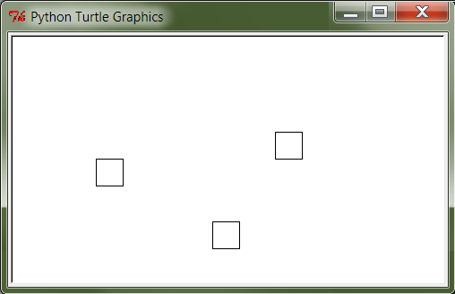

***************
4. Funktsioonid
***************


.. todo::
    
    * lisa kombinatoorika ülesandeid
    * lisa samaväärsuse küsimusi


    * omistamise += kuju üle korrata?
    * TODO: muutujate juurde: Pange tähele, et Python salvestas muutujasse ``x`` justnimelt avaldise *väärtuse* (st. `5`), mitte avaldise ``2 + 3`` enda. See nüanss muutub oluliseks edaspidi, kui hakkame muutujate väärtusi muutma.
    * TODO: Wikipedia sirvimise näide funktsiooni väljakutsete mõistmiseks
    * TODO: **näited** selle kohta, et ühte funktsiooni saab välja kutsuda mitu korda
    * "Let's wrap it in a function to make it easier to use" -- tee selle kohta näide
    * calling a function *generates* a value
    * funktsioonide komponeerimine avaldises & funktsioonid, mis kutsuvad välja teisi funktsioone
    * bool funktsioonid
    * Ülesanded, kus ühe ülesande lahenduses on vaja teise ülesande funktsiooni
    * paaris, paaritu defineerimine vastastikuselt
    * Definitsioonide laadimine käsureale, harjutused, kus on näidatud käsurea sessioon, aga puudu on definitsioonid, Lõpuks Docstringi ja doctest'i tutvustamine
    * roles of variables
    * roles of functions: utility functions, reuse, division, documentation, encapsulation
    * paralleelid muutujate ja funktsioonide vahel -> tadaa

    

Eelmise peatüki :ref:`pere sissetuleku ülesandes <pere_sissetulek_vol1>` tuli sul tõenäoliselt korrata netopalga arvutamise valemit kahes kohas -- ema ja isa netopalga arvutamisel.
    
Õnneks polnud tegemist eriti keerulise valemiga ning copy-paste'ga oli võimalik topelt tippimise vaeva vältida. Aga päris õige see asi siiski ei tundunud -- näiteks kui netopalga arvutamise valem peaks kunagi muutuma, siis peab olema meeles programmi muuta kõigis kohtades, kus seda valemit on kasutatud. 

Tsüklid küll võimaldavad ühekordselt kirja pandud koodi mitu korda käivitada, aga nad teevad oma kordused alati järjest, seega antud ülesandes, kus sarnast koodi oli vaja erinevates programmi kohtades, neist abi ei ole.

Kahtlemata oleks pere sissetulekut palju lihtsam arvutada, kui Pythonis oleks olemas spetsiaalne käsk netopalga arvutamiseks. Samas, kust teavad Pythoni loojad, milliseid käske kellegi vaja võib minna?

Selles peatükis uurime, kuidas "pakendada" mingi programmijupp *funktsiooniks* ja kuidas seda hiljem erinevates kohtades kasutada. Teisiti öeldes, me hakkame looma uusi Pythoni käske. Alustuseks aga võtame kokku selle, mida me Pythoni käskude kohta juba teame.

Käsud e. funktsioonid
========================================================================
Siiani olnud juttu mitmetest erinevatest Pythoni "käskudest", nagu näiteks ``input``, ``sin``, ``right``, ``is_wall``, ``int``, ``readline``, ``upper``, ``print``. Tegelikult on ametlik termin nende kohta *funktsioon*.

Paljudel juhtudel saab tõmmata selged paralleelid Pythoni funktsioonide ja matemaatikast tuntud funktsioonide vahele, samas on mõnede Pythoni funktsioonide olemus hoopis erinev. Alustuseks ütleme lihtsalt, et funktsioon (e. mitteformaalselt *käsk*) on mingi Pythoni maailma "asi", millel on (tavaliselt) nimi ja *mis oskab midagi arvutada või teha*.


Funktsioonide kasutamine
-------------------------------------------------------------------------------------------------------
Toome meeldetuletuseks mõned koodijupid, kus on kasutatud funktsioone nimedega ``input``, ``int``, ``is_wall``, ``print``, ``sqrt`` ja ``sin``:

* ``sisestatud_vanus = input("Sisesta oma vanus: ")``
* ``vanus_arvuna = int(sisestatud_vanus)``
* ``if is_wall(): ...``
* ``print(sqrt(sin(0.5)))``

Esimene tähelepanek on see, et funktsiooni kasutamiseks tuleb kirjutada tema nimi ja selle järel sulud. Sulgudes võib olla 0 või rohkem **argumenti** so. miski, millega me saame funktsiooni tööd kuidagi mõjutada. Näiteks lauses ``print("tere")`` tähistab ``print`` funktsiooni, ``"tere"`` on tema argument ja kõik see kokku on funktsiooni **väljakutse** e. **rakendamine**  (öeldakse ka *aplikatsioon*). Argumendid võivad olla mingid konkreetsed väärtused, muutujad või mingid muud avaldised (sh. funktsioonide rakendused).

TODO: skeem: funktsioon, argument ja väljakutse

Nimelised argumendid
-------------------------------------------------------------------------------------------------------
TODO: print'i näitel


Arvutamine vs. "tegemine"
-------------------------------------------------------------------------------------------------------
Siiani oli meil kombeks uusi Pythoni konstruktsioone lahterdada avaldiste või lausete hulka. Nüüd tekib küsimus, kas mingi funktsiooni väljakutse (nt. ``sqrt(sin(x))`` või ``print('Tere!')``) on avaldis või lause? Tuleb välja, et sellele ei saagi lühidalt vastata.

Mõned funktsioonid (nt. ``sin``, ``sqrt`` ja ``int``) on olemuselt küllalt sarnased matemaatilistele funktsioonidele, kuna nad "võtavad" ühe väärtuse, arvutavad natuke ja "annavad vastu" e. **tagastavad** mingi teise väärtuse (nt. avaldisega ``sqrt(4)`` anname funktsioonile ``sqrt`` argumendiks väärtuse ``4`` ning funktsioon annab meile vastu väärtuse ``2.0``). Selliste funktsioonide väljakutsed on oma olemuselt avaldised, mis tähendab, et me võime neid kasutada igal pool, kus avaldised on lubatud, näiteks omistuslauses või mõne teise funktsiooni argumendina. Siia gruppi loeme ka need funktsioonid, mille väljakutse võib anda igal korral erineva väärtuse, näiteks ``input("Sisesta midagi: ")`` või Pykkari ``is_wall()``. Kuigi need pole funktsioonid matemaatilises mõttes, kasutatakse ka neid avaldistes.

Teiste funktsioonide väljakutsel (nt. ``print('Tere')``, ``right(90)``, ``step()``) huvitab meid see, mida nad **teevad** -- me tahame, et midagi *juhtuks* (nt. et ekraanile ilmuks uus tekstijupp või robot liigutaks ennast). Mingit huvitavat tagastusväärtust nad meile ei paku. Selliste funktsioonide väljakutseid loeme me lauseteks ja seetõttu esinevad nad programmides omaette real. Funktsioonide defineerimise õppimist alustame just seda tüüpi funktsioonidega.


.. note::

    Mõnedes keeltes kasutatakse tegevusele orienteeritud funktsioonide jaoks eraldi terminit *protseduur*. Seda, mis taolise funktsiooni käivitamisel juhtub, nimetatakse mõnikord funktsiooni *efektiks* või *kõrvalefektiks*.

.. note::

    Kui nüüd päris täpne olla, siis tegelikult kõik Pythoni funktsioonid tagastavad midagi, isegi ``print`` ja ``step``. Need funktsioonid, mille põhieesmärgiks on mingi tegevus, tagastavad alati ühe spetsiifilise (ja suhteliselt ebahuvitava) väärtuse ``None``. Selle väärtusega ei ole üldjuhul midagi peale hakata. Õnneks ta meid ka ei sega, seega võime teda vabalt ignoreerida.


.. index::
    single: meetodid

Meetodid
-------------------------------------------------------------------------------------------------------
Teises peatükis nägime, et sõnede puhul kirjutati mõne funktsiooni nimi (nt. ``count``) sõne ja argumentide vahele, nt:

.. sourcecode:: py3

    sõna = "kukununnu"
    u_tähtede_arv = sõna.count("u")

Jääb mulje, et mingil põhjusel on üks funktsiooni argumentidest (antud näites ``sõna``) lihtsalt esile tõstetud. Tuleb välja, et Python seda umbes nii ka käsitleb.

Taolisi funktsioone nimetatakse **meetoditeks**. Lisaks sellele, et meetodite puhul kirjutame esimese argumendi meetodi nime ette, on neil tavaliste funktsioonidega võrreldes veel mõningaid erinevusi, millel me praegu ei peatu. Meetod on väga tähtis mõiste *objekt-orienteeritud programmeerimises*.

.. note::
    Meetodeid ei ole vaja kunagi ``import``-ida.


Funktsioonide defineerimine
========================================================================
Enne, kui funktsiooni saab kasutada, tuleb ta *defineerida*. Meile tuttavad funktsioonid on defineeritud Pythoni loojate poolt, seepärast ei pidanud me siiani selle peale mõtlema. Paraku pole võimalik ette valmistada kõiki funktsioone, mida kellelgi võiks vaja minna, seepärast lubab Python neid ka programmeerijal ise defineerida.

Oletame, et meil on vaja joonistada kilpkonnaga 3 ruutu, kõik küljepikkusega 30, aga nad peavad olema erinevates kohtades: 



Võiks ju proovida joonistada ruudud kolme kordusega tsüklis, aga ilmselt jääksime hätta, sest tsükkel teeb igal kordusel sama asja, kuid meil on vaja iga ruudu joonistamise eel liikuda erinevasse kohta.

Kui vastav programm kirjutada "jõumeetodil", siis sisalduks ruudu joonistamise kood kolmes kohas:

.. sourcecode:: py3
    :emphasize-lines: 5-9,19-23,32-36 

    # "Jõuga" programmeeritud variant
    from turtle import *

    # joonistame esimese ruudu
    joonistatud_külgi = 0
    while joonistatud_külgi < 4:
        forward(30)
        left(90)
        joonistatud_külgi += 1 

    # liigume järgmisesse kohta
    up()
    forward(100)
    left(90)
    forward(100)
    down()

    # joonistame teise ruudu
    joonistatud_külgi = 0
    while joonistatud_külgi < 4:
        forward(30)
        left(90)
        joonistatud_külgi += 1 

    # liigume järgmisesse kohta
    up()
    left(90)
    forward(200)
    down()

    # joonistame kolmanda ruudu
    joonistatud_külgi = 0
    while joonistatud_külgi < 4:
        forward(30)
        left(90)
        joonistatud_külgi += 1 

    exitonclick()    

Lahendus oleks palju lihtsam, kui ruudu joonistamiseks oleks olemas spetsiaalne funktsioon. ``turtle`` moodulis sellist ei leidu, aga me võime selle ise *defineerida* ja seejärel kasutada seda justkui iga teist Pythoni funktsiooni:

.. sourcecode:: py3
    :emphasize-lines: 4-9,12,22,31    
    
    # Kavalam variant
    from turtle import *
    
    def ruut():
        joonistatud_kylgi = 0               
        while joonistatud_kylgi < 4:
            forward(30)
            left(90)
            joonistatud_kylgi += 1
    
    # joonistame esimese ruudu
    ruut()
    
    # liigume järgmisesse kohta
    up()
    forward(100)
    left(90)
    forward(100)
    down()
    
    # joonistame teise ruudu
    ruut()
    
    # liigume järgmisesse kohta
    up()
    left(90)
    forward(200)
    down()
    
    # joonistame kolmanda ruudu
    ruut()
    
    exitonclick()


Kui sa nüüd arvad, et funktsiooni defineerimisega on seotud see koodijupp, mis algab võtmesõnaga ``def``, siis on sul täiesti õigus.

``def``-konstruktsiooni *päises* antakse funktsioonile nimi, mille järgi saab teda hiljem kasutada. Tühjad sulud nime järel näitavad, et antud funktsioon on mõeldud kasutamiseks ilma argumentideta.

Konstruktsiooni *kehas* tuuakse välja need laused, mida soovitakse käivitada funktsiooni rakendamisel. Antud juhul kopeerisime funktsiooni kehasse algsest programmist ruudu joonistamise koodi. Seejuures pidime muidugi read pisut paremale nihutama, et oleks aru saada, et need kuuluvad ``def``-konstruktsiooni alla.

Päis ja keha kokku moodustavad *funktsiooni definitsiooni* e. ``def``-lause. Pärast selle lause käivitamist on Pythonil üks käsk juures, mida saab edaspidi rakendada samal põhimõttel nagu sisseehitatud funktsioone. (Erinevus on selles, et uus funktsioon kehtib ainult sama programmi piires -- kui tahad seda kasutada ka mõnes muus programmis, siis tuleb see seal uuesti defineerida.)

Pane tähele, et ``def``-konstruktsioon ise ei tee muud, kui jätab enda kehas olevad laused meelde. Laused käivituvad alles funktsiooni rakendamisel.


Harjutus. Täidetud ruudud
-------------------------------------------------------------------------------------------------------
Täienda eespool toodud 3 ruudu joonistamise programmi nii, et kõik 3 ruutu oleksid seest värviga täidetud.

.. note::

    Värviga täitmine käib Pythoni kilpkonna puhul nii:
    
    .. sourcecode:: py3
    
        ...
        begin_fill()
        ...
        # joonista mingi kujund
        ...
        end_fill()
        ....


.. hint::

    Antud ülesannet saab lahendada mitmel moel.
     
    Esimeses variandis lisame täitmise käsud otse funktsiooni ``ruut`` definitsiooni:
    
    .. sourcecode:: py3
        :emphasize-lines: 5, 11
        
        # Kavalam variant
        from turtle import *
        
        def ruut():
            begin_fill()
            joonistatud_kylgi = 0               
            while joonistatud_kylgi < 4:
                forward(30)
                left(90)
                joonistatud_kylgi += 1
            end_fill()
            
        ruut()
        
        up()
        forward(100)
        left(90)
        forward(100)
        down()
        
        ruut()
        
        up()
        left(90)
        forward(200)
        down()
        
        ruut()
        
        exitonclick()

    Kui me leiame, et definitsioon ``ruut`` peaks siiski jääma täitmise küsimustest sõltumatuks, siis on mõttekam mainida täitmist iga ruudu joonistamise juures eraldi:

    .. sourcecode:: py3
        :emphasize-lines: 11,13,21,23,30,32
        
        # Kavalam variant
        from turtle import *
        
        def ruut():
            joonistatud_kylgi = 0               
            while joonistatud_kylgi < 4:
                forward(30)
                left(90)
                joonistatud_kylgi += 1
            
        begin_fill()
        ruut()
        end_fill()
        
        up()
        forward(100)
        left(90)
        forward(100)
        down()
        
        begin_fill()
        ruut()
        end_fill()
        
        up()
        left(90)
        forward(200)
        down()
        
        begin_fill()
        ruut()
        end_fill()
        
        exitonclick()

    See lähenemine annab meile suurema paindlikkuse (vajadusel saame joonistada ka täitmata ruute), aga samas teeb meie programmi pisut pikemaks (esimeses variandis lisasime vaid 2 uut rida).

.. hint::

    Kui soovid täitmise värvi ise valida, siis uuri kilpkonna dokumentatsiooni: http://docs.python.org/3/library/turtle.html

Kontrollküsimus: Mitu kala?
-------------------------------------------------------------------------------------------------------
Küllap oled juba märkanud, et Python ei soovi programmeerija vabadust piirata, seetõttu on loomulik, et ühes programmis võib defineerida ükskõik kui palju uusi funktsioone ja need võivad ka üksteist kasutada. 

Nüüd küsimus: Mitu korda kirjutab järgnev programm ekraanile sõna "kala"? NB! proovi vastata ilma Pythoni abita, programmi enda peas "läbi mängides"! Lõpuks kontrolli oma vastust Pythoni abil.

.. sourcecode:: py3

    def fun1():
        print("kala")
        print("kala")
    
    def fun2():
        fun1()
        print("kala")
        fun1()

    fun2()
    fun2()

.. hint::

    Kui sulle jäi segaseks, miks tulemus tuli selline nagu ta tuli, siis uuri veidi muudetud, aga enam-vähem sama struktuuriga programmi käitumist:
    
    .. sourcecode:: py3
    
        def fun1():
            print("fun1 esimene rida")
            print("fun1 teine rida")
        
        def fun2():
            print("fun2 algus")
            fun1()
            print("fun2 keskmine rida")
            fun1()
            print("fun2 lõpp")

        print("kogu eksperimendi algus")
        fun2()
        print("----------------")
        fun2()
        print("kogu eksperimendi lõpp")


Kontrollküsimus: Mitu tärni?
-------------------------------------------------------------------------------------------------------
Mitu tärni ilmub ekraanile järgmise programmi käivitamisel? Paku vastus ja siis kontrolli.

.. sourcecode:: py3

    def fun1():
        print(10 * "*")
    
    def fun2():
        i = 0
        while i < 10:
            fun1()
            i += 1
            
.. hint::

    Nagu Pythonis kontrollimine näitab, ilmub ekraanile 0 tärni, sest programmi välimisel tasemel on ainult funktsioonide definitsioonid, mitte ühtki väljakutset. Funktsioonis ``fun2`` on küll väljakutse funktsioonile ``fun1``, aga kuna ``fun2`` ennast kusagil välja ei kutsuta, siis too väljakutse kunagi ei käivitu.


Harjutus. Pööre vasakule
-------------------------------------------------------------------------------------------------------
Eelmises peatükis Pykkari käske tutvustades tuli välja, et Pykkaril pole sisseehitatud käsku vasakule pööramiseks. Õnneks oli võimalik saavutada sama effekt pöörates 3 korda paremale.

Proovi nüüd täiendada mõnda eelmises peatükis kirjutatud Pykkari programmi selliselt, et vasakule pööramised näeksid koodis natuke loomulikumad välja. 

.. hint::

    .. sourcecode:: py3
    
        from pykkar import *
        
        ...
        
        def left():
            ...
            ...
            ...
        
        
        ...
        left()
        ...
        ...
        left()
        ...
        ...
        ...


Lokaalsed muutujad
-------------------------------------------------------------------------------------------------------
Nagu nägime juba funktsiooni ``ruut`` definitsioonist, võib definitsiooni kehas kasutada abimuutujaid (meie näites ``joonistatud_külgi``). Teeme nüüd väikese eksperimendi -- joonistame funktsiooni kasutades ühe ruudu ning üritame seejärel väljastada muutuja ``joonistatud_külgi`` viimase väärtuse:

.. sourcecode:: py3
    :emphasize-lines: 13
    
    from turtle import *
    
    def ruut():
        joonistatud_külgi = 0               
        
        while joonistatud_külgi < 4:
            forward(100)
            left(90)
            joonistatud_külgi += 1
    
    ruut()
    
    print(joonistatud_külgi)
    
    exitonclick()

Programmi käivitades saime oodatud ``4`` asemel hoopis veateate ``NameError: name 'joonistatud_külgi' is not defined``.

Asi on selles, et funktsiooni kehas kasutusele võetud muutujad on **lokaalsed**, st nad toimivad ainult funktsiooni sees. Lokaalsed muutujad luuakse funktsiooni igal käivitamisel ja nad kaovad, kui funktsioon oma töö lõpetab. Nende olemasolu on funktsiooni siseasi, see ei paista kuidagimoodi väljapoole. See asjaolu võimaldab meil funktsiooni sees olevatele muutujatele e. *lokaalsetele muutujatele* vabalt nimesid valida, ilma muretsemata, kas mõnda neist nimedest on juba programmi põhiosas või mõnes teises funktsioonis kasutatud. 

Eelneva jutu kinnituseks demonstreerib järgnev programm, et funktsiooni sees defineeritud muutuja ``x`` ei mõjuta kuidagi programmi põhiosas defineeritud samanimelist muutujat, tegemist on kahe eraldi muutujaga, millele on juhtumisi sama nimi (justnagu kahel erineval inimesel võib olla sama nimi):

.. sourcecode:: py3

    x = 1

    def f():
        x = 2
        print(x)
    
    print(x) # ekraanile kuvatakse 1
    f()      # ekraanile kuvatakse 2
    print(x) # ekraanile kuvatakse 1
        

.. note::

    Programmi põhiosa muutujate (neid nimetakse ka *globaalseteks muutujateks*) ning funktsiooni kehas defineeritud muutujate (e. lokaalsete muutujate) eraldatus ei ole päris sümmeetriline -- kuigi programmi põhiosal pole ligipääsu funktsiooni muutujatele, saab funktsioonis siiski kasutada programmi põhiosa muutujaid. Sellest tuleb täpsemalt juttu ühes hilisemas peatükis.


    
Parameetrid
========================================================================
Nagu näha, on funktsioonid suureks abiks, kui sama käskude komplekti tahetakse programmis käivitada mitmes kohas. Samas, täpselt sama tegevuse kordamist on vaja siiski üpris harva. Tihemini on vaja teha midagi sarnast, kuid teatud väikese nüansiga, mis võib erinevatel kordadel varieeruda. Sellise nüansi väljatoomiseks on võimalik funktsioonile lisada **parameetreid**. Järgnevas näiteprogrammis on defineeritud funktsioon kasutaja tervitamiseks. Varieeruvaks nüansiks e. parameetriks on antud juhul tervitatava nimi:

.. sourcecode:: python

    def tere(nimi):
        print("Tere " + nimi)
        print("Kuidas läheb?")
        
    tere("Kalle")
    tere("Malle")
    
Funktsiooni ``tere`` definitsiooni päises on lisaks funktsiooni nimele näidatud ära ka üks *parameeter* nimega "nimi". Parameetri näol on sisuliselt tegu spetsiaalse *lokaalse muutujaga*, mille väärtus sõltub sellest, kuidas funktsioon parasjagu välja kutsuti. Antud näites, kui funktsioon kutsutakse välja avaldisega ``tere("Kalle")``, siis saab muutuja ``nimi`` väärtuseks ``"Kalle"``, ``tere("Malle")`` puhul on väärtuseks ``"Malle"``. Funktsiooni sisemine masinavärk töötab mõlemal juhul samamoodi – ta võtab parameetri väärtuse (misiganes see juhtub olema) ning lisab selle tervitusele. Kuna aga väärtused on kahel juhul erinevad, on ka tulemus erinev.

Parameetritega saab teha funktsiooni universaalsemaks -- teatud detailid jäetakse funktsiooni väljakutsuja otsustada. Ilma parameetriteta funktsioon on justkui rätsep, kes teeb alati samasuguseid ülikondi, parameetreid võiks aga võrrelda tellija mõõtudega ja muude soovidega, mida rätsep oma tegevuses arvesse võtab.

.. index::
    single: funktsioon; argumendid
    single: argumendid; funktsiooni argumendid

Harjutus 2. Parameetriseeritud ``ruut``
-------------------------------------------------------------------------------------------------------
Täiusta 3. peatükis mainitud ruudu joonistamise funktsiooni nii, et ruudu küljepikkuse saab määrata funktsiooni väljakutsel. Kasuta loodud funktsiooni, joonistades mitu erineva suurusega ruutu.

.. note::

    Järgnevas vihjes on antud harjutuse näitelahendus, ära seda enne vaata, kui oled ise proovinud!

.. hint::
    
    .. sourcecode:: py3
    
        from turtle import *
        
        def ruut(kylg):
            i = 0
            while i < 4:
                forward(kylg)
                left(90)
                i += 1
        
        ruut(100)
        
        # liigume kuskile mujale
        up()
        forward(200)
        down()
        
        # väiksem ruut
        ruut(20)
        
        exitonclick()


Kas sõnad *parameeter* ja *argument* on sünonüümid?
-------------------------------------------------------------------------------------------------------
Mitte päris. Parameetrid ja argumendid on ühe mündi kaks erinevat poolt. *Argument* on funktsiooni väljakutses antud avaldis, millest saab vastava *parameetri* väärtus. Parameetrid on seotud funktsiooni definitsiooniga, argumendid on seotud funktsiooni väljakutsega. Parameetrid on üldised, argumendid on konkreetsed. Meie viimases näites on ``nimi`` funktsiooni ``tere`` `parameeter`, aga sõneliteraal ``"Kalle"`` on vastav `argument` funktsiooni väljakutses.

.. note::    
    `Parameetri` vs. `argumendi` asemel võib mõnikord kohata ka väljendeid `formaalne parameeter` vs. `tegelik parameeter`.  


.. _param-vs-input:

Parameetrid vs. ``input``
-------------------------------------------------------------------------------------------------------
Parameetritega funktsioon meenutab oma olemuselt programmi, kus on kasutatud ``input`` käsku -- mõlemal juhul on konkreetsed sisendandmed teadmata. Erinevus on selles, et kui ``input`` puhul on teada, et sisendandmed küsitakse kasutajalt, siis parameetrite kasutamisel jäetakse (funktsiooni seisukohast vaadatuna) sisendi saamise viis lahtiseks. Eelnevas näites andsime funktsiooni väljakutsel parameetri väärtuseks sõneliteraali, kuid seal oleks võinud kasutada ka muutujat:

.. sourcecode:: py3

    def tere(nimi):
        print("Tere " + nimi)
        print("Kuidas läheb?")
        
    sisestatud_nimi = input("Kuidas on sinu nimi? ")
    tere(sisestatud_nimi)

See näide demonstreerib parameetritega funktsioonide universaalsust -- vastavalt vajadusele võime taolist funktsiooni kasutada literaaliga või mõne muutujaga (mille väärtus võib olla saadud ``input``-ist) või ka mingil keerulisemal kujul oleva avaldisega.

.. note::

    Pange tähele, et eelviimasel real defineeritud muutuja nimeks oleksime võinud panna ka lihtsalt ``nimi``:
    
    .. sourcecode:: py3

        def tere(nimi):
            print("Tere " + nimi)
            print("Kuidas läheb?")
            
        nimi = input("Kuidas on sinu nimi? ")
        tere(nimi)
        
    See, et funktsiooni ``tere`` parameeter on samuti ``nimi``, ei aja Pythonit segadusse, kuna funktsiooni sisemus (sh. tema parameetrid) on ülejäänud programmist eraldatud. Kõlab sarnaselt sektsioonile "Lokaalsed muutujad"? Tegemist ongi sama teemaga -- nagu juba korra mainitud, käsitletakse ka parameetreid justkui (lokaalseid) muutujaid.
    
    Taoline nimede "taaskasutamine" erinevates kontekstides on küllalt levinud, aga kui leiate, et see ajab sind ennast segadusse, siis võid kasutada alati erinevaid muutujanimesid.


Mitu parameetrit
-------------------------------------------------------------------------------------------------------
Parameetreid (ja vastavaid argumente) võib olla ka rohkem kui üks. Proovi näiteks järgmist programmi:

.. sourcecode:: python

    def tere(nimi, aeg):
        print("Tere, " + nimi)
        print("Pole sind juba " + str(aeg) + " päeva näinud")
	
    tere("Kalle", 3)

Nagu näed, tuleb funktsiooni väljakutsel argumendid anda samas järjekorras nagu on vastavad  parameetrid funktsiooni definitsioonis. Teisisõnu, argumendi *positsioon* määrab, millisele parameetrile tema väärtus omistatakse.

Harjutus 3. Värviline ruut
-------------------------------------------------------------------------------------------------------
Kilpkonna "pliiatsi" värvi saab muuta funktsiooniga ``color``, andes sellele argumendiks sõne ingliskeelse värvinimega, nt. ``color('red')``. Peale seda teeb kilpkonn järgmised jooned nõutud värviga. 

.. note::

    Soovi korral vaata täpsemat infot siit:
    http://docs.python.org/3/library/turtle.html#turtle.color

Lisa funktsioonile ``ruut`` uus parameeter joone värvi määramiseks. Katseta.


Vaikeväärtusega parameetrid
-------------------------------------------------------------------------------------------------------
Mõnede funktsioonide puhul on ühe parameetri väärtus tavaliselt sama ja seda on vaja vaid harvadel juhtudel muuta. Sellisel juhul on võimalik see "tavaline" väärtus funktsiooni definitsioonis ära mainida. Kui funktsiooni väljakutsel sellele parameetrile väärtust ei anta, kasutatakse lihtsalt seda vaikeväärtust. Seda võimalust demonstreerime eelmise näite modifikatsiooniga:

.. sourcecode:: python

    def tere(nimi, aeg = "mitu"):
        print("Tere, " + nimi)
        print("Pole sind juba " + str(aeg) + " päeva näinud")
    
    tere("Kalle", 3)
    tere("Malle")

Eespool juba nägime, et funktsioonil ``print`` on lisaks põhiparameetrile veel parameeter nimega `end`, millele on antud vaikeväärtus ``"\n"`` (so. reavahetus). See on põhjus, miks ``print`` vaikimisi kuvab teksti koos reavahetusega. Kuna selle funktsiooni definitsioonis kasutatakse Pythoni keerulisemaid võimalusi, siis ``print``-i väljakutsel ei olegi võimalik `end` väärtust määrata ilma parameetri nime mainimata, st. seda ei saa anda positsiooniliselt.

.. index::
    single: funktsioon; tagastamine
    single: väärtusega funktsioon
    single: return
    
Väärtusega funktsioonid
========================================================================
Tuleme tagasi peatüki alguses mainitud probleemi juurde: pere sissetuleku ülesandes pidime netopalga valemi panema kirja kahes kohas ja kuigi koodi kopeerimine ajas asja ära, ei tundunud see siiski päris õige.

Ilmselt juba aimad, et taolise kordamise vältimiseks on jälle abiks funktsioonid -- netopalga arvutamiseks tuleb defineerida uus funktsioon (nt. nimega ``neto``), valem tuleb kirja panna funktsiooni kehas, seejuures tuleks brutopalk jätta lahtiseks, st. parameetriks.

Kuidas aga saada funktsiooni käest vastust kätte? Võid proovida lisada funktsiooni lõppu vastava ``print`` lause, aga see ei aita, kui tahame tulemust järgmistes arvutustes kasutada. Võiks proovida salvestada tulemuse kuhugi muutujasse, aga milline muutuja valida? Kas ``isa_sissetulek`` või ``ema_sissetulek``?

``return``-lause
-------------------------------------------------------------------------------------------------------
Funktsiooni tulemuse **tagastamiseks** on Pythonis eraldi konstruktsioon -- ``return`` lause. Demonstreerime selle kasutamist netopalga arvutamise funktsioonis:

.. sourcecode:: py3
    :emphasize-lines: 1-7, 13

    def neto(bruto):
        maksuvaba = 144
        if (bruto <= maksuvaba):
            return bruto
        else:
            maksustatav = bruto - maksuvaba
            return maksustatav * 0.79 + maksuvaba
    
    ema_bruto = float(input('Sisesta ema palk: '))
    isa_bruto = float(input('Sisesta isa palk: '))
    laste_arv = int(input('Sisesta alaealiste laste arv: '))
    ühe_lapse_toetus = 20 
    sissetulek = neto(ema_bruto) + neto(isa_bruto) + laste_arv * ühe_lapse_toetus
    print('Pere sissetulek kuus on', sissetulek, 'eurot.')

``return``-lause käivitamisel arvutab Python näidatud avaldise väärtuse ja saadab selle funktsioonist välja (e. *tagastab*) sellesse konteksti, kus funktsioon välja kutsuti (antud näites on selleks kontekstiks eelviimase rea liitmistehe). 

Vaatame selle idee kinnistamiseks ka ühte lihtsamat näidet -- defineerime funktsiooni, mis arvutab ja tagastab ringi pindala, ning seejärel kutsume seda välja omistuslauses:

.. sourcecode:: py3
    :emphasize-lines: 1-2,9,10
    
    from math import pi

    def ringi_pindala(raadius):
        return pi * raadius**2
        
    r1 = float(input("Sisesta esimese ringi raadius: "))
    r2 = float(input("Sisesta teise ringi raadius: "))
    
    pindala1 = ringi_pindala(r1)
    pindala2 = ringi_pindala(r2)
    
    if pindala1 > pindala2:
        print("Esimene on suurem")
    elif pindala2 > pindala1:
        print("Teine on suurem")
    else:
        print("Ringid on võrdse pindalaga") 


Eespool jagasime funktsioonid kahte leeri -- ühed teevad midagi (neid kasutame me lausetena) ja teised arvutavad midagi (neid kasutame avaldistes). Funktsiooni defineerimise vaatenurgast tuleneb see erinevus justnimelt ``return``-lause kasutamisest -- kõikides funktsioonides, mida me soovime avaldistes kasutada, on vaja kasutada ``return``-i.


Harjutus 6. Sõne dubleerimine
-------------------------------------------------------------------------------------------------------
Kirjuta funktsioon ``dubleeri`` , mis võtab argumendiks sõne ning tagastab selle sõne dubleerituna niimitu korda, kui mitu tähte on esialgses sõnes:

.. sourcecode:: py3

    >>> dubleeri('xo')
    'xoxo'
    >>> dubleeri('Tere')
    'TereTereTereTere'

.. hint::

    Abiks on funktsioon ``len`` ja operaator ``*``


Nipp: Funktsioonide testimine käsureal
-------------------------------------------------------------------------------------------------------
Väärtusega funktsioone on mugav testida IDLE'i käsureal. Selleks piisab, kui skriptis on kirjas ainult funktsiooni definitsioon -- taolise skripti jooksutamisel küll esialgu midagi ekraanile ei ilmu, aga käsureal on võimalik funktsiooni kasutada. Näiteks, kui skripti sisu on selline:

.. sourcecode:: py3

    def liida(a,b):
        return a + b
    
    def korruta(a,b):
        return a * b

siis peale selle IDLE'is käivitamist on võimalik käsureal teha nii:

.. sourcecode:: py3

    >>> liida(223, 6)
    229
    >>> korruta(456, 987)
    450072
 
  


.. _return-vs-print:

Harjutus 5. Tollid ja sentimeetrid
-------------------------------------------------------------------------------------------------------
#. **Kirjuta funktsioon** ``cm``, mis võtab argumentideks pikkuse jalgades ja tollides (st. esimene argument tähistab jalgu ja teine tolle) ning tagastab pikkuse sentimeetrites (nt. ``cm(6, 1)`` peaks tagastama umbes ``187.96``). Salvesta esialgu faili vaid funktsiooni definitsioon, ilma väljakutseta.
#. **Testi loodud funktsiooni** käsureal (käivita programm, ning kirjuta mõned väljakutsed). Kui funktsioon ei tööta õigesti, siis korrigeeri definitsiooni ja proovi uuesti.
#. Lõpuks **kirjuta programmi põhiosa**, mis küsib kasutajalt tema pikkuse tollides ja väljastab ekraanile vastava pikkuse sentimeetrites ning tema nn. "ideaalkaalu" (so. pikkus sentimeetrites - 100, nt. kui pikkus on 185cm, siis ideaalkaal on 85kg).

.. note::

    Taolist programmi kirjutamise stiili, kus alguses tehakse valmis mõned abifunktsioonid ja alles peale nende testimist kirjutatakse programmi põhiosa, nimetatakse "alt üles programmeerimiseks". 

``return`` vs. ``print``
-------------------------------------------------------------------------------------------------------
Eelnevalt märkisime, et nii funktsiooni parameetrid kui ``input`` on olemuselt sarnased, kuna mõlemad on seotud sisendi saamisega, kuid parameetrid on paindlikumad, kuna täpne sisendi saamise viis jäetakse lahtiseks.

Analoogselt võime võrrelda ``print`` ja ``return`` käsku -- mõlemad on seotud väljundi andmisega, kuid ``return`` on paindlikum, kuna *täpne tulemuse kasutamise viis jäetakse lahtiseks*.

Uurige kahte järgnevat programmi, mis töötavad kasutaja seisukohast samamoodi:

+----------------------------------------------+----------------------------------------------+
|.. sourcecode:: py3                           |.. sourcecode:: py3                           |
|                                              |                                              |
|    from math import pi                       |    from math import pi                       |
|                                              |                                              |
|    def ringi_pindala(raadius):               |    def ringi_pindala(raadius):               |
|        print("Pindala on", pi * raadius**2)  |        return pi * raadius**2                |
|                                              |                                              |
|    ringi_pindala(16.5)                       |    print("Pindala on", ringi_pindala(16.5))  |
+----------------------------------------------+----------------------------------------------+
    
Kuna antud juhul soovisime arvutuse tulemust näidata ekraanil, siis tehniliselt võttes pole vahet, kas me teeme ``print``-i funktsiooni sees või väljaspool. Erinevus tuleb sisse, kui me peaksime programmi täiendama veel mingite lisaarvutustega, kus meil läheb pindala tarvis -- meie esimeses programmis olev funktsioon siis enam ei sobi. Teises variandis on funktsioon defineeritud üldisemana, ja seetõttu saab seda kasutada rohkemates situatsioonides.


.. note::
    
    Antud teemas võib segadus tekkida Pythoni käsurea kasutamisel -- kui kirjutada sinna avaldis ``sqrt(2)``, siis tulemus ilmub ikkagi ekraanile, kuigi me ei kasutanud ``print`` käsku. Kas see tähendab, et ka funktsioon ``sqrt`` kuvab vastuse ekraanile? Ei, tegelikult kuvab Pythoni käsurida ``sqrt`` käest saadud vastuse ekraanile omal algatusel, ``sqrt`` ei tea sellest midagi. 

Harjutus. Kuu nimed
-------------------------------------------------------------------------------------------------------
.. _kuu_nime_funktsioon:
.. container:: autotest

    .. include:: exercises/kuu_nime_funktsioon.py
        :start-after: """
        :end-before: """  


``return`` lõpetab funktsiooni töö
-------------------------------------------------------------------------------------------------------
Senistes näidetes oli ``return``-lause funktsiooni kehas kõige viimane lause (või siis viimane lause ``if``-lause harus). Tegelikult ei pea ``return`` olema tingimata funktsiooni lõpus. Järgnevas absoluutväärtuse arvutamise funktsiooni näites kasutatakse ``return``-i kahes kohas -- funktsiooni lõpus ja tingimuslause sees:

.. sourcecode:: py3

    def absoluut(x):
        if x < 0:
            return -x
        
        return x

Kumb neist ``return``-idest siis ikkagi kehtib? Sellele vastamiseks peame teadma, et ``return`` lause käivitamine lõpetab alati funktsiooni töö. Seega, kui kutsume antud funktsiooni välja negatiivse argumendiga, siis käivitub esimene ``return`` ja ``if``-lausele järgnevat rida üldse ei vaadatagi. Kui aga ``if`` lause tingimus osutub vääraks, siis ``if``-lause keha ei vaadata ja Python jätkab sellega, mis tuleb peale ``if``-lauset (so. teine ``return```).

Selline võimalus kasutada ``return``-i funktsiooni keskel ei ole tegelikult eriti oluline -- alati saab funktsiooni panna kirja nii, et seal on täpselt üks ``return`` lause ja see paikneb funktsiooni lõpus.

.. note::

    ``return``-lausest on olemas ka variatsioon, kus avaldise osa on hoopis ära jäetud, st. kogu lause koosneb ainult võtmesõnast ``return``. Seda varianti kasutatakse siis, kui tahetakse funktsiooni töö lõpetada ilma mingit väärtust tagastamata.

Harjutus 7. Kahest suurim => kolmest suurim
-------------------------------------------------------------------------------------------------------
Kirjuta funktsioon ``kahest_suurim``, mis tagastab kahest argumendiks antud arvust suurima.

Programmi põhiosas küsi kasutajalt *kolm* arvu, ning kuva ekraanile neist suurim. Proovi seejuures delegeerida võimalikult palju tööd funktsioonile.


Näide: Tõeväärtusfunktsioonid
-------------------------------------------------------------------------------------------------------
TODO:

.. _milleks-funktsioonid:


Alamülesannete tuvastamine ja alamprogrammide loomine
========================================================================
Eelmise peatüki lõpus läksid mõned programmid võrdlemisi keeruliseks -- näiteks põranda värvimise ülesandes tuli sul tõenäoliselt läbi mõelda ja kirja panna kuidas teha vahet, milline veerg värvida ja milline mitte, kuidas korraldada liikumise ja värvimise vaheldumine, millal ja kuhupoole tuleks pöörata, millal on ülesanne täidetud jne. Kõikide nende probleemide lahendused kokku kirjutatuna võivad esialgu silme eest kirjuks võtta. Kui keegi küsiks sult praegu, millise eesmärgiga on sinu programmis mingi konkreetne rida või plokk, siis ilmselt peaksid enne vastamist omajagu süvenema.

Kuna enamus praktikas kasutatavaid programme on palju keerulisemad kui põranda värvimise programm, peab eksisteerima mingi nipp taolise keerukusega toimetulekuks. Käesolev peatükk ongi mõeldud selle nipi selgitamiseks ja harjutamiseks.


Tuleb välja, et programmeerimises kasutatakse keeruliste ülesannete lahendamisel sama nippi nagu "päris elus" -- esmalt jaotatakse ülesanne parajateks osadeks e. alamülesanneteks, seejärel lahendatakse alamülesanded (keskendudes korraga vaid ühele) ning lõpuks kombineeritakse alamülesannete lahendused. Seejuures juhtub küllalt tihti (nii programmeerimises, kui päris elus), et mõni alamülesanne on juba mingi teise probleemi kontekstis varem lahendatud, sel juhul saab vastavat lahendust taaskasutada.

Programmeerimises nimetatakse alamülesande lahendust **alamprogrammiks** (see on üldisem nimetus) või ka **funktsiooniks** (Pythoni programmeerijad eelistavad seda nimetust). Pythoni funktsioonide defineerimist sai tegelikult juba liitlausete peatükis veidi tutvustatud (vt. Uute käskude loomine), aga selles peatükis käsitleme funktsioonide kasutusvõimalusi palju sügavamalt ja laiemalt.

.. note::

    Erinevalt teistest siiani tutvustatud Pythoni põhikonstruktsioonidest (hargnemine ja tsükkel), ei ole alamprogrammid tehniliselt võttes programmeerimisel hädavajalikud -- kõik programmid on teoreetiliselt võimalik kirjutada kasutades vaid väikest hulka sisseehitatud käske. Taoliselt kirjutatud praktilised programmid aga läheksid peagi nii suureks ja keeruliseks, et ka parimad programmeerijad ei suudaks neid enam hallata.

Võtame esimeseks näiteks juba mainitud ülesande, kus robot peab värvima põranda triibuliseks (vt. 3. ptk :ref:`triibuliseks`. Kui sul on jäänud see ülesanne lahendamata, siis enne jätkamist on soovitav see ülesanne praeguste teadmiste abil ära teha). 

Toome siinkohal ära ühe võimaliku lahenduse, kus pole alamprogramme kasutatud:

.. sourcecode:: py3

    from pykkar import *

    create_world("""
    ########
    #      #
    #      #
    #  ^   #
    #      #
    #      #
    ########
    """)

    # eeldame, et robot alustab alati näoga põhjasuunas

    # liigu põhjaseinani
    while not is_wall():
        step()

    # pööra läänesuunda
    right()
    right()
    right()

    # liigu lääneseinani
    while not is_wall():
        step()

    # pööra lõunasuunda
    right()
    right()
    right()

    # välimine tsükkel käib üle veergude (kaks veergu korraga, üks allaminnes, 
    # koos värvimisega ja teine üles tulles, ilma värvimiseta)
    while True:

        # allaminek ja värvimine
        paint()
        while not is_wall():
            step()
            paint()

        # liigu järgmisele veerule (kui võimalik)
        right()
        right()
        right()
        
        if is_wall():
            # rohkem veerge pole
            break

        # kui jõudsime siia, siis on järelikult veel veerge
        step()
        # pööra nina põhjasuunda
        right()
        right()
        right()

        # liigu üles
        while not is_wall():
            step()

        # proovime liikuda järgmisele (värvitavale) veerule
        right()
        if is_wall():
            # pole rohkem veerge
            break

        step()
        # pöörame õigesse suunda
        right()

        
        

    


Nagu juba varem mainitud, oskab meie robot pöörata vaid paremale. Seetõttu on näitekoodis koht, kus 90° võrra vasakule pööramise saavutamiseks on antud 3 korda järjest käsklus ``paremale()``. See on üks koht, mis võib programmi lugejale esmapilgul segadust tekitada. Kasutame võimalust ja defineerime uue alamprogrammi (e. funktsiooni või "käsu") vasakule pööramiseks. Selleks lisame esialgse programmi algusse uue *funktsiooni definitsiooni*:

.. sourcecode:: py3

    from pykkar import *

    def left():
        right()
        right()
        right()
    
    ...


Sisuliselt defineerisime ühe uue roboti juhtimise käsu ja me võime algses programmis kolmekordse paremale pööramise asendada käsuga ``left()``. Nii ei jäta me koodi lugejale enam kahtlust, mida me soovime kolmekordse pööramisega saavutada.

Teine korduv motiiv esialgses programmis on seinani liikumine. Ka selle saame vormistada funktsioonina:

.. sourcecode:: py3

    ...
    
    def move_to_wall():
        while not is_wall():
            step()
    
    ...

Kui nüüd mõlemaid uusi käske programmis kasutada, saame juba omajagu lihtsama tulemuse:

.. sourcecode:: py3

    from pykkar import *

    def left():
        right()
        right()
        right()

    def move_to_wall():
        while not is_wall():
            step()

    create_world("""
    ########
    #      #
    #      #
    #  ^   #
    #      #
    #      #
    ########
    """)

    # eeldame, et robot alustab alati näoga põhjasuunas

    # liigu põhjaseinani
    move_to_wall()

    # pööra läänesuunda
    left()

    # liigu lääneseinani
    move_to_wall()

    # pööra lõunasuunda
    left()

    # välimine tsükkel käib üle veergude (kaks veergu korraga, üks allaminnes, 
    # koos värvimisega ja teine üles tulles, ilma värvimiseta)
    while True:

        # allaminek ja värvimine
        paint()
        while not is_wall():
            step()
            paint()

        # liigu järgmisele veerule (kui võimalik)
        left()
        
        if is_wall():
            # rohkem veerge pole
            break

        # kui jõudsime siia, siis on järelikult veel veerge
        step()
        # pööra nina põhjasuunda
        left()

        # liigu üles
        move_to_wall()
        
        # proovime liikuda järgmisele (värvitavale) veerule
        right()
        if is_wall():
            # pole rohkem veerge
            break

        step()
        # pöörame õigesse suunda
        right()


Nende funktsioonide loomine ja kasutuselevõtt tuli kasuks kahel moel. Esiteks, funktsiooni defineerimisega **andsime (potentsiaalselt) keerulisele programmilõigule selgitava nime** ning võisime programmi põhiosas mainida ainult nime -- nii muutsime programmi põhiosa veidi lihtsamaks. Nüüd on meil võimalus analüüsida seda värjaeraldatud koodi põhiprogrammist eraldi ja samuti on võimalik analüüsida põhiprogrammi ilma, et peaks muretsema detailide pärast. Näiteks, põhiprogrammi uurides piisab meile teadmisest, et robot pöörab mingis kohas vasakule, me ei pea muretsema selle pärast, kuidas ta seda teeb. Samas, kui meid detailid siiski huvitavad, siis saame alati otsida üles vastava funktsiooni definitsiooni.

Teiseks, me **defineerisime funktsiooni ühekordselt, aga saime seda kasutada mitmes kohas**, seega hoidsime kokku tippimise vaeva.

.. note::

    Alamprogrammide defineerimine on tihti mõistlik ka siis, kui väljaeraldatud koodi on kasutatud vaid ühes kohas, aga ta on piisavalt keeruline, et programmi mõistmist raskendada. Meie näite puhul võiksime eraldi funktsiooni luua veel kuni seinani värvimise kohta:
    
    .. sourcecode:: py3
    
        def paint_until_wall():
            paint()
            while not is_wall():
                step()
                paint()
    
    Selle funktsiooni kasutamisega saaksime lahti ka kahekordsest tsüklist (tsükkel tsükli sees), mis võib mõnele programmi lugejale tunduda keeruline.
    

Harjutus 1. Liigu nurka
-------------------------------------------------------------------------------------------------------
Lisa vaadeldud näiteprogrammi veel ühe funktsiooni definitsioon -- ``liigu_nurka`` peaks liigutama kilpkonna temast vasakule-ettepoole jäävasse nurka (võime eeldada ristküliku kujulist põrandat).

Kasuta seda funktsiooni programmis sobival kohal.


Milleks funktsioonid?
========================================================================
Vaatame üle peamised põhjused, miks on funktsioonid kasulikud.

.. index::
    single: DRY-printsiip
    
*DRY*-printsiip
-------------------------------------------------------------------------------------------------------
Kolmandas peatükis oli ülesanne pere sissetuleku arvutamiseks. Tõenäoliselt kasutasite programmis netopalga arvutamise valemit kahes kohas (vastavalt isa ja ema palga jaoks).

Kui taoline programm oleks reaalses kasutuses, siis nt. tulumaksuvaba miinimumi muutmise korral tuleks parandused teha kahes kohas. Antud näite puhul oleks see piisavalt lihtne, kuid reaalsetes programmides juhtub tihti, et vajalik parandus unustatakse mõnes kohas tegemata. Seetõttu propageeritakse programmeerimisel nn. **DRY-printsiipi** -- see tuleb ingliskeelsest väljendist *Don't Repeat Yourself*, millega tahetakse öelda, et sarnase koodi kordamist tuleks vältida.

Tuleb välja, et funktsioonid sobivad suurepäraselt *DRY*-printsiibi rakendamiseks -- selle asemel, et samasugust koodi kirjutada erinevatesse kohtadesse, saab selle koodi esitada funktsioonina, ning edaspidi piisab selle kasutamiseks vaid funktsiooni nime mainimisest. Kui midagi on vaja muuta, siis tehakse muudatus vaid funktsiooni kehas ja see mõjub igalpool, kus funktsiooni on kasutatud.

TODO: näide tõeväärtusega funktsioonist

"Mugavusfunktsioonid"
-------------------------------------------------------------------------------------------------------
Python'i ``math`` mooduli ``log`` funktsioon arvutab vaikimisi naturaallogaritmi. Selleks, et arvutada logaritmi mõne teise alusega, tuleb alus anda teiseks argumendiks, nt. ``log(8, 2)``. Kui meil on tihti tarvis arvutada just kahendlogaritmi, siis võime defineerida selle jaoks uue funktsiooni, mis kasutab oma definitsioonis tavalist ``log`` funktsiooni:

.. sourcecode:: py3

    from math import *

    def log2(x):
        return log(x, 2)

Nüüd on meil eraldi kahendlogaritmi arvutamise funktsioon, millele peame andma vaid ühe argumendi, nt. ``log2(8)``. Antud näites ei võitnud me sellega just palju, kuid keerulisemate funktsioonide väljakutsete puhul võib taoline trikk teha koodi märgatavalt lühemaks ja selgemaks.


.. index::
    single: abstraktsioon
    
Üldistamine e. *abstraktsioon*
-------------------------------------------------------------------------------------------------------
Kui eri kohtades on vaja sarnast, kuid teatud variatsiooniga koodi (nt. ühel juhul arvutame netopalka ema, aga teisel juhul isa brutopalga põhjal), siis tulevad appi parameetrid, mis võimaldavad meil funktsiooni kehas jätta mõned detailid lahtiseks. Teisiti öeldes -- funktsiooni parameetrid võimaldavad meil kirjutada üldisema e. **abstraktsema** lahenduse, mida saab hiljem konkreetsete argumentidega täpsustada. Nt. netopalga arvutamise funktsioonis saame brutopalga esitada parameetrina, millele antakse väärtus alles konkreetse arvutuse käivitamisel.


"Let's wrap it in a function for easier use"
-------------------------------------------------------------------------------------------------------
ex2 http://www.openbookproject.net/thinkcs/python/english2e/ch07.html#exercises

TODO:


.. index::
    single: modulaarsus
    single: must kast
    
Modulaarsus ja *musta kasti* metafoor
-------------------------------------------------------------------------------------------------------
Kolmas oluline põhjus tuleb paremini esile suuremate programmide puhul. Kui me koondame teatud alamülesande lahendamiseks vajalikud laused ühte funktsiooni (e. alamprogrammi), siis programmi põhiosas saame selle alamülesande kirja panna vaid vastava funktsiooni nime mainides. Eeldades, et funktsioonide nimed on hoolikalt valitud, piisab meile programmi põhiidee mõistmiseks vaid kasutatud funktsioonide nimede lugemisest -- funktsiooni sisu võime esialgu ignoreerida. Teisiti öeldes: me võime funktsioone soovi korral käsitleda maagiliste **mustade kastidena**, mis *kuidagimoodi* teevad seda, mis nende nimest võib välja lugeda.

Taolisi "musti kaste", mida on võimalik kasutada ilma nende täpset sisu teadmata, nimetatakse tihti *mooduliteks*, ning programme, mis on jagatud alamprogrammideks nimetatakse vastavalt **modulaarseteks**. Kuna Pythonis on sõnal *moodul* spetsiifilisem tähendus, siis meie seda terminit alamprogrammi jaoks ei kasuta.
    
Keskendumine vaid "mustade kastide" *tähendusele*, ignoreerides nende *ehitust*, vabastab osa meie aju töömälust ning võimaldab luua sellevõrra keerulisemaid programme. Kõige keerulisemad programmid on saanud võimalikuks vaid seetõttu, et lihtsatest mustadest kastidest on ehitatud keerulisemad mustad kastid, neist omakorda veel keerulisemad jne.

Kui *DRY*-printsiibi juures rõhutasime seda, et funktsioonid aitavad sama koodi kasutada korduvalt, siis modulaarsuse põhiidee on selles, et me saame funktsiooni kasutada ilma selle täpse sisu peale mõtlemata, toetudes vaid ta nimele. Seetõttu on uue funktsiooni loomine põhjendatud tihti ka siis, kui seda kasutatakse vaid ühes kohas.

TODO: näide, kus funktsiooni nime järgi saab asjast aimu

.. admonition:: Nimede tähtsus

    TODO: Tee näiteprogramm, kus muutujanimed on a,b,c,x,y,z ja lase lugejal arvata, mida see programm teeb, pärast näita nimedega varianti. peab olema meeldejääv, sest seda on tarvis tagasi viidata


.. index::
    single: import
    single: moodulid

``import``-lause
========================================================================
Pythoni `standardteegis` (so. funktsioonide ja teiste programmielementide kogum) on väga palju funktsioone (ja teisi Pythoni objekte). Nende paremaks organiseerimiseks on nad jaotatud teemade kaupa gruppidesse, mida nimetatakse `mooduliteks`. ``import`` lause teeb moodulis olevad funktsioonid programmi jaoks kättesaadavaks. Meeldetuletuseks näide, kus me soovime kasutada ainult kahte funktsiooni moodulist ``math``:

.. sourcecode:: py3

    from math import sin, cos
    
    print(sin(0.3))
    print(cos(sin(0.3)))

Kui soovime moodulist kõiki funktsioone, siis võime kasutada import lauses funktsiooninime(de) asemel tärni:

.. sourcecode:: py3

    from turtle import *
    
    forward(100)
    left(90)
    forward(100)

    
Mõned funktsioonid, nagu näiteks ``int`` ja ``float``, on alati kättesaadavad, neid pole vaja importida.

.. note::

    Importida saab ka moodulit ennast, sel juhul tuleb soovitava funktsiooni nimi kirjutada koos mooduli nimega:
    
    .. sourcecode:: py3
    
        >>> import math
        >>> print(math.sin(0.5))
        0.479425538604203
        >>> print(math.cos(0.5))
        0.8775825618903728    


Moodulid ja ``import``
========================================================================
Pythoniga tuleb kaasa tuhandeid erinevaid funktsioone, lisaks kirjutavad Pythoni programmeerijad üle maailma igapäevaselt tuhandeid funktsioone juurde. Sellises situatsioonis on täiesti loomulik, et mitmele erinevale funktsioonile pannakse sama nimi. Selleks, et erinevatel funktsioonidel oleks siiski võimalik vahet teha, jagatakse need **moodulitesse**.

Eelmistes peatükkides kohtusid juba moodulitega ``math`` ja ``turtle``, ning nägid, et mooduli sisu muutub kättesaadavaks ``import`` käsuga, nt:

.. sourcecode:: py3

    from math import *

Selline variant ``import`` käsust on tegelikult soovitav vaid siis, kui sul on vaja moodulist palju erinevaid funktsioone. Kui sa tead, et sul läheb moodulist tarvis vaid mõnda funktsiooni (nt. ``math`` moodulist funktsioone ``sin`` ja ``cos``), siis on soovitav kasutada ``import`` käsu varianti, kus näidatakse ära konkreetsed funktsioonide (või konstantide) nimed, mida tahetakse kasutada: 

.. sourcecode:: py3

    from math import sin, cos

Sellise variandi puhul ei teki segadust, kui tahate mõnd ``math`` moodulis defineeritud nime (nt. ``e``) kasutada mõne enda muutuja nimena.    

``import`` käsust on olemas veel üks variant, mis võimaldab moodulis olevaid funktsioone kasutada ainult koos mooduli nimega:

.. sourcecode:: py3

    >>> import math
    >>> math.sqrt(9)
    3.0
    
Ka selle variandi puhul ei pea oma muutujate nimede valimisel muretsema, kui imporditud moodulis on juba sama nime kasutatud -- antud näites võiksime vabalt luua uue muutuja nimega ``sqrt`` ja see ei läheks segamini funktsiooniga ``math.sqrt``.

.. note:: 
    ``import``-laused tuleks panna programmi algusesse. See pole Pythoni poolt range nõue, vaid lihtsalt tava --  nii on hea näha, milliste teemadega antud programm tegeleb.

.. topic:: Oma mooduli loomine

    Kõikide selle õpiku ülesannete puhul piisab, kui su programm koosneb ainult ühest failist. Samas, reaalsete programmide juures on peaaegu alati tarvilik organiseerida programmi jaoks loodud funktsioonid eraldi moodulitesse.
    
    Uue mooduli loomine on Pythonis imelihtne -- funktsioonide definitsioonid tuleb lihtsalt salvestada tavalisse *py*-laiendiga faili. Mooduli nimeks saab seejuures tema failinimi ilma *py*-laiendita. Selleks, et neid funktsioone saaks kasutada teistes failides, tuleb seal teha sobiv ``import``, justkui ``math`` või ``turtle`` mooduli puhul. 
    
    Siit tuleb ka välja, miks esimeses peatükis märgiti, et omaloodud faili nimeks ei tohiks panna `turtle.py`. Kui panna, siis hakatakse ``import turtle`` puhul funktsioone ``left()``, ``right()`` jt otsime uuest failist, kus neid aga pole.

    NB! Erinevalt standardmoodulitest, peab enda moodul olema üldjuhul samas kaustas, kus seda kasutav programm (täpsem info siit: http://docs.python.org/3/tutorial/modules.html#the-module-search-path)

    


Veateated ja funktsioonid
========================================================================
Esimeses peatükis soovitasime pikkade veateadete puhul keskenduda veateate viimastele ridadele. Kui täitmisaegne viga tekib mingi funktsiooni sees, siis võib ainult viimaste ridade põhjal olla raske vea põhjust tuvastada. Proovi käivitada järgnevat programmi:

.. sourcecode:: py3

    def arvuta_kuupalk(aastapalk):
        return aastapalk / 12
    
    aastapalk = input("Palun sisesta aastapalk: ")
    print("Kuupalk on", arvuta_kuupalk(aastapalk))    


Kui sisestad nõutud palganumbri, siis saad umbes taolise veateate:

.. sourcecode:: none

    Traceback (most recent call last):
      File "C:/harjutused/vigane.py", line 5, in <module>
        print("Kuupalk on", arvuta_kuupalk(aastapalk))
      File "C:/harjutused/vigane.py", line 2, in arvuta_kuupalk
        return aastapalk / 12
    TypeError: unsupported operand type(s) for /: 'str' and 'int'

Viimaste ridade järgi võiks järeldada, et probleem on real nr 2, funktsioonis ``arvuta_kuupalk``. Tegelikult oli viga aga selles, et funktsiooni kutsuti välja valet tüüpi argumendiga (peaks olema arv, aga oli sõne). Seega tuleb pöörata tähelepanu ka funktsiooni väljakutse kohale. Meie õnneks on ka väljakutse koht veateates ära näidatud -- see on real nr. 5. Kui ka väljakutse ise paiknes kuskil funktsioonis, siis on ka tolle funktsiooni väljakutse koht ära näidatud -- ülevalt alla liikudes saab veateatest välja lugeda, millises kohas kutsuti mida välja.


Funktsioonid vs. muutujad
========================================================================
TODO: Räägi siin ka importimisest


Kokkuvõte
========================================================================

**Funktsiooni definitsiooni** kehas olevad laused jäetakse esialgu lihtsalt meelde. Neid saab hiljem käivitada kirjutades definitsiooni päises antud nime koos sulgudega -- seda nimetatakse *funktsiooni väljakutseks* e. rakendamiseks. Funktsioonid võimaldavad keerulise programmilõigu panna kirja vaid ühekordselt, aga kasutada seda mitmes erinevas kohas.


Ülesanded
========================================================================
.. note::

    Kursuse kodulehel loetletud kontrollülesannete all on mõeldud just selle ploki ülesandeid.

Harjutus: Kahe punkti kaugus
-------------------------------------------------------------------------------------------------------
Kirjuta funktsioon, mis võtab argumentideks kahe tasandipunkti koordinaadid ja tagastab nende punktide kauguse üksteisest.


    
1. Ristkülik
-------------------------------------------------------------------------------------------------------
Kirjuta funktsioon ``ristkylik``, mis võtab argumentideks kaks küljepikkust ja joonistab kilpkonnaga neile vastava ristküliku. Joonista loodud funktsiooni kasutades järgnev kujund:


.. hint::

    Joonis koosneb kolmest ristkülikust
    
.. hint::

    Segaduse vältimiseks on soovitav funktsiooni töö lõppedes pöörata kilpkonn tagasi algsesse suunda.

2. Kolmnurga pindala
-------------------------------------------------------------------------------------------------------
Kirjuta funktsioon ``kolmnurga_pindala``, mis võtab argumentideks kolmnurga külgede pikkused, ning tagastab vastava kolmnurga pindala. Eeldame, et argumentide väärtused sobivad kolmnurga küljepikkusteks.

.. note:: Kuidas arvutada?

    http://en.wikipedia.org/wiki/Heron%27s_formula

.. note::

    Kui valem läheb liiga kirjuks, siis kaalu (lokaalsete) abimuutujate kasutamist! 

Lisa programmi lõppu (peale funktsiooni definitsiooni) järgmised laused:

.. sourcecode:: py3

    print("a: 1, b: 1, c: 2**0.5, pindala: " + str(kolmnurga_pindala(1, 1, 2**0.5)))
    print("a: 3, b: 2, c: 2,      pindala: " + str(kolmnurga_pindala(3, 2, 2)))
    print("a: 3, b: 4, c: 5,      pindala: " + str(kolmnurga_pindala(3, 4, 5)))
    
Veendu, et programmi käivitamisel saad järgmised tulemused:

.. sourcecode:: none

    a: 1, b: 1, c: 2**0.5, pindala: 0.49999999999999983
    a: 3, b: 2, c: 2,      pindala: 1.984313483298443
    a: 3, b: 4, c: 5,      pindala: 6.0

NB! tulemused võivad õige pisut ka erineda, sest erinevad Pythoni versioonid ümardavad erineva täpsusega.

TODO: tulemuse kasutamine arvutamises

3. Kodulaen
-------------------------------------------------------------------------------------------------------
Kirjuta funktsioon, mis võtab argumentideks ostetava kinnisvara hinna, sissemakse suuruse ja laenuperioodi aastates ning tagastab intresside kogusumma, mis tuleb ostjal selle laenu eest pangale maksta. Lihtsuse mõttes eeldame, et igal aastal arvestatakse intress algse laenusumma põhjal.

Esimeses versioonis kasuta fikseeritud intressi -- 4% aastas.

Seejärel muutke funktsiooni selliselt, et kui sissemakse on väiksem kui 30% kinnisvara hinnast, siis on intress hoopis 6% aastas.

Lõpuks rakenda loodud funktsiooni programmis, mis küsib kasutajalt soovitud algandmed ja
väljastab antud kinnisvara soetamise kogukulu (sissemakse + laenusumma + intressid) ning eraldi ka intresside kogusumma.

Testi oma programmi ja kontrolli, kas saad järgnevad tulemused:

    * hind: 10000, sissemakse: 3000, aastaid: 10; kogusumma: 12800, intressid: 2800
    * hind: 10000, sissemakse: 2900, aastaid: 10; kogusumma: 14260, intressid: 4260
    * hind: 10000, sissemakse: 2900, aastaid: 0; kogusumma: 10000, intressid: 0

Üks ülesanne segatud ülesannete pangast
-------------------------------------------------------------------------------------------------------
TODO:


Üks ülesanne projecteulerist
-------------------------------------------------------------------------------------------------------
TODO:

Lisalugemine
========================================================================
Matemaatilised funktsioonid vs. Pythoni funktsioonid
-------------------------------------------------------------------------------------------------------
TODO, tee graafikuid?


Projekt: Graafilised programmid
========================================================================
Praeguseks tunned Pythonit juba piisavalt, et alustada graafiliste programmide loomisega. Kõik vajalikud funktsioonid selleks asuvad moodulis ``tkinter`` (ja selle alammoodulites).

Graafiliste programmide loomisel kasutatakse samu baaskonstruktsioone, mida oled siiani õppinud -- avaldised, laused (tingimuslause, tsükkel), funktsioonid. Oluline erinevus on see, et kasutusele võetakse uued, spetsiifilisemad andmetüübid, mis esitavad kasutajaliides komponente (nupud, sisestuskastid jne). Nendega toimetamine nõuab omajagu tähelepanu ja teadmisi detailide osas -- näiteks kuidas mingit nuppu paigutada ekraanil õigesse kohta. Seetõttu tuleb ka arvestada, et graafilised programmid kipuvad olema nende detailide tõttu pikemad kui tekstipõhised programmid.

Nagu ikka, on mõttekas alustada millestki lihtsast. Vaata üle järgnev näiteprogramm ja katseta seda:

.. sourcecode:: py3

    # impordi tk vidinad ja konstandid
    from tkinter import *
    # Pythoni moodulisüsteemi ühe nüansi tõttu tuleb ttk importida eraldi
    from tkinter import ttk 

    # loome ühe funktsiooni, mis käivitatakse nupule klõpsamisel
    # (funktsiooni sidumine nupuga tehakse allpool)
    def tervita():
        tervitus = 'Tere ' + nimi.get()
        messagebox.showinfo(message=tervitus)


    # loome akna
    raam = Tk()
    raam.title("Tervitaja")  # määrame pealkirja
    raam.geometry("300x100") # määrame akna suuruse

    # loome tekstikasti jaoks sildi
    # esimene argument (raam) näitab, et silt asub ülalpool loodud akna sees
    silt = ttk.Label(raam, text="Nimi")
    silt.place(x=5, y=5) # paigutame etteantud koordinaatidele

    # loome tekstikasti
    nimi = ttk.Entry(raam)
    nimi.place(x=70, y=5, width=150)

    # loome nupu ja seome selle ülalpool antud funktsiooniga (command=tervita)
    nupp = ttk.Button(raam, text="Tervita!", command=tervita)
    nupp.place(x=70, y=40, width=150)

    # mainloop jälgib kasutaja tegevusi (nt. hiireklõpse)
    # ja kutsub õigel hetkel välja õige funktsiooni (nt. tervita())
    raam.mainloop()
    

Loodetavasti ilmus sinu ekraanile aken, kus oli võimalik sisestada mingi tekst ja vajutada nupule. Peale nupuvajutust pidi ilmuma uus väike aken tervitusega.

Kuigi see programm on suhteliselt lihtne ja lühike, illustreerib ta küllalt hästi graafiliste programmide põhimõtteid:

    * kuskil on olemas funktsioonid ja andmetüübid, mis oskavad ekraanile manada nuppe jms. (antud juhul moodulid ``tkinter`` ja ``tkinter.ttk``)
    * erinevaid kasutajaliidese komponente (e. "vidinaid") saab paigutada üksteise sisse (antud näites ``silt``, ``nimi`` ja ``nupp`` asuvad ``raam``-i sees)
    * vidinate juures saab ära näidata, millised funktsioonid tuleb käivitada mingi kasutaja tegevuse korral (``... command=tervita ...``). Vastavates funktsioonides võid teha mida iganes oskad -- lugeda ja kirjutada faile, tõmmata midagi internetist, muuta teiste vidinate sisu või välimust jne.
    * vidinate omadusi saab määrata nende loomisel (``... text="Tervita!" ...) või ka hiljem (``nupp.place(...)``). 
    * peale kasutajaliidese paikasättimist pannakse programm kasutaja tegevusi ootama (``raam.mainloop()``).
    
Järgmine samm oleks uurida välja, milliseid erinevaid kasutajaliidese komponente ``tkinter`` toetab ja kuidas neid kasutada. Kui sul on juba olemas projektiidee, mis vajab graafilist kasutajaliidest, siis tee oma tulevase programmi väljanägemisest lihtne visand ja proovi seda realiseerida ``tkinter``-i abil.

Veel selgitusi, näiteprogramme ja linke lisainformatsioonile leiate õpiku lisast (:ref:`tkinter`).

Soovitame uurida ka järgnevaid linke, mis tutvustavad ``tkinter``-i erinevaid vidinaid (vali lehekülje paremalt servast `Show: Python`, siis näidatakse näiteid ainult keeles Python):

    * http://www.tkdocs.com/tutorial/widgets.html
    * http://www.tkdocs.com/tutorial/morewidgets.html

    
Projekt
========================================================================
Tkinter'i Canvas
-------------------------------------------------------------------------------------------------------
Eelmises peatükis tutvustasime mõningaid tkinter'i võimalusi graafiliste kasutajaliideste loomisel. Seal demonstreerisime põhiliste "standardvidinate", nagu nuppude ja tekstisisestuskastide kasutamist. Seekord uurime ühte väga paindlikku vidinat, mille nimi on *Canvas* (tõlkes *lõuend*). *Canvase* peale saab joonistada kujundeid, laadida pilte, neid pilte ja kujundeid saab liigutada, nendele klõpsamist on võimalik registreerida jne.

Salvesta endale järgnev näiteprogramm. Enne käivitamist salvesta samasse kausta ka fail :download:`juku.gif <downloads/juku.gif>`.

.. sourcecode:: py3

    from tkinter import *
    from random import randint

    # mõningad abikonstandid
    juku_sammu_pikkus = 50
    tahvli_laius = 600
    tahvli_kõrgus = 600

    # funktsioonid, mis käivitatakse vastavalt kasutaja tegevusele
    def hiireklõps_juku_peal(event):
        # liigutan Juku juhuslikku positsiooni
        uus_x = randint(0, tahvli_laius-50)
        uus_y = randint(0, tahvli_kõrgus-50)
        tahvel.coords(juku_id, uus_x, uus_y)

    def nool_üles(event):
        tahvel.move(juku_id, 0, -juku_sammu_pikkus)

    def nool_alla(event):
        tahvel.move(juku_id, 0, juku_sammu_pikkus)

    def nool_vasakule(event):
        tahvel.move(juku_id, -juku_sammu_pikkus, 0)

    def nool_paremale(event):
        tahvel.move(juku_id, juku_sammu_pikkus, 0)


    # tavaline raami ja tahvli loomine
    raam = Tk()
    raam.title("Tahvel")
    tahvel = Canvas(raam, width=tahvli_laius, height=tahvli_kõrgus, background="white")
    tahvel.grid()

    # tavaline pildi sisselugemine
    juku = PhotoImage(file="juku.gif")

    # pildi loomisel jätan meelde pildi id 
    juku_id = tahvel.create_image(100, 100, image=juku)

    # pildi id kaudu seon sellel pildil toimunud klõpsud vastava funktsiooniga
    # <1> tähistab vasakut hiireklahvi
    tahvel.tag_bind(juku_id, '<1>', hiireklõps_juku_peal)

    # seon nooleklahvid vastavate funktsioonidega
    raam.bind_all("<Up>",    nool_üles)
    raam.bind_all("<Down>",  nool_alla)
    raam.bind_all("<Left>",  nool_vasakule)
    raam.bind_all("<Right>", nool_paremale)

    raam.mainloop()

Käivita programm, vajuta nooleklahve, klõpsa hiirega kriipsujukul.

See näiteprogramm oli siinkohal mõeldud vaid "isuäratajana" -- selleks, et sellest aru saada, loe esmalt lihtsamate Canvase programmide selgitusi õpiku lisast *tkinter*, jaotusest :ref:`canvas`.