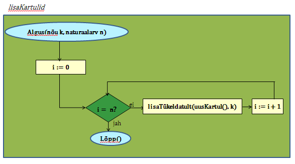

6. Algoritm ja plokkskeem
==========================

.. admonition:: Õpinipp:: Ära karda raskeid ülesandeid!

    TODO

.. todo::

    * tutvusta alternatiivsete lahenduste ja elegantsi/loetavuse teemat 

Struktuurse progemise skeem
http://www.freenetpages.co.uk/hp/alan.gauld/tutwhat.htm

TODO The skill of programming is in translating a dynamic algorithm into a static text. (http://www.i-programmer.info/professional-programmer/i-programmer/5180-trouble-at-code-school.html) The first step in programming isn't thinking up complex algorithms, it is in seeing the connection between simple algorithms and the equivalent text.

TODO: Arvude tuvastamise “jaga ja valitse” lahendus peaks olema õpikus, funktsioonide juures. Võibolla mingi pikema arutluse (case-study?) vormis.

Selles peatükis teeme väikese pausi uute Pythoni konstruktsioonide õppimisse ning vaatame juba läbitud teemasid veidi teise nurga alt.

Peale antud teema läbimist oskad:

    * selgitada algoritmi mõistet;
    * lihtsamate ülesannete korral esitada probleemi täpse püstituse, st välja selgitada algandmed ja nõutava tulemuse;
    * leida antud ülesande lahendamiseks kohased põhitegevused ja esitada nende täitmise järjekorra;
    * esitada lihtsamate ülesannete lahendust plokkskeemina.

Ülesanded ja nende lahendamine
--------------------------------------
Meie igapäevaelus tuleb ette suuri ja väikesi ülesandeid või probleeme. Mõned on lihtsad lahendada, teiste lahendamine pöörab kogu elu pahupidi (nt. arst avastab sinu lähedasel ravimatu haiguse). Mõnedele ülesannetele on olemas standardvastused, teiste korral tuleb neid alles hakata otsima. Mõned probleemid tunduvad huvitavana, mõned mitte. Ülesanded varieeruvad oma olemuselt matemaatilistest kuni filosoofilisteni (nt. Mis on elu mõte?). 

Vaatame nüüd mõnesid ülesandeid, millega võid kokku puutuda.

Näide 1. Dokumentideta võõras linnas
~~~~~~~~~~~~~~~~~~~~~~~~~~~~~~~~~~~~~~~~~~~
Kujutle end võõras linnas välisüliõpilanena. Saabudes ühiselamu juurde avastad, et ühiselamu võti, ID-kaart ja mobiiltelefon on kadunud. Kuidas lahendada olukord?

.. admonition:: Kommentaar 

    Antud ülesande püstitus tekitab palju küsimusi: kuhu need asjad võisid kaduda? Kas nad kadusid korraga? Millal nad viimati olemas olid? Kas ülikooli ruumidesse pääseb veel sisse, et neid sinna otsima minna? Selliseid küsimusi saab esitada veel ja seetõttu oleks väga raske lahendust üheselt määrata. Me võiksime ju proovida formuleerida kaotatud asjade leidmiseks mingi "retsepti" aga tõenäoliselt nõuab selle situatsiooni lahendamine ka *loovust*, st. oskust toimida ettenägematus olukorras.

Näide 2. Ruut ja ring
~~~~~~~~~~~~~~~~~~~~~~~~~~~~

Ringi sisse on joonistatud ruut, mille külje pikkus on a. Leida ringi pindala. 

.. admonition:: Kommentaar

    Siin on tegemist täpselt defineeritud geomeetriaülesandega. Peale ülesandest arusaamist on vaja lahendusplaani. On vaja välja selgitada sisend (ristküliku külg) ja väljund (ringi pindala) ja kasutada sobivat tähistust.  Edasi on vaja välja selgitada seos sisendi ja väljundi vahel, mis viib lahenduseni. See võib sisaldada vahepealsete tulemuste arvutamist, nt ristküliku diagonaali arvutamist. On vaja kasutada tasandilise geomeetria põhiteadmisi (antud juhul Pythagorase teoreemi). Täiendame joonist 

    .. image:: images/ring_ruut2.png

    ja esitame lahenduse kahe sammuna:

    .. centered::
        :math:`d=\sqrt{a^2+a^2}=\sqrt{2}a`
        :math:`S=\frac {\pi d^2}{4}= \frac {\pi a^2}{2}`

Näide 3. Hundi, kitse ja kapsa üle jõe viimine 
~~~~~~~~~~~~~~~~~~~~~~~~~~~~~~~~~~~~~~~~~~~~~~~~~~~~~
Mees peab ületama jõe paadiga, millesse mahub peale tema ainult üks kaaslane. Ta peab üle jõe viima hundi, kitse ja kapsapea. Mees peab tegutsema nii, et samal ajal, kui ta ise on paadiga jõel, ei sööks hunt ära kitse ega kits kapsapead. 

Leida ülesandele vähemalt üks lahendus.

.. admonition:: Kommentaar
    
    Seda tüüpi ülesanne sisaldab loogikat. Tulemuseks ei ole arvutatav väärtus nagu ülesandes 2, vaid rida käike, mis esitavad üleminekut algseisundist (kõik tegelased on ühel pool jõge) lõppseisundisse (kõik tegelased on teisel pool jõge). 

Näide 4. Pascal'i kolmnurk 
~~~~~~~~~~~~~~~~~~~~~~~~~~~
Joonisel on esitatud Pascal'i arvude kolmnurk

Äärmistel kohtadel on arv 1. Ülejäänute korral on väärtuseks kahe lähima arvu summa arvule vahetult ülemisel real. Kuidas arvutada kombinatsioonide arvu *n* elemendist *k* kaupa

.. centered::
    :math:`C_{k}^n=\frac {n!(n - k)!}{k!}`
    

kus 

.. centered::
    :math:`n!=1\cdot 2 \cdot 3 \cdot \ldots \cdot n`

kasutades Pascali kolmnurka?
Kuidas on Pascali kolmnurga arvud seotud kordajatega valemis  

.. centered::
    :math:`(x + y)^n`

peale valemi lahtikirjutamist?  

.. index::
    single: algoritm
    
.. _algoritm:    

Algoritm
---------
Ülalpool toodud näited illustreerivad olukordi, mis tekivad ülesannete lahendamisel. Arvutiteaduses tegeleme me probleemidega, mille lahendust saab esitada `algoritmina`. 

**Algoritmiks** nimetatakse probleemi lahendamiseks vajalikku instruktsioonide hulka, mida *mehhaaniliselt* (st. ilma loovust rakendamata) järgides on võimalik jõuda soovitud tulemuseni. Algoritmi kohta öeldakse tihti ka lihtsalt *protseduur*.

Algoritmil on neli olulist omadust:

1. Algoritmi iga samm peab olema *täpne*, st olema ühetähenduslik.
2. Algoritm peab olema *lõplik*. Vastasel juhul me ei saa probleemile lahendust.
3. Algoritm peab olema *efektiivne*, st ta peab andma probleemile korrektse vastuse.
4. Algoritm peab olema *üldine*, st ta peab lahendama ülesande iga eksemplari. Näiteks ringi pindala leidmise algoritm peab sobima kõigi võimalike algandmete jaoks.

Algoritme kasutatakse erinevate elukutsete juures. Näiteks kokk järgib algoritmi, mida nimetatakse retseptiks. Retsept kirjeldab protsessi, mis teisendab rea sammude abil toiduained (sisend) mingiks toiduks (väljund). 
 
.. note::

    Sõna *‘algoritm’* on tuletatud 9. sajandi Pärsia matemaatiku Mohammed al-Khowarizmi nimest. Tema nime ladinapärane kuju on *Algorismus*.

Algoritm ja arvuti
~~~~~~~~~~~~~~~~~~~~~~~~
Kuna algoritmi järgimine ei nõua loovust, siis on algoritme võimalik tõlkida arvuti jaoks arusaadavale kujule (programm) ja seega saab neid vajadusel käivitada arvutil. Sellest vaatenurgast võiksime anda algoritmile ka järgneva, veidi kitsama definitsiooni:

*Algoritm on täpselt defineeritud (arvutuslik) protseduur, mis koosneb instruktsioonide hulgast, millele antakse sisendina ette mingi väärtus või väärtuste hulk ja mis leiab väljundiks mingi väärtuse või väärtuste hulga. Teiste sõnadega, algoritm on protseduur, mis võtab andmed ja manipuleerib nendega, järgides ettekirjutatud samme ja leiab otsitavad väärtused.* 

.. image:: images/l04_fig8.png 

Algoritmi loomine
~~~~~~~~~~~~~~~~~~~~~~~~~~
Iga algoritmi saab kergesti kohandada selliseks, et tema *rakendamiseks* sobib masin. Seevastu algoritmide *loomiseks* on vaja midagi enamat.

Esimeses peatükis oli juttu programmeerimise olemusest. Sama kehtib ka algoritmide loomise juures -- tegemist on loomingulise protsessiga, kus läheb vaja samaaegselt konkreetsust (täpsust) ja üldistusvõimet (abstraktset mõtlemist). Algoritmide loomine on üks põhilisi tegevusi programmeerimise juures. Piisavalt täpselt formuleeritud algoritmi esitamine arvutiprogrammina on küllaltki lihtne, tuleb vaid jälgida vastava programmeerimiskeele sõnavara ja reegleid. 

Kuidas aga formuleerida algoritmi? Mõned ütlevad, et programmeerimine ja algoritmide loomine ongi üks ja sama. Tavapärases kõnepruugis siiski tehakse algoritmil ja programmil vahet: algoritm esitab mingi ülesande lahenduskäiku ilma tehnilistesse detailidesse laskumata (aga siiski ühetähenduslikult), programm on aga tavaliselt mõeldud mingi konkreetse masina (sh virtuaalse masina) juhtimiseks ja seetõttu võib sisaldada nüansse, mis on olulised vaid selle masina kasutamise korral.

Kaasaegsetes programmeerimiskeeltes (nt Python) ei ole masina nüanssidele eriti vaja mõelda, seetõttu kasutatakse programmeerimiskeeli juba algoritmide väljatöötamise faasis. Vahel on aga siiski mugavam panna algoritm esialgu kirja kuidagi teisiti, näiteks *pseudokoodina* (so. loomuliku keele ja matemaatiliste sümbolite segu) või mingi visuaalse *skeemina*. Järgnevalt uurimegi lähemalt ühte algoritmide skemaatilise esitamise viisi.

   

.. index::
    single: algoritmi esitus plokkskeemina
    
.. _plokkskeem:    

Plokkskeem
--------------------------------
Üks levinud graafiline notatsioon algoritmide esitamiseks on *plokkskeem*. Vaatleme järgnevalt plokkskeemis kasutatavaid kujundeid:

.. index::
    single: plokkskeem
    

.. image:: images/l04_fig9.png 

Kartulisalati tegemise plokkskeem
~~~~~~~~~~~~~~~~~~~~~~~~~~~~~~~~~~~~~~~~~~
Alustame praktilisest näitest - lihtsast kartulisalati valmistamisest, mille võib esitada järgmise plokkskeemina:

Üksi salatit valmistades on meil võimalik lisada kartuleid ühekaupa ja hapukoort ühe lusikatäie kaupa, samal ajal kontrollides, kas vajalik kogus on juba lisatud:

.. image:: images/l05_fig2.png

Korraldame loendamist pliiatsi ja paberiga, märkides igal lisamisel paberile ühe kriipsu. Peale kartulite lisamist kustutame kriipsud paberilt, et saaks loendada hapukurkide lisamist:

Arvutis me kasutamine loendamiseks muutujaid, hoides nendes näiteks loendamise jooksvat seisu. Loendamise algul peame loenduri seisu nullima.  

OLetame, et meil on juba olemas käsklused (funktsioonid), mis rakendamisel annavad meile vajaliku asja või toiduaine:

* ``tühiKauss()`` annab tühja kausi, 
* ``uusHapukurk()`` annab uue hapukurgi, 
* ``uusKartul()`` annab uue kartuli, 
* ``splKoort()`` annab supilusikatäie hapukoort,
* ``noaotsagaSoola()`` annab noa otsatäie soola, 
* ``maitseSisu()`` annab tagasi soolasuse maitse *m*, mille parajust saab hiljem kontrollida. 

Samuti oletame, et me saame kasutada olemasolevaid protseduure, millele asju ette andes tehakse ära mingi töö:

* ``lisaTükeldatult(a, k)`` lisab  aine *a* tükeldatult kaussi *k*, 
* ``segaSisu(k)`` segab kausis *k* olevad ained kokku.

Kasutades neid käsklusi, saame kartulisalati tegemise esitada järgmisel kujul:
 

Lihtsustame oma plokkskeemi selliselt, et anname uue kartuli, hapukurgi, supilusikatäie hapukoore ja noaotsatäie soola võtmise otse lisamise käsklustele, sest meil ei ole neid eraldi muutujates vaja rohkem kasutada:

Ülesande lahendamise protsess
-----------------------------------------------
Ülesande lahendamise arvutil võib jagada järgmisteks etappideks:

    #. Algoritmi koostamine ja esitamine.
    #. Programmi koostamine mingis konkreetses programmeerimiskeeles.
    #. Programmi sisestamine arvutisse.
    #. Programmi testimine ja silumine.
    #. Programmi käivitamine arvutis, andmete sisestamine ja tulemuse saamine arvutist.

Teeme need etapid läbi ringi pindala ülesande näitel:

    #. Esitame algoritmi plokkskeemina:

        .. image:: images/l04_fig20.png 

        Siin ülesande sisendiks on ruudu külje pikkus *a*. Märgime siinjuures, et jätsime vahele diagonaali arvutamise, sest ringi pindala *S* saame arvutada otse otse ruudu külje pikkuse kaudu. 

    #. Koostame programmi, kasutades programmeerimiskeelt Python:

        .. sourcecode:: py3

            from math import *

            a = int(input("Sisesta külje pikkus a: "))
            S = pi*a*a/2
            print("Kui ruudu külje pikkus on " + str(a) + ", siis ringi pindala on " +  str(S))

    #. Enamasti me teostame sammud 2 ja 3 korraga, st programmi koostamise käigus sisestame selle ka arvutisse.
    #. Selgub, et meie programm jääb hätta siis kui kasutaja ei sisesta midagi või sisestab külje pikkuse asemel midagi muud, nt "kuus". Seega saab öelda, et antud programm töötab vaid korrektse arvulise sisendi korral, vigase sisendi korral programmi töö lõpeb veaga.   
    #. Käivitame programmi konkreetse küljepikkuse jaoks ja leiame ringi pindala.  

Robotkilpkonn
--------------

Edasiseks harjutamiseks võtame appi ühe virtuaalse robotkilpkonna, mis suudab etteantud keskkonnas liikuda ja reageerida veel mõnedele lihtsatele käskudele. Oletame, et robotkilpkonn liigub ristkülikukujulisel mänguväljakul, mille mõõtmed pole teada:

 .. image:: images/l04_fig11.png 
 
Kilpkonn oskab sooritada järgmiseid tegevusi:

 .. image:: images/l04_fig12.png  
 
Harjutus 1. Kolm sammu edasi ja ümberpöörd
~~~~~~~~~~~~~~~~~~~~~~~~~~~~~~~~~~~~~~~~~~~~~~
 Robotkilpkonn asub näoga seina poole selliselt, et seinani on vähemalt 3 sammu. Kilpkonnal on vaja liikuda kolm sammu edasi ja pöörata näoga tuldud tee suunas (pöörata ümber).   

Lahenduse võib esitada järgmise plokkskeemina:

Harjutus 2. Kui võimalik, kolm sammu  edasi ja ümberpöörd 
~~~~~~~~~~~~~~~~~~~~~~~~~~~~~~~~~~~~~~~~~~~~~~~~~~~~~~~~~~~~~
Robotkilpkonn asub näoga seina poole ja ei ole teada, mitu sammu on seinani. Kilpkonnal on vaja liikuda kolm sammu edasi ja pöörata näoga tuldud tee suunas (pöörata ümber). Kui seinani on vähem kui kolm sammu, siis liikuda seinani ja pöörata ümber. 

Nüüd on lahendus juba veidi keerulisem:  

Harjutus 3. Ring ümber mänguväljaku 
~~~~~~~~~~~~~~~~~~~~~~~~~~~~~~~~~~~~~~~
Kilpkonn asub ruudustiku vasakus ülemises nurgas näoga paremale. Ruutude arv ei ole teada. Kilpkonnal on vaja läbi käia suurim ring ja jõuda esialgsesse positsiooni tagasi. Koostada plokkskeem.  

Harjutus 4. Liikumine takistusest mööda
~~~~~~~~~~~~~~~~~~~~~~~~~~~~~~~~~~~~~~~~~~~
Kilpkonn asub ruudustiku suvalisel ruudul. Ruutude arv ei ole teada. Ruudustikul võib olla sirge vahesein, mille otsad ei ulatu ruudustiku servani. Kilpkonnal on vaja liikuda ruudustiku selle välisseinani, mille poole ta näoga on. Koostada plokkskeem.  

.. hint:: 
    Antud ülesande korral võib olla olukord, kus takistus asub roboti ees

    .. image:: images/l04_fig18.png  

    või siis ei asu

    .. image:: images/l04_fig19.png  

.. note:: 

    Laadides alla väikese programmi, on võimalik kilpkonna liikumist modelleerivate plokkskeemide koostamist testida ka arvuti abil: http://www.physicsbox.com/indexrobotprogen.html

.. _triibuliseks:

Harjutus 5. Põranda värvimine triibuliseks
~~~~~~~~~~~~~~~~~~~~~~~~~~~~~~~~~~~~~~~~~~~~~~~~~
Oletame, et kilpkonnal on lisaks veel käsk ``värvi()``, mille saamisel värvib ta selle ruudu, kus ta parasjagu asub, tumedaks. Programmi alguses asub kilpkonn juhuslikul ruudul näoga põhja suunas. Ruudustik on ristkülikukujuline, ilma takistusteta. Ruudustiku täpne suurus pole teada.

Koosta plokkskeem, mis paneb kilpkonna värvima põrandat põhja-lõuna suunas triibuliseks -- alustada tuleks lääneservast, järgmine veerg põrandaruute peab jääma värvimata, ülejärgmine tuleb jälle värvida jne.

NB! proovi programmi läbi mängida nii paaritu- kui paarisarvulise laiusega ruudustiku korral.

Olge valmis, et see plokkskeem tuleb eelmistest omajagu suurem.

.. hint::

    Ülesande lahendamiseks tuleks valida kõigepealt strateegia, kuidas robotkilpkonn liigub ruudustikul. Üheks võimaluseks on variant, kus kilpkonn värvib ühe triibu ja liigub tuldud teed tagasi. Ta kordab värvimist järgmisel värvitaval veerul (üks veerg tuleb jätta vahele, et tulemus oleks triibuline). 
    

Alaprogrammid plokkskeemis
----------------------------------
Alamprogramme saab defineerida ka plokkskeemides. Selleks eraldatakse lihtsalt skeemil üks eraldiolev ala alamprogrammi jaoks (näiteks ümbritsetakse kastiga) ning kirjutatakse selle juurde alamprogrammi nimi.

Proovime nüüd koostada mõned alamprogrammide skeemid põranda värvimise plokkskeemi jaoks. NB! siin jaotame ülesande osadeks veidi teistest kohtadest, kui Pythoni näites, sellega demonstreerime, et alamülesannete väljaeraldamise viis on alati programmeerija valiku küsimus.

Loome kõigepealt alamprogrammid järgmistele tegevustele: 

* Ühe triibu värvimine robotkilpkonna liikumisel kuni seinani.
* Robotkilpkonna tagasitulek sama teed mööda seinani ja lõpuks pööre paremale.

Meeldetultuseks käsud, mida kasutasime roboti juhtimiseks plokkskeemis:

    * ``edasi()`` - kilpkonn liigub ühe sammu edasi;
    * ``paremale()`` - kilpkonn pöörab 90 kraadi võrra paremale;
    * ``värvi()`` - kilpkonn värvib ruudu, mille peal ta asub;
    * ``kasSein()``, kilpkonn annab tagasi kas ``jah`` või ``ei``, sõltuvalt sellest, kas vahetult tema ees on sein või mitte. 

Alamprotseduur ``triip()``

Tegevus: Robotkilpkonn värvib triibu kuni seinani.

Alamprotseduur ``tagasi()``

Tegevus: Robotkilpkonn pöörab ümber, liigub seinani ja lõpuks pöörab paremale.

Koostame nüüd plokkskeemi kogu mänguväljaku värvimiseks triibuliseks, kasutades juba koostatud protseduure:

Selline värvimine annab soovitava tulemuse, kuid lahendus sisaldab ülearust tühjalt liikumist lõunast põhja. Koostame nüüd sellise algoritmi, kus kilpkonn ei liigu tühjalt, vaid värvib ruudustikku ka liikumisel lõunast põhja. Selleks kasutame juba olemasolevat protseduuri ``triip`` ja koostame veel ühe protseduuri, mille abil kilpkonn pöörab vasakule:

Alamprotseduur ``vasakule()``

Tegevus: Robotkilpkonn pöörab vasakule.

Enne uue triibu värvimist peab kilpkonn lõunas pöörama kaks korda vasakule ja põhjas kaks korda paremale. Selle realiseerimiseks võtame appi loenduri *l*, mille abil saame kindlaks teha, kummale poole on vaja pöörata. Kui loendur jagub kahega, siis on vaja pööramisi vasakule, vastasel juhul paremale. Kogu värvimisprotseduur oleks järgmine:

.. image:: images/l05_fig18.png

Antud juhul robotkilpkonn liigub ökonoomsemalt, kuid algoritmile vastav plokkskeem on veidi keerulisem.  Algoritmi koostamisel tuleb arvestada ülesande püstituses olevaid nõudmisi.

Parameetrid plokkskeemis
~~~~~~~~~~~~~~~~~~~~~~~~~~~~~~ 
.. note:: 

    Järgnevates plokkskeemides on parameetritega koos antud ka parameetri tüüp. Sellist lähenemist kasutatakse mitmetes programmeerimiskeeltes (nt. Java), aga mitte Pythonis.

Tuleme tagasi eelmises peatükis alustatud kartulisalati teema juurde.

Kogu salatitegemise saame jaotada eraldiseisvateks tegevusteks: kartuli, hapukurgi, hapukoore ja soola lisamine. 
Kartulite lisamine: 

Paneme tähele, et kartulite lisamine protseduurile antakse ette nõu *k* ja naturaalarv *n*, mitu kartulit antud nõusse lisada.   
Järgmiseks protseduuriks on hapukurkide lisamine:

Hapukoore lisamine:

Soola lisamine:

Kasutades neid protseduure, saame kogu ülesande jaoks esialgsele skeemile sarnase skeemi:

Retseptikogudes antakse ette retsepti täitmise tulemusena valmiva toidu jaoks sööjate arv. Teeme seda siingi, oletades, et esialgne kogus oli mõeldud ühele inimesele ja muudame vastavalt kasutatavate koostisainete kogust. Seega *n* inimese tarbeks kartulisalati valmistamise algoritm näeks välja järgmine: 

Väärtusega alamprogrammid plokkskeemis
~~~~~~~~~~~~~~~~~~~~~~~~~~~~~~~~~~~~~~~~~~~
Siiani oleme plokkskeemidena esitanud ainult protseduure, mis muudavad küll süsteemi seisundit, aga otseselt midagi väljakutsujale tagasi ei anna. Näitena väärtusega funktsioonist esitame siin varemvaadeldud ülesannet ringi pindalast. Esitame  plokkskeemi funktsioonist, mis saab ette ruudu külje pikkuse ja annab väljakutsujale tagasi ringi pindala:

 
Esinevus siin eelmise ringi pindala plokkskeemiga seisneb selles, et lõpuplokis näidatakse tagastatavad andmed. Sisuline erinevus on selles, et nüüd on see alaprogramm universaalsem -- vastavalt soovile võime arvutatud pindala kas väljundisse anda või kasutada mingis avaldises.

Lisalugemist
------------

Kuna algoritmi koostamine on ülesande lahendamise kõige olulisem osa, siis on ülesannete lahendusprotsessi uuritud ka süstemaatiliselt. Üheks selle ala klassikuks võib lugeda Ungari matemaatikut George Pólyat, kes uuris ülesande lahendamise protsessi lähemalt ja avaldas oma kuulsa raamatu "Kuidas seda lahendada?". Oma raamatus toob ta välja neli etappi, millega ülesande lahendajal tuleb kokku puutuda. Esitame siinkohal tema kuulsa tsitaadi:

.. index::
    single: Pólya
    
.. _Pólya:    

George Pólya:

*Suur avastus lahendab suure probleemi, kuid väike avastus on olemas iga probleemi lahenduses. Sinu probleem võib olla tagasihoidlik, kuid kui see esitab väljakutse sinu uudishimule ja toob mängu sinu leiutaja omadused. Kui sa seda lahendad omaenda vahenditega, võid kogeda pingutust ja nautida avastuse triumfi. Sellised kogemused võivad vastuvõtlikus eas tekitada vajaduse vaimse töö järele ja jätta jälje terveks eluks.*

George Pólya selgitab oma raamatus ülesande lahendamise nelja etappi, mida soovitame ka antud kursuse ülesannete korral hoolikalt järgida. 

1. Ülesandest arusaamine
~~~~~~~~~~~~~~~~~~~~~~~~
* Mis on otsitavaks? Mis on antud? Milles seisnevad ülesande tingimused?
* Kas tingimusi on võimalik üldse rahuldada? Kas tingimused on otsitava tulemi määramiseks piisavad? Kas nende hulgas on ülearuseid? Kas tingimused on vastuolulised?
* Valmista joonis. Võta kasutusele sobiv tähistus.

2. Lahendamise idee ja sellele vastava plaani koostamine
~~~~~~~~~~~~~~~~~~~~~~~~~~~~~~~~~~~~~~~~~~~~~~~~~~~~~~~~
* Kas tead mõnd teist antud ülesandega seonduvat ülesannet?
* Vaatle otsitavat! Püüa meenutada mõnda tuntud ülesannet, milles on sama või sarnane otsitav.
* Kas on võimalik seda ülesannet ära kasutada? Kas peab sisse tooma mingi abielemendi, mis võimaldaks varem lahendatud ülesannet ära kasutada?
* Kas saab ülesannet teisiti sõnastada? Veel teisiti? Pöördu tagasi definitsiooni juurde.
* Kui sa ei suuda antud ülesannet lahendada, siis proovi lahendada kõigepealt mõni temaga seonduv ja võib-olla lihtsam ülesanne. Või üldisem ülesanne? Või erijuht? Või sarnane ülesanne? Jättes osa tingimustest kõrvale, kuivõrd on otsitav siis määratud?
* Kas kasutasid kõiki andmeid? Kas kasutasid kõiki tingimusi? Kas arvestasid kõiki ülesandes sisalduvaid mõisteid?

3. Lahendusplaani täitmine
~~~~~~~~~~~~~~~~~~~~~~~~~~
* Veendu iga sammu õigsuses.

4. Tagasivaade
~~~~~~~~~~~~~~
* Kas saad kontrollida tulemust? Kas saad kontrollida lahenduskäiku?
* Kas saad tulemust teisiti leida?
* Kas tulemus või lahenduskäik on kasutatav mõne teise ülesande korral?

Plokkskeemi ülesanded
--------------------------

.. note::

    Neid ülesandeid praktikumis ei kontrollita, aga need on soovitav siiski lahendada. Ülesandeid 1,2,3,4,6 saab lahendada ka Pykkariga.

1. Ring ümber mänguväljaku
~~~~~~~~~~~~~~~~~~~~~~~~~~~~~~~~~~~~~~~

Kilpkonn asub ruudustiku vasakus ülemises nurgas näoga paremale. Ruutude arv ei ole teada. Kilpkonnal on vaja läbi käia suurim ring ja jõuda esialgsesse positsiooni tagasi. Koostada plokkskeem.  Kasutada eelmise ülesande alamprotseduuri. 
 
2. Seinani ja tagasi
~~~~~~~~~~~~~~~~~~~~~~~~~~~~~~~~~
Kilpkonn asub näoga seina poole ja ei ole teada, mitu sammu on seinani. Kilpkonnal on vaja liikuda seinani, pöörata ümber ja liikuda tagasi samasse kohta algasendisse. Koostada plokkskeem.  

3. Liigu ettenähtud kohta
~~~~~~~~~~~~~~~~~~~~~~~~~~~~~~~~~~~~~~

Kilpkonn asub seinaga ümbritsetud ja ilmakaarte järgi orienteeritud ruudustiku mingil ruudul, ninaga itta. Kirjutada plokkskeemi kujul protseduurid, millega kilpkonn
a) liigub ruudustiku kirdenurka ja jääb seal pidama;
b) liigub ruudustiku edelanurka ja jääb seal pidama;
c) liigub ruudustiku äärele ja hakkab äärt pidi päripäeva ringiratast liikuma.

4. Loe tumedad laigud
~~~~~~~~~~~~~~~~~~~~~~~~~~~~~~~~~~
Kilpkonn asub ruudustiku loodenurgas näoga itta. Koostada plokkskeemi kujul funktsioon, mis loendab ruudustikul asuvad tumedad laigud. Ruudustiku mõõtmed pole teada. Kilpkonna juhtimiseks on lisaks veel operatsioon

``KasTumeLaik()`` - Kilpkonn kontrollib, kas ruut, millel asub kilpkonn, on tume.

.. image:: images/l05_fig19.png

Koostada abistavaid alamprotseduure.

.. note::

    Pykkari tumeda ruudu kontrollimise funktsioon on ``is_painted()``, tumeda ruudu tekitamiseks maailma kaardil tuleks kasutada sümbolit ``.``.

5. Istuta lilli
~~~~~~~~~~~~~~~~~~~~~~~~~~~~
Kilpkonn asub ruudustiku loodenurgas näoga itta. Koostada plokkskeem protseduuri jaoks, mis istutab ruudustikule lilli. Ruudustiku mõõtmed pole teada. Lill ei kasva äärel ega kontaktis teise lillega. Kilpkonna juhtimiseks on lisaks lille istutamise operatsioon:

``Istuta()`` - Kilpkonn istutab lille samale ruudule, kus ta parajasti asub, kusjuures kilpkonna orientatsioon pole oluline. 

Koostada abistavaid alamprotseduure.

6. Malelaud
~~~~~~~~~~~~~~~~~~~~~~~~

Kilpkonn asub ruudustiku loodenurgas näoga itta. Koostada plokkskeem protseduuri jaoks, mis värvib ruudustiku malelaua sarnaselt ruuduliseks. Ruudustiku mõõtmed pole teada. Koostada abistavaid alamprogramme.

7. Bankett
~~~~~~~~~~~~~~~~~~~~~~~

Kilpkonn  peab kontrollima, kas ühe ruudu laiuse,  põhja-lõunasuunaliselt paigutatud pika banketilaua ääres on iga koha juures tool. Kilpkonn seisab banketilaua põhjapoolses otsas. Laua pikkus on talle teadmata. Toolid peavad olema iga ruudu juures, ka laua põhja ja lõunaotsas. Kilpkonna juhtimiseks on lisaks järgmised operatsioonid: 

``KasLaud()`` - Kilpkonn kontrollib, kas kilpkonna nina ees on laud.

``KasTool()`` - Kilpkonn kontrollib, kas sellel ruudul, kus kilpkonn seisab, on tool.

.. image:: images/l05_fig22.png

Kilpkonn peab töö lõpetama samal ruudul, kust ta alustas. Koostada plokkskeemi kujul funktsioon. Koostada abistavaid alamprogramme.

