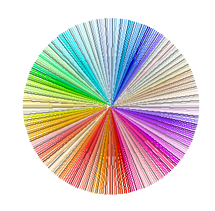

.. todo::

    * Ül: Kirjuta funkts on_palindroom näidete järgi
    * Käsurea argumendid (nt. käsurealt antud arvude keskmine)
    * mediaani arvutamine
    * Lisalugemiseks statistika?
    * http://www.openbookproject.net/thinkcs/python/english2e/ch10.html#exercises
    * http://www.openbookproject.net/thinkcs/python/english2e/ch11.html#exercises

8. Järjendid ja ``for``-tsükkel
=================================

Meie senistes programmides on iga andmejupp kuskil eraldi ära mainitud (nt. muutujana). Kui mõelda reaalsete programmide peale (nt. firma raamatupidamissüsteem), siis üldjuhul ei ole võimalik kõiki asjassepuutuvaid objekte (nt. töötajad või arved) programmis üksikult ära mainida, kuna selliste objektide hulk pole piiratud.

Selles peatükis õpite, kuidas käsitleda mitut objekti ühe kogumina ning mida taolise kogumiga Pythonis teha saab.

Järjendid
---------
Järjend (ing.k. *list*) on andmetüüp loetelude esitamiseks. Järjendi loomiseks on kõige lihtsam viis kirjutada järjendisse kuuluvad väärtused (e. järjendi *elemendid*) komadega eraldatult nurksulgude vahele: 

.. sourcecode:: py3

    pikad_kuud = [1, 3, 5, 7, 8, 10, 12]
    linnad = ['Tartu', 'Tallinn', 'Põltsamaa']
    
Me salvestasime muutujasse ``pikad_kuud`` ühe arvujärjendi (31-päevaliste kuude numbrid) ning muutujasse ``linnad`` ühe sõnejärjendi 3 sõnega.

.. TODO: skeem, kus järjendi elemendid on nummerdatud kastikesed

Operatsioonid järjenditega
~~~~~~~~~~~~~~~~~~~~~~~~~~
Kui me oleme järjendi kirja pannud, siis tekib loomulikult küsimus, mida sellega teha saab? Mõningaid põhioperatsioone demonstreerib järgnev programm:

.. sourcecode:: py3
    
    # järjendi loomine
    pikad_kuud = [1, 3, 5, 7, 8, 10, 12]
    
    # järjendit võib lihtsalt ekraanile kuvada
    print(pikad_kuud)
    
    # elementide arvu (e. järjendi pikkuse) leidmine
    arv = len(pikad_kuud)
    print('Aastas on ' + str(arv) + ' pikka kuud')
    
    # järjendisse kuulumise kontroll
    if 2 in pikad_kuud:
        print("Veebruar kuulub pikkade kuude hulka")
    else:
        print("Veebruar ei kuulu pikkade kuude hulka")

    # ühe elemendi väärtuse küsimine järjekorranumbri järgi
    # NB! järjekorranumbrid algavad 0-st!
    esimene_pikk_kuu = pikad_kuud[0]
    teine_pikk_kuu = pikad_kuud[1]
    print("Esimene pikk kuu on " + str(esimene_pikk_kuu) \
        + ", teine pikk kuu on " + str(teine_pikk_kuu))

Ilmselt märkasid kahte operatsiooni (``len`` ja ``in``), mida oled juba kasutanud sõnede puhul. Kuna sõnet saab vaadelda kui sümbolite järjendit, siis ongi Pythonis korraldatud nii, et paljud järjendioperatsioonid toimivad ka sõnedega.

Järgnev tabel demonstreerib olulisimaid järjendioperatsioone:

+----------------------------+------------------+---------------------------------+
| Avaldis                    | Väärtus          | Kommentaar                      |
+============================+==================+=================================+
| ``len([2, 1, 3, 16])``     | ``4``            | Elementide arv                  |
+----------------------------+------------------+---------------------------------+
| ``min([2, 1, 3])``         | ``1``            | Minimaalne element              |
+----------------------------+------------------+---------------------------------+
| ``max([2, 1, 3])``         | ``3``            | Maksimaalne element             |
+----------------------------+------------------+---------------------------------+
| ``sum([2, 1, 3])``         | ``6``            | Elementide summa                |
+----------------------------+------------------+---------------------------------+
| ``sorted([2, 1, 3])``      | ``[1, 2, 3]``    | Tagastab järjestatud järjendi   |
+----------------------------+------------------+---------------------------------+
| ``3 in [2, 1, 3]``         | ``True``         | Elemendi sisaldumine järjendis  |
+----------------------------+------------------+---------------------------------+
| ``[2, 1] + [3, 1]``        | ``[2, 1, 3, 1]`` | Järjendite liitmine             |
+----------------------------+------------------+---------------------------------+
| ``[2, 1, 3, 1].count(1)``  | ``2``            | Elemendi esinemiste arv         |
+----------------------------+------------------+---------------------------------+
| ``[1, 2] == [2, 1]``       | ``False``        | Elementide järjekord loeb       |
+----------------------------+------------------+---------------------------------+

NB! Nagu viimastest ridadest selgub, võib järjendis olla korduvaid väärtusi, ning elementide järjekord on oluline.
    
Harjutus 1. Järjendiavaldiste kasutamine
~~~~~~~~~~~~~~~~~~~~~~~~~~~~~~~~~~~~~~~~~~~~~~~~
Olgu meil defineeritud järgnevad järjendimuutujad:

    * ``a = [2, 3, 1, 5]``
    * ``b = [6, 4]``

Koosta muutujaid ``a`` ja ``b`` ning järjendioperatsioone kasutades avaldis, mille väärtuseks oleks järjend ``[1, 2, 3, 4, 5, 6]``.

Järjendi elementide küsimine e. indekseerimine
~~~~~~~~~~~~~~~~~~~~~~~~~~~~~~~~~~~~~~~~~~~~~~
Nagu esimeses näites juba mainitud, võimaldab Python küsida järjendimuutujast mingil konkreetsel positsioonil olevat elementi, kirjutades järjendi nime taga olevatesse nurksulgudesse soovitud elemendi positsiooni e. **indeksi** :

.. sourcecode:: py3
    
    pikad_kuud = [1, 3, 5, 7, 8, 10, 12]

    # küsi elemente indeksi järgi
    esimene_pikk_kuu = pikad_kuud[0] 
    teine_pikk_kuu = pikad_kuud[1]
    
    print("Esimene pikk kuu on " + str(esimene_pikk_kuu) \
        + ", teine pikk kuu on " + str(teine_pikk_kuu))

Ilmselt on pisut ootamatu aga see, et esimest positsiooni ei tähista mitte number ``1`` vaid ``0``, st. elementide nummerdamine algab 0-st. Selle omapäraga tuleb **indekseerimisel** (st. indeksi järgi elementide küsimisel) alati arvestada.

.. topic:: Miks alustatakse järjendi elementide nummerdamist 0-st? 

    Vanemates programmeerimiskeeltes oli taoline valik tingitud järjendite esitusviisist arvuti mälus. Teine põhjus on selles, et nii saab mõningaid keerulisemaid indekseerimisavaldisi veidi lühemalt kirja panna. Kolmas ja kõige olulisem põhus on see, et enamikus programmeerimiskeeltes on sedasi koguaeg tehtud ning väga paljud programmeerijad on harjunud taolise nummerdamisega. 
    
NB! indeksiks võime kasutada ka mingit täisarvulist muutujat. Seetõttu, kui kombineerime indekseerimise ``while``-tsükliga, siis saame iga järjendi elemendi ükshaaval ette võtta ja sellega midagi teha (nt. ekraanile kuvada):

.. sourcecode:: py3

    linnad = ['Tartu', 'Tallinn', 'Põltsamaa']
    
    i = 0
    while i < len(linnad):
        print("Linn indeksiga " + str(i) + " on " + linnad[i])
        i += 1

Sellel teemal me praegu pikemalt ei peatu, sest tuleb välja, et elementide ükshaaval läbivaatamiseks on olemas parem võimalus kui ``while`` tsükkel ja indekseerimine.

``for``-tsükkel
---------------
Lisaks ``while``-tsüklile on Pythonis veel üks tsüklitüüp -- ``for``-tsükkel, mis on oma olemuselt väga tihedalt seotud järjenditega.

Käivita järgnev näiteprogramm, mis koosneb ühest lihtsast ``for``-tsüklist:

.. sourcecode:: py3

    for linn in ["Tartu", "Tallinn", "Põltsamaa"]:
        print(linn)

Nagu näed, sarnaneb ``for``-tsükkel kuju poolest ``while``-tsüklile -- esimesel real on *päis*, mis määrab korduste korralduse ning edasi tuleb taandreaga esitatud *keha*, mis sisaldab lauseid, mida igal kordusel käivitatakse.

``for``-tsükli kordused põhinevad mingil etteantud järjendil -- antud näites on selleks kolme linna nimest koosnev järjend. Igal kordusel küsitakse järjendist üks element, salvestatakse tema väärtus *tsüklimuutujasse* (antud näites ``linn``) ning seejärel käivitatakse tsükli kehas olevad laused. Elemente loetakse järjendist järjekorras, st. esimesel kordusel esimene element jne. Kui kõik elemendid on sedasi läbi käidud, siis on tsükli töö tehtud -- seega käivitatakse tsükli keha niipalju kordi kui on järjendis elemente.

Järjendite töötlemine
---------------------
Paljude ülesannete puhul on vaja antud järjend elementhaaval läbi vaadata ning koguda sealjuures mingit infot. Järgnevas näites on defineeritud funktsioon, mis leiab etteantud arvujärjendi elementide hulgast suurima:

.. sourcecode:: py3

    def suurim_element(arvud):
        # alustuseks oletame, et esimene element on suurim
        seni_suurim = arvud[0]
        
        # hakkame järjendit läbi vaatama
        # kui leiame seni leitust veel suurema, siis uuendame muutuja väärtust
        for arv in arvud:
            if arv > seni_suurim:
                seni_suurim = arv
        
        # kui kõik arvud on läbi vaadatud, siis ongi abimuutujasse jäänud õige vastus
        return seni_suurim
    
    # Katsetame seda funktsiooni.
    # Nagu näha, järjendit, nagu iga teist väärtust, saab anda argumendiks
    s = suurim_element([8, 45, 12, 331, 123])
    
    print("Suurim element on " + str(s))

Sellise töötlemise juures kasutatakse enamasti abimuutujat, mida nimetatakse *akumulaatoriks* ja millesse kogutakse samm-sammult infot läbivaadatud järjendi osa kohta. Antud näite käivitamisel on igal tsükli sammul muutuja ``seni_suurim`` väärtuseks läbivaadatud elementide hulgast suurim.

Tegelikult on Pythonisse juba sisse ehitatud mitmeid funktsioone, mis koguvad etteantud järjendi kohta mingit infot. Näiteks funktsioon ``max`` teeb sama, mis meie eelmise näite funktsioon. Selles peatükis aga üritame taolisi funktsioone ise "leiutada", et õppida järjendeid ning ``for``-tsüklit paremini tundma.

Harjutus 2. Elementide summa
~~~~~~~~~~~~~~~~~~~~~~~~~~~~~
Kirjuta funktsioon ``elementide_summa``, mis võtab argumendiks arvujärjendi ning tagastab kõigi elementide summa. (Selle jaoks on küll Pythonis juba olemas funktsioon ``sum``, aga ära praegu seda kasuta).

NB! Erinevalt suurima elemendi leidmise funktsioonist, peaks summa funktsioon töötama ka tühja järjendiga, st. ``elementide_summa([])`` peaks andma vastuseks ``0``.

.. hint::
    
    Jälgi eelmise näite skeemi -- hoia akumulaatoris seni läbivaadatud summat ning igal tsükli sammul uuenda akumulaatorit. Samuti mõtle, mis on antud ülesande juures sobiv akumulaatori algväärtus.

Lõpuks kontrolli, kas sinu funktsioon annab samade järjendite puhul sama tulemuse, mis Pythoni funktsioon ``sum``.    
    

Failist lugemine
-----------------
Tuleb välja, et ``for``-tsükkel on väga mugav ka failist lugemiseks:

.. sourcecode:: py3

    f = open('andmed.txt')
    
    for rida in f:
        print('Lugesin järgneva rea: ' + rida)
    
    f.close()

Selle näidet kommenteerides võiks lihtsustatult öelda, et:

    #. funktsioon ``open`` tagastab failis sisalduvad read sõnejärjendina ...
    #. ... mis salvestatakse muutujasse ``f`` 
    #. ``for``-tsükkel käib selle järjendi elemendid ükshaaval läbi.

Tegelikult ei ole muutujas ``f`` siiski mitte järjend, vaid natuke keerulisem väärtus. Õnneks oskab ``for``-tsükkel käsitleda seda väärtust justkui järjendit, seetõttu ei pea me muretsema, kuidas need faili read on tegelikult esitatud.

Harjutus 4. Temperatuuride lugemine failist
~~~~~~~~~~~~~~~~~~~~~~~~~~~~~~~~~~~~~~~~~~~
Kirjuta programm, mis loeb tekstifailist ükshaaval Celsiuse skaalas esitatud temperatuure (iga arv on antud eraldi real) ning väljastab need ekraanile koos vastavate väärtustega Fahrenheiti skaalas.

.. hint:: 
    Meeldetuletus: Justnagu ``input`` käsu puhul, saame ka tekstifailist lugedes sisendi alati tekstina, seetõttu tuleb antud ülesandes teisendada algandmed enne kasutamist arvudeks.

Funktsioon ``range``
--------------------
Vaatame nüüd pisut teistsuguse ilmega ``for``-tsükli näidet:

.. sourcecode:: py3

    for i in range(10):
        print(i)

Selle programmi käivitamisel ilmuvad ekraanile numbrid *0..9*. Selleks, et antud näitest paremini aru saada, proovi käsureal läbi järgnev näiteavaldis:

.. sourcecode:: py3

    >>> list(range(5))
    [0, 1, 2, 3, 4]

Avaldis ``range(5)`` genereerib ühe järjendit meenutava väärtuse -- nimelt *vahemiku*. Funktsioon ``list`` teisendas selle väärtuse päris järjendiks, mis sisaldab täisarve *0..4*.

Nüüd peaks olema selge, miks meie ``for``-tsükli näide sedasi käitus -- ``range(10)`` genereerib vahemikku *0..9* kujutava väärtuse ja kuigi tegemist pole päris järjendiga, oskab ``for``-tsükkel seda käsitleda justkui järjendit. Edasi toimub kõik samamoodi nagu varem kirjeldatud -- "pseudo-järjendist" loetakse ükshaaval elemente, mis salvestatakse kordamööda tsüklimuutujasse ``i`` ning igal kordusel käivitatakse tsükli kehas olevad laused.

.. note::

    Mõnikord läheb meile korda ainult see, mitu korda tsükli keha on vaja korrata, st. tsüklimuutuja konkreetsete väärtuste vastu me huvi ei tunnegi. Järgnev ruudu joonistamise näide peaks olema tuttav kolmandast peatükist, ainult, et seekord kasutame me ``while``-tsükli asemel ``for``-tsüklit:

    .. sourcecode:: py3
        
        from turtle import *
        
        for i in range(4):
            forward(100)
            left(90)

        exitonclick()

    Kuigi me muutuja ``i`` väärtust ei kasutanud, siis Pythoni süntaks nõuab ikkagi selle muutuja kirjapanekut.

Harjutus 3. Kilpkonn tsüklis
~~~~~~~~~~~~~~~~~~~~~~~~~~~~~
Proovi ennustada, mida joonistab järgmine programm:

.. sourcecode:: python

    from turtle import *
    
    for i in range(30) :
        forward(i * 2)
        left(90)
    
    exitonclick()

.. topic:: Selgitus

    Nagu näed, joonistub ekraanile kandiline spiraal. Kuidas see programm aga kilpkonna abil sellise tulemuseni jõuab?

    Tegelikult on antud programmi puhul üldine seletus lihtne:

    * ``for i in range(30)`` ütleb, et talle järgnevat koodiblokki (taandatud ridasid) tuleb korrata 30 korda, kusjuures esimest korda on selle bloki jaoks ``i`` väärtus 0, siis 1, siis 2 jne. kuni 29-ni välja.
    * Esimesel kordusel, kui i=0, ei liigu kilpkonn üldse edasi, kuid pöörab 90 kraadi vasakule (nina üles suunda).
    * Teisel kordusel, kui i=1, liigub kilpkonn kaks (``i*2``) sammu edasi (üles), ning siis 90 kraadi vasakule (nina nüüd vasakus suunas).
    * Kolmandal kordusel, kui i=2, liigub kilpkonn 4 sammu edasi (vasakule) ja siis pöörab jälle 90 kraadi vasakule (nii et nina on nüüd alla suunatud).
    * jne kuni i=29 -ni.

    Et iga kord on joonistatav lõik eelmisest pikem, tekibki selle tsükli tulemusena kandiline spiraal.

Katseta erinevaid pööramise nurki ning erinevaid teepikkusi. Proovi joonistada kuuekandiline spiraal!

``range``'i variandid
~~~~~~~~~~~~~~~~~~~~~
Funktsiooni ``range`` saab kasutada ka 2 või 3 argumendiga. Järgnevas käsurea näites kasutame jälle ``list`` funktsiooni, et näha, mida mingi ``range`` variant tähendab:

.. sourcecode:: py3

    >>> list(range(5))
    [0, 1, 2, 3, 4]
    >>> list(range(0, 5))
    [0, 1, 2, 3, 4]
    >>> list(range(2, 5))
    [2, 3, 4]
    >>> list(range(0, 15, 2))
    [0, 2, 4, 6, 8, 10, 12, 14]
    >>> list(range(5, 0, -1))
    [5, 4, 3, 2, 1]
    >>> list(range(0, 5, 1))
    [0, 1, 2, 3, 4]

Kommentaarid:

    * ühe argumendiga variandi puhul algab loetelu 0-st ning lõpeb *enne* näidatud argumendi väärtuseni jõudmist
    * kahe argumendi puhul algab loetelu esimese argumendi väärtusest ja lõpeb *enne* teise argumendini jõudmist
    * kolme argumendi puhul näitab kolmas argument väärtuste kasvamise sammu

Harjutus 4. Kolmega jaguvad arvud
~~~~~~~~~~~~~~~~~~~~~~~~~~~~~~~~~
Kirjuta ``for``-tsükkel koos sobiva ``range`` variandiga, mis kuvab ekraanile kõik 3-ga jaguvad arvud vahemikus 10 kuni 100.

Harjutus 5. ``range`` avaldis
~~~~~~~~~~~~~~~~~~~~~~~~~~~~~~
Kirjuta avaldis kujul ``list(range(...))``, mis tagastaks järgmise järjendi:

 ``[100, 93, 86, 79, 72, 65, 58, 51, 44, 37, 30, 23, 16]``

``for`` vs. ``while``
---------------------
Tegelikult saaks ``for``-tsükli asemel alati kasutada ka ``while``-tsüklikt, aga tulemus poleks alati nii selge. Võrdleme omavahel samaväärseid ``while`` ja ``for``-tsükleid:

+----------------------------------+-----------------------------------+
| .. sourcecode:: py3              | .. sourcecode:: py3               |
|                                  |                                   |
|     i = 0                        |     for i in range(10)            |
|     while i < 10:                |         print(i)                  |
|         print(i)                 |                                   |
|         i += 1                   |                                   |
+----------------------------------+-----------------------------------+

Kui meenutad kolmandat peatükki, siis selleks, et ``while`` tsükliga teha mingit toimingut *n* korda, tuleb:

    * võtta kasutusele abimuutuja (loendur) algväärtusega 0
    * tsükli kehas suurendada muutuja väärtust igal kordusel
    * tsükli päises kontrollida, et loenduri väärtus on väiksem kui *n*

Nagu näha, annab ``for``-tsükkel koos ``range``-ga sama tulemuse palju lihtsamalt -- tsüklimuutuja algväärtustamine, selle suurendamine ja tsükli lõpetamise kontrollimine toimuvad kõik automaatselt. Seetõttu ongi soovitav loenduril põhinevad tsüklid kirjutada ``for``-tsüklina.

Samas, mõnede probleemide lahendamisel ei piisa ``for``-tsüklist. Näiteks kolmandas peatükis kirjeldatud arvamismängu ei saa ``for``-tsükliga kirja panna. Seetõttu ongi Pythonis kaks erinevat korduslauset -- paindlik, aga pisut tülikas ``while``-lause ning mugav, aga teatud juhtudel ebasobiv ``for``-lause.

Veel järjendioperatsioone
-------------------------
    

Sõne kui järjend
~~~~~~~~~~~~~~~~
Nagu eespool juba mainitud, saab sõnet käsitleda justkui sümbolite järjendit:

.. sourcecode:: py3

    sõne = 'Tere'
    print(sõne[0])
    
    for täht in sõne:
        print(täht)

Selleks, et sõnet muuta päris järjendiks, saab kasutada funktsiooni ``list``:
    
.. sourcecode:: py3

    >>> list('Tere')
    ['T', 'e', 'r', 'e']

Meetodid ``split`` ja ``join``
~~~~~~~~~~~~~~~~~~~~~~~~~~~~~~
Tihti on tarvis teha mingi sõne pisut suuremateks juppideks kui üksikud tähed -- näiteks võib olla vaja jagada sõnena esitatud lause eraldi sõnadeks. Selle jaoks saab kasutada sõnemeetodit ``split``:

.. sourcecode:: py3

    >>> 'Tere hommikust'.split()
    ['Tere', 'hommikust']
    >>> 'CY2X44;3;66;T'.split(';')
    ['CY2X44', '3', '66', 'T']

Kui ``split``-i kasutada ilma argumentideta, siis tehakse "lõikamine" tühikute, tabulaatorite ja reavahetuste kohalt. Kui anda ette mingi muu sümbol, siis lõigatakse sõne juppideks just selle sümboli kohalt. 

Sama operatsiooni saab "ümber pöörata" meetodiga ``join``:

.. sourcecode:: py3

    >>> ' '.join(['Tere', 'hommikust'])
    'Tere hommikust'
    >>> ';'.join(['CY2X44', '3', '66', 'T'])
    'CY2X44;3;66;T'

Harjutus 6. Kuupäeva "lahtiharutamine"
~~~~~~~~~~~~~~~~~~~~~~~~~~~~~~~~~~~~~~
Kirjuta funktsioon ``kuu``, mis võtab argumendiks sõne kujul *<päev>. <kuu> <aasta>* (nt. ``'24. veebruar 1918'`` ning tagastab vastava kuu nime.

Negatiivsed indeksid
~~~~~~~~~~~~~~~~~~~~
Järjendeid (ja sõnesid) saab indekseerida ka negatiivsete indeksitega, sel juhul hakatakse lugema järjendi lõpust:

.. sourcecode:: py3

    >>> sõne = 'Tere'
    >>> sõne[-1]
    'e'
    >>> sõne[-2]
    'r'
    >>> sõne[-3]
    'e'
    >>> sõne[-4]
    'T'

Avaldis ``järjend[-0]`` tähistab siiski esimest elementi, sest *-0 = 0*.

Järjendite "viilutamine"
~~~~~~~~~~~~~~~~~~~~~~~~
.. todo::

    tee skeem, kus indeksid asuvad tähtede vahel. vt. http://www.openbookproject.net/thinkcs/python/english2e/ch07.html#string-slices

Kirjutades nurksulgudesse indeksi asemel *indeksivahemiku* on järjendist (ja sõnedest) võimalik võtta alamjärjendeid (alamsõnesid):

.. sourcecode:: py3

    >>> a = ['a', 'b', 'c', 'd', 'e', 'f']
    
    >>> a[0:2]
    ['a', 'b']
    >>> a[:2]
    ['a', 'b']
    
    >>> a[2:6]
    ['c', 'd', 'e', 'f']
    >>> a[2:]
    ['c', 'd', 'e', 'f']

    >>> a[-2:]
    ['e', 'f']
    
    >>> s = "Tere"
    >>> s[0:3]
    'Ter'

Koolonist vasakule tuleb kirjutada see indeks, millest alates tuleb elemente tulemusse kopeerida, ning koolonist paremale see indeks, mille juures tuleb kopeerimine lõpetada (st. selle indeksiga element jääb tulemusest välja). Kui vasak indeks jätta kirjutamata, siis alustatakse esimesest elemendist ja kui parem indeks jätta kirjutamata, siis kopeeritakse kuni järjendi lõpuni (viimane element kaasaarvatud).

Mida võiks tähendada ``s[:]``?

Valed indeksid
~~~~~~~~~~~~~~~~~~
Proovi läbi järgnev näide, et sa tunneksid saadud veateate edaspidi ära:

.. sourcecode:: py3

    a = ['a', 'b', 'c']
    print(a[66])

Harjutus 7. Sõne viilutamine
~~~~~~~~~~~~~~~~~~~~~~~~~~~~
Kirjuta funktsioon ``kaja``, mis võtab argumendiks sõne, ning tagastab selle sõne 3 viimast tähte. Kui sõnes on vähem kui 3 tähte, siis tagastada terve sõne.

Ennikud
---------------------
Ennik (ing.k. *tuple*) on Pythoni andmetüüp, mis on väga sarnane järjendile. Ainsaks sisuliseks erinevusteks on see, et ennikut ei saa muuta -- st. ennikusse ei saa ``append`` meetodiga elemente lisada ega olemasolevaid elemente muuta. Ennikud kirjutatakse ümarsulgude vahele, aga nende indekseerimiseks kasutatakse siiski nurksulge:

.. sourcecode:: py3

    punkt = (3, 8)
    print("Punkti x-koordinaat on:", punkt[0])
    print("Punkti y-koordinaat on:", punkt[1])
    
    andmed = ("Peeter", "Paun", 1967)
    print("Eesnimi:", andmed[0])
    print("Perenimi:", andmed[1])
    print("Sünniaasta:", andmed[2])

Tegelikult saaksime alati ennikute asemel kasutada ka järjendeid, aga heaks tavaks on kasutada järjendeid vaid neil juhtudel, kus kogumi elemendid on kõik ühte tüüpi.

Ennikuid võiks eelistada siis, kui meil on mingi kindel komplekt elemente, mida me tahame koos käsitleda, kusjuures iga element võib olla erinevat tüüpi.

.. note::

    Mingit 3-elemendilist kogumit nimetatakse tavaliselt *kolmikuks*, 4-elemendilist *nelikuks* jne. Enniku nimi on tulnud selle skeemi üldistamisest: *n*-elemendilist kogumit nimetatakse *ennikuks*.

Mitme väärtuse tagastamine funktsioonist
~~~~~~~~~~~~~~~~~~~~~~~~~~~~~~~~~~~~~~~~
Ennikuid kasutatakse tihti siis, kui funktsioonist on vaja tagastada mitut väärtust:

.. sourcecode:: py3

    def loe_andmed(failinimi):
        nimed = []
        sünniaastad = []
        
        f = open(failinimi)
        for rida in f:
            jupid = rida.split()
            nimed.append(jupid[0])
            sünniaastad.append(jupid[1])
        
        f.close()
        
        # tagastan kaheelemendilise enniku
        return (nimed, sünniaastad)

    # salvestan enniku komponendid muutujatesse
    (meeste_nimed, meeste_sünniaastad) = loe_andmed("mehed.txt")
    (naiste_nimed, naiste_sünniaastad) = loe_andmed("naised.txt")
    
    print(meeste_nimed)
    print(naiste_sünniaastad)

Näite lõpp näitab, et enniku komponente saab omistamise süntaksi abil salvestada muutujatesse. (Alternatiivina võiksime kasutada ka indekseerimist).

.. note::

    Taolist ennikutega omistamise trikki kasutatakse mõnikord ka 2 muutuja väärtuste vahetamiseks:
    
    .. sourcecode:: py3
    
        x = 1
        y = 2
        
        x, y = y, x
        
        print(x)
        print(y)
        
    See näide demonstreerib veel seda, et teatud juhtudel on lubatud enniku ümbert sulud ära jätta.

*Vahepala: Sõnede ja väljundi formaatimine*
---------------------------------------------
Seni oleme sõnede ja teiste andmetüüpide kombineerimisel kasutanud komponentide ühendamiseks operatsiooni ``+`` ning teisendamiseks funktsiooni ``str``. Nüüd vaatame alternatiivset viisi selle toimingu tegemiseks.

Sõnedel on olemas meetod ``format``, millega saab teisendada andmeid erinevatele sõnekujudele. Selle meetodi põhiolemust demonstreerib järgnev käsurea näide:

.. sourcecode:: py3

    >>> eesnimi = "Kalle"
    >>> perenimi = "Kala"
    >>> vanus = 25
    >>> 'Klient: {0} {1}, vanus: {2}'.format(eesnimi, perenimi, vanus)
    'Klient: Kalle Kala, vanus: 25'

Meetod ``format`` konstrueerib tulemuse (uue sõne) mitmest komponendist: esimeseks komponendiks on lähtesõne, mis sisaldab muuhulgas loogeliste sulgudega tähistatud "pesasid" (ing.k. `placeholders`); ülejäänud komponentideks (st. meetodi argumentideks) on suvalised väärtused, mis kopeeritakse vastavatesse pesadesse.

Pesa kirjeldus on kõige lihtsamal juhul täisarv, mis näitab, mitmes argumentväärtus tuleb antud pesasse panna. Seejuures tuleb arvestada, et loendamist alustatakse `0`-st. 

Pesa kirjeldusse saab märkida ka lisatingimusi andmete formaadi kohta:

.. sourcecode:: py3
    
    pikkused = [173.235235, 33.0, 167.333]

    for i in range(len(pikkused)):
        pikkus_sõnena = "{0}. pikkus on {1:>6.2f}cm".format(i, pikkused[i])
        print(pikkus_sõnena)

Hakkame jupphaaval analüüsima pesa ``{1:>6.2f}`` tähendust:

    * koolonist vasakul on pesa järjekorranumber
    * ``>6`` näitab, et sisu esitamiseks on ette nähtud 6 positsiooni ja kui tegelik sisu võtab vähem ruumi, siis tuleb nihutada sisu ette panna niipalju tühikuid, et kokku saaks 6 sümbolit
    * ``.2f`` ütleb, et vastavat väärtust tuleb tõlgendada ujukomaarvuna (`f` nagu `float`), mis tuleb esitada 2 komakohaga.
    
.. note::

    | ``format`` meetodi teiste võimalustega saab tutvuda aadressil:    
    | http://docs.python.org/py3k/library/string.html#format-examples

Ülesanded
-------------

1. Paarisarvude loendamine
~~~~~~~~~~~~~~~~~~~~~~~~~~~~~~~~
Kirjuta funktsioon, mis võtab argumendiks täisarvude listi, ning tagastab, mitu elementi antud listis olid paarisarvud.

Testi oma funktsiooni erinevate listidega (sh. tühja listiga).

2. Ruudud
~~~~~~~~~~~~~~~~~~
Kirjuta programm, mis küsib sisendiks täisarvu ning väljastab ``for``-tsükli abil kõikide arvude ruudud alates 1-st kuni sisestatud arvuni (kaasaarvatud) ja lõpuks ka kõigi nende ruutude summa.

3. Teksti esitamine
~~~~~~~~~~~~~~~~~~~~
Kirjuta programm, mis küsib kasutajalt failinime ning ``for``-tsüklit kasutades kuvab faili sisu ekraanile.

Seejärel täienda programmi sedasi, et teksti näidatakse 20 rea kaupa -- st. iga kord peale 20 rea näitamist jääb programm ootama kasutajapoolset ENTER-i vajutust (vihje: ``input()``).

Testimiseks võib alla laadida nt. "Alice in Wonderland" teksti aadressilt http://www.gutenberg.org/files/11/11.txt.

4. Kuupäevade töötlemine
~~~~~~~~~~~~~~~~~~~~~~~~
.. note::

    Selle ülesande lahendamisel tuleks abifunktsioonidena kasutada 6. peatükis loodud funktsioone.

Kirjuta funktsioon ``korrasta_kuupäev``, mis võtab argumendiks ühe sõnena esitatud kuupäeva (nt. ``'24.02.1918'``), ning tagastab kuupäeva kujul `<päev>. <kuu nimi> <aasta>` (nt. ``'24. veebruar 1918'``). 

Etteantud sõnes võib olla kuupäeva osade vahel kasutatud ka sidekriipse. Sel juhul tuleb tõlgendada kuupäeva kujul *<aasta>-<kuu>-<päev>* (nn. *ISO formaat*). NB! Tagastatav kuupäev peab olema ikkagi kujul `<päev>. <kuu nimi> <aasta>`.

Kui etteantud kuupäev on arusaamatul kujul või kui pole tegemist legaalse kuupäevaga, siis tagastada vastav veateade. Eeldame, et etteantud sõnes on kuu antud alati numbriga.

.. topic:: Soovituslik lisaülesanne

    Kui osade vahel on kaldkriipsud, siis eeldame, et tegemist on USA formaadiga: *<kuu>\/<päev>\/<kahekohaline aasta>*. Uuri välja, kuidas kahekohalisi aastaid tõlgendatakse (nt. *12\/25\/10* vs. *12\/25\/97*).

5. Värvid
~~~~~~~~~~~~~~~~~~~~~~
Aadressilt http://wiki.tcl.tk/16166 leiate loetelu värvinimedest, mida ``turtle`` moodul tunnistab (mitmesõnalised värvinimed on pandud loogeliste sulgude vahele, neid võid lihtsuse mõttes ignoreerida). Kirjuta programm, mis kilpkonna abil näitab võimalikult suurt osa neist värvidest, näiteks värvid antud loetelu keskosast, kus pole mitmesõnalisi nimesid:

Võite proovida ka paigutada värvid hõredamalt ja kirjutada iga värvi juurde tema nime (vt. http://docs.python.org/py3k/library/turtle.html#turtle.write).

Otsi võimalusi rakendada selle peatüki uusi teemasid (``for``, ``split``).

NB! ülesande saab lahendada ilma mingi rutiinse "käsitööta"!

.. hint::

    http://docs.python.org/py3k/library/turtle.html#turtle.pencolor

.. hint::

    .. sourcecode:: py3
    
        nimed_sõnena = """Mari Kalle Malle
        Jüri Peeter Toomas Olev
        Kaur Jaanus Jaan"""
        
        nimed_listina = nimed_sõnena.split()
        
        for nimi in nimed_listina:
            ...

6. Keskmise hinde leidmine
~~~~~~~~~~~~~~~~~~~~~~~~~~~~~~~~~~~
Olgu meil fail nimega ``hinded.txt``, kus on igal real üks hinne (vahemikus 1 kuni 5). Kirjuta programm, mis arvutab nende hinnete keskmise. (Ära unusta, et failist ridade sisselugemisel antakse read sõnedena, mitte arvudena).

Kui oled programmi tööle saanud, siis muutke programmi põhiosa funktsiooniks, mis **võtab argumendiks** failinime ning **tagastab** failis olevate hinnete keskmise.

Lisalugemine
------------
Paroolide murdmine
~~~~~~~~~~~~~~~~~~
Järgnev näide demonstreerib jõumeetodil paroolide murdmise põhiideed.

Turvalisuse huvides salvestatakse infosüsteemides kasutajate paroolide asemel ühesuunalise krüpteerimismeetodiga saadud *räsikoode*. Kuigi räsikoodist pole otseselt võimalik parooli tuletada, tuleks seda siiski võõraste eest kaitsta, sest pahalane võib proovida krüptida sama meetodiga palju erinevaid paroole ning kui tulemuseks on sama räsikood, siis on ka parool teada.

Vali mingi inglisekeelne, väikeste tähtedega sõna parooliks, ning koosta sellest MD5 räsikood, kasutades vormi aadressil: http://www.miraclesalad.com/webtools/md5.php

Lae alla inglisekeelsete paroolide nimekiri aadressilt http://www.apasscracker.com/dictionaries/ ning paki zip failis olev tekstifail lahti.

Järgnev programm küsib kasutajalt MD5 räsikoodi, ning otsib paroolisõnastikust sobivat vastet. Edu korral näidatakse parool ekraanile.

.. sourcecode:: py3

    import hashlib

    räsi = input("Sisesta parooli MD5 räsi: ")
    f = open("english.dic", encoding="latin_1")

    # esialgu veel pole midagi leidnud
    tulemus = "Ei leidnud parooli"

    for rida in f:
        # strip eemaldab rea lõpust reavahetuse
        parool = rida.strip()
        
        if hashlib.md5(parool.encode('ascii', 'ignore')).hexdigest() == räsi:
            tulemus = "Vastav parool on: " + parool
            break # edasi pole vaja vaadata

    # faili me enam ei vaja
    f.close()

    print(tulemus)
    
Tegelikkuses ei lähe paroolide murdmine siiski nii libedalt -- esiteks piirasime end praegu vaid väikeste tähtedega paroolidega ja teiseks, reaalselt kasutatavad krüptimismeetodid on palju aeglasemad, kui meie kasutatud *MD5*.

Kilpkonna keel ja interpretaator
~~~~~~~~~~~~~~~~~~~~~~~~~~~~~~~~~~~~~~~~    
Kilpkonnaga Pythoni käsureal joonistamine on üpris lõbus, kuid muutub pikkade käskude tõttu kähku tüütuks. Arvutid on aga just mõeldud tüütute ülesannete automatiseerimiseks ja lihtsustamiseks. See motiveerib ka järgnevat ülesannet.

Antud on fail, kus igal real on kilpkonna käsk – täht ja selle järel number, näiteks:

.. sourcecode:: none

    F 100
    L 90
    B 100
    R 120

Kirjutada programm, mis loeb sisse vastava faili ja edastab need käsud kilpkonnale, lastes sellel joonistada siis neile vastava kujundi.

Programm ise on tegelikult üsna lihtne:

.. sourcecode:: py3

    import turtle

    # Faili avamine
    file = open("Kilpkonn.txt","r")

    # Faili töötlemine ja kilpkonnaga joonistamine
    while True:
        rida = file.readline()
        # Katkesta viimase rea puhul
        if rida == "" :
            break

       

        # Teisenda käsk kaheks komponendiks
        kask = rida.split()
        tyyp = kask[0]
        param = int(kask[1])

        if tyyp == "L" :
            turtle.left(param)
        elif tyyp == "R" :
            turtle.right(param)
        elif tyyp == "F" :
            turtle.forward(param)
        elif tyyp == "B" :
            turtle.backward(param)
        else :
            print "Failis oli tundmatu käsk!"

Sisuliselt kirjutasime me just interpretaatori niiöelda "Kilpkonna keele" jaoks, mis tõlkis lihtsalt loetud käsud meie kilpkonnale arusaadavasse keelde. Põhimõtteliselt sama moodi toimivad ka teiste keelte interpretaatorid. Interpretaator ei ole seega midagi keerulist ja abstraktset – tegu on lihtsalt asjaga, mis loeb käske ja täidab neid.

