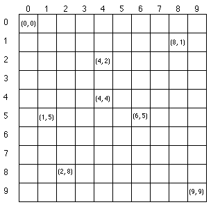

.. _listid2:

********************************
8. Järjendite kasutamise skeemid
********************************

Selles peatükis me uusi Pythoni keelekonstruktsioone sisse ei too, vaid uurime erinevaid võimalusi juba tuttavate teemade kombineerimiseks ja kasutamiseks.

Järjendid ja failid
===================
Enne peatüki põhiosa juurde asumist vaatame üle paar kasulikku failidega seotud funktsiooni, mis annavad tulemuseks listi.

Meetod ``readlines``
--------------------
Eespool oleme juba vaatanud failimeetodeid ``read`` ja ``readline``. Nüüd on paras aeg tutvuda meetodiga ``readlines``.

Koosta fail *tekst.txt*, mille sisu on järgmine:

.. sourcecode:: none

    Esimene rida
    Teine rida
    Kolmas rida

Nüüd käivita samas kaustas järgnev programm:

.. sourcecode:: py3

    f = open("tekst.txt")
    read = f.readlines()
    f.close() # faili ei lähe enam vaja
    
    print(read)

Loodetavasti nägid, et muutujasse ``read`` ilmus list, mille iga element on üks rida näidatud failist.

Funktsioon ``os.listdir``
-------------------------
Moodulis ``os`` asuv funktsioon ``listdir`` tagastab listi, mille elemendid on näidatud kaustas asuvate failide ja alamkaustade nimed:

.. sourcecode:: py3

    >>> import os
    
    >>> os.listdir("C:\\Users\\Aivar\\Desktop")
    ['desktop.ini', 'demo.py', 'SML_modules.pdf', 'thonny-0.1.3.exe', 'IMG_23887.jpg']
    
    >>> os.listdir(".") 
    ['08_listid2.rst', 'temp.py', 'sonad.txt']

Esimesel korral andsin kausta ette *absoluutse teega*. Siin tuleb panna tähele, et langjooned kausta nimede vahel on kirjutatud topelt, kuna Pythoni sõne süntaks seda nõuab. 

Teisel korral kasutasin kausta tee asemel punkti, mis tähendab, et tuleb tagastada *jooksva kausta* failid ja alamkaustad. Jooksev kaust on harilikult see kaust, kus asub käivitatav skriptifail. 

Järjendist otsimine
===================
Loodetavasti mäletad, et kontrollimaks, kas järjendis leidub mingi kindel element, piisab operaatorist ``in``:

.. sourcecode:: py3

    >>> 4 in [2,5,3,6,3,4,1,4]
    True
    
    >>> "Nuustaku" in ["Tartu", "Tallinn", "Pärnu", "Narva"]
    False

Kui tahame teada, mitu korda mingi element esineb, siis seda saab teha meetodiga ``count``:

.. sourcecode:: py3

    >>> arvud = [2,5,3,6,3,4,1,4]
    >>> arvud.count(4)
    2
    >>> arvud.count(7)
    0

Mõnikord aga pole tarvis otsida mitte konkreetset väärtust, vaid väärtust, mis vastab mingitele tingimustele. Sel juhul tuleks elemendid ükshaaval läbi käia, ning jätta meelde, kas me nägime selle käigus mõnda sobivat elementi. Järgnev programm üritab tuvastada, kas teatud kasutas on mõni mp3-fail:

.. sourcecode:: py3

    from os import listdir
    
    failinimed = listdir("C:\\Users\\Aivar\\Music")
    
    mp3_leidub = False # alustame pessimistlikult
    for failinimi in failinimed:
        if failinimi.endswith(".mp3"):
            mp3_leidub = True
            
            # kui meile piisab ühe faili leidumisest, 
            # siis rohkem pole vaja edasi vaadata
            break
                     
    print(mp3_leidub)

.. note::

    Kuna ``listdir`` annab vaid otse näidatud kaustas olevad faili- ja kaustanimed, siis selle lihtsa programmiga ei saa kontrollida, kas mõnes suvalisel sügavusel olevas alamkaustas leidub mõni mp3-fail. Sellele probleemile hakkame lahendust otsima rekursiooni peatükis. 

Indeksi otsimine
----------------
Mõnikord on vaja teada mingi elemendi asukohta järjendis. Kui otsime konkreetse väärtuse paiknemist, siis tuleb appi meetod ``index``:

.. sourcecode:: py3

    >>> linnad = ["Tartu", "Tallinn", "Pärnu", "Narva", "Tartu"]
    >>> linnad.index("Pärnu")
    2
    >>> linnad.index("Tartu") # mitme esinemise korral antakse esimese esinemise indeks
    0
    >>> linnad.index("Võru")
    Traceback (most recent call last):
      File "<pyshell#12>", line 1, in <module>
        linnad.index("Võru")
    ValueError: 'Võru' is not in list

Kui on vaja otsida mingi kriteeriumi põhjal, siis tuleb rohkem vaeva näha. Järgnev programm ütleb, mitmendal real asub faili esimene tühi rida või, et sellist ei leidu.

.. sourcecode:: py3

    f = open(input("Sisesta failinimi: "))
    read = f.readlines()
    f.close() 
    
    tühja_rea_indeks = -1 # harilikult tähistatakse mitteleidumist indeksiga -1
    
    # kuna tarvis teada ka elemendi positsiooni, siis teeme tsükli üle indeksite
    for i in range(len(read)):
        rida = read[i] 
        if rida.strip("\n") == "":
            tühja_rea_indeks = i
            break
    
    if tühja_rea_indeks > -1:
        # indeksid algavad 0-st aga reanumbreid on tavaks lugeda 1-st
        tühja_rea_nr = tühja_rea_indeks + 1  
        print(str(tühja_rea_nr) + ". rida oli tühi")
    else:
        print("Tühje ridasid polnud")
        

Nagu näha on ``for i in range(len(järjend)):`` paindlikum kui ``for element in järjend:``, sest pole mingit probleemi tsükli kehas indeksi abil saada kätte ka vastav element (``element = järjend[i]``), aga elemendi põhjal indeksi leidmine üldjuhul ei õnnestu.

Harjutus. Viimane tühi rida
---------------------------
Kui failis on mitu tühja rida, siis eelnev näiteprogramm leiab neist ainult esimese asukoha.

Muuda programmi nüüd nii, et see mitme tühja rea korral väljastaks viimase tühja rea numbri.

Proovi teha seda mitmel erineval moel:

* nii, kuidas sulle endale kõige lihtsam tundub;
* programmist ühe rea kustutamisega;
* programmi ühe sümboli lisamisega;
* ``range`` funktsiooni argumentide muutmisega.

Järjendist kokkuvõtte tegemine
==============================
Väga sagedasti tuleb teha järjendi elementidest mingi kokkuvõte, näiteks leida neist suurim või vähim või arvutada kõigi elementide summa. Suurima elemendi leidmise näide ning summa arvutamise harjutus olid juba :ref:`eelmises peatükis<jarjendite-tootlemine>`. Teema kinnistamiseks võiks teha siin veel ühe harjutuse.

Harjutus. Aritmeetiline keskmine
--------------------------------
Kirjuta funktsioon ``aritmeetiline_keskmine``, mis võtab argumendiks arvulisti ning tagastab antud arvude aritmeetilise keskmise.

.. hint::

    Selle funktsiooni keha on võimalik kirjutada ühe reaga. Samas ei tee paha ka tsükliga variant kirja panna.

        
Järjendi koostamine elementhaaval
=================================
Siiani oleme järjendi kirjapanekul loetlenud alati kõik tema elemendid. Paraku pole alati võimalik kõiki elemente korraga välja tuua. Appi tuleb järjendite liitmine. Tuletame kõigepealt meelde, mida see tähendas:

.. sourcecode:: py

    >>> [1, 2, 3] + [6, 4, 9]
    [1, 2, 3, 6, 4, 9]
    
    >>> [1] + [2] + [3]
    [1, 2, 3]
    
    >>> [1, 2, 3] + [4]
    [1, 2, 3, 4]
    >>> [1] + [2] + [3] + [1, 2, 3]
    [1, 2, 3, 1, 2, 3]
    
    >>> [1] + []
    [1]
    >>> [] + [1]
    [1]
    >>> [] + []
    []

Salvestades täiendatud järjendi samasse muutujasse, saavutame järjendi kasvamise efekti:

.. sourcecode:: py

    >>> a = []
    >>> a = a + [1]
    >>> a = a + [2]
    >>> a = a + [6]
    >>> a = a + [2]
    >>> a
    [1, 2, 6, 2]
    >>> a += [5]   # nagu arvude puhul, saab ka siin kasutada liitmisega omistamist
    >>> a
    [1, 2, 6, 2, 5]
 

.. _arvude-liitmine-listi:

Taolist järjendite elementhaaval kasvatamist kasutatakse siis, kui järjendi elemendid selguvad alles programmi töö käigus.  Kõige tavalisema skeemi puhul luuakse kõigepealt tühi järjend ning järjendi sisu täiendatakse tsüklis -- igal kordusel täiendatakse järjendit ühe uue elemendiga. Selleks kombineeritakse olemasolev järjend üheelemendilise järjendiga:   

.. sourcecode:: py3
            
    arvud = []

    while True:
        sisend = input('Sisesta täisarv (lõpetamiseks vajuta lihtsalt ENTER): ')
        if sisend == '':
            break
        else:
            arvud += [int(sisend)]

    print('Sisestati', len(arvud), 'arvu')
    print('Sisestatud arvud:', arvud)
    print('Arvude summa on:', sum(arvud))

Antud näite puhul olid tsükli aluseks kasutaja tegevused. Samahästi võiksime kasutada järjendi koostamisel kindla korduste arvuga ``for``-tsüklit:

.. sourcecode:: py3
    
    ruudud = []
    
    for arv in range(1, 10):
        ruudud += [arv ** 2]
    
    print('Arvude 1..9 ruudud on:', ruudud)

Harjutus. Failist järjendisse
-----------------------------
Nagu juba tead, võib ``for``-tsükli aluseks olla ka mingi tekstifail.

Kirjuta programm, mis loeb tekstifailist ükshaaval ridu (eeldame, et igal real on üks arv) ning koostab selle käigus järjendi, mis sisaldab failist leitud paarisarve. Koostatud järjend kuva ekraanile.

Näide. Standardhälbe leidmine
-----------------------------
Standardhälve kirjeldab mingi arvukogumi elementide varieeruvust. Väikese standarhälbega kogumis on elementide väärtused suhteliselt lähedal nende aritmeetilisele keskmisele, suure standardhälbe korral leidub palju keskmisest väga erineva väärtusega elemente.

Standardhälbe leidmiseks tuleb kõigepealt leida arvude aritmeetiline keskmine. Seejärel arvutatakse iga arvu kaugus keskmisest, ning võetakse see ruutu. Nendest ruutudest võetakse omakorda keskmine. Arvude standardhälve on selle keskmise ruutjuur. See protsess on loodetavasti arusaadavam Pythoni koodi kujul:

.. sourcecode:: py3

    from math import sqrt
    
    def aritmeetiline_keskmine(arvud):
        return sum(arvud) / len(arvud)
    
    
    def standardhälve(arvud):
        keskmine = aritmeetiline_keskmine(arvud)
        
        kauguste_ruudud = []
        
        for arv in arvud:
            kaugus = abs(arv - keskmine)
            kauguste_ruudud += [kaugus**2]
        
        kauguste_keskmine = aritmeetiline_keskmine(kauguste_ruudud)
        
        return sqrt(kauguste_keskmine)
        
.. note::

    Python 3.4-st alates on standardteegis olemas moodul ``statistics`` ja selles funktsioon ``pstdev``, mis teeb sama mida meie ``standardhälve``.

Näide. Juhuslike järjendite genereerimine
-----------------------------------------
Selle asemel, et harjutustes järjendeid ise sisse toksida, võime kasutada ka juhuslikult genereeritud arvujärjendeid:

.. sourcecode:: py3

    from random import randint
    
    arvud = []
    for i in range(100):
        # imiteerime täringuviskamist
        arvud += [randint(1,6)]
    
    print(arvud)

Harjutus. Juhuslike järjendite uurimine
---------------------------------------
Kirjuta funktsioon ``juhuslik_järjend``, mis võtab argumendiks järjendi elementide arvu ning kaks argumenti arvuvahemiku määramiseks, ning tagastab vastava juhuslikult genereeritud arvujärjendi.

Genereeri loodud funktsiooni abil mitu erineva pikkusega järjendit (sh mõned väga lühikesed ja mõned väga pikad) nii, et arvuvahemik on kõigil juhtudel sama. Uuri nende järjendite aritmeetilisi keskmisi. Kas märkad mingit seaduspära?

Järjendi teisendamine
=====================
Tihti on tarvis teha mingit operatsiooni järjendi iga elemendiga ning salvestada tulemused uude järjendisse. Uuri ja katseta järgnevat näiteprogrammi:

.. sourcecode:: py3

    sõned = ['1', '14', '69', '42']
    
    arvud = []
    for sõne in sõned:
        arvud += [int(sõne)]
    
    print(arvud)

Harjutus. Sõned arvudeks
------------------------
Kirjuta eelneva programmi näitel funktsioon ``sõned_arvudeks``, mis võtab argumendiks sõnede järjendi ning tagastab vastava arvude järjendi. (Võid praegu eeldada, et argumendiks antud järjendis sisalduvad vaid sellised sõned, mida saab arvudeks teisendada.)

Järjendi filtreerimine
======================
Filtreerimiseks nimetame operatsiooni, mis moodustab mingi järjendi põhjal uue järjendi, milles sisalduvad teatud tingimustele vastavad väärtused algsest järjendist. Uuri ja katseta järgnevat näidet:

.. sourcecode:: py3

    def paarisarvud(arvud):
        paaris = []
        for arv in arvud:
            if arv % 2 == 0:
                paaris +=  [arv]
        
        return paaris
    
    print(paarisarvud([1,2,3,4,5,6,7]))

Harjutus. Arvude tuvastamine
----------------------------
Kirjuta funktsioon ``naturaal_sõned``, mis võtab argumendiks sõnede järjendi ning tagastab uue sõnede järjendi, milles sisalduvad vaid need esialgse järjendi väärtused, mis kujutavad naturaalarve (st ``sõne.isnumeric() == True``). NB! Sõnede teisendamist arvudeks pole selles ülesandes tarvis.

Harjutus. Arvude tuvastamine koos teisendamisega
------------------------------------------------
Kirjuta funktsioon ``filtreeri_ja_teisenda``, mis võtab argumendiks sõnede järjendi ning tagastab täisarvude järjendi, mis vastab esialgse järjendi nendele elementidele, mis kujutavad täisarve. Näide selle funktsiooni kasutamisest:

.. sourcecode:: py3

    >>> filtreeri_sõned_arvudeks(['1', 'Tere', '2', '3'])
    [1, 2, 3]

.. hint:: 

    Kui kasutad abifunktsioone ``sõned_arvudeks`` ja ``naturaal_sõned``, siis saab selle funktsiooni väga lühidalt kirja panna.
    
Harjutus. Mp3-failid
--------------------
Kirjuta funktsioon ``mp3_failid``, mis võtab argumendiks kaustatee, ning tagastab kõik selles kaustas leiduvate mp3-laiendiga failide nimed.

.. hint::

    Abiks on ``os.listdir``, mille kasutamise näide on ülalpool.

Järjendite kombineerimine
=========================
Küllalt sagedasti tuleb ette situatsioon, kus kahest või enamast järjendist on vaja mingi reegli põhjal panna kokku üks järjend. Kõige lihtsam juhtum on see, kus erinevate järjendite elemendid on vaja panna lihtsalt üksteise järele uude järjendisse. Nagu just nägime, saab seda teha järjendite liitmisega. Siin vaatame veidi keerulisemaid probleeme.

Näide. Järjendite ühend
-----------------------
Järgnevas näites võtab funktsioon ``ühend`` argumendiks kaks järjendit ning tagastab uue järjendi, mis sisaldab mõlema argumentjärjendi erinevaid väärtusi ühekordselt:

.. sourcecode:: py3

    def ühend(j1, j2):
        tulemus = []
        
        for element in j1:
            if not (element in tulemus):
                tulemus += [element]
                
        for element in j2:
            if not (element in tulemus):
                tulemus += [element]
        
        return tulemus
    
    print(ühend([1, 2, 3, 2], [1, 6, 6]))

Harjutus. Järjendite ühisosa
----------------------------
Kirjuta funktsioon ``ühisosa``, mis võtab argumendiks kaks järjendit ning tagastab **uue** järjendi, mis sisaldab (ühekordselt) neid väärtusi, mis esinevad mõlemas järjendis.

Näide. Kahe järjendi elementide "paaritamine"
---------------------------------------------
Mõnikord juhtub, et omavahel seotud andmed asuvad erinevates järjendites.

Eksamitöid hinnatakse tihti nii, et hindaja ei tea, kelle tööd ta parasjagu vaatab. Samas on lõpuks ikkagi tarvis nimed ja punktid kokku viia. Üks võimalus selle korraldamiseks on omistada igale õpilasele järjekorranumber ja salvestades tema nimi vastavale reale mingis tekstifailis. Hindajale antakse ilma nimedeta eksamitööd samas järjekorras ja tema ülesandeks on kirjutada uude faili samas järjekorras tööde eest pandud punktid. Lõpuks võtavad eksami korraldajad mõlemad failid ja koostavad järgneva programmi abil kolmanda faili, kus on nimed koos punktidega:

.. sourcecode:: py3

    def loe_faili_read(failinimi):
        f = open(failinimi)
        read = []
        for rida in f:
            read += [rida.strip("\n")]
        f.close()
        return read
    
    
    nimed = loe_faili_read("nimed.txt")
    punktid = loe_faili_read("punktid.txt")
    
    
    f = open("nimed_koos_punktidega.txt", mode="w")
    
    # teen tsükli üle indeksite (järjekorranumbrite)
    # kuna eeldan, et nimede ja punktide failis oli ridu sama palju,
    # siis pole vahet kumma listi pikkuse ma aluseks võtan
    for i in range(len(nimed)):
        nimi_koos_punktidega = nimed[i] + ", " + punktid[i]
        f.write(nimi_koos_punktidega + "\n")
    
    f.close()
 

Näide. Eraldamine ja sidumine
-----------------------------
Arendame eelmist näidet veidi edasi. Oletame, et õpetaja, kellel on käepärast fail `nimed_koos_hinnetega.txt`, tahab teada nende õpilaste nimesid, kes said keskmisest vähem punkte. Selle eesmärgi saavutamiseks võiks ta kirjutada järgneva programmi: 

.. sourcecode:: py3

    def aritmeetiline_keskmine(arvud):
        return sum(arvud) / len(arvud)
    
    
    f = open("nimed_koos_punktidega.txt")
    
    # eraldan failis olevad nimed ja punktid eraldi järjenditesse
    nimed = []
    tulemused = []
    
    for rida in f:
        # löön rea koma kohalt pooleks
        rea_osad = rida.split(",")
    
        nimi = rea_osad[0]
        tulemus = int(rea_osad[1])
        
        nimed += [nimi]
        tulemused += [tulemus]
    
    f.close()
    
    # arvutan keskmise
    keskmine_tulemus = aritmeetiline_keskmine(tulemused)
    
    # käin üle kõikide tudengite järjekorranumbrite 
    # ja prindin välja nimed, millele vastav tulemus oli alla keskmise
    for i in range(len(nimed)):
        if tulemused[i] < keskmine_tulemus:
            print(nimed[i])
    
    
    
    
        

.. admonition:: Millal on mõtet salvestada andmed järjendisse?

    Kui me soovime failist loetud (või kasutaja käest küsitud) järjendi põhjal arvutada midagi lihtsat (nt arvude summat või maksimaalset arvu), siis pole järjendi koostamine tegelikult isegi vajalik -- piisaks ühest abimuutujast, mille väärtust me iga järgmise arvu sisselugemisel sobivalt uuendame. Andmete järjendisse võib tulla kasuks näiteks siis, kui andmeid on vaja mitu korda läbi vaadata, sest järjendi korduv läbivaatamine on palju kiirem kui faili korduv lugemine ja kasutajalt samade andmete mitu korda küsimine oleks eriti plass.

*Vahepala. Pikslid ja topelttsükkel*
====================================

.. note::

    Paari peatüki pärast tulevad meil mängu ka listid, mille elementideks on listid. Nendega toimetamisel on peamiseks vahendiks tsükkel, mille sees on tsükkel. Et harjutada ennast ideega tsüklist tsükli sees, võtame ette järjekordse mänguasja.

Arvuti esitab pilte ruudustikuna paigutatud täppidena e *pikslitena*. Moodul :download:`pixboard<downloads/pixboard.py>` võimaldab pilte joonistada pikselhaaval. Lae viidatud fail alla, salvesta samasse kausta järgnev skript ning käivita see. 

.. sourcecode:: py3

    from pixboard import *
    
    # Määrame pildi laiuseks 60 pikslit ja kõrguseks 40 pikslit
    setup(60, 40) 
    
    # värvime pildi keskel olevad 4 pikslit punaseks
    set_pixel(29, 19, "red")
    set_pixel(29, 20, "red")
    set_pixel(30, 19, "red")
    set_pixel(30, 20, "red")
    
    # näitame oma saavutust
    show()

Ilmselt aimasid, et ``set_pixel``-i esimene argument on x-koordinaat, teine y-koordinaat ning kolmas soovitav värv.

NB! Siin tuleb arvestada, et ``pixboard``-i arvates (nagu ka arvutigraafikas üldiselt tavaks) kasvab y-koordinaat allapoole ja punkt (0,0) asub pildi ülemises vasakus nurgas. Näiteks 10x10 pikslise pildi koordinaadistik on selline:

Näide. Kõigi pikslite värvimine kahekordse tsükliga
---------------------------------------------------
Kui me tahaks 60x40 pikslist pilti üleni näiteks siniseks värvida, siis üks võimalus oleks kirjutada 2400 korda käsku ``set_pixel`` sobivate argumentidega. Kui see tundub liiga tüütu, siis võib proovida muidugi tsüklit kasutada.

Paljudel tuleks arvatavasti esimese hooga mõte kirjutada ``for i in range(2400): ...``. See on täiesti adekvaatne lähenemine, aga siis peaks hakkama eraldi jälgima, millal kasvatada x-koordinaati ja millal y-koordinaati. Hoopis mugavam variant oleks selline:

.. sourcecode:: py3

    from pixboard import *
    
    # Määrame pildi laiuseks 60 pikslit ja kõrguseks 40 pikslit
    laius = 60
    kõrgus = 40
    setup(laius, kõrgus) 
    
    for x in range(laius):
        for y in range(kõrgus):
            set_pixel(x, y, "blue")
    
    # näitame oma saavutust
    show() 

Välimine ``for``-tsükkel teeb niipalju kordusi, nagu on pildi ruudustikus veerge. Iga korduse ülesandeks on korralda ühe veeru värvimine. Selleks võtab ta endale appi ühe alluva, sisemise ``for``-tsükli, mis teeb igal välimise tsükli kordusel niipalju kordusi, nagu on pildil ridu. Kokku käivitataksegi käsku ``set_pixel`` 2400 korda, just nagu meil alguses plaanis oli. 

Harjutus. Diagonaalne värvimine
-------------------------------
Kirjuta ``pixboard``-i programm, mis genereerib sellise 150x150 pikslise pildi:

(See peenike helehall raam akna servas ole pildi osa.)

Ülesanded
=========

1. Mediaani leidmine
--------------------
Kirjuta funktsioon ``mediaan``, mis arvutab etteantud arvude mediaani. Lahenduse korrektsuse kontrollimiseks võrdle enda funktsiooni tulemusi Pythoni ``statistics`` moodulis oleva funktsiooni ``median`` tulemustega (https://docs.python.org/3/library/statistics.html#statistics.median).

NB! Funktsiooni ``statistics.median`` ära enda lahenduses kasuta! 

.. hint::

    .. sourcecode:: py3
    
        >>> sorted([5, 2, 8, 234, 8, 2, 1, -4, 6, -12])
        [-12, -4, 1, 2, 2, 5, 6, 8, 8, 234] 

2. Lausegeneraator
------------------
* Defineeri funktsioon ``lause``, mis **võtab argumendiks** 3 sõna (sõnena) ning **tagastab** neist kombineeritud lause (muuhulgas lisab tühikud ja punkti).

* Loo 3 tekstifaili -- ``alus.txt``, ``oeldis.txt`` ning ``sihitis.txt``. Kirjuta igasse neist 10 sõna eraldi ridadele.

    * ``alus.txt`` - peaks sisaldama nimisõnu või nimesid nimetavas käändes (nt `Margus`).
    * ``oeldis.txt`` - oleviku vormis, 3. isikus tegusõnad (nt `õpetab`).
    * ``sihitis.txt`` - nimisõna osastavas käändes (nt `tudengeid`).

* Kirjuta funktsioon, mis võtab argumendiks failinime ning tagastab vastava faili read järjendina (reavahetuse sümbolid tuleks eemaldada meetodiga ``strip``).

* Kirjuta programm, mis:
    
    #. loeb mainitud kolme faili sisud järjenditesse (``alused``, ``oeldised``, ``sihitised``), kasutades selleks eelmises punktis defineeritud funktsiooni;
    #. genereerib 3 juhuslikku täisarvu vahemikust 0..9;
    #. võtab järjendite vastavatelt positsioonidelt aluse, öeldise ja sihitise ning koostab neist lause kasutades eelnevalt defineeritud funktsiooni ``lause``;
    #. kuvab moodustatud lause ekraanile.

* Muuda programmi selliselt, et see genereeriks ja väljastaks (lõpmatus tsüklis) iga ENTER-i vajutuse peale uue lause.

3. Eesti-inglise sõnaraamat
---------------------------
Lae alla eesti-inglise sõnastik(:download:`sonastik.txt <downloads/sonastik.txt>`, kodeeringus UTF-8). Selle igal real on kõigepealt inglisekeelne sõna või väljend, seejärel tabulaatori sümbol (kirjutatakse Pythonis ``"\t"``) ning lõpuks eestikeelne vaste.

Kirjuta programm, mis loeb failist eestikeelsed ja ingliskeelsed väljendid eraldi järjenditesse ning võimaldab kasutajal korduvalt küsida ingliskeelse sõna eestikeelset vastet (või vastupidi -- võid ise valida või lubada kasutajal valida).

.. topic:: Ülesande lisa

    Fail on järjestatud alfabeetiliselt ingliskeelsete vastete järgi. Seda arvestades tundub raiskamisena sõnastiku "läbilappamine" iga uue ingliskeelse sõna otsimisel. Proovi korraldada programmi töö nii, et enamikku ridadest puututakse vaid üks kord (faili sisselugemisel) ja et ingliskeelsele sõnale eestikeelse vaste otsimisel ei tehtaks kunagi rohkem kui 20 sõnede võrdlemist.
    
    .. hint::
        
        Tuleta meelde, milline oli parim strateegia :ref:`arvamismängus<arvamismang>`.   

.. note::
    
    Antud sõnastiku fail on veidi modifitseeritud variant Eesti Keele Instituudi poolt jagatavast failist (ftp://ftp.eki.ee/pub/keeletehnoloogia/inglise-eesti/en_et.current.wbt).

4. Palindroomid
---------------
Palindroom on sõna, mis on tagantpoolt ettepoole lugedes sama, nagu eestpoolt tagantpoole lugedes, näiteks *sammas*.

#. Kirjuta funktsioon ``on_palindroom``, mis võtab argumendiks sõne, ning tagastab ``True`` või ``False`` vastavalt sellele, kas see sõne on palindroom või mitte.
#. Failis :download:`sonad.txt <downloads/sonad.txt>` (kodeering UTF-8) on hulk eestikeelseid sõnu, iga sõna eraldi real. Kuva ekraanile kõik selles failis esinevad palindroomid, iga sõna eraldi reale, samas järjekorras nagu need failis paiknevad.

5. Anagrammid
-------------
Kaks sõna on üksteise anagrammid, kui ühes sõnas tähti ümber paigutades on võimalik moodustada teine sõna, näiteks *puitpost* ja *supipott*.

Kirjuta programm, mis küsib kasutajalt sõna, ning väljastab kõik selle anagrammid, mis leiduvad eelmises ülesandes mainitud sõnade failis.

.. hint::

    .. sourcecode:: py3
    
        >>> sorted("anagramm")
        ['a', 'a', 'a', 'g', 'm', 'm', 'n', 'r']

.. admonition:: Väljakutse

    Leia ja väljasta kõik mainitud failis leiduvad anagrammide komplektid. 

.. todo::

    Joonistamise ülesanne

Lisalugemine
============

Järjendite filtreerimise üldistus
---------------------------------
Selles peatükis käis meil korduvalt läbi skeem, kus oli tarvis leida järjendist teatud tingimusele vastavad elemendid ja moodustada nende põhjal uus järjend, teisisõnu, järjendit oli vaja filtreerida. Vastavate koodijuppide üldkuju oli alati midagi sellist:

.. sourcecode:: py3

    algne_järjend = ...
    uus_järjend = []
    
    for element in algne_järjend:
        if ... element rahuldab mingit tingimust ...:
            uus_järjend += [element]
    
Eespool on aga ka korduvalt manitsetud, et kui märkad oma koodis korduvaid koodiplokke või -skeeme, siis tuleks need pakendada funktsiooniks, kus spetsiifilised kohad on asendatud funktsiooni parameetritega. Lõpuks tuleb algsed `copy-paste`tud kohad asendada funktsioonikutsete, millele antakse vajalikud argumendid. Seega, me võiksime üritada kirjutada universaalse abifunktsiooni ``filtreeri``, mis oskab etteantud liste vastavalt vajadusele filtreerida. Esimene katse võiks olla midagi sellist:

.. sourcecode:: py3
    
    def filtreeri(algne_järjend):
        uus_järjend = []
        
        for element in algne_järjend:
            if ... element rahuldab mingit tingimust ...:
                uus_järjend += [element]
        
        return uus_järjend

Nagu näha, tekib probleem tingimuse üldistamisega. Kuidas teha tingimus funktsiooni parameetriks, kui see võib erinevatel juhtumitel olla väga erineva struktuuriga? 

Esimene samm oleks väljendada soovitud tingimus eraldi abifunktsioonina. Näiteks, kui meil on vaja eraldada sõned, mis lõpevad ``".mp3"``-ga, siis oleks tingimuse funktsioon midagi sellist:

.. sourcecode:: py3

    def lõpeb_mp3_ga(sõne):
        return sõne.endswith(".mp3")

Kui tahame eraldada sõnesid, mis tähistavad märgita täisarve, siis on meil tegelikult tingimuse funktsioon juba olemas, see on ``str.isnumeric``:

.. sourcecode:: py3

    >>> str.isnumeric("333")
    True
    >>> str.isnumeric("aaaa")
    False

.. note::

    Pythoni jaoks on ``"aaa".isnumeric()`` praktiliselt sama, mis ``str.isnumeric("aaa")``. Miks see nii on, seda me praegu ei hakka uurima, selle jaoks tuleks kõigepealt teha selgeks Pythoni klasside olemus.

Üldine idee on selles, et ükskõik kui keeruline meie tingimus ka on, me saame ta pakendada funktsiooniks, mis võtab ühe argumendi ja tagastab tõeväärtuse, mis näitab kas argument vastab tingimusele või mitte. Seda arvestades saame skeemi üldkuju lihtsustada:

.. sourcecode:: py3
    :emphasize-lines: 5
    
    def filtreeri(algne_järjend):
        uus_järjend = []
        
        for element in algne_järjend:
            if tingimus(element):
                uus_järjend += [element]
        
        return uus_järjend

Siit on jäänud veel üksainus samm meie eesmärgini. Erinevalt paljudest teistest populaarsetest programmeerimiskeeltest, lubab Python käsitleda funktsioone kui väärtusi, st salvestada neid muutujatesse ning, veel parem, anda funktsiooni väljakutse argumendiks. See lubab meie ``filtreeri`` funktsioonil käsitleda tingimust kui parameetrit:

.. sourcecode:: py3
    :emphasize-lines: 1
    
    def filtreeri(algne_järjend, tingimus):
        uus_järjend = []
        
        for element in algne_järjend:
            if tingimus(element):
                uus_järjend += [element]
        
        return uus_järjend

Selle funktsiooni kasutamiseks kirjutame teise argumendi kohale soovitud tingimusfunktsiooni nime:

.. sourcecode:: py3

    >>> filtreeri(["dokument.doc", "tekst.txt", "Bemmi kummid.mp3", "Für Elise.mp3"], lõpeb_mp3_ga)
    ['Bemmi kummid.mp3', 'Für Elise.mp3']
    >>> filtreeri(["asdbaf", "24jklh34", "3423", "3", "uuuu", "999"], str.isnumeric)
    ['3423', '3', '999']

Suurepärane! Kuidas Pythoni loojad pole selle peale tulnud, et selline võimalus Pythonisse sisse kirjutada?

Tegelikult on selline funktsioon Pythonis olemas ja selle nimi on ... ``filter``! See käitub meie funktsioonist veidi erinevalt, nimelt võtab ta argumendid vastupidises järjekorras (kõigepealt tingimusfunktsioon ja siis järjend), ning ta ei tagasta päris järjendit, vaid ühe müstilise *filter*-objekti. Õnneks saab seda objekti ``list`` funktsiooniga järjendiks teisendada:

.. sourcecode:: py3

    >>> filter(lõpeb_mp3_ga, ["dokument.doc", "tekst.txt", "Bemmi kummid.mp3", "Für Elise.mp3" ])
    <filter object at 0x0000000002C7ECF8>
    >>> list(filter(lõpeb_mp3_ga, ["dokument.doc", "tekst.txt", "Bemmi kummid.mp3", "Für Elise.mp3" ]))
    ['Bemmi kummid.mp3', 'Für Elise.mp3']
    >>> list(filter(str.isnumeric, ["asdbaf", "24jklh34", "3423", "3", "uuuu", "999"]))
    ['3423', '3', '999']

Kui me tahaks tulemust aga kasutada näiteks for-tsükli aluseks, siis pole "päris"-järjendiks teisendamine vajalik.

.. note::

    Kui sulle tundub, et kõik on justkui ilus, aga see tingimuse funktsiooni defineerimine on tüütu, siis tea, et ka  sellele on lahendus. Vaata lähemalt näiteks siit: http://www.diveintopython.net/power_of_introspection/lambda_functions.html

Järjendite teisendamise üldistus
--------------------------------
Loodetavasti mõtled sa nüüd, et küll oleks lahe, kui ka järjendite teisendamiseks saaks mingit sarnast trikki kasutada. Saab! Saage tuttavaks, ``map``:

.. sourcecode:: py3

    >>> list(map(str, [1,2,3]))
    ['1', '2', '3']
    
    >>> list(map(float, [1,2,3]))
    [1.0, 2.0, 3.0]
    
    >>> list(map(int, ["1","2","3"]))
    [1, 2, 3]
    
    >>> from math import sqrt
    >>> list(map(sqrt, [1,2,3]))
    [1.0, 1.4142135623730951, 1.7320508075688772]
    
    >>> def pluss_üks(x): return x + 1
    >>> list(map(pluss_üks, [1,2,3]))
    [2, 3, 4]

.. admonition:: Väljakutse

    Kirjuta enda versioon ``map``-ist.