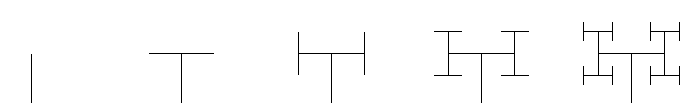

12. Rekursioon
================
Paljude ülesannete jaoks on olemas väga elegantsed lahendused, kus algse ülesande lahendamiseks lahendatakse kõigepealt väiksem alamülesanne ja seejärel täiendatakse saadud vastust mingil moel. Sarnast skeemi kasutasime korduvalt tsüklite peatükis.

Ilmneb, et taoliste ülesannete puhul on tsüklite asemel võimalik kasutada ka *rekursiivseid* funktsioone -- so. funktsioone, mis iseennast välja kutsuvad. Tihti on selliselt kirjutatud lahendused selgemad ja lühemad, kui tsüklitega kirjutatud lahendused.

Tehniliselt võttes ei õpi te selles peatükis Pythoni kui programmeerimiskeele kohta midagi uut, kuna Pythoni seisukohast ei erine rekursiivsed funktsioonid "tavalistest" funktsioonidest. Samas, rekursiivsetest algoritmidest arusaamiseks on vaja vaadata asju pisut teise nurga alt -- seetõttu on antud peatükis ülesandeid, mis aitavad rekursiivse mõtteviisiga harjuda. 

Rekursiivsed funktsioonid
-------------------------
Programmeerimises nimetatakse rekursiooniks tavaliselt situatsiooni, kus funktsiooni definitsioonis on kasutatud parasjagu defineeritavat funktsiooni. Kõige lihtsam rekursiivne funktsioon oleks selline:

.. sourcecode:: py3

    def f():
        f()

Kui sellist funktsiooni Pythonis välja kutsuda, siis vastavalt definitsioonile tuleb kutsuda seesama funktsioon uuesti välja, see omakorda põhjustab jälle selle funktsiooni väljakutsumise jne. Pythoni puhul lõpeb taoline ahel veateatega, mis ütleb, et alustatud, aga mitte lõpule jõudnud väljakutsete limiit sai täis. (Mõne teise keele puhul võib see protsess lõputult käima jääda.)

Rekursiooni *baas* ja *samm*
~~~~~~~~~~~~~~~~~~~~~~~~~~~~~
Et rekursioon mingil hetkel lõppeks, peab rekursiivses funktsioonis toimuma hargnemine sõltuvalt funktsiooni argumentidest. Vähemalt üks haru peab olema ilma rekursiivse väljakutseta – seda nimetatakse rekursiooni **baasiks**. Seda haru, mis kutsub funktsiooni rekursiivselt välja, nimetatakse rekursiooni **sammuks**.

Rekursiooni samm lahendab tavaliselt ülesande "vähendatud koopia", e. mingi alamülesande (kasutades selleks sedasama funktsiooni) ning koostab saadud tulemuse põhjal terve ülesande lahenduse. Aga kui alamülesanne on piisavalt väike, siis käsitletakse seda *baasjuhuna* ja vastus antakse ilma rekursiivse väljakutseta.

Näide: Faktoriaal
~~~~~~~~~~~~~~~~~~
Faktoriaali definitsiooni järgi on `0! = 1`. Iga teise naturaalarvu puhul on `n!` võrdne arvude `1` .. `n` korrutisega. Nt.

    * 4! = 1 × 2 × 3 × 4
    * 5! = 1 × 2 × 3 × 4 × 5
    
Nagu näha, on `5!` arvutus väga sarnane `4!` arvutusele -- selleks, et arvutada `5!` võiksime me arvutada `4!` ja korrutada saadud tulemuse `5`-ga. Seda asjaolu arvestades on kirjutatud järgnev *rekursiivne* faktoriaali definitsioon:

.. sourcecode:: py3

    def fact(n):
        if n == 0:
            return 1
        else:
            return fact(n-1) * n

Ülesanne 1. Faktoriaali algoritmi analüüs
~~~~~~~~~~~~~~~~~~~~~~~~~~~~~~~~~~~~~~~~~~~~~~
* Väärtustage *mõttes* ülaltoodud definitsiooni järgides avaldis ``fact(3)``.
* Milline osa antud näites on rekursiooni baas? Milline on samm? Kuidas jõutakse alamülesande lahendusest terve ülesande lahenduseni?
* Kuidas käitub antud funktsioon negatiivsete (või reaalarvuliste) argumentide korral? Kuidas võiks seda probleemi lahendada?

Näide: Stardiloendus
~~~~~~~~~~~~~~~~~~~~~~
Rekursiivne funktsioon ei pea alati midagi tagastama:

.. sourcecode:: py3

    from time import sleep

    def stardiloendus(sekundeid_stardini) :
        if sekundeid_stardini == 0:
            print('Start!')
        else:
            print(sekundeid_stardini)
            sleep(1) # ootab 1 sekundi
            stardiloendus(sekundeid_stardini-1)
    

Kui antud funktsiooni definitsiooni rahulikult lugeda, siis peaks selle tähendus olema selge -- kui me teeme stardiloendust `0` sekundiga (e. *baasjuhu* korral), siis ei ole midagi loendada, vaja kohe start anda; vastasel juhul väljastame ekraanile järelejäänud sekundite arvu, ootame ühe sekundi ja alustame ühe sekundi võrra lühemat stardiloendust. 
     
.. topic:: Lisaseletus

    Mis toimub Pythoni seisukohast, kui me sellise funktsiooni välja kutsume?

    .. sourcecode:: py3

        >>> stardiloendus(3)

    * ``stardiloendus`` käivitatub argumendiga `3` ja kuna see ei võrdu `0`-ga, väljastakse väärtus `3`  ja ``stardiloendus`` kutsutakse välja argumendiga `2`
        * ``stardiloendus`` käivitatub argumendiga `2` ja kuna see ei võrdu `0`-ga, väljastakse väärtus `2` ja ``stardiloendus`` kutsutakse välja argumendiga `1`
            * ``stardiloendus`` käivitatub argumendiga `1` ja kuna see ei võrdu `0`-ga, väljastakse väärtus `1` ja ``stardiloendus`` kutsutakse välja argumendiga `0`
                * ``stardiloendus`` käivitatub argumendiga `0` ja kuna see rahuldab `if`-lause tingimust, siis väljastatakse ``'Start!'`` 
                * ``stardiloendus`` argumendiga `0` lõpetab oma töö
            * ``stardiloendus`` argumendiga `1` lõpetab oma töö
        * ``stardiloendus`` argumendiga `2` lõpetab oma töö
    * ``stardiloendus`` argumendiga `3` lõpetab oma töö

Ülesanne 2. Modifitseeritud stardiloendus
~~~~~~~~~~~~~~~~~~~~~~~~~~~~~~~~~~~~~~~~~~~~~~
Muutke eelnevat näidet nii, et peale starti loendatakse veel stardist möödunud sekundeid, st. ``uus_stardiloendus(3)`` peaks andma väljundi:

.. sourcecode:: none

    3
    2
    1
    Start!
    1
    2
    3

Ülesanne 3. Spiraali joonistamine
~~~~~~~~~~~~~~~~~~~~~~~~~~~~~~~~~~~~
Kirjuta rekursiivne funktsioon, mis joonistaks kilpkonna abil kandilise spiraali, alustades etteantud küljepikkusest ning vähendades küljepikkust igal ringil mingi väärtuse võrra, kuni see jõuab nulli.  (Analoogse ülesande lahendasime ühes varasemas peatükis tsükliga.)

Ülesanne 4. Eukleidese algoritm
~~~~~~~~~~~~~~~~~~~~~~~~~~~~~~~~~~
Eukleidese algoritm leiab kahe naturaalarvu suurima ühisteguri.

Algoritm on järgmine:

    * Olgu meil naturaalarvud a ja b ning on teada, et a > b;
    * Kui b = 0, siis on suurim ühistegur a;
    * Kui ei, siis korda protsessi, võttes uueks a-ks b ja uueks b-ks endiste a ja b jagamisel saadud jääk.

Realiseerige Eukleidese algoritm rekursiivse funktsioonina.

Ülesanne 5. Fraktal
~~~~~~~~~~~~~~~~~~~~~~
Fraktalid on graafilised kujundid, milles kordub sama motiiv üha väiksemal kujul (loodetavasti paistab siit seos rekursiooniga).

Kirjutage rekursiivne funktsioon, mis vastavalt etteantud tasemele joonistab vastava kujundi järgmiselt skeemilt (esimene kujund on tasemega 0, teine tasemega 1 jne):

Selle fraktali joonistamise mitteformaalne juhis: 0 tasemega fraktali joonistamiseks tuleb joonistada kriips; selleks, et joonistada fraktalit tasemega *n*, tuleb joonistada kriips ja selle kriipsu otsa paremale ja vasakule joonistada vähendatud suurusega fraktalid tasemega *n-1*.

.. hint::

    Ülesannet on lihtsam lahendada, kui korraldate nii, et funktsiooni lõpus on kilpkonn samas punktis ja sama suunaga nagu funkstiooni väljakutsel.

Ülesanne 6. Kuulujutt
~~~~~~~~~~~~~~~~~~~~~~
Keegi laseb lahti kuulujutu, rääkides seda 3 inimesele. Iga tunni jooksul räägivad kõik, kes kuulujuttu juba teavad, selle edasi 3 inimesele, kes seda veel ei teadnud. Mitu inimest teavad kuulujuttu 10 tunni pärast?

Kirjutage rekursiivne funktsioon, mis annab selle ülesande vastuse suvalise tundide arvu korral.

Mitmeharuline rekursioon
~~~~~~~~~~~~~~~~~~~~~~~~~~
Rekursiivses funktsioonis võib olla mitu rekursiivset väljakutset. Järgnev funktsioon annab Fibonacci arvujada *n*-da liikme. Funktsiooni definitsioon põhineb otseselt Fibonacci jada definitsioonil (http://en.wikipedia.org/wiki/Fibonacci_number).

.. sourcecode:: py3

    def fib(n):
        if n == 0:
            return 0
        elif n == 1:
            return 1
        else:
            return fib(n-1) + fib(n-2)

Ülesanne 7. Küülikud
~~~~~~~~~~~~~~~~~~~~~~
Üks XIII sajandi matemaatik tundis huvi küülikute paljunemise vastu. Ta koostas sellise ülesande: 

    * alguses on meil üks äsjasündinud emane ja üks äsjasündinud isane küülik
    * küülik saab suguküpseks ühe kuuga (ja ta kasutab oma uut staatust kohe ära)
    * küüliku tiinusperiood kestab 1 kuu (st. küülik poegib 1 kuu pärast viljastamist)
    * suguküps emane küülik poegib iga kuu järel ja sünnitab igal korral ühe emase ning ühe isase küüliku
    * oletame, et küülikud ei sure iial
    * mitu paari küülikuid on meil 12 kuu pärast?

Kirjutage üldisem funktsioon, mis annab vastuse suvalise arvu kuude kohta.
    

Näide: Argumentideta rekursioon
~~~~~~~~~~~~~~~~~~~~~~~~~~~~~~~~~~~~~~
Enamasti käib rekursioon muutuja järgi, mida edastatakse funktsiooni argumendina. Kui lõpetamistingimus on esitatud muul moel, võib rekursioon toimuda ka ilma väärtusi edastamata. Järgmine funktsioon laseb kasutajal arvata mündivisete tulemusi, kuni ta mõne neist õigesti arvab:

.. sourcecode:: py3

    from random import choice

    def mäng() :
        münt = choice(['kull', 'kiri'])
        arvamus = input("Arva, kas kull või kiri: ")
        
        if (münt == arvamus) :
           print("Arvasid õigesti!")
        else:
           print("Proovi veelkord")
           mäng()
    
    mäng()

Rekursiivsed andmestruktuurid
-------------------------------
Eelmises peatükis vaatasime, kuidas järjendeid üksteise sisse pannes luua keerulisemaid andmestruktuure. Selle juures me aga alati arvestasime, mitu taset meie andmestruktuurides on. 

Alati pole tasemete arvu võimalik ette teada -- näiteks failisüsteemi puhul pole kaustade sügavus süsteemi poolt (otseselt) piiratud. Ilmneb, et rekursioon sobib ideaalselt taoliste andmestruktuuride töötlemiseks.

Vaatame kõigepealt ühte näiteprogrammi, mis liidab kokku kõik antud mitmemõõtmelises järjendis olevad arvud, olenemata sellest, mitme mõõtmega on tegemist:

.. sourcecode:: py3

    def liida(järjend):
        summa = 0
        for element in järjend:
            if isinstance(element, list):
                summa += liida(element)
            else:
                summa += element
        return summa

    print(liida([1, [2, 3], [[[[4, 5], 6]]], 7, 8]))
    print(liida([1, 2, 3, 4, 5, 6, 7, 8]))
        

Kuna me ei teadnud, kas mingil tasemel on meil järjendis veel järjendeid, või tulevad juba arvud, siis kasutasime funktsiooni ``isinstance`` elemendi andmetüübi testimiseks.

.. topic:: Kõrvalepõige

    Erinevates teooriates käsitletakse tihti ka naturaalarve rekursiivsete andmestruktuuridena. Meile tuttavaid vahendeid kasutades võiksime esimesi naturaalarve esitada näiteks järgnevalt:
    
    * 0 --- ``[]``
    * 1 --- ``[[]]``
    * 2 --- ``[[[]]]``
    * jne.

    Kas oskaksite kirjutada funktsiooni taoliselt esitatud naturaalarvude liitmiseks?

Ülesanne 8. Kaustade läbimine
~~~~~~~~~~~~~~~~~~~~~~~~~~~~~~

Kirjutage programm, mis otsib etteantud nimega kaustast ja selle kõikidest alamkaustadest *mp3* faile ja kuvab nende nimed ekraanile.

Abiks on järgnevad Pythoni funktsioonid:

* http://docs.python.org/py3k/library/os.path.html#os.path.isdir
* http://docs.python.org/py3k/library/os.html#os.listdir

Järgnev programmilõik demonstreerib nende kasutamist:

.. sourcecode:: py3

    import os
    
    # topelt langkriipsud on vajalikud, kuna langkriipsul 
    # on Pythoni sõneliteraalides eritähendus
    kaustanimi = "c:\\mingi_kaust\\alamkaust"
    
    # os.listdir tagastab järjendi faili- ja kaustanimedega
    print(os.listdir(kaustanimi))
    
    # os.path.isdir ütleb, kas antud nime taga peitub kaust (mitte fail)
    print(os.path.isdir(kaustanimi))
    

Koduülesanded
-------------------

1. Kaustad ja järjendid
~~~~~~~~~~~~~~~~~~~~~~~~
Kirjutage funktsioon, mis etteantud kaustanime põhjal moodustab ja tagastab mitmemõõtmelise järjendi, kus iga alamkaust on omakorda esindatud järjendina ja failid on esindatud vastavas järjendis olevate sõnedena. Kui meil on näiteks selline kataloog:

* Muusika
    * Eesti musa
        * kaelakee_hääl.mp3
        * Bemmi kummid.mp3
    * miami_vice_theme.mp3

siis funktsioon peaks tagastama sellise järjendi:

    * ``[['kaelakee_hääl.mp3', 'Bemmi kummid.mp3'], 'miami_vice_theme.mp3']``

2. Cesaro fraktal
~~~~~~~~~~~~~~~~~~
Lahendage õpiku pt. 10 lõpust ülesanne nr. 3 (*Cesaro torn square fractal*).
http://courses.cs.ut.ee/2011/programmeerimine/uploads/Raamat/ch10.html

3. Kuulujutt ver.2
~~~~~~~~~~~~~~~~~~~~~~
Lahendage ülalpool toodud kuulujutu ülesandest ümberpööratud variant:

Antud on linnakese elanike arv *n*. Leida mitme tunni pärast teavad kuulujuttu kõik selle linnakese elanikud.

Lisaülesanne. Arvamismäng
~~~~~~~~~~~~~~~~~~~~~~~~~~~~~~~~
Realiseerige IV praktikumis tutvustatud *Arvamismäng* kasutades tsüklite asemel rekursiooni. Programm peaks pidama arvet arvamiste arvu üle ja lõpetama töö, kui kasutaja on juba *n* korda ebaõnnestunult arvanud.

Lisaülesanne. Fibonacci arvud
~~~~~~~~~~~~~~~~~~~~~~~~~~~~~~~~
Ülalpool toodud definitsioon Fibonacci arvude leidmiseks pole optimaalne, sest samu väärtusi peab arvutama mitu korda ning programmi tööaeg kasvab eksponentsiaalselt. Kirjutage funktsioon ümber selliselt, et sama argumendiga väljakutset ei toimuks mitu korda. 

(Tahvlipraktikumis anti selle ülesande lahendus, kus kasutati 3 argumendiga abifunktsiooni. Proovige leida mingi alternatiivne lahendus.)

.. hint:: 

     Kasutage funktsioonis ainult üht rekursiivset väljakutset, mis tagastab 2 väärtust st. kirjutage hoopis programm mitte ühe, vaid kahe järjestikuse Fibonacci arvu leidmiseks. Võrrelge antud näites toodud ja oma kirjutatud programmide töökiirust nt 30-da Fibonacci arvu leidmisel.

Lisalugemine
------------

Rekursioon, müstika, huumor
~~~~~~~~~~~~~~~~~~~~~~~~~~~~
Mõned lingid rekursiooniga seotud koomiksitele, piltidele, mõistetele:

* http://en.wikipedia.org/wiki/Ouroboros
* http://xkcd.com/244/
* http://www.regruntled.com/2009/08/07/recursive-comic/
* http://www.peteonsoftware.com/images/201108/InfiniteRecursion.jpg
* http://en.wikipedia.org/wiki/Drawing_Hands
* http://en.wikipedia.org/wiki/Recursive_acronym
* The Hasselhoffian Recursion ;)

Mitmetes programmeerimiskeelte õpikutes on terminoloogia osas taoline fragment: 

.. topic:: Terminid

    .. glossary::

        rekursioon
            vt. :term:`rekursioon`

Öeldakse veel, et rekursiooni mõistmiseks tuleb rekursiooni mõista.

Aritmeetilise avaldise väärtustaja
~~~~~~~~~~~~~~~~~~~~~~~~~~~~~~~~~~~~~~~~~~~~~~~~~~

.. note::
    See näide demonstreerib ühte ilusat rekursiivset algoritmi. Nagu rekursiivsete algoritmide puhul tavaline, võib see alguses aju "sõlme keerata" -- varuge endale selle teema läbitöötamiseks piisavalt aega!

Ülesanne: Kirjutada funktsioon, mis võtab argumendiks sõne kujul aritmeetilise avaldise ja tagastab selle väärtuse. Avaldis võib sisaldada arve, aritmeetilisi operatsioone (``+``, ``-``, ``*``, ``/``) ning sulge (mitmel tasemel). Seal, kus sulge pole kasutatud, tuleb arvestada tavalise tehete järjekorraga.

(Lihtsuse mõttes võime esialgu eeldada, et kõik avaldise komponendid on üksteisest tühikutega eraldatud, nt. ``3 * ( -4 / 3.5 + ( 3 - 2 ) ) - 6`` -- sedasi on lihtsam avaldist komponentideks jagada.)

.. note::

    Enne edasi lugemist mõelge, kuidas te sellise ülesande lahendaksite. Katsetage! Milline ülesande aspekt valmistab kõige rohkem probleeme?
    
    Astuge samm tagasi ja mõelge, milline võib olla aritmeetilise avaldise *struktuur*.

Alljärgnevalt on toodud mõned näited erineva struktuuriga avaldistest:

    * ``3`` --- arv
    * ``3 + 2`` --- liitmine, kus argumendid on arvud
    * ``3 * 10 + 2 * 10`` --- liitmine, kus argumendid on korrutised
    * ``3 - 2 - 6`` --- loetakse ``( 3 - 2 ) - 6``; so. lahutamine, kus vasak argument on lahutamine (``3 - 2``) ja parem argument on arv (``6``)
    * ``3 + 2 * 3`` --- loetakse ``3 + ( 2 * 3 )``; so. liitmine, kus vasak argument on arv ja parem argument on korrutamine
    * ``( 3 + 2 )`` --- sulgudes olev avaldis
    * ``( 3 + 2 ) * 3`` --- korrutamine, kus vasak argument on sulgudes olev avaldis ja parem argument on arv

Viimases kahes näites kasutasime avaldise struktuuri kirjelduses mõistet *avaldis* -- st. me kirjeldasime avaldise olemust *rekursiivselt*.

Enne edasi minemist defineerime abimõisted erinevatel kujudel avaldiste tähistamiseks:

    * `faktor` -- arv või sulgudes olev avaldis, nt. ``3`` või ``( 2 * 3 + ( 4 / 6 ) )``
    * `term` -- faktor või korrutis/jagatis, nt ``3``, ``( 2 * 3 + ( 4 / 6 ) )`` või ``2 * ( 3 + 4 )``. Pange tähele, et korrutise/jagatise vasak argument võib olla term aga parem argument on faktor (mõelge ``8 / 2 / 2`` struktuuri peale). 
    * `avaldis` -- term või liitmine/lahutamine. Liitmise/lahutamise vasak argument võib olla avaldis, aga parem argument on term.
    
Paneme samad mõisted kirja ka spetsiaalses notatsioonis, mida kasutatakse *grammatikate* esitamiseks (``|`` võib lugeda kui sõna *või*):

.. sourcecode:: none

    avaldis  :  term    |  avaldis ('+' | '-') term
    term     :  faktor  |  term    ('*' | '/') faktor
    faktor   :  arv | '(' avaldis ')'

Avaldise väärtustamise plaan on järgnev:

    * mugavuse mõttes teisendame sõne *märkide* järjendiks nii, et iga märk on kas mingi operaator, arv või sulg; edasine töö toimub märkide järjendi põhjal
    * loome iga avaldise tüübi jaoks eraldi funktsiooni (``loe_avaldis``, ``loe_term``, ``loe_faktor``), mis võtab argumendiks märkide järjendi, loeb järjendi lõpust selle jupi, mida ta tunneb (vastavalt avaldise, termi või faktori) ning tagastab selle jupi väärtuse. "Ära loetud" jupp eemaldatakse märkide järjendist -- seega muutub järjend igal etapil järjest lühemaks.
    * märkide järjendi lühendamiseks kasutame meetodit ``pop``, mis eemaldab ja tagastab järjendi viimase elemendi
    * kui kõik läheb ilusti, siis funktsiooni ``loe_avaldis`` töö lõpus on märkide järjend muutunud tühjaks järjendiks ja saadud vastus ongi avaldise väärtus.

Selle plaani põhjal on kirjutatud järgnev programm, mis toetub rekursiivsetele funktsioonidele:

.. sourcecode:: py3
    
    def väärtusta_avaldis(avaldis):
        # tühikuid nõudsime selleks, et osadeks jaotamine oleks lihtsam
        märgid = avaldis.split()
        tulemus = loe_avaldis(märgid)
        if märgid != []:
            print("Mingi jama, allesjäänud märgid:", märgid)
        return tulemus
    
    def loe_avaldis(märgid):
        # nagu avaldise grammatika ütleb, on avaldise lõpus alati term
        parem_argument = loe_term(märgid)
        
        # kui enne termi on operaator (+ või -), siis enne operaatorit peab olema avaldis
        if märgid != [] and märgid[-1] in ['+', '-']:
            operaator = märgid.pop()
            vasak_argument = loe_avaldis(märgid)
            if operaator == '+':
                return vasak_argument + parem_argument
            else:
                return vasak_argument - parem_argument
                
        # kui liitmist/lahutamist pole, siis järelikult on tegemist
        # avaldise lihtsa variandiga (e. lihtsalt termiga)
        else:
            return parem_argument

    def loe_term(märgid):
        # selle funktsiooni ülesehitus on eelmisega analoogne
        parem_argument = loe_faktor(märgid)

        if märgid != [] and märgid[-1] in ['*', '/']:
            operaator = märgid.pop()
            vasak_argument = loe_term(märgid)
            if operaator == '*':
                return vasak_argument * parem_argument
            else:
                return vasak_argument / parem_argument
        else:
            return parem_argument

    def loe_faktor(märgid):
        märk = märgid.pop()
        
        if märk == ')': # tegemist on sulgudes oleva avaldisega
            tulemus = loe_avaldis(märgid)
            # nüüd on eeldatavasti viimaseks sümboliks '(', "loeme" ka selle ära
            sulg = märgid.pop()
            if sulg != '(':
                print("Mingi jama!")
            return tulemus
        else:
            # pop-itud märk peab olema arv
            return float(märk)

    print(väärtusta_avaldis("3"))
    print(väärtusta_avaldis("( 3 )"))
    print(väärtusta_avaldis("3 * ( -4 / 3.5 + ( 3 - 2 ) ) - 6"))
    print(väärtusta_avaldis("3 * 3"))
    print(väärtusta_avaldis("( 3 + 3 * 4 )"))
    print(väärtusta_avaldis("( 3 + 3 ) * 4"))
    print(väärtusta_avaldis("1 + 1 + 1 + 1"))
    print(väärtusta_avaldis("2 * 2 * 2 * 2"))

.. note::

    Selles programmis on lisaks *otsesele rekursioonile* mängus ka *kaudne rekursioon* -- nt. funktsioon ``loe_faktor`` ei kutsu küll otseselt iseend välja, kuid ta võib kutsuda välja funktsiooni ``loe_avaldis``, mis võib kutsuda välja ``loe_term``-i, mis võib kutsuda välja ``loe_faktor``-i.
    
.. topic:: Küsimus

    Miks ei võiks me alustada märkide järjendi läbimist algusest?

