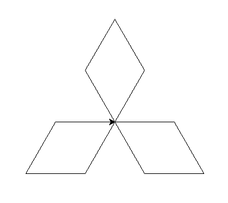

*Kontrolltöö, 27.-28. september*
====================================
 
Kontrolltöö toimub praktikumi ajal ja koosneb 2 programmeerimisülesandest, mis nõuavad 1.-3. nädala teemade valdamist.

.. admonition:: NB!
    
    Seda kontrolltööd ei ole võimalik hiljem järgi teha. Kui te ei saa enda praktikumi ajal kohale tulla, siis uurige eelnevalt, kas saate teha kontrolltöö koos mõne teise rühmaga.
    
Kontrolltöö ajal võib kasutada kaasavõetud materjale ja internetti. *Suhtlemine (sh. interneti teel) ei ole lubatud* (aga loomulikult võib küsida juhendajalt selgitust, kui ülesande mõte jääb segaseks). Aega on 45 minutit.

Teemad
------
* operatsioonid arvude ja sõnedega
* muutujad
* sisend ja väljund (sh. faili avamine/lugemine/sulgemine)
* tingimuslause
* ``while``-tsükkel

NB! Esimene kontrolltöö on oluline, kuna antud teemad on aluseks kõigile järgnevatele teemadele.

Üldised nõuanded
----------------
Enne kontrolltööd:
    * Kui teil on mõned ülesanded I-III peatükist jäänud lahendamata, siis tehke see töö tagantjärgi ära.
    * Soovitav oleks teha ära ka võimalikult palju praktikumiülesandeid, mis veel lahendamata. Samas, mõned praktikumiülesanded olid mõeldud parema ettevalmistusega tudengitele -- kontrolltöö raskem ülesanne on siiski kergem, kui praktikumide raskemad ülesanded.
    * Kontrolltöö jaoks on aega vaid 45 minutit, seega peaksite olema antud teemade osas küllalt vilunud, et mitte raisata aega nt. ``while``-lause süntaksi meeldetuletamise peale. Selleks, et teil oleks võimalik kiiresti vajalikke detaile meelde tuletada, on **soovitav koostada endale paberkandjal spikker**. Kirjutage sinna täpselt seda, mida te arvate, et teil on tarvis kontrolltöö ajal meelde tuletada. Selleks tuleks muidugi käsitletud teemad üle vaadata ning mõelda, millised aspektid on ülesannete lahendamisel olulised.
    * Kui miski jääb ikka segaseks, siis küsige abi praktikumijuhendajalt või kaaslastelt.

Kontrolltöö ajal:
    * **Lugege ülesanded mõttega läbi!**
    * Ärge üritage konkreetse ülesande lahendamisel kasutada kõike, mida te programmeerimisest teate. Näiteks, kui ülesande tekstis pole ei otseselt ega kaudselt nõutud kasutajalt sisendi küsimist, siis järelikult pole selle ülesande lahenduses tarvis ``input`` funktsiooni kasutada.
    * Kui te ei oska ülesannet kohe algsel kujul lahendada siis lihtsustage seda, lahendage lihtsustatud variant ning kirjutage programmi vastav kommentaar. Lisaks on soovitav ära märkida ka see aspekt, mille taha te toppama jäite -- on suur võimalus, et selle kirjapanekul tuleb teile pähe õige lahendusidee.
    * Ärge üritage kogu programmi korraga valmis kirjutada -- sedasi on vea korral raskem vigast kohta üles leida. Pigem kirjutage mingi väike asi ja katsetaga, lisage midagi juurde ja katsetage uuesti.
    
Sisulised nõuanded
------------------
* Ärge ajage segamini sõneliteraali (jutumärkide või ülakomade vahel) ja muutuja nime (alati ilma jutumärkide/ülakomadeta). Seda probleemi demonstreerib järgnev programm:

  .. sourcecode:: py3
  
        nimi = input('Sisesta oma nimi: ')
        print('Tere ' + 'nimi')  # probleem! Alati kuvatakse tekst 'Tere nimi'
  
  Õige oleks nii: 
  
  .. sourcecode:: py3
  
        nimi = input('Sisesta oma nimi: ')
        print('Tere ' + nimi)    # nüüd saab Python õieti aru, et pidasite silmas muutujat
  
        
* Veenduge, et te teate, kuidas toimub muutujate kasutamine avaldistes (tehetes). Võib tekkida ekslik mulje, et nt. avaldis ``int(s)`` teisendab muutuja ``s`` täisarvuks. Tegelikult luuakse selle avaldisega hoopis uus täisarvuline väärtus, aga muutuja ``s`` väärtus jääb samaks (vt. :ref:`operatsioonid-muutujatega`).
* Muutujate olemuse mõistmiseks lugege vajadusel uuesti üle õpikust lõik: :ref:`milleks-muutujad`

Veaotsing
~~~~~~~~~
* Kontrollige, kas iga alustava sulu jaoks on olemas ka **lõpetav sulg**
* Kontrollige, kas muutujate või funktsioonide **nimed on õigesti kirjutatud**
* Kontrollige, kas funktsiooni definitsiooni päises ja tingimuslause tingimuse järel on olemas **koolon**
* Kontrollige, kas teil on **treppimine** (st. taandread) paigas
* Kontrollige, kas funktsiooni väljakutsel on **funktsiooni nime järel sulud** (olgu argumentidega või ilma)
* Kui programm annab vale tulemuse, siis **kuvage ekraanile vahetulemused**, et saada aru, millises kohas läks arvutus valeks.

Harjutusülesanded
----------------------
1. Labürint
~~~~~~~~~~~~~~~~
Joonistage ``turtle`` mooduli abil mingi lihtne labürint, nt:

2. Mitsubishi
~~~~~~~~~~~~~~~~~~~~
Joonistage ``turtle`` mooduli abil Mitsubishi logo kontuurid:

3. Kuup
~~~~~~~~~~~~~~
Joonistage ``turtle`` mooduli abil umbes selline kuup:

.. image:: images/kuup.gif

4a. Nimede lugemine
~~~~~~~~~~~~~~~~~~~~~~
Koostage tekstifail, mis sisaldab vaheldumisi inimeste ees- ja perenimesid, nt:

.. sourcecode:: none

    Toomas
    Tubin
    Anu
    Allik
    Peeter
    Kaun
    Kalle
    Kaabits
    

Kirjutage programm, mis kuvab failis antud nimed ekraanile nii, et ees- ja perenimi on ühel real koos, nt:

.. sourcecode:: none

    Toomas Tubin
    Anu Allik
    Peeter Kaun
    Kalle Kaabits
    
Programm võib eeldada, et failis on alati paarisarv ridu (st igale eesnimele on olemas vastav perenimi), aga nimede arv ei ole fikseeritud.

.. hint::

    Miski ei keela lugeda ühe tsüklikorduse jooksul failist mitu rida järjest.

4b. Nimede võrdlemine
~~~~~~~~~~~~~~~~~~~~~~~~~~~~
Täiendage eelmise ülesande lahendust selliselt, et ekraanile kuvatakse vaid nende inimeste nimed, kelle eesnimi pole perenimest pikem.

.. hint::

    .. sourcecode:: py3
    
        >>> len("Anu")
        3
        >>> len("Allik")
        5
    
5a. Nimede grupeerimine
~~~~~~~~~~~~~~~~~~~~~~~~~~
Antud on tekstifail inimeste nimedega (üks nimi igal real). Kirjutage programm, mis väljastab nimed 5-liikmeliste gruppidena (viimases grupis võib olla vähem liikmeid). Näiteks, kui faili sisu on:

.. sourcecode:: none

    Toomas
    Tõnu
    Anu
    Mari
    Kalle
    Malle
    Teet
    Peeter
    Joonas
    Maarja
    Heino
    Vallo

siis programmi väljund peaks olema midagi sellist:

.. sourcecode:: none

    Toomas
    Tõnu
    Anu
    Mari
    Kalle
    ----------------------
    Malle
    Teet
    Peeter
    Joonas
    Maarja
    ----------------------
    Heino
    Vallo

5b. Viieks loe
~~~~~~~~~~~~~~~~~~~~~~~~~~~~~~~
Täiendage eelmise ülesande lahendust selliselt, et väljundis oleks nimed grupisiseselt nummerdatud, nt:

.. sourcecode:: none

    1. Toomas
    2. Tõnu
    3. Anu
    4. Mari
    5. Kalle
    -------------------------
    1. Malle
    2. Teet
    3. Peeter
    4. Joonas
    5. Maarja
    -------------------------
    1. Heino
    2. Vallo

6. Keskmine vanus
~~~~~~~~~~~~~~~~~~~~~~
Oletame, et on antud kaks tekstifaili, ühes on `n` rida inimeste nimedega (iga nimi eraldi real), teises `n` rida vastavate inimeste sünniaastatega (täisarvud, iga aastanumber eraldi real). Kirjutada programm, mis arvutab ja väljastab, milline oli nende inimeste keskmine vanus mingil konkreetsel aastal (see aastaarv tuleb küsida kasutajalt). Seega, programm küsib kasutajalt üheainsa täisarvu ja annab vastuseks üheainsa reaalarvu.

.. admonition:: Lihtsam variant

    Sünniaastate asemel on teises failis kirjas inimeste vanused (täisaastates) ja keskmine vanus tuleb arvutada nende vanuste põhjal.
