IV. Algoritm ja plokkskeem
==========================

Peale antud teema läbimist üliõpilane oskab

* selgitada algoritmi mõistet;

* lihtsamate ülesannete korral esitada probleemi täpse püstituse, st välja selgitada algandmed ja nõutava tulemuse;

* leida antud ülesande lahendamiseks kohased põhitegevused ja esitada nende täitmise järjekorra;

* esitada lihtsamate ülesannete lahendust plokkskeemina (nt. lihtsamate kilpkonnaülesannete korral).

Sissejuhatus
------------

**Ülesanne 1.** Dokumentideta võõras linnas
~~~~~~~~~~~~~~~~~~~~~~~~~~~~~~~~~~~~~~~~~~~
Kujutle end võõras linnas välisüliõpilanena. Saabudes ühiselamu juurde avastad, et ühiselamu võti, ID-kaart ja mobiiltelefon on kadunud. Kuidas lahendada olukord?

Meie igapäevaelus tuleb meil ette suuri ja väikesi ülesandeid. Mõned on lihtsad lahendada, teiste lahendamine pöörab kogu elu pahupidi (arst avastab sinu lähedasel üliharva esineva ravimatu haiguse). Mõnedele ülesannetele on olemas standardvastused, teiste korral tuleb neid alles hakata otsima. Mõned probleemid tunduvad huvitavana, mõned mitte.  
Ülesanded varieeruvad oma olemuselt matemaatilistest kuni filosoofilisteni (Mis on elu mõte?). Arvutiteaduses me tegeleme probleemidega, mille lahendust saab esitada algoritmina. 

*Algoritmiks* nimetatakse probleemi lahendamiseks vajalikku instruktsioonide hulka, mida on võimalik tõlkida arvuti jaoks arusaadavale kujule (programm) ja  mida täidab arvuti. 

Pöördume tagasi ülesande 1 juurde. Siin on ülesande püstitus puudulik. Tekib palju küsimusi, millele pole vastuseid: Kuhu need asjad kadusid? Kas need kadusid korraga? Kas need kadusid teel koju? Kas nad jäid ülikooli mõnda auditooriumi? 

Selliseid küsimusi saab esitada veel ja lahendust pole võimalik üheselt määrata.    

**Ülesanne 2.** Ruut ja ring
~~~~~~~~~~~~~~~~~~~~~~~~~~~~
Ringi sisse on joonistatud ruut, mille külje pikkus on 2a. Leida ringi pindala. 

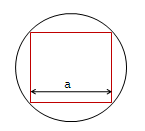

Siin on tegemist täpselt defineeritud geomeetriaülesandega. Peale ülesandest arusaamist on vaja lahendusplaani. On vaja välja selgitada sisend (ristküliku külg) ja väljund (ringi pindala) ja kasutada sobivat tähistust.  Edasi on vaja välja selgitada seos sisendi ja väljundi vahel, mis viib lahenduseni. See võib sisaldada vahepealsete tulemuste arvutamist, nt ristküliku diagonaali arvutamist. On vaja kasutada tasandilise geomeetria põhiteadmisi (antud juhul Pythagorase teoreemi). Täiendame joonist 

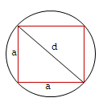

ja esitame lahenduse kahe sammuna:

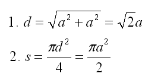

**Ülesanne 3.** Hundi, kitse ja kapsa üle jõe viimine 
~~~~~~~~~~~~~~~~~~~~~~~~~~~~~~~~~~~~~~~~~~~~~~~~~~~~~
Mees peab ületama jõe paadiga, millesse mahub peale tema ainult üks kaaslane. Ta peab üle jõe viima hundi, kitse ja kapsapea. Mees peab tegutsema nii, et samal ajal, kui ta ise on paadiga jõel, ei sööks hunt ära kitse ega kits kapsapead. 

Seda tüüpi ülesanne sisaldab loogikat. Tulemuseks ei ole arvutatav väärtus nagu ülesandes 2, vaid rida käike, mis esitavad üleminekut algseisundist (kõik tegelased on ühel pool jõge) lõppseisundisse (kõik tegelased on teisel pool jõge). 

.. note::
   Leida ülesandele vähemalt üks lahendus.

**Ülesanne 4.** 
~~~~~~~~~~~~~~~
Joonisel on esitatud Pascal'i arvude kolmnurk

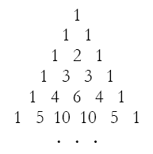

Äärmistel kohtadel on arv 1. Ülejäänute korral on väärtuseks kahe lähima arvu summa arvule vahetult ülemisel real. Kuidas arvutada kombinatsioonide arvu *n* elemendist *k* kaupa

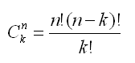

kus 

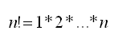

kasutades Pascali kolmnurka?
Kuidas on Pascali kolmnurga arvud seotud kordajatega valemis  

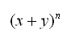

peale valemi lahtikirjutamist? 
Toodud näited illustreerivad olukordi, mis tekivad ülesannete lahendamisel. 

Ülesande lahendamise protsess (problem solving)  
-----------------------------------------------
Ülesande lahendamise arvutil võib jagada järgmisteks etappideks:

1. Algoritmi koostamine ja esitamine.
2. Programmi koostamine mingis konkreetses programmeerimiskeeles.
3. Programmi sisestamine arvutisse.
4. Programmi testimine ja silumine.
5. Programmi käivitamine arvutis, andmete sisestamine ja tulemuse saamine arvutist.

.. index::
    single: algoritm
    
.. _algoritm:    

Algoritm
--------

Mõiste *‘algoritm’* on tuletatud 9. sajandi Pärsia matemaatiku Mohammed al-Khowarizmi nimest. Al-Khowarizmi on Algorismus (ladina keeles) - algorithm.

Esitame nüüd algoritmile täpsema definitsiooni.

**Algoritm**  on  täpselt defineeritud (arvutuslik) protseduur, mis koosneb instruktsioonide hulgast, mis saab sisendina ette mingi väärtuse või väärtuste hulga ja leiab väljundiks mingi väärtuse või väärtuste hulga. Teiste sõnadega, algoritm on protseduur, mis võtab andmed ja manipuleerib nendega, järgides ettekirjutatud samme ja leiab otsitavad väärtused.

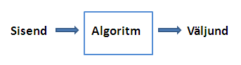

Kokkuvõtvalt, algoritm on arvutispetsialistide kõnepruugis lihtsalt protseduur. Erinevate elukutsete inimestel on erinev vorm oma töövoost ja nad nimetavad seda erinevalt. Näiteks kokk järgib protseduuri, mida nimetatakse  retseptiks. Retsept kirjeldab algoritmi, mis teisendab rea sammude abil toiduained (sisend) mingiks toiduks (väljund). Algoritm hõlmab lahenduse kogu loogikat. Seega ülesande lahendamine jaotub kaheks etapiks:

* algoritmi koostamine, mis lahendaks ülesande,
* algoritmi teisendamine programmiks.

Viimast protsessi nimetatakse programmeerimiseks ja see protsess on suhteliselt lihtsam, sest kogu loogika on juba olemas ja tuleb lihtsalt järgida kasutatava programmeerimiskeele süntaksit. Esimene etapp võib olla komistuskiviks paljudele ja seda kahel põhjusel:

* esitatakse väljakutse vaimsetele võimetele (mõtlemisele), et leida õige lahendus.
* see nõuab võimet selgesti väljendada lahenduskäik täpselt samm-sammuliste isntruktsioonidena.

Teist oskust omandatakse ja täiustatakse pidevalt läbi praktika. 
   
.. index::
    single: algoritmi omadused

Algoritmi omadused
------------------
Algoritmil on neli olulist omadust:

1. Algoritmi iga samm peab olema *täpne*, st olema ühetähenduslik.
2. Algoritm peab olema *lõplik*. Vastasel juhul me ei saa probleemile lahendust.
3. Algoritm peab olema *efektiivne*, st ta peab andma probleemile korrektse vastuse.
4. Algoritm peab olema *üldine*, st ta peab lahendama ülesande iga eksemplari. Näiteks programm, mis leiab ringi pindala, peab töötama kõigi võimalike algandmete korral antud programmeerimiskeele ja arvuti korral. 

.. index::
    single: algoritmi esitus plokkskeemina
    
.. _algoritmi esitus plokkskeemina:    

Algoritmi esitus plokkskeemina
------------------------------

Algoritmi tavaliseks esitusviisiks on nn pseudokood, mis on segu loomuliku keele sõnadest, matemaatilistest märkidest ja programmeerimiskeele võtmesõnadest. 
Algoritmi saab esitada ka graafiliselt, nt plokkskeemina. Vaatleme järgnevalt plokkskeemis kasutatavaid kujundeid:

.. index::
    single: plokkskeem
    
.. _plokkskeem:    

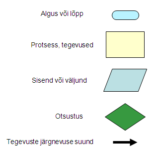

Ringi pindala
~~~~~~~~~~~~~
1. Esitame ülesande 2 lahenduse plokkskeemina:

 .. image:: _static/l04_fig20.gif 

Siin ülesande sisendiks on ruudu külje pikkus *a*. Märgime siinjuures, et jätsime vahele diagonaali arvutamise, sest ringi pindala *S* saame arvutada otse otse ruudu külje pikkuse kaudu. 
Lahendame nüüd selle ülesande arvutil, tehes läbi ka ülesande lahendamise teised etapid. 

2. Koostame programmi, kasutades programmeerimiskeelt Python:

.. sourcecode:: py3

	from math import *

	a = int(input("Sisesta külje pikkus a: "))
	S = pi*a*a/2
	print("Kui ruudu külje pikkus on " + str(a) + ", siis ringi pindala on " +  str(S))

3. Enamasti me teostame sammud 2 ja 3 korraga, st programmi koostamise käigus sisestame selle ka arvutisse.

4. Selgub, et meie programm jääb hätta siis kui kasutaja ei sisesta midagi või sisestab külje pikkuse asemel midagi muud, nt "kuus". Seega saab öelda, et antud programm töötab vaid korrektse arvulise sisendi korral, vigase sisendi korral programmi töö lõpeb veaga.   

5. Käivitame programmi konkreetse küljepikkuse jaoks ja leiame ringi pindala.  

Robotkilpkonn
~~~~~~~~~~~~~

Tuleme tagasi eelmistest paragrahvidest tuttava robotkilpkonna juurde. Oletame, et robotkilpkonn 
liigub ristkülikukujulisel mänguväljakul, mille mõõtmed pole teada:

 .. image:: _static/l04_fig11.gif 
 
Kilpkonn oskab sooritada järgmiseid tegevusi:

 .. image:: _static/l04_fig12.gif  
 
**Ülesanne 5.** Kolm sammu edasi ja ümberpöörd
~~~~~~~~~~~~~~~~~~~~~~~~~~~~~~~~~~~~~~~~~~~~~~
 Robotkilpkonn asub näoga seina poole selliselt, et seinani on vähemalt 3 sammu. Kilpkonnal on vaja liikuda kolm sammu edasi ja pöörata näoga tuldud tee suunas (pöörata ümber).   

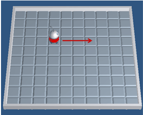

Lahenduse võib esitada järgmise plokkskeemina:

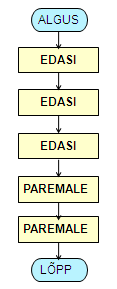

**Ülesanne 6.** Kui võimalik, kolm sammu  edasi ja ümberpöörd 
~~~~~~~~~~~~~~~~~~~~~~~~~~~~~~~~~~~~~~~~~~~~~~~~~~~~~~~~~~~~~
Robotkilpkonn asub näoga seina poole ja ei ole teada, mitu sammu on seinani. Kilpkonnal on vaja liikuda kolm sammu edasi ja pöörata näoga tuldud tee suunas (pöörata ümber). Kui seinani on vähem kui kolm sammu, siis liikuda seinani ja pöörata ümber. 

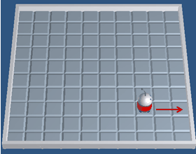

Nüüd on lahendus juba veidi keerulisem:  

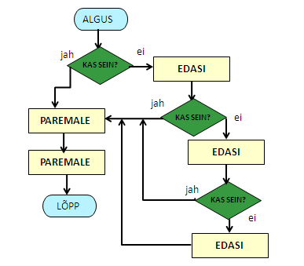

**Ülesanne 7.** Ring ümber mänguväljaku 
~~~~~~~~~~~~~~~~~~~~~~~~~~~~~~~~~~~~~~~
Kilpkonn asub ruudustiku vasakus ülemises nurgas näoga paremale. Ruutude arv ei ole teada. Kilpkonnal on vaja läbi käia suurim ring ja jõuda esialgsesse positsiooni tagasi. Koostada plokkskeem.  

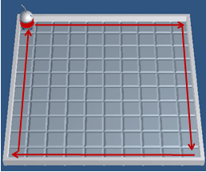

**Ülesanne 8.** Liikumine takistusest mööda
~~~~~~~~~~~~~~~~~~~~~~~~~~~~~~~~~~~~~~~~~~~
Kilpkonn asub ruudustiku suvalisel ruudul. Ruutude arv ei ole teada. Ruudustikul võib olla sirge vahesein, mille otsad ei ulatu ruudustiku servani. Kilpkonnal on vaja liikuda ruudustiku selle välisseinani, mille poole ta näoga on. Koostada plokkskeem.  

.. hint:: 
	Antud ülesande korral võib olla olukord, kus takistus asub roboti ees

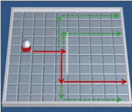

.. hint:: 
	või siis ei asu

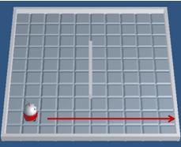

.. note:: 

	Laadides alla väikese programmi, on võimalik kilpkonna liikumist modelleerivate plokkskeemide koostamist testida ka arvuti abil  
http://www.physicsbox.com/indexrobotprogen.html

Lisalugemist
------------

Kuna algoritmi koostamine on ülesande lahendamise kõige olulisem osa, siis on ülesannete lahendusprotsessi uuritud ka süstemaatiliselt. Üheks selle ala klassikuks võib lugeda Hungari matemaatikut George Pólyat, kes uuris ülesande lahendamise protsessi lähemalt ja avaldas oma kuulsa raamatu "Kuidas seda lahendada?". Oma raamatus toob ta välja neli etappi, millega ülesande lahendajal tuleb kokku puutuda. Esitame siinkohal tema kuulsa tsitaadi:

.. index::
    single: Pólya
    
.. _Pólya:    

George Pólya:

*Suur avastus lahendab suure probleemi, kuid väike avastus on olemas iga probleemi lahenduses. Sinu probleem võib olla tagasihoidlik, kuid kui see esitab väljakutse sinu uudishimule ja toob mängu sinu leiutaja omadused. Kui sa seda lahendad omaenda vahenditega, võid kogeda pingutust ja nautida avastuse triumfi. Sellised kogemused võivad vastuvõtlikus eas tekitada vajaduse vaimse töö järele ja jätta jälje terveks eluks.*

George Pólya selgitab oma raamatus ülesande lahendamise nelja etappi, mida soovitame ka antud kursuse ülesannete korral hoolikalt järgida. 

1. Ülesandest arusaamine
~~~~~~~~~~~~~~~~~~~~~~~~
* Mis on otsitavaks? Mis on antud? Milles seisnevad ülesande tingimused?
* Kas tingimusi on võimalik üldse rahuldada? Kas tingimused on otsitava tulemi määramiseks piisavad? Kas nende hulgas on ülearuseid? Kas tingimused on vastuolulised?
* Valmista joonis. Võta kasutusele sobiv tähistus.

2. Lahendamise idee ja sellele vastava plaani koostamine
~~~~~~~~~~~~~~~~~~~~~~~~~~~~~~~~~~~~~~~~~~~~~~~~~~~~~~~~
* Kas tead mõnd teist antud ülesandega seonduvat ülesannet?
* Vaatle otsitavat! Püüa meenutada mõnda tuntud ülesannet, milles on sama või sarnane otsitav.
* Kas on võimalik seda ülesannet ära kasutada? Kas peab sisse tooma mingi abielemendi, mis võimaldaks varem lahendatud ülesannet ära kasutada?
* Kas saab ülesannet teisiti sõnastada? Veel teisiti? Pöördu tagasi definitsiooni juurde.
* Kui sa ei suuda antud ülesannet lahendada, siis proovi lahendada kõigepealt mõni temaga seonduv ja võib-olla lihtsam ülesanne. Või üldisem ülesanne? Või erijuht? Või sarnane ülesanne? Jättes osa tingimustest kõrvale, kuivõrd on otsitav siis määratud?
* Kas kasutasid kõiki andmeid? Kas kasutasid kõiki tingimusi? Kas arvestasid kõiki ülesandes sisalduvaid mõisteid?

3. Lahendusplaani täitmine
~~~~~~~~~~~~~~~~~~~~~~~~~~
* Veendu iga sammu õigsuses.

4. Tagasivaade
~~~~~~~~~~~~~~
* Kas saad kontrollida tulemust? Kas saad kontrollida lahenduskäiku?
* Kas saad tulemust teisiti leida?
* Kas tulemus või lahenduskäik on kasutatav mõne teise ülesande korral?

