V. Ülesande jagamine mooduliteks
========================================================

Peale antud teema läbimist üliõpilane oskab

* jaotada lihtsamaid ülesandeid alamülesanneteks ja esitada lahendust plokkskeemina;

* lihtsamate ülesannete korral tuua välja võimalikud erijuhud ja kontrollima neid olemasoleva algoritmi korral;

* parandada algoritmi efektiivsust (konkreetsete näidete abil).

Sissejuhatus
------------

Alustame praktilisest näitest - lihtsast kartulisalati valmistamisest, mille võib esitada järgmise plokkskeemina:

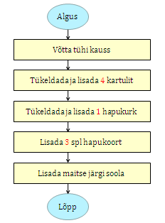

Üksi salatit valmistades on meil võimalik lisada kartuleid ühekaupa ja hapukoort ühe lusikatäie kaupa, samal ajal kontrollides, kas vajalik kogus on juba lisatud:

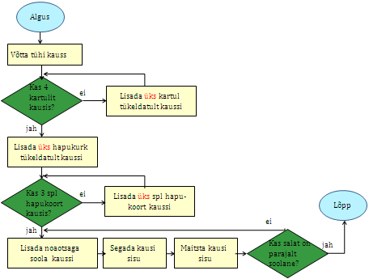

Korraldame loendamist pliiatsi ja paberiga, märkides igal lisamisel paberile ühe kriipsu. Peale kartulite lisamist kustutame kriipsud paberilt, et saaks loendada hapukurkide lisamist:

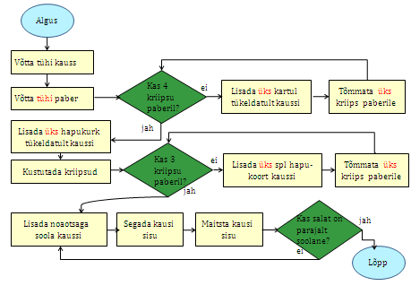

Arvutis me kasutamine loendamiseks muutujaid, hoides nendes näiteks loendamise jooksvat seisu. Loendamise algul peame loenduri seisu nullima.  

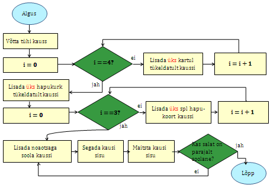

OLetame, et meil on juba olemas käsklused (funktsioonid), mis rakendamisel annavad meile vajaliku asja või toiduaine:

* ``tühiKauss()`` annab tühja kausi, 
* ``uusHapukurk()`` annab uue hapukurgi, 
* ``uusKartul()`` annab uue kartuli, 
* ``splKoort()`` annab supilusikatäie hapukoort,
* ``noaotsagaSoola()`` annab noa otsatäie soola, 
* ``maitseSisu()`` annab tagasi soolasuse maitse *m*, mille parajust saab hiljem kontrollida. 

Samuti oletame, et me saame kasutada olemasolevaid protseduure, millele asju ette andes tehakse ära mingi töö:

* ``lisaTükeldatult(a, k)`` lisab  aine *a* tükeldatult kaussi *k*, 
* ``segaSisu(k)`` segab kausis *k* olevad ained kokku.

Kasutades neid käsklusi, saame kartulisalati tegemise esitada järgmisel kujul:
 
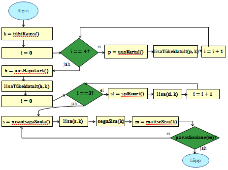

Lihtsustame oma plokkskeemi selliselt, et anname uue kartuli, hapukurgi, supilusikatäie hapukoore ja noaotsatäie soola võtmise otse lisamise käsklustele, sest meil ei ole neid eraldi muutujates vaja rohkem kasutada:

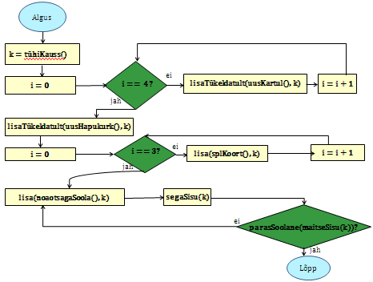

Kogu salatitegemise saame jaotada eraldiseisvateks tegevusteks: kartuli, hapukurgi, hapukoore ja soola lisamine. 
Kartulite lisamine: 

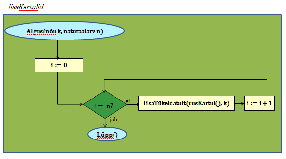

Paneme tähele, et kartulite lisamine protseduurile antakse ette nõu *k* ja naturaalarv *n*, mitu kartulit antud nõusse lisada.   
Järgmiseks protseduuriks on hapukurkide lisamine:

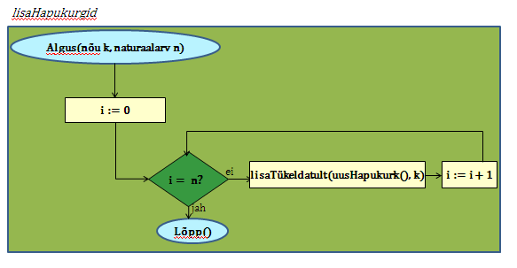

Hapukoore lisamine:

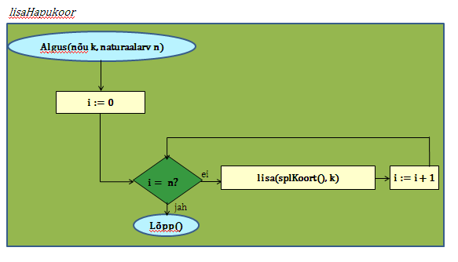

Soola lisamine:

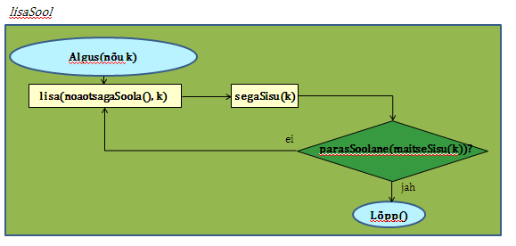

Kasutades neid protseduure, saame kogu ülesande jaoks esialgsele skeemile sarnase skeemi:

.. image:: _static/l05_fig11.gif

Retseptikogudes antakse ette retsepti täitmise tulemusena valmiva toidu jaoks sööjate arv. Teeme seda siingi, oletades, et esialgne kogus oli mõeldud ühele inimesele ja muudame vastavalt kasutatavate koostisainete kogust. Seega *n* inimese tarbeks kartulisalati valmistamise algoritm näeks välja järgmine: 

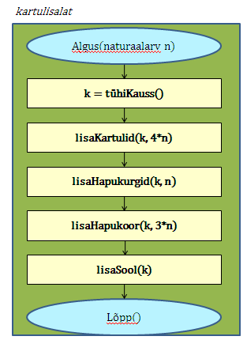

Siiani oleme plokkskeemidena esitanud ainult protseduure, mis muudavad küll süsteemi seisundit, aga otseselt midagi väljakutsujale tagasi ei anna. Näitena funktsioonist esitame siin varemvaadeldud ülesannet ringi pindalast. Esitame  plokkskeemi funktsioonist, mis saab ette ruudu külje pikkuse ja annab väljakutsujale tagasi ringi pindala:

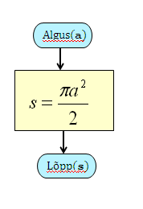
 
Esinevus siin eelmise ringi pindala plokkskeemiga seisneb selles, et lõpuplokis näidatakse tagastatavad andmed.

Robotkilpkonn
~~~~~~~~~~~~~

Nägime, et alamülesandeid on kahte liiki: funktsioonid ja protseduurid. Toome nüüd näite protseduuride kasutamisest robotkilpkonna korral.
Võtame robotkilpkonna korral samuti kasutusele funktsioonid ja protseduurid. Paneme kirja kilpkonna poolt sooritatavad tegevused protseduuride või funktsioonidena:

``edasi()`` - kilpkonn liigub ühe sammu edasi;

``paremale()`` - kilpkonn pöörab 90 kraadi võrra paremale;

``värvi()`` - kilpkonn värvib ruudu, mille peal ta asub;

Kui rakendada robotkilpkonnale funktsiooni 

``kasSein()``, siis kilpkonn annab tagasi kas ``jah`` või ``ei``, sõltuvalt sellest, kas vahetult tema ees on sein või mitte. 

**Ülesanne 1.** Värvi triibuliseks
~~~~~~~~~~~~~~~~~~~~~~~~~~~~~~~~~~
Koostada plokkskeem algoritmile, millega kilpkonn värvib ruudustiku põranda põhjast lõunasse triibuliseks. Kilpkonn asub ruudustiku ülemises vasakus (s.t. loode-) nurgas, näoga lõunasse. 

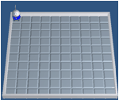

Ülesande lahendamiseks valime kõigepealt strateegia, kuidas robotkilpkonn liigub ruudustikul. Üheks võimaluseks on variant, kus kilpkonn värvib ühe triibu ja liigub tuldud teed tagasi. Ta kordab värvimist järgmisel värvitaval veerul (üks veerg tuleb jätta vahele, et tulemus oleks triibuline). Koostame plokkskeemid järgmiste alamülesannete jaoks:

* Ühe triibu värvimine robotkilpkonna liikumisel kuni seinani.
* Robotkilpkonna tagasitulek sama teed mööda seinani ja lõpuks pööre paremale.

Alamprotseduur ``triip()``

Tegevus: Robotkilpkonn värvib triibu kuni seinani.

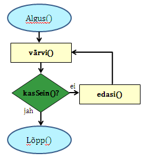

Alamprotseduur ``tagasi()``

Tegevus: Robotkilpkonn pöörab ümber, liigub seinani ja lõpuks pöörab paremale.

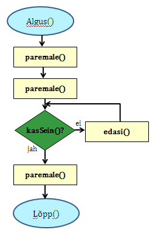

Koostame nüüd plokkskeemi kogu mänguväljaku värvimiseks triibuliseks, kasutades juba koostatud protseduure:

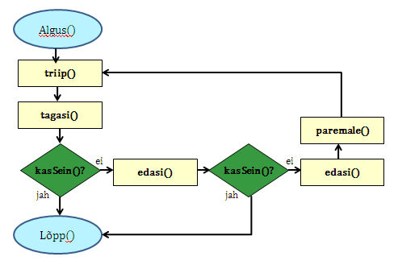

Selline värvimine annab soovitava tulemuse, kuid lahendus sisaldab ülearust tühjalt liikumist lõunast põhja. Koostame nüüd sellise algoritmi, kus kilpkonn ei liigu tühjalt, vaid värvib ruudustikku ka liikumisel lõunast põhja. Selleks kasutame juba olemasolevat protseduuri ``triip`` ja koostame veel ühe protseduuri, mille abil kilpkonn pöörab vasakule:

Alamprotseduur ``vasakule()``

Tegevus: Robotkilpkonn pöörab vasakule.

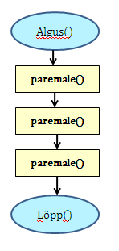

Enne uue triibu värvimist peab kilpkonn lõunas pöörama kaks korda vasakule ja põhjas kaks korda paremale. Selle realiseerimiseks võtame appi loenduri *l*, mille abil saame kindlaks teha, kummale poole on vaja pöörata. Kui loendur jagub kahega, siis on vaja pööramisi vasakule, vastasel juhul paremale. Kogu värvimisprotseduur oleks järgmine:

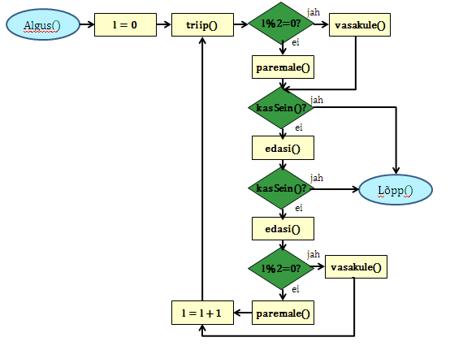

Antud juhul robotkilpkonn liigub ökonoomsemalt, kuid algoritmile vastav plokkskeem on veidi keerulisem.  Algoritmi koostamisel tuleb arvestada ülesande püstituses olevaid nõudmisi.

**Ülesanne 2.** Liigu nurka
~~~~~~~~~~~~~~~~~~~~~~~~~~~

Kilpkonn asub näoga seina poole ja ei ole teada, mitu sammu on seinani. Kilpkonnal on vaja liikuda nurka (pole oluline, millisesse). Koostada plokkskeem, milles kasutatakse uut alamprotseduuri. 

**Ülesanne 3.** Ring ümber mänguväljaku
~~~~~~~~~~~~~~~~~~~~~~~~~~~~~~~~~~~~~~~

Kilpkonn asub ruudustiku vasakus ülemises nurgas näoga paremale. Ruutude arv ei ole teada. Kilpkonnal on vaja läbi käia suurim ring ja jõuda esialgsesse positsiooni tagasi. Koostada plokkskeem.  Kasutada eelmise ülesande alamprotseduuri. 
 
**Ülesanne 4.** Seinani ja tagasi
~~~~~~~~~~~~~~~~~~~~~~~~~~~~~~~~~
Kilpkonn asub näoga seina poole ja ei ole teada, mitu sammu on seinani. Kilpkonnal on vaja liikuda seinani, pöörata ümber ja liikuda tagasi samasse kohta algasendisse. Koostada plokkskeem.  

**Ülesanne 5.** Liigu ettenähtud kohta
~~~~~~~~~~~~~~~~~~~~~~~~~~~~~~~~~~~~~~

Kilpkonn asub seinaga ümbritsetud ja ilmakaarte järgi orienteeritud ruudustiku mingil ruudul, ninaga itta. Kirjutada plokkskeemi kujul protseduurid, millega kilpkonn
a) liigub ruudustiku kirdenurka ja jääb seal pidama;
b) liigub ruudustiku edelanurka ja jääb seal pidama;
c) liigub ruudustiku äärele ja hakkab äärt pidi päripäeva ringiratast liikuma.

**Ülesanne 6.** Loe tumedad laigud
~~~~~~~~~~~~~~~~~~~~~~~~~~~~~~~~~~
Kilpkonn asub ruudustiku loodenurgas näoga itta. Koostada plokkskeemi kujul funktsioon, mis loendab ruudustikul asuvad tumedad laigud. Ruudustiku mõõtmed pole teada. Kilpkonna juhtimiseks on lisaks veel operatsioon

``KasTumeLaik()`` - Kilpkonn kontrollib, kas ruut, millel asub kilpkonn, on tume.

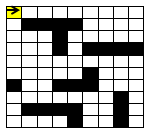

Koostada abistavaid alamprotseduure.

**Ülesanne 7.** Istuta lilli
~~~~~~~~~~~~~~~~~~~~~~~~~~~~
Kilpkonn asub ruudustiku loodenurgas näoga itta. Koostada plokkskeem protseduuri jaoks, mis istutab ruudustikule lilli. Ruudustiku mõõtmed pole teada. Lill ei kasva äärel ega kontaktis teise lillega. Kilpkonna juhtimiseks on lisaks lille istutamise operatsioon:

``Istuta()`` - Kilpkonn istutab lille samale ruudule, kus ta parajasti asub, kusjuures kilpkonna orientatsioon pole oluline. 

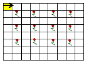

Koostada abistavaid alamprotseduure.

**Ülesanne 8.** Malelaud
~~~~~~~~~~~~~~~~~~~~~~~~

Kilpkonn asub ruudustiku loodenurgas näoga itta. Koostada plokkskeem protseduuri jaoks, mis värvib ruudustiku malelaua sarnaselt ruuduliseks. Ruudustiku mõõtmed pole teada. Koostada abistavaid alamprogramme.

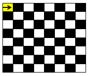

**Ülesanne 9.** Bankett
~~~~~~~~~~~~~~~~~~~~~~~

Kilpkonn  peab kontrollima, kas ühe ruudu laiuse,  põhja-lõunasuunaliselt paigutatud pika banketilaua ääres on iga koha juures tool. Kilpkonn seisab banketilaua põhjapoolses otsas. Laua pikkus on talle teadmata. Toolid peavad olema iga ruudu juures, ka laua põhja ja lõunaotsas. Kilpkonna juhtimiseks on lisaks järgmised operatsioonid: 

``KasLaud()`` - Kilpkonn kontrollib, kas kilpkonna nina ees on laud.

``KasTool()`` - Kilpkonn kontrollib, kas sellel ruudul, kus kilpkonn seisab, on tool.

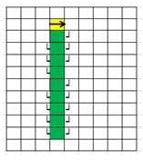

Kilpkonn peab töö lõpetama samal ruudul, kust ta alustas. Koostada plokkskeemi kujul funktsioon. Koostada abistavaid alamprogramme.

