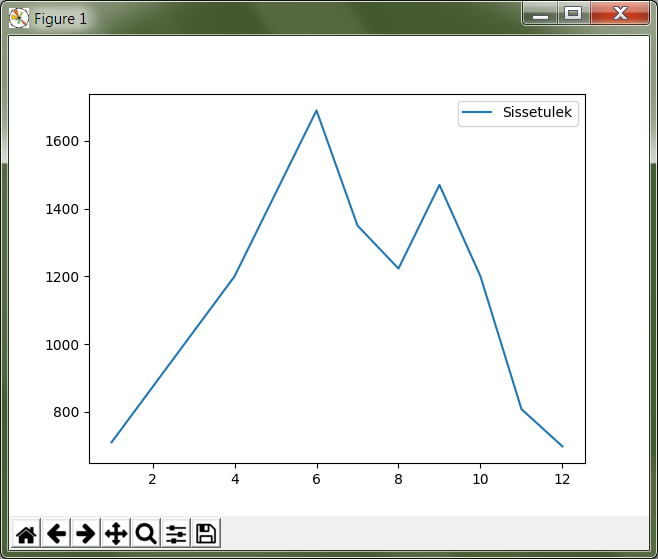
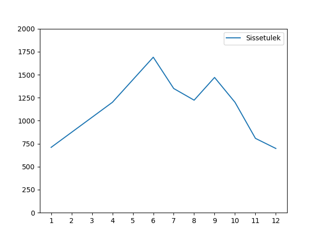
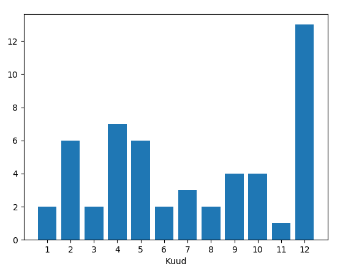

**********
Matplotlib
**********

.. todo::

    TODO: joonestusala vs teljestik
    TODO: selle juhendi läbilugemine aitab ka dokumentatsioonis orienteeruda
    
    * grid
    

Matplotlib on Pythoni pakett graafikute koostamiseks. 

.. admonition:: NB!

    Hetkel on juhend veel lõpetamata, aga tõenäoliselt juba kasulik...

Paketi paigaldamine
===================
Thonny puhul vali *Tools* menüüst *Open system shell* ja sisesta süsteemi käsureale ``pip install matplotlib``

TODO: Lisa ka Thonnyst sõltumatu juhend.

.. todo::

    listid vs NumPy

.. admonition:: Millisel kujul andmed?

    Näidetes on aastad ja vastavad elanike arvud antud harilike Pythoni listidena, aga nende asemel võivad vabalt olla ka NumPy massiivid.

Põhimõtted
==========
Oletame, et meil on andmed mingi firma sissetulekute kohta erinevatel kuudel. Proovime seda infot kõigepealt visualiseerida ``matplotlib``-i joongraafiku abil: 

.. sourcecode:: py3

    import matplotlib.pyplot as plt
    
    kuud         = [  1,    4,    5,    6,    7,    8,    9,   10,  11,  12]
    sissetulekud = [710, 1200, 1445, 1690, 1350, 1223, 1470, 1200, 808, 698]
    
    fig = plt.figure()           # Kõigepealt loome joonist tähistava objekti
    ax = fig.add_subplot(1,1,1)  # ja lisame joonisele joonestusala.
    
    ax.plot(kuud, sissetulekud)  # Lisame joonestusalale joondiagrammi
    ax.set_xlabel("Kuud")        # ja x-telje pealkirja
    
    fig.show()                   # Kuvame joonise ekraanile.

Käivita see programm ja katseta avanenud aknas olevaid nuppe. 

Selle lihtsa näite põhjal saame välja tuua kõige olulisemad ``matplotlib``-i põhimõtted ja tavad.

* Kõige sagedamini kasutatav matplotlib-i moodul on :py:mod:`matplotlib.pyplot`, mis imporditakse tavaliselt lühema nime ``plt`` alla.
* Imporditud moodulis on funktsioon :py:func:`figure<matplotlib.pyplot.figure>`, mille abil luuakse joonist tähistav objekt.
* Ühel joonisel võib olla mitu graafikut/joonestusala (ing k *subplot*). Uue joonestusala loomiseks kasutatakse joonise meetodit :py:meth:`add_subplot<matplotlib.figure.Figure.add_subplot>`, mille argumendid näitavad mitmeks reaks ja veeruks joonis jagada ning mitmes joonestusala luua. Ühe joonestusalaga jooniste puhul on argumendid alati ``1,1,1``.
* ``add_subplot`` tagastab objekti klassist :py:class:`Axes<matplotlib.axes.Axes>` (*teljestik*), mille abil saab konkreetsele joonestusalale elemente lisada.
    * Antud näites kasutasime joonestamiseks meetodit :py:meth:`plot<matplotlib.axes.Axes.plot>`, mis on mõeldud joondiagrammide koostamiseks, aga ``Axes`` oskab joonistada ka sektor-,  tulp- ja hajuvusdiagramme, histogramme, lihtsaid kujundeid ja palju muud.
    * Sama objekti kaudu käib näiteks ka telgede ja legendi seadistamine.
* Tulemust saab näha kasutades joonise meetodit :py:meth:`show<matplotlib.figure.Figure.show>`. Alternatiivina (või lisaks) võib joonise meetodiga :py:meth:`savefig<matplotlib.figure.Figure.savefig>` ka faili salvestada. 

.. admonition:: Alternatiiv: pyplot-stiil

    Internetis ringi vaadates leiate palju matplotlib-i kasutamise näiteid, kus pole meetodeid ``figure`` ja ``add_subplot`` üldse kasutatud. Meie näide võiks olla neis kohtades kirja pandud umbes selliselt:
    
    .. sourcecode:: py3
    
        import matplotlib.pyplot as plt
        
        kuud         = [  1,    4,    5,    6,    7,    8,    9,   10,  11,  12]
        sissetulekud = [710, 1200, 1445, 1690, 1350, 1223, 1470, 1200, 808, 698]
        
        plt.plot(kuud, sissetulekud)  # Lisame joonestusalale joondiagrammi
        plt.xlabel("Kuud")            # ja x-telje pealkirja
        
        plt.show()       
    
    Nagu näha on siin ``plot``, ``legend`` ja ``show`` võetud otse moodulist :py:mod:`matplotlib.pyplot`.
    
    Tegelikult luuakse ka sellise koodi korral joonisele ja joonestusalale vastavad objektid, aga see toimub automaatselt. Teisisõnu :py:func:`matplotlib.pyplot.plot`, :py:func:`matplotlib.pyplot.legend` ja :py:func:`matplotlib.pyplot.show` on veidi kavalamad, kui vastavad :py:class:`Axes<matplotlib.axes.Axes>` ja :py:class:`Figure<matplotlib.figure.Figure>` meetodid.
    
    Kuna praktiliselt kõigile ``Axes`` meetoditele olemas vastavad kavalad :py:mod:`matplotlib.pyplot` funktsioonid, siis saaks selle stiiliga panna kokku sama keerulisi jooniseid nagu eraldi väljatoodud ``Axes`` objektide abil.
    
    Kui sellised kavalad funktsioonid on olemas, miks siis üldse näha vaeva :py:class:`Figure<matplotlib.figure.Figure>` ja :py:class:`Axes<matplotlib.axes.Axes>` objektide loomisega? Tegelikult ei olegi tarvis -- eriti just lihtsate, ühekordseks kasutamiseks mõeldud graafikute koostamiseks on pyplot-stiil väga mugav ja asjakohane. Keerulisemate graafikute puhul aga võimaldavad eraldi väljatoodud ``Figure`` ja ``Axes`` objektid (st. objekt-orienteeritud stiil) lahendust selgemalt struktureerida ning teatud puhkudel on nende sissetoomine lausa möödapääsematu. Seepärast ongi selles õpikus matplotlib-i tutvustamiseks valitud objektorienteeritud stiil.
    
    Selle teema kohta saab lähemalt lugeda siit: http://matplotlib.org/faq/usage_faq.html#coding-styles
        

Joondiagramm
============
Eelmisest näitest nägime, et joondiagramme saab koostada :py:class:`Axes<matplotlib.axes.Axes>` meetodi :py:meth:`plot<matplotlib.axes.Axes.plot>` abil. Uurime nüüd asja lähemalt. 

Teljestiku seadistamine
-----------------------
Ülaltoodud koodi käivitamisel pidi ilmuma umbes selline aken:

Nagu näha, on matplotlib seadistanud graafiku teljestiku nii, et etteantud andmepunktid mahuvad parajasti ära, aga see ei pruugi olla alati parim valik -- selle pildi järgi tundub jaanuari ja juuni erinevus palju suurem, kui see tegelikult oli. Telgede ulatuse seadistamiseks saame kasutada meetodeid :py:meth:`set_xlim<matplotlib.axes.Axes.set_xlim>` ja :py:meth:`set_ylim<matplotlib.axes.Axes.set_ylim>`, mis määravad vastava telje nähtavuspiirkonna.

Teine probleem on see, et y-teljel ei ole kõikide kuude numbreid. Õnneks saab meetoditega :py:meth:`set_xticks<matplotlib.axes.Axes.set_xticks>` ja :py:meth:`set_yticks<matplotlib.axes.Axes.set_yticks>` määrata, millistesse kohtadesse tuleb telgedel märgid (*ticks*) kuvada. 

Täiendame nüüd oma graafikut neid võimalusi kasutades:

.. sourcecode:: py3
    :emphasize-lines: 12,13

    import matplotlib.pyplot as plt
    
    kuud         = [  1,    4,    5,    6,    7,    8,    9,   10,  11,  12]
    sissetulekud = [710, 1200, 1445, 1690, 1350, 1223, 1470, 1200, 808, 698]
    
    fig = plt.figure()           # Kõigepealt loome joonist tähistava objekti
    ax = fig.add_subplot(1,1,1)  # ja lisame joonisele joonestusala.
    
    ax.plot(kuud, sissetulekud)  # Lisame joonestusalale joondiagrammi
    ax.set_xlabel("Kuud")        # ja x-telje pealkirja
    
    ax.set_ylim(0, 2000)         # Määrame y-telje nähtavuspiirkonna
    ax.set_xticks([1,2,3,4,5,6,7,8,9,10,11,12])  # ja x-telje märgid
    
    fig.show()                   # Kuvame joonise ekraanile.

.. admonition:: Näide telgede paigutamisest keskele

    * http://matplotlib.org/examples/pylab_examples/spine_placement_demo.html
    
Harjutus. Märkide seadistamine
------------------------------
Uuri meetodit :py:meth:`set_xticklabels<matplotlib.axes.Axes.set_xticklabels>` ja proovi manada x-teljele kuu numbrite asemel kuu nimed.

Joone ja andmepunktide seadistamine
-----------------------------------

Kui uurid meie firma sissetuleku andmeid lähemalt, siis märkad, et veebruari ja märtsi andmed on puudu ja joondiagrammi vastav lõik on joonistatud lihtsalt jaanuari ja aprilli vahele. Oleks hea, kui graafikust tuleks välja, milliste kuude kohta on tegelikud andmepunktid olemas. 

Joone ja andmepunktide välimust saame määrata ``plot`` meetodi kolmanda argumendiga:

.. sourcecode:: py3
    :emphasize-lines: 9

    import matplotlib.pyplot as plt
    
    kuud         = [  1,    4,    5,    6,    7,    8,    9,   10,  11,  12]
    sissetulekud = [710, 1200, 1445, 1690, 1350, 1223, 1470, 1200, 808, 698]
    
    fig = plt.figure()           # Kõigepealt loome joonist tähistava objekti
    ax = fig.add_subplot(1,1,1)  # ja lisame joonisele joonestusala.
    
    ax.plot(kuud, sissetulekud, "o-")  # Lisame joonestusalale joondiagrammi
    ax.set_xlabel("Kuud")        # ja x-telje pealkirja
    
    ax.set_ylim(0, 2000)         # Määrame y-telje nähtavuspiirkonna
    ax.set_xticks([1,2,3,4,5,6,7,8,9,10,11,12])  # ja x-telje märgid
    
    fig.show()                   # Kuvame joonise ekraanile.

Antud näites ``o`` tähendab seda, et iga andmepunkti kohale tuleb joonistada täpike ja ``-`` tähendab seda, et andmepunktide vahele tuleb tõmmata kriips. 

Lisaks punkti ja kriipsu kuju määramisele, saaks sama argumendiga näidata ära ka nende värvi. Näiteks ``"^--g"`` (g nagu green) tekitab rohelised kolmnurksed andmepunktid ja katkendliku joone ning ``"*r"`` tekitab punased tärnikujulised andepunktid ilma jooneta.

Rohkem infot leiab meetodi :py:meth:`plot<matplotlib.axes.Axes.plot>` dokumentatsioonist.

TODO: grid

Mitme näitaja võrdlemine
------------------------
Tuli välja, et firmal on kogutud andmed ka antud kuude väljaminekute kohta. Teeme graafiku, mis näitab sissetulekuid ja väljaminekuid korraga. Selleks, et oleks, selge, kumb joon tähistab kumba näitajat, lisame graafikule ka legendi -- selleks lisame ``plot`` väljakutsetele ``label`` argumendid ja kutsume välja joonestusala meetodi :py:meth:`legend()<matplotlib.axes.Axes.legend>`: 

.. sourcecode:: py3
    :emphasize-lines: 5,10-11,16

    import matplotlib.pyplot as plt
    
    kuud         = [  1,    4,    5,    6,    7,    8,    9,   10,  11,  12]
    sissetulekud = [710, 1200, 1445, 1690, 1350, 1223, 1470, 1200, 808, 698]
    väljaminekud = [700, 1160, 1556, 1520, 1415, 1180, 1770,  500, 408, 505]
    
    fig = plt.figure()           # Kõigepealt loome joonist tähistava objekti
    ax = fig.add_subplot(1,1,1)  # ja lisame joonisele joonestusala.
    
    ax.plot(kuud, sissetulekud, "o-", label="Sissetulekud")               
    ax.plot(kuud, väljaminekud, "^-r", label="Väljaminekud")
    
    ax.set_xlabel("Kuud")      
    ax.set_ylim(0, 2000)         # Määrame y-telje nähtavuspiirkonna
    ax.set_xticks([1,2,3,4,5,6,7,8,9,10,11,12])  # ja x-telje märgid
    ax.legend()         
    
    fig.show()                   # Kuvame joonise ekraanile.

Tulpdiagramm
============
Tulpdiagrammi koostamiseks on meetod :py:meth:`bar<matplotlib.axes.Axes.bar>`, millele tuleb anda argumendiks tulpade positsioonid x-teljel, tulpade kõrgused ja tulba laius (x-telje skaalal):

.. sourcecode:: py3
    :emphasize-lines: 4,8

    import matplotlib.pyplot as plt
    
    kuud             = [ 1,  2,  3,  4,  5,  6,  7,  8,  9, 10, 11, 12]
    ümbrikke_kulunud = [ 2,  6,  2,  7,  6,  2,  3,  2,  4,  4,  1, 13]
    
    fig = plt.figure()
    ax = fig.add_subplot(1,1,1)
    ax.bar(kuud, ümbrikke_kulunud, 0.8)
    ax.set_xlabel("Kuud")      
    ax.set_xticks([1,2,3,4,5,6,7,8,9,10,11,12])
    
    fig.show()
    

Nagu näha, määrab meetodi ``bar`` esimene argument, kuhu satuvad tulpade vasakud servad. Paremad servad satuvad tulba laiuse võrra paremale. Kui tahame tulpasid paigutada nii, et tulba kuu märgi kohale satuks tulba keskkoht, siis tuleb esimest argumenti natuke nihutada:

.. sourcecode:: py3
    :emphasize-lines: 9-11

    import matplotlib.pyplot as plt
    
    kuud             = [ 1,  2,  3,  4,  5,  6,  7,  8,  9, 10, 11, 12]
    ümbrikke_kulunud = [ 2,  6,  2,  7,  6,  2,  3,  2,  4,  4,  1, 13]
    
    fig = plt.figure()
    ax = fig.add_subplot(1,1,1)
    
    # moodustame kuu numbrite põhjal uue listi, kus elemendid on 0.4 võrra väiksemad
    tulpade_positsioonid = [kuu - 0.4 for kuu in kuud]  
    ax.bar(tulpade_positsioonid, ümbrikke_kulunud, 0.8)
    
    ax.set_xlabel("Kuud")      
    ax.set_xticks([1,2,3,4,5,6,7,8,9,10,11,12])
    
    fig.show()

TODO: seleta list comprehensionit

Mitme näitaja tulpdiagramm
--------------------------
Kui me tahame tulpadena kõrvuti näha ümbrike ja kirjaklambrite kulusid, siis  tuleb lihtsalt meetodit ``bar`` välja kutsuda kaks korda. Seejuures aga tuleb sättida eri näitajate tulbad nii, et nad üksteist varjutama ei hakkaks. Samuti tuleb teha tulbad kitsamaks. Lisaks anname ``bar``-ile ``label`` argumendi, mille põhjal :py:meth:`legend()<matplotlib.axes.Axes.legend>` teeb joonisele legendi:

.. sourcecode:: py3
    :emphasize-lines: 5,14-15,19

    import matplotlib.pyplot as plt
    
    kuud                    = [ 1,  2,  3,  4,  5,  6,  7,  8,  9, 10, 11, 12]
    ümbrikke_kulunud        = [ 2,  6,  2,  7,  6,  2,  3,  2,  4,  4,  1, 13]
    kirjaklambreid_kulunud  = [ 5,  2,  1,  3,  3,  0,  0,  0,  1,  2,  1,  3]
    
    fig = plt.figure()
    ax = fig.add_subplot(1,1,1)
    
    # moodustame kuu numbrite põhjal uue listi, kus elemendid on 0.4 võrra väiksemad
    ümbriku_tulpade_positsioonid = [kuu - 0.4 for kuu in kuud]
    ax.bar(ümbriku_tulpade_positsioonid, ümbrikke_kulunud, 0.4, label="Ümbrikke")
    
    # kirjaklambri tulpade positsioonideks kõlbavad kuu numbrid
    ax.bar(kuud, kirjaklambreid_kulunud, 0.4, label="Kirjaklambreid")
    
    ax.set_xlabel("Kuud")      
    ax.set_xticks([1,2,3,4,5,6,7,8,9,10,11,12])
    ax.legend()
    
    fig.show()

Veel võimalusi
--------------
* Horisontaalse tulpdiagrammi jaoks on meetod :py:meth:`barh<matplotlib.axes.Axes.barh`
* ...

Kahe y-telje kasutamine
=======================
Siiani tehtud joon- ja tulpdiagrammide kombineerimine ei ole tehniliselt võttes midagi rasket -- kuna x-teljel oli kõigil juhtudel sama skaala, siis tuleb lihtsalt kõik elemendid lisada samale joonestusalale. Tuleb vaid arvestada, et rahaasjade andmetes oli meil veebruari ja märtsi kohal auk, aga kontoritarvete puhul oli ka nende kuude jaoks andmed olemas:

.. sourcecode:: py3

    import matplotlib.pyplot as plt
    
    raha_kuud      = [  1,    4,    5,    6,    7,    8,    9,   10,  11,  12]
    sissetulekud   = [710, 1200, 1445, 1690, 1350, 1223, 1470, 1200, 808, 698]
    väljaminekud   = [700, 1160, 1556, 1520, 1415, 1180, 1770,  500, 408, 505]
    
    asjade_kuud             = [ 1,  2,  3,  4,  5,  6,  7,  8,  9, 10, 11, 12]
    ümbrikke_kulunud        = [ 2,  6,  2,  7,  6,  2,  3,  2,  4,  4,  1, 13]
    kirjaklambreid_kulunud  = [ 5,  2,  1,  3,  3,  0,  0,  0,  1,  2,  1,  3]
    
    fig = plt.figure()           # Kõigepealt loome joonist tähistava objekti
    ax = fig.add_subplot(1,1,1)  # ja lisame joonisele joonestusala.
    ax.set_ylim(0, 2000)         # Määrame y-telje nähtavuspiirkonna
    ax.set_xticks([1,2,3,4,5,6,7,8,9,10,11,12])  # ja x-telje märgid
    
    ax.plot(raha_kuud, sissetulekud, "o-", label="Sissetulekud")
    ax.plot(raha_kuud, väljaminekud, "^-r", label="Väljaminekud")
    
    ümbriku_tulpade_positsioonid = [kuu - 0.4 for kuu in asjade_kuud]
    ax.bar(ümbriku_tulpade_positsioonid, ümbrikke_kulunud, 0.4, label="Ümbrikke")
    ax.bar(asjade_kuud, kirjaklambreid_kulunud, 0.4, label="Kirjaklambreid")
    
    ax.set_xlabel("Kuud")      
    ax.legend()
    
    fig.show()                   # Kuvame joonise ekraanile.

Kahjuks see lähenemine siiski ei tööta, sest rahasummad on palju suuremad kui kontoritarvete arvud ja seetõttu viimased ei paista üldse välja. Lahenduseks on kahe erineva y-skaala kasutamine (TODO: pikem selgitus ja lingid):

.. sourcecode:: py3
    :emphasize-lines: 20-26

    import matplotlib.pyplot as plt
    
    raha_kuud      = [  1,    4,    5,    6,    7,    8,    9,   10,  11,  12]
    sissetulekud   = [710, 1200, 1445, 1690, 1350, 1223, 1470, 1200, 808, 698]
    väljaminekud   = [700, 1160, 1556, 1520, 1415, 1180, 1770,  500, 408, 505]
    
    asjade_kuud             = [ 1,  2,  3,  4,  5,  6,  7,  8,  9, 10, 11, 12]
    ümbrikke_kulunud        = [ 2,  6,  2,  7,  6,  2,  3,  2,  4,  4,  1, 13]
    kirjaklambreid_kulunud  = [ 5,  2,  1,  3,  3,  0,  0,  0,  1,  2,  1,  3]
    
    fig = plt.figure()           # Kõigepealt loome joonist tähistava objekti
    ax = fig.add_subplot(1,1,1)  # ja lisame joonisele joonestusala.
    ax.set_ylim(0, 2000)         # Määrame y-telje nähtavuspiirkonna
    ax.set_xticks([1,2,3,4,5,6,7,8,9,10,11,12])  # ja x-telje märgid
    
    ax.plot(raha_kuud, sissetulekud, "o-", label="Sissetulekud")
    ax.plot(raha_kuud, väljaminekud, "^-r", label="Väljaminekud")
    
    ümbriku_tulpade_positsioonid = [kuu - 0.4 for kuu in asjade_kuud]
    ax2 = ax.twinx()
    ax2.bar(ümbriku_tulpade_positsioonid, ümbrikke_kulunud, 0.4, label="Ümbrikke")
    ax2.bar(asjade_kuud, kirjaklambreid_kulunud, 0.4, label="Kirjaklambreid")
    
    ax.set_xlabel("Kuud")      
    ax.legend(loc="upper left")
    ax2.legend(loc="upper right")
    
    fig.show()                   # Kuvame joonise ekraanile.

Nüüd häirib tulemuses veel see, et jooned jäävad osaliselt tulpade taha peitu, ning sissetulekute joon on ümbrike tulpadega sama värvi. Õnneks pakub matplotlib lahenduse ka neile muredele:

.. sourcecode:: py3
    :emphasize-lines: 16,28-30

    import matplotlib.pyplot as plt
    
    raha_kuud      = [  1,    4,    5,    6,    7,    8,    9,   10,  11,  12]
    sissetulekud   = [710, 1200, 1445, 1690, 1350, 1223, 1470, 1200, 808, 698]
    väljaminekud   = [700, 1160, 1556, 1520, 1415, 1180, 1770,  500, 408, 505]
    
    asjade_kuud             = [ 1,  2,  3,  4,  5,  6,  7,  8,  9, 10, 11, 12]
    ümbrikke_kulunud        = [ 2,  6,  2,  7,  6,  2,  3,  2,  4,  4,  1, 13]
    kirjaklambreid_kulunud  = [ 5,  2,  1,  3,  3,  0,  0,  0,  1,  2,  1,  3]
    
    fig = plt.figure()           # Kõigepealt loome joonist tähistava objekti
    ax = fig.add_subplot(1,1,1)  # ja lisame joonisele joonestusala.
    ax.set_ylim(0, 2000)         # Määrame y-telje nähtavuspiirkonna
    ax.set_xticks([1,2,3,4,5,6,7,8,9,10,11,12])  # ja x-telje märgid
    
    ax.plot(raha_kuud, sissetulekud, "o-g", label="Sissetulekud")
    ax.plot(raha_kuud, väljaminekud, "^-r", label="Väljaminekud")
    
    ümbriku_tulpade_positsioonid = [kuu - 0.4 for kuu in asjade_kuud]
    ax2 = ax.twinx()
    ax2.bar(ümbriku_tulpade_positsioonid, ümbrikke_kulunud, 0.4, label="Ümbrikke")
    ax2.bar(asjade_kuud, kirjaklambreid_kulunud, 0.4, label="Kirjaklambreid")
    
    ax.set_xlabel("Kuud")      
    ax.legend(loc="upper left")
    ax2.legend(loc="upper right")
    
    # sätime joonte teljestiku tulpade omast ettepoole
    ax.set_zorder(ax2.get_zorder() + 1)
    ax.patch.set_visible(False)
    
    fig.show()                   # Kuvame joonise ekraanile.

.. admonition:: Rohkem infot

    * http://matplotlib.org/examples/api/two_scales.html näitab, kuidas rõhutada telje ja joone seotust värvides erinevate telgede märgendid eri värvi
    * http://matplotlib.org/examples/axes_grid/demo_parasite_axes2.html näitab kuidas tekitada graafikule rohkem kui 2 y-telge.

Sektordiagramm
==============

Sektordiagrammi koostamiseks on mõeldud meetod :py:meth:`pie<matplotlib.axes.Axes.pie>`, mis võtab esimeseks argumendiks sektorite suurused ja ``labels`` argumendiks sektorite nimed:

.. sourcecode:: py3
    :emphasize-lines: 8

    import matplotlib.pyplot as plt
    
    kuud         = [  1,    4,    5,    6,    7,    8,    9,   10,  11,  12]
    sissetulekud = [710, 1200, 1445, 1690, 1350, 1223, 1470, 1200, 808, 698]
    
    fig = plt.figure()           
    ax = fig.add_subplot(1,1,1)  
    ax.pie(sissetulekud, labels=kuud)
    fig.show()

Histogramm
==========
Jätame nüüd firma rahule ja võtame ette järgmise andmekomplekti. Failis :download:`punktid.csv <downloads/punktid.csv>` (kodeering UTF-8) on tudengite poolt mingis aines kogutud punktid. Iga rida tähistab ühe tudengi andmeid. Esimeses veerus on kodutööde punktisumma, teises veerus on testi eest saadud punktid ja kolmandas veerus vaheeksami punktid.

Kõigepealt üritame saada selgust, kuidas jaotusid vaheeksami punktid. Selleks laseme matplotlib-il joonistada histogrammi. 

Me võiksime need andmed sisse lugeda harilikke faili- ja tekstioperatsioone kasutades, aga seekord võtame Pythoni standardteegi moodulist :py:mod:`csv` appi  funktsiooni :py:func:`reader`, mis teeb CSV-faili lugemise oluliselt lihtsamaks.

Histogrammi joonistamiseks kasutame ``Axes`` meetodit :py:meth:`hist<matplotlib.axes.Axes.hist>`, mis võtab esimeseks argumendiks väärtuste loetelu ja teiseks argumendiks täisarvu, mis näitab, mitmesse gruppi need väärtused tuleks jaotada.
 

.. sourcecode:: py3
    :emphasize-lines: 17

    import csv
    import matplotlib.pyplot as plt
    
    vaheeksamid = []
    
    with open("punktid.csv", encoding="UTF-8") as f:
        reader = csv.reader(f, delimiter=";")
        for rida in reader:
            try:
                vaheeksamid.append(float(rida[2]))
            except ValueError:
                # Ignoreerime puuduvate või vigaste väärtusega
                pass 
    
    fig = plt.figure()           
    ax = fig.add_subplot(1,1,1)  
    ax.hist(vaheeksamid, 20)
    fig.show()

Hajuvusdiagramm
===============
Läheme edasi tudengite poolt kogutud punktide analüüsimisega. Nüüd oleks hea teada, kas usin kodutööde lahendamine aitab saada vaheeksamil paremat tulemust -- selleks koostame kodutööde ja vaheeksami punktide põhjal ning :py:meth:`Axes.scatter<matplotlib.axes.Axes.scatter>` abil hajuvusdiagrammi.

.. sourcecode:: py3
    :emphasize-lines: 38

    import csv
    import matplotlib.pyplot as plt
    
    kodutööd = []
    vaheeksamid = []
    
    with open("punktid.csv", encoding="UTF-8") as f:
        reader = csv.reader(f, delimiter=";")
        for rida in reader:
            try:
                # Kui tudeng pole ühtegi kodutööd teinud, siis võib vastavas
                # lahtris olla 0 asemel ka sidekriips.
                # Mõlemal juhul võime öelda, et tudeng on saanud kodutööde eest 0p
                if rida[0] == "-":
                    kodutöö = 0.0
                else:
                    kodutöö = float(rida[0])
    
                # Vaheeksami puhul aga tähendab kriips seda, et tudeng puudus
                # vaheeksamilt. Kõige kindlam on praegu neid tudengeid mitte arvestada.
                # Seetõttu üritame teisendust ilma lisakontrollita. Kui see ebaõnnestub,
                # siis selle tudengi andmeid ei arvestata (ka kontrolltööd mitte)
                vaheeksam = float(rida[2])
    
                # Jätame andmed meelde alles siis, kui kõik teisendused õnnestusid.
                # See kindlustab selle, et mõlemasse listi tuleb sama palju elemente
                # ja samadel indeksitel on sama tudengi andmed, st. listides olevad andmed
                # on seotud. See on hajuvusdiagrammi koostamisel oluline.
                kodutööd.append(kodutöö)
                vaheeksamid.append(vaheeksam)
            except ValueError:
                # Ignoreerime puuduvate või vigaste väärtustega ridu
                pass 
                
    
    fig = plt.figure()           
    ax = fig.add_subplot(1,1,1)  
    ax.scatter(kodutööd, vaheeksamid)
    ax.set_xlabel("Kodutööde punktid")      
    ax.set_ylabel("Vaheeksami punktid")      
    fig.show()
    

Diagramm näitab tõesti, et rohkem kodutöid teinud tudengid said ka rohkem punkte vaheeksamil, aga algandmeid uurides näeme, et on palju tudengeid, kelle kodutööde ja vaheksami punktid kattuvad täpselt mõne teise (või paljude teiste) tudengite punktidega ja seetõttu satuvad vastavad andmepunktid ka graafikul kohakuti. Äkki selle täpi kohal, mis tähistab 0p kodutööde eest ja 20p vaheeksami eest, on tegelikult 50 täppi ja meie eespool tehtud järeldus ei pea paika?

Kõige lihtsam lahendus on kasutada ``scatter``-i väljakutsel lisaparameetrit ``alpha``, mis määrab iga täpi läbipaistvuse -- 0.0 tähendab täiesti läbipaistvat täppi ja 1.0 täiesti läbipaistmatut täppi. Kui me laseme matplotlibil joonistada osaliselt läbipaistvaid täppe, siis mitut täppi kohakuti pannes saame kokku tumedama täpi. Proovi järele:

.. sourcecode:: py3
    :emphasize-lines: 2
    
    ...
    ax.scatter(kodutööd, vaheeksamid, alpha=0.1)
    ...

Teine võimalus on näidata punktikombinatsioonide sagedust täppide suurusega. Selleks korjame kokku kõik erinevad punktikombinatsioonid ja nende sagedused, ning kasutame parameetrit ``s`` täppide läbimõõtude määramiseks. Järgneval graafikul ei tähista iga täpp enam mitte ühte tudengit, vaid ühte kodutöö ja vaheeksami punktide kombinatsiooni.

.. sourcecode:: py3
    :emphasize-lines: 3,4,6,26,27,33-52,57
    
    import csv
    import matplotlib.pyplot as plt
    from collections import Counter
    from math import sqrt
    
    kombinatsioonid = []
    
    with open("punktid.csv", encoding="UTF-8") as f:
        reader = csv.reader(f, delimiter=";")
        for rida in reader:
            try:
                # Kui tudeng pole ühtegi kodutööd teinud, siis võib vastavas
                # lahtris olla 0 asemel ka sidekriips.
                # Mõlemal juhul võime öelda, et tudeng on saanud kodutööde eest 0p
                if rida[0] == "-":
                    kodutöö = 0.0
                else:
                    kodutöö = float(rida[0])
    
                # Vaheeksami puhul aga tähendab kriips seda, et tudeng puudus
                # vaheeksamilt. Kõige kindlam on praegu neid tudengeid mitte arvestada.
                # Seetõttu üritame teisendust ilma lisakontrollita. Kui see ebaõnnestub,
                # siis selle tudengi andmeid ei arvestata (ka kontrolltööd mitte)
                vaheeksam = float(rida[2])
    
                kombinatsioon = (kodutöö, vaheeksam)
                kombinatsioonid.append(kombinatsioon)
            except ValueError:
                # Ignoreerime puuduvate või vigaste väärtustega ridu
                pass 
                
    
    # Toome välja erinevad kombinatsioonid ja täpi suurused vastavalt sagedusele
    sagedused = Counter(kombinatsioonid)
    kodutööd = []
    vaheeksamid = []
    täpi_läbimõõdud = []
    for kombinatsioon in sagedused:
        sagedus = sagedused[kombinatsioon]
        kodutööd.append(kombinatsioon[0])
        vaheeksamid.append(kombinatsioon[1])
    
        # Kui kombinatsiooni A esineb kaks korda rohkem, kui kombinatsiooni B,
        # siis kumb valik oleks õigem?
        #
        #  - A täpi läbimõõt on 2x suurem kui B oma
        #  - A täpi pindala on 2x suurem kui B oma
        #
        # On leitud, et täpsema mulje jätab see, kui sagedust näitab pindala,
        # seetõttu valime täpi läbimõõdu nii, täpi pindala sõltuks lineaarselt
        # vastava kombinatsiooni sagedusest:
        täpi_läbimõõdud.append(sqrt(sagedus) * 10)
    
    
    fig = plt.figure()           
    ax = fig.add_subplot(1,1,1)
    ax.scatter(kodutööd, vaheeksamid, alpha=0.3, s=täpi_läbimõõdud)
    ax.set_xlabel("Kodutööde punktid")      
    ax.set_ylabel("Vaheeksami punktid")      
    fig.show() 

Sageduste arvutamiseks võtsime appi klassi :py:class:`Counter<collections.Counter>` Pythoni standardteegi moodulist :py:mod:`collections` (aga seda oleksime võinud teha ka primitiivsemate vahenditega).

Kuna täpid võivad nüüd osaliselt ikkagi kattuda, siis jätsime ``scatter`` väljakutsesse ka ``alpha`` argumendi, et pilt tuleks selgem. 

.. note::

    Argumendile ``s`` saab anda väärtuseks ka ainult ühe arvu -- sel juhul tulevad kõik täpid näidatud läbimõõduga. Selline paindlikkus on matplotlib-i puhul tavaline -- näiteks ``alpha`` aktsepteerib samuti nii üksikut arvu kui arvude loetelu. 

TODO: ka üksikute täppide värvi saab varieerida

Graafikute täiendamine
======================
:py:class:`Axes<matplotlib.axes.Axes>` pakub erinevaid meetodeid graafikute täiendamiseks üksikute joonte, kujundite ja tekstiga. Toome siin ära vaid mõned näited:

* :py:meth:`axhline<matplotlib.axes.Axes.axhline>` ja :py:meth:`axvline<matplotlib.axes.Axes.axvline>` horisontaalsete / vertikaalsete joonte lisamiseks
* :py:meth:`axhspan<matplotlib.axes.Axes.axhspan>` ja :py:meth:`axvspan<matplotlib.axes.Axes.axvspan>` horisontaalsete / vertikaalsete piirkondade esiletõstmiseks   
* :py:meth:`text<matplotlib.axes.Axes.text>` ja :py:meth:`annotate<matplotlib.axes.Axes.annotate>` teksti lisamiseks
* :py:meth:`fill<matplotlib.axes.Axes.fill>` hulknurkade joonistamiseks

Järgnev näide demonstreerib nende võimaluste kasutamist:

.. sourcecode:: py3

    import csv
    import matplotlib.pyplot as plt
    
    x = [-3.4, 0.5, -1.3, -4.4, 0.4, -3.8, -2.0, 1.2, 4.5, 4.3, -2.2, -2.9, 1.0,
         0.9, 2.1, -2.4, 2.9, 0.5, 3.4, 4.4, 3.7, -1.1, 2.0, 0.4, -1.6, -3.9,
         2.0, -0.9, -2.4, 0.1, 1.5, 3.6, 1.8, 4.1, 0.2, -2.8, -4.0, -0.2, -2.6,
         -4.1, -2.6, -0.1, 3.3, 3.3, 0.7, -3.3, 4.8, -0.7, 2.5, 1.2]
    
    y = [594, 696, 299, 808, 840, 805, 0, 325, 168, 40, 444, 304, 842, 862, 406,
         578, 162, 713, 236, 986, 680, 849, 236, 1, 6, 942, 387, 635, 682, 473, 54,
         807, 948, 230, 521, 38, 423, 942, 752, 573, 117, 419, 729, 909, 106, 66,
         236, 85, 653, 846]
    
    
    fig = plt.figure()
    ax = fig.add_subplot(1,1,1)
    
    ax.scatter(x, y, zorder=3)
    ax.axhline(y=700, color='r', zorder=1)
    ax.axvspan(1,3, color="lightgreen", zorder=2)
    
    ax.text(3, 200, "Lihtne tekst")
    ax.annotate("Vaata seda!!!", (-3.4, 594), color="r",
                arrowprops={"arrowstyle" : "-|>"}, xytext=(-3, 500))
    
    ax.fill([0, -1, 2], [300, 255, 200], zorder=3, color="yellow")
    
    fig.show()

Graafikute kohandamine
======================
TODO: fondid, teljed, tickmarks, labels, grids, styles

Eksportimine
============
TODO: fig.savefig

Interaktiivsed graafikud
========================
Matplotlibi graafikuid saab panna hiireklõpsudele ja klahvivajutustele reageerima. Järgnev näide demonstreerib ühte võimalust hiireklõpsudele reageerimiseks:

.. sourcecode:: py3

    import matplotlib.pyplot as plt
    
    kuud         = [  1,    4,    5,    6,    7,    8,    9,   10,  11,  12]
    sissetulekud = [710, 1200, 1445, 1690, 1350, 1223, 1470, 1200, 808, 698]
    väljaminekud = [700, 1160, 1556, 1520, 1415, 1180, 1770,  500, 408, 505]
    
    fig = plt.figure()           
    ax = fig.add_subplot(1,1,1)  
    
    # Salvestame jooned muutujatesse, et oleks pärast võimalik vahet teha,
    # kummale joonele klõpsati.
    # Lisame ka picker argumendi, mis näitab kui lähedale peab klõpsama,
    # et klõpsu seostatakse joonega
    [sissetulekute_joon] = ax.plot(kuud, sissetulekud, "o-", label="Sissetulekud", picker=3)               
    [väljaminekute_joon] = ax.plot(kuud, väljaminekud, "^-r", label="Väljaminekud", picker=3)
    
    ax.set_xlabel("Kuud")      
    ax.set_ylim(0, 2000)        
    ax.set_xticks([1,2,3,4,5,6,7,8,9,10,11,12]) 
    ax.legend()         
    
    # defineerime funktsiooni, mis peaks klõpsudele reageerima
    def on_pick(event):
        thisline = event.artist
        
        # xdata, ydata ja evend.ind on NumPy massiivid
        xdata = thisline.get_xdata() 
        ydata = thisline.get_ydata()
        index = event.ind[0]
        
        kuu_nr = xdata[index]
        summa = ydata[index]
        
        if thisline == sissetulekute_joon:
            näitaja = "sissetulek"
        else:
            näitaja = "väljaminek"
            
        print(str(kuu_nr) + ". kuu " + näitaja + " oli " + str(summa))
    
    # registreerime funktsiooni klõpsudele reageerima
    cid = fig.canvas.mpl_connect('pick_event', on_pick)
    
    fig.show()                   

Täpsemalt loe siit: http://matplotlib.org/users/event_handling.html

Graafikute integreerimine programmidesse
========================================

Matplotlib-i graafikuid saab integreerida erinevate kasutajaliidese raamistikega, sh Tkinteriga. Selleks tuleb ``Figure`` objekt luua mitte ``pyplot`` abil, vaid moodulis :py:mod:`matplotlib.figure` oleva klassi :py:class:`Figure<matplotlib.figure.Figure>` abil. Lisaks tuleb luua raamistikuspetsiifilised vidinad graafiku näitamiseks.

Järgnev näide demonstreerib pirukagraafiku lisamist Tkinteri programmi:

.. sourcecode:: py3

    import tkinter as tk
    from tkinter import ttk
    from matplotlib.backends.backend_tkagg import FigureCanvasTkAgg
    from matplotlib.figure import Figure
    
    def uuenda_graafik():
        ax.clear()
        
        # Simuleerin andmete uuendamist juhuslike andmete genereerimisega.
        # Reaalne programm loeks andmed kusagilt failist, sensoritest vms.
        import random
        k = 5
        suurused = random.sample([12, 45, 4, 14, 33, 32, 66, 23, 29, 7], k)
        nimed = random.sample(["Peeter", "Tiit", "Mari", "Jakob", "Teele",
                               "Kalle", "Malle", "Reet", "Lauri", "Kati"], k)
        
        ax.pie(suurused, labels=nimed)
        canvas.show()
    
    def salvesta_graafik():
        fig.savefig("graafik.pdf") # Fail ilmub jooksvasse kausta
    
    # Loon akna
    aken = tk.Tk()
    aken.title("Demo")
    
    # Loon graafikut tähistavad objektid
    fig = Figure(figsize=(5, 5), dpi=100) # 5x5 tolli
    ax = fig.add_subplot(1,1,1)
    fig.set_facecolor('white')
    
    # Loon pinna graafiku joonistamiseks
    # ja paigutan vastava Tk vidina
    canvas = FigureCanvasTkAgg(fig, master=aken)
    canvas.get_tk_widget().grid(row=0, column=0, columnspan=2)
    
    # Loon nupu andmete laadimiseks
    nupp1 = ttk.Button(aken, text="Uuenda graafik", command=uuenda_graafik)
    nupp1.grid(row=1, column=0)
    
    # Loon nupu graafiku salvestamiseks
    nupp2 = ttk.Button(aken, text="Salvesta graafik", command=salvesta_graafik)
    nupp2.grid(row=1, column=1)
    
    # Kuvan andmete esialgse seisu
    uuenda_graafik()
    
    # Alustan programmi peatsüklit
    aken.mainloop()

Rohkem infot:

* http://matplotlib.org/examples/user_interfaces/embedding_in_tk.html 
* https://pythonprogramming.net/how-to-embed-matplotlib-graph-tkinter-gui

Matplotlib + Plotly
===================
`Plotly <http://plot.ly/>`_ on veebiteenus, mis võimaldab interaktiivsete graafikute koostamist ja veebis publitseerimist. Muuhulgas toetab Plotly ka matplotlib-i abil koostatatud graafikute importimist. Selleks saab kasutada Pythoni paketti ``plotly``, mille saab installida käsuga ``pip install plotly``.

Järgnev näide demonstreerib, kuidas ühte meie eelpool koostatud graafikutest saata Plotly-sse:

.. attention::

    Enne selle koodi käivitamist tuleb sul teha enda Plotly konto, ning asendada funktsiooni ``sign_in`` argumendid enda andmetega!

.. sourcecode:: py3
    :emphasize-lines: 8,9,65-69

    import matplotlib.pyplot as plt
    
    import csv
    import matplotlib.pyplot as plt
    from collections import Counter
    from math import sqrt
    
    # plotly.plotly imporditakse tavaliselt nime py alla
    import plotly.plotly as py      
    
    kombinatsioonid = []
    
    with open("punktid.csv", encoding="UTF-8") as f:
        reader = csv.reader(f, delimiter=";")
        for rida in reader:
            try:
                # Kui tudeng pole ühtegi kodutööd teinud, siis võib vastavas
                # lahtris olla 0 asemel ka sidekriips.
                # Mõlemal juhul võime öelda, et tudeng on saanud kodutööde eest 0p
                if rida[0] == "-":
                    kodutöö = 0.0
                else:
                    kodutöö = float(rida[0])
    
                # Vaheeksami puhul aga tähendab kriips seda, et tudeng puudus
                # vaheeksamilt. Kõige kindlam on praegu neid tudengeid mitte arvestada.
                # Seetõttu üritame teisendust ilma lisakontrollita. Kui see ebaõnnestub,
                # siis selle tudengi andmeid ei arvestata (ka kontrolltööd mitte)
                vaheeksam = float(rida[2])
    
                kombinatsioon = (kodutöö, vaheeksam)
                kombinatsioonid.append(kombinatsioon)
            except ValueError:
                # Ignoreerime puuduvate või vigaste väärtustega ridu
                pass
    
    
    # Toome välja erinevad kombinatsioonid ja täpi suurused vastavalt sagedusele
    sagedused = Counter(kombinatsioonid)
    kodutööd = []
    vaheeksamid = []
    täpi_läbimõõdud = []
    for kombinatsioon in sagedused:
        sagedus = sagedused[kombinatsioon]
        kodutööd.append(kombinatsioon[0])
        vaheeksamid.append(kombinatsioon[1])
    
        # Kui kombinatsiooni A esineb kaks korda rohkem, kui kombinatsiooni B,
        # siis kumb valik oleks õigem?
        #
        #  - A täpi läbimõõt on 2x suurem kui B oma
        #  - A täpi pindala on 2x suurem kui B oma
        #
        # On leitud, et täpsema mulje jätab see, kui sagedust näitab pindala,
        # seetõttu valime täpi läbimõõdu nii, täpi pindala sõltuks lineaarselt
        # vastava kombinatsiooni sagedusest:
        täpi_läbimõõdud.append(sqrt(sagedus) * 30)
    
    
    fig = plt.figure()
    ax = fig.add_subplot(1,1,1)
    ax.scatter(kodutööd, vaheeksamid, alpha=0.3, s=täpi_läbimõõdud)
    ax.set_xlabel("Kodutööde punktid")
    ax.set_ylabel("Vaheeksami punktid")
    
    # Meetod sign_in on vajalik selleks, et graafiks jõuaks õige Plotly konto alla
    py.sign_in("sinu_kasutajanimi", "sinu_api_key") # NB! pane siia enda andmed
    plot_url = py.plot_mpl(fig)                     # Saadame graafiku Plotly-sse
    print(plot_url)

Kui kõik läks hästi, siis avanes peale selle koodi käivitamist varsti brauseri aken, mis näitas sama graafikut Plotly keskkonnas. Graafiku kõrvalt leiad HTML koodi, mille saad `lisada oma veebilehele <http://help.plot.ly/embed-graphs-in-websites/>`_. Tulemus on midagi sellist (proovi liigutada hiirt punktide kohal): 

.. raw:: html

    <iframe width="100%" height="500" frameborder="0" scrolling="no" src="//plot.ly/~aivarannamaa/14.embed"></iframe> 

.. note::
    
    Tuleb arvestada, et ``plot_mpl`` ei saa vähemalt 2016 novembri seisuga kõigi matplotlib-i graafikutega veel hakkama. Kui su graafik toimib :py:meth:`show<matplotlib.figure.Figure.show>` meetodiga, aga ``plot_mpl`` annab veateate, siis proovi graafikus midagi lihtsustada. Abi võib olla ka veateate guugeldamisest

Täpsem info
===========
Ülevaade võimalustest: http://matplotlib.org/users/screenshots.html
Väga hea ülevaade matplotlib mõistetest: http://matplotlib.org/faq/usage_faq.html

Hea tut?: http://www.labri.fr/perso/nrougier/teaching/matplotlib/

Kommentaarid
============
.. disqus::
    :disqus_identifier: matplotlib