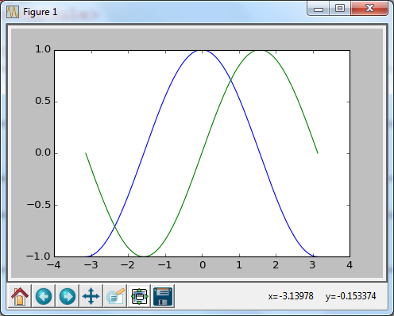
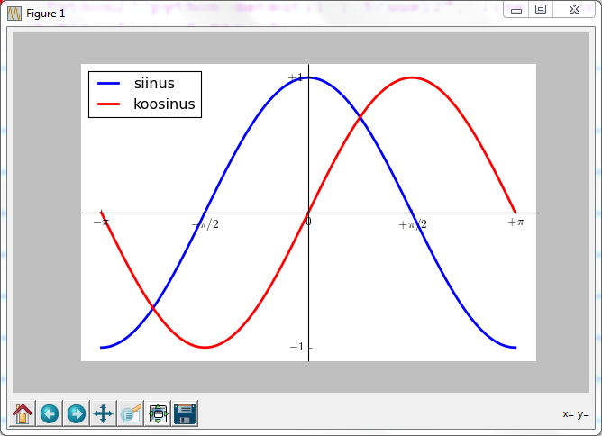
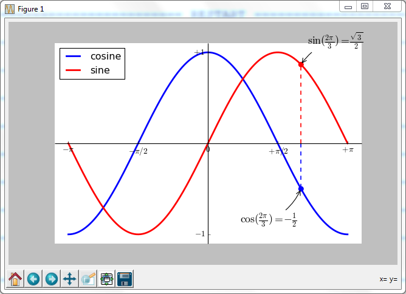
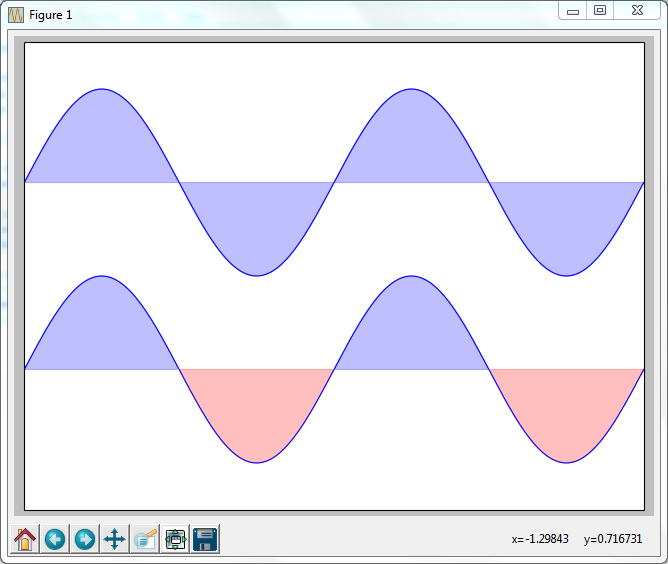

Matplotlib
**********
(Kirjutanud Allar Aav ja Andreas Suurkuusk)

.. warning::

    See peatükk on veel kontrollimata ja lõplikult viimistlemata.

 
Matplotlib on teek, mille eesmärk on kuvada graafikuid. Sellega saab teha väga erinevat tüüpi graafikuid, milledest allpool ka juttu tuleb.

Matplotlib osutub kasulikuks, kui on vaja näiteks andmeanalüüsis kuvada graafikuid. Nii nagu Pygame, ei ole ka Matplotlib Pythoniga automaatselt kaasas.
Seega tuleb see eraldi installida. 

soovituslik lisalugemine: http://matplotlib.org/ ja http://www.loria.fr/~rougier/teaching/matplotlib/ viimane viide on ka koht mis oli antud peatüki osas tähtsaim allikas.

Kuidas Matplotlib installida?
=============================

Järgnev juhend on Windowsi kasutajate jaoks.

1) Installeri leiad lehelt: http://matplotlib.org/downloads.html. Sealt otsige sobiv versioon.
2) Laadige alla teek NumPy, Python 3.2 ja 3.3 jaoks sobib 1.8.0: http://sourceforge.net/projects/numpy/files/NumPy/. Tänu sellele saame kasutada laiend
3) Laadige alla Python dateutil: https://pypi.python.org/pypi/python-dateutil
4) Kontrollige kas installeerimine õnnestus, kirjutades "import matplotlib" Jälgige, et vastav fail oleks salvestatud samasse kausta kus on "dateutil" failid. Kui veateadet ei tule, siis saate alustada tööd. Kui saate veateate mingi lisamooduli puudumise kohta, siis vaadake kas kõik lisamoodulid on õigesti kaustades. Kui on ja käima ei saa, siis tuleb teil alla laadida veel pyparsing: http://sourceforge.net/projects/pyparsing/.
5) Nüüd peaks kõik töötama, kui ei tööta, siis kontrollige kas olete tõmmanud õiged versioonid, mis ühilduvad teie Pythoniga.

Esimene graafik
===============
Esimeseks graafikuks joonestame lihtsalt ühe sirge. kasutame käsku plot, mis on väga mitmekülgne käsk
antud juhul on graafik selline, kus x-i väärtused on 0-3 ja y väärtused 1-4. Mõelge miks see nii on.

.. sourcecode:: py3

    import matplotlib.pyplot as plt
    plt.plot([1,2,3,4])
    plt.ylabel('numbrid')
    plt.show()

Esimene päris graafik
=====================
Vaatleme ühte graafikut ja kuidas seda muuta endale meelepärasemaks. Kasutame matplotlib liidest pylab-see on MATLAB analoog. Tänu sellele saame
kasutada kõiki matplotlib võimalusi, seda kõike ei lähe vaja, aga nii on lihtsam. NumPy on kättesaadav kui np

.. sourcecode:: py3

    from pylab import *

Järgnevalt paneme paika X-telje. Antud näites on X-telje väärtused -pii kuni pii sh pii kaasa arvatud, punkte on 256(see on graafiku täpsus) 

.. sourcecode:: py3

    X = np.linspace(-np.pi, np.pi, 256,endpoint=True)

nüüd väärtustame siinuse ja koosinuse: C-koosinus, S-siinus.

.. sourcecode:: py3

    C,S = np.cos(X), np.sin(X)

Joonestame graafikud ja kuvame ekraanile

.. sourcecode:: py3

    plot(X,C)
    plot(X,S)

    show()

Pilt peaks välja nägema selline

Praeguses näites kasutasime kaasasolevaid vaikeväärtusi graafiku koostamisel, enamasti on need sobilikud, aga loomulikult saab neid kõiki ise muuta.

Järgnevalt teeme samast graafikust arenduse, mis on detailsem ja meelepärasem. Antud sammud tasub ükshaaval läbi teha

1) Muudame joonte värvust, paksust ja graafiku akna küljesuhet.

.. sourcecode:: py3

    ...
    figure(figsize=(10,6), dpi=80)
    plot(X, C, color="blue", linewidth=2.5, linestyle="-")
    plot(X, S, color="red",  linewidth=2.5, linestyle="-")

2) Muudame telgede maksimaalset ja minimaalset väärtust, sest need on antud graafiku jaoks ebavajalikult suured.

.. sourcecode:: py3

    ...
    xlim(X.min()*1.1, X.max()*1.1)
    ylim(C.min()*1.1, C.max()*1.1)

3) Muudame X-telje ja Y-telje nähtavaid väärtusi."tick" tähendab siinkohal telje Punkte.

.. sourcecode:: py3

    ...
    xticks( [-np.pi, -np.pi/2, 0, np.pi/2, np.pi])
    yticks([-1, 0, +1])

4) Muudame väärtused telgedel meile arusaadavamaks ja täpseks. 

.. sourcecode:: py3

    ...
    xticks([-np.pi, -np.pi/2, 0, np.pi/2, np.pi],
           [r'$-\pi$', r'$-\pi/2$', r'$0$', r'$+\pi/2$', r'$+\pi$'])

    yticks([-1, 0, +1],
           [r'$-1$', r'$0$', r'$+1$'])

5) Muudame telgede asukohti, et X ja Y telg kohtuksid 0 punktis.
Algul on joonisel nähtavad neli telge, mis joonistavad raami ümber funktsioonide graafikute, me teeme nii, et nähtavaks jääks ainult kaks telge. Need kaks telge liigutame andmete põhjal null punkti.

.. sourcecode:: py3

    ...
    ax = gca()
    ax.spines['right'].set_color('none') 
    ax.spines['top'].set_color('none')
    ax.xaxis.set_ticks_position('bottom')
    ax.spines['bottom'].set_position(('data',0))
    ax.yaxis.set_ticks_position('left')
    ax.spines['left'].set_position(('data',0))

6) Lisame legendi

.. sourcecode:: py3

    ...
    plot(X, C, color="blue", linewidth=2.5, linestyle="-", label="koosinus")
    plot(X, S, color="red",  linewidth=2.5, linestyle="-", label="siinus")

Pärast neid kuut sammu peaks graafik välja nägema selline

7) lisame graafikule meid huvitava punkti, olgu selleks 2pii/3, kasutades käsku annotate  ja kuvame ka vastavate funktsioonide väärtused sellel kohal.

antud punkti juurde soovitaks lisalugemist: http://matplotlib.org/api/pyplot_api.html#matplotlib.pyplot.annotate

.. sourcecode:: py3

    t = 2*np.pi/3
    plot([t,t],[0,np.cos(t)], color ='blue', linewidth=2.5, linestyle="--")
    
    annotate(r'$\sin(\frac{2\pi}{3})=\frac{\sqrt{3}}{2}$',
             xy=(t, np.sin(t)), xycoords='data',
             xytext=(+10, +30), textcoords='offset points', fontsize=16,
             arrowprops=dict(arrowstyle="->", connectionstyle="arc3,rad=.2"))
    
    plot([t,t],[0,np.sin(t)], color ='red', linewidth=2.5, linestyle="--")
    
    annotate(r'$\cos(\frac{2\pi}{3})=-\frac{1}{2}$',
             xy=(t, np.cos(t)), xycoords='data',
             xytext=(-90, -50), textcoords='offset points', fontsize=16,
    arrowprops=dict(arrowstyle="->", connectionstyle="arc3,rad=.2"))

Pärast kõikide sammude tegemist võiks kood välja näha selline:

.. sourcecode:: py3

    from pylab import *
    
    figure(figsize=(8,5), dpi=80)
    
    X = np.linspace(-np.pi, np.pi, 256,endpoint=True)
    C,S = np.cos(X), np.sin(X)
    
    plot(X, C, color="blue", linewidth=2.5, linestyle="-", label="koosinus")
    plot(X, S, color="red", linewidth=2.5, linestyle="-",  label="siinus")
    
    ax = gca()
    ax.spines['right'].set_color('none')
    ax.spines['top'].set_color('none')
    ax.xaxis.set_ticks_position('bottom')
    ax.spines['bottom'].set_position(('data',0))
    ax.yaxis.set_ticks_position('left')
    ax.spines['left'].set_position(('data',0))
    
    xlim(X.min()*1.1, X.max()*1.1)
    xticks([-np.pi, -np.pi/2, 0, np.pi/2, np.pi],
           [r'$-\pi$', r'$-\pi/2$', r'$0$', r'$+\pi/2$', r'$+\pi$'])
    
    ylim(C.min()*1.1,C.max()*1.1)
    yticks([-1, +1],
           [r'$-1$', r'$+1$'])
    
    t = 2*np.pi/3
    plot([t,t],[0,np.cos(t)],
         color ='blue',  linewidth=1.5, linestyle="--")
    
    annotate(r'$\sin(\frac{2\pi}{3})=\frac{\sqrt{3}}{2}$', xy=(t, np.sin(t)),  xycoords='data',
             xytext=(+10, +30), textcoords='offset points', fontsize=16,
             arrowprops=dict(arrowstyle="->", connectionstyle="arc3,rad=.2"))
    
    plot([t,t],[0,np.sin(t)],
              color ='red',  linewidth=1.5, linestyle="--")
    
    annotate(r'$\cos(\frac{2\pi}{3})=-\frac{1}{2}$', xy=(t, np.cos(t)),  xycoords='data',
             xytext=(-90, -50), textcoords='offset points', fontsize=16,
             arrowprops=dict(arrowstyle="->", connectionstyle="arc3,rad=.2"))
    
    legend(loc='upper left')
    
    show()

Pilt mis avaneb peaks olema selline:

Ülesanne 
========
Ilmuta ekraanile pildilolev graafik

.. hint::

    Üks võimalik lahendus:

    .. sourcecode:: py3
    
        from pylab import *
        
        n = 256
        X = np.linspace(-np.pi,np.pi,n,endpoint=True)
        Y = np.sin(2*X)
        
        axes([0.025,0.025,0.95,0.95])
        
        plot (X, Y+1, color='blue', alpha=1.00)
        fill_between(X, 1, Y+1, color='blue', alpha=.25)
        
        plot (X, Y-1, color='blue', alpha=1.00)
        fill_between(X, -1, Y-1, (Y-1) > -1, color='blue', alpha=.25)
        fill_between(X, -1, Y-1, (Y-1) < -1, color='red',  alpha=.25)
        
        xlim(-np.pi,np.pi), xticks([])
        ylim(-2.5,2.5), yticks([])
        
        show()

Näited
========
Nagu eelnevalt mainitud, siis saab matplotlib´iga teha väga erinevaid graafikuid, järgnevalt mõned näited.

.. sourcecode:: py3

    from pylab import *
    
    n = 20
    Z = np.random.uniform(0,1,n)
    pie(Z), show()

.. sourcecode:: py3

    from pylab import *
    
    n = 1024
    X = np.random.normal(0,1,n)
    Y = np.random.normal(0,1,n)
    
    scatter(X,Y)
    show()
    
