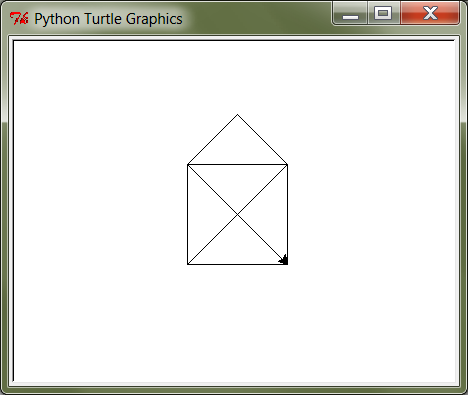

I. Sissejuhatus
===============
Esimese peatüki esmärgiks on tutvustada programmeerimise olemust ja võimalusi ning Python keele põhilisi töövahendeid -- käsurida ning keskkonda "IDLE". Uurime ka mõningaid näiteprogramme, kuid need on mõeldud vaid andmaks aimu kursuse edasisest käigust -- täpsemad selgitused ning süstemaatilise harjutamise jätame järgmistesse praktikumidesse.

.. index::
    single: käsurida
    single: shell; käsurida

Programmeerimine ja Python
----------------------------
TODO

    * Miks Python?
    * Selles kursuses programmeerimise universaalsed põhimõtted
    * keskendume sellele osale programmeerimisest, mis jääb inputi ja outputi vahele
    * Põhiülesanne: näidata lahedaid asju, mida on võimalik programmeerida ja veenda, et need on varsti jõukohased ka lugejale.
    * liiguta osa Kilpkonna asju siit järgmisesse peatükki ja too siia lihtsad if/while/for näited

Pythoni installeerimine
--------------------------
Pythoni enda arvutisse installeerimiseks laadige alla vajalikud failid Pythoni ametlikult leheküljelt http://www.python.org/download/. Valige sealt versioon `3.2`.

TODO: kas 32b või 64b?

Pythoni keskkonna enda arvutisse installeerimine on väga soovitav, sest siis saate arvutiklassis proovitud asju ka seal teha. Programmeerima pole võimalik õppida vaid loenguid kuulates – tegemist on praktilise oskusega, mis nõuab eelkõige harjutamist. Reeglina ei piisa vaid praktikumides tehtud ülesannetest ning harjutada tuleks kindlasti ka kodus.

Pythoni käsurida
----------------
.. note:: 

    Antud kursusel on oluline kasutada Pythoni versiooni, mis algab 3-ga, olgu see `3.2`, `3.1` vms. Versioonid, mis algavad 2-ga, ei sobi meile, kuna seal töötavad mõned asjad pisut teisiti, kui on kirjeldatud selles õpikus.
    
    Kuna arvutiklassides on installeeritud nii Python 2, kui Python 3, tuleks vajadusel kontrollida, et kasutate õiget versiooni. Käsurea avamisel näidatakse Pythoni versioon esimesel real. IDLE versiooni saab kontrollida menüüst `Help -> About IDLE`

TODO: äkki piisab ainult IDLE-st?

Kõigepealt võtame ette Pythoni **interaktiivse käsurea** (ing.k. *shell*), mis sobib hästi väiksemate ülesanne lahendamiseks ning Pythoni võimaluste katsetamiseks. Windowsi arvutis avage `Start -> All Programs -> Python 3.1 -> Python (command line)`. Linuxis või Macis tuleks avada terminal, ning seal sisestada käsk ``python`` (kui sellega avaneb Python 2, siis proovige käsku ``python3``).

Python kui kalkulaator
~~~~~~~~~~~~~~~~~~~~~~
Pythonit saab kasutada võimsa kalkulaatorina. Selleks tuleb lihtsalt peale Pythoni käsuviipa (``>>>``) sisestada avaldis ja vajutada reavahetuse klahvi (Enter). Tulemusena peaks ekraanile ilmuma avaldise väärtus, nt:

.. sourcecode:: py3  
    
    >>> 3 / 2
    1.5
    >>> 5 * 5
    25
    >>> 4 + 9 - 1
    12
    >>> 10 / 3
    3.3333333333333335
    >>> round(10 / 3)
    3

.. note::
    
    Siin ja edaspidi on käsurea näidete juures soovitav ise järgi katsetada mõned sarnased, aga mitte samad näiteid (kui proovite täpselt samu näiteid, siis uskuge, te saate ka samad tulemused.) Üritage Pythonit (või iseennast) üllatada!
    
.. note::
    
    Tehtemärkide ümber ei pea tingimata tühikuid panema.
    
Samamoodi nagu mõnede taskukalkulaatorite puhul, saab ka Pythonis arve "mällu" salvestada:

.. sourcecode:: py3

    >>> a = 2 * 0.9
    >>> b = 66
    >>> a + b
    67.8

Kui soovite kasutada trigonomeetrilisi funktsioone või matemaatilisi konstante, siis tuleb kõigepealt öelda Pythonile ``from math import *``, nt:

.. sourcecode:: py3

    >>> from math import *
    >>> sin(1)
    0.8414709848078965
    >>> pi
    3.141592653589793

.. hint::

    Varem antud käsu saab uuesti ette, vajutades klaviatuuril `üles` ja `alla` nooleklahve.
    

Ülesanne 1. Puu läbimõõt
~~~~~~~~~~~~~~~~~~~~~~~~
Arvutage Pythonis, kui suur on puu läbimõõt, kui ümbermõõt on 75cm.

Harjutus
~~~~~~~~
Proovige sisestada ka keerulisemaid avaldisi. Soovi korral saab tehete järjekorda muuta sulgudega. Katsetage ka "mälu" kasutamist.

.. note:: 

    Ärge kartke teha vigu! Kui Python annab mingi veateate, siis kontrollige kõigepealt oma viimast sisestust -- võibolla on puudu lõpetav sulg vms. Veateadetest arusaamine on tavaliselt algajate jaoks küll raske, kuid sellega tuleb ennast harjutada -- vigadeta ei suuda töötada ükski programmeerija.

.. index::
    single: IDLE
    
Skriptid ja IDLE
----------------
Sisukamate programmide loomine on käsureal küll võimalik, kuid tülikas. Pealegi, kui programm on piisavalt väärt, et seda ka edaspidi kasutada, siis on mõttekas ta kuidagimoodi salvestada. Pythoni programmid salvestatakse tekstifailidena, mille nime laiendiks on `py`. Taolist faili nimetakse **skriptiks** ja seda on võimalik käivitada peaaegu nagu iga teist programmi (täpne viis sõltub arvuti seadetest).

.. topic:: Lisainfo neile, kes armastavad kasutada süsteemi käsurida:

    Praktikumides käivitame oma skriptid alati läbi IDLE aga reaalsete Pythoni programmide kasutamiseks pole see kõige mugavam. Kõige levinum viis on anda arvuti käsurealt (terminal või `cmd.exe`) käsk kujul ``python minuskript.py``. See peaks Linuxis ja Macis kohe peale Pythoni installimist töötama, kuid Windowsi puhul on vaja veel natuke nokitsemist: vaata täpsemalt aadressilt http://docs.python.org/py3k/using/windows.html#configuring-python. (Samas, Windowsis saab tavaliselt Pythoni skripte käivitada ka nagu tavalisi programme, nt. topeltklõpsuga `Windows Exploreris`.)

Pythoni skripte võiks vabalt salvestada näiteks Notepad'i või mõne muu levinud tekstiredaktoriga, kuid Pythoni standardvarustuses on olemas spetsiaalne redaktor nimega **IDLE**, mis on selle töö jaoks palju sobivam.

**IDLE käivitamiseks** Windowsis vali `Start -> All Programs -> Python 3.2 -> IDLE (Python GUI)`. Linuxis tuleb sisestada terminali käsk ``idle`` (kui sellega avaneb IDLE 2, siis proovi ``idle3``). Tõenäoliselt ilmub kõigepealt IDLE käsurida (pealkirjaga "Python shell"), mis töötab enamvähem samamoodi, kui eespool kasutatud konsoolipõhine käsurida.

**Uue programmi kirjutamiseks** valige `File` menüüst `New window`. Ilmub uus aken pealkirjaga "Untitled", kuhu saab hakata kirjutama Python programmi. Esimeseks katsetuseks kopeerige redaktorisse järgnev kaherealine programmitekst, ning salvestage fail (`Ctrl+S`) kasutades failinime lõpus laiendit `py` (nt. `esimene.py`). *NB! Ärge praegu veel oma nime kuhugi kirjutage!*

.. sourcecode:: python

    nimi = input("Palun sisesta oma nimi ja vajuta ENTER: ")
    print("Tere " + nimi)

**Programmi käivitamiseks** vajutage klaviatuuril `F5`. Ilmub uuesti IDLE käsurida, kus saate sisestada programmi poolt soovitud andmed ning näha programmi reaktsiooni.

.. note::
    Nagu näha, ei kasutata skriptis käsu ees ``>>>`` märki. Käsureal kasutatakse seda vaid selleks, et oleks kergem eristada, millistel ridadel on käsud ja millistel on vastused. Skriptis on situatsioon teine, kuna sinna kirjutame vaid käsud.

    Edaspidi tuleb meil nii käsurea, kui skriptinäiteid. Kui näide algab käsuviibaga (``>>>``), siis on see mõeldud käsureal katsetamiseks. Vastasel juhul on tegemist skriptiga.

.. note::

    Üks mugav viis, kuidas Windowsis avada Pythoni faile IDLE-ga, on teha paremklõps soovitud failil (nt. `Windows Explorer`-is) ning valida `Edit with IDLE`.
    
    Kuna arvutiklassides on mitu Pythoni versiooni, siis ei pruugi fail avaneda õiges IDLE versioonis. Sel puhul võib olla abiks järgneval aadressil jagatav programm: http://defaultprogramseditor.com/. Sellega saab kasutaja määrata, millise programmiga peaks mingi failitüüp avanema. (Kui antud aadressilt ei õnnestu seda programmi laadida, siis kasuta aadressi http://courses.cs.ut.ee/2011/programmeerimine/uploads/DefaultProgramsEditor.zip)

.. note::

    IDLE käsureal saab varasema käsu uuesti ette, kui liigute nooleklahvidega soovitud käsuni ja vajutate ENTER.

.. index::
    single: turtle
    single: kilpkonn; turtle
    
Kilpkonn
--------
Nagu ehk teate, on arvutid siiski võimelised oluliselt rohkemaks kui vaid aritmeetiliste avaldiste arvutamiseks ja kasutaja tervitamiseks. Tänapäeval saab panna tekstiredaktoreid õigekirja kontrollima, mobiiltelefone GPS satelliitidega suhtlema jne. Paraku ei saa aga alustada kohe keerulisest. 

Programmeerimise puhul on etteantud käskude hulk piiratud – arvutile on selgeks õpetatud vaid mõned väga lihtsad käsud, mida ta täita oskab. Neid kombineerides ja õigesti järjestades on aga võimalik arvutit panna lõpuks tegema väga keerulisi asju. 

Demonstreerimaks käskude kombineerimist, toome siinkohal sisse ühe pedagoogilise abimehe – nimelt kilpkonna. Meie virtuaalne kilpkonn oskab kõndida edasi ja tagasi ning ennast pöörata. Tal on hambus ka pliiats, millega ta ringi kõndides enda all olevale pinnale jälje jätab. Vajadusel võib ta seda pliiatsit paberilt tõsta ning siis taas langetada. Järgnevalt vaatame, kuidas kilpkonnale sobivas järjekorras käske andes saame joonistada huvitavaid kujundeid.

.. note:: 
    
    Selline kilpkonn mõeldi esmakordselt välja 1967.a. lastele programmeerimise õpetamise otstarbel Feurzeigi ja Paperti poolt programmeerimiskeele Logo jaoks. Praeguseks on kilpkonnast saanud programmeerimise õpetamise klassika.

Kilpkonn Pythonis
~~~~~~~~~~~~~~~~~
Kilpkonna juhtimiseks kasutame 6 erinevat käsku:

* ``forward(n)``, ``backward(n)`` – edasi või tagasi `n` sammu
* ``left(d)``, ``right(d)`` – vasakule või paremale `d` kraadi
* ``up()``, ``down()`` - pliiatsi üles tõstmine ja langetamine

Kui anname käsurealt esimese käskluse, avaneb uus aken, kus kilpkonna tähistab väike nooleke.

Antud käsud pole kohe kättesaadavad, sest nad on "peidetud" `moodulisse` ``turtle``. Nende kasutamiseks peame kõigepealt ütlema Pythonile ``from turtle import *``. (Analoogselt talitasime eespool ``math`` mooduliga).

Järgnev näiteskript joonistab kilpkonnaga kolmnurga.

.. note::
    
    Ärge pange oma skripti nimeks `turtle.py` -- see ajab Pythoni `import` käsu segadusse. Üldisemalt: vältige skripti nimedes Pythoni moodulite nimesid (vähemalt neid, mida te ise impordite).
    
.. sourcecode:: py3
    
    from turtle import *
    
    forward(100)
    left(120)
    forward(100)
    left(120)
    forward(100)
    left(120)
    
    exitonclick() # see võimaldab akna sulgemist hiireklõpsuga

.. note::

    Kuigi me võiksime kilpkonna juhtida ka käsurealt, on praegu soovitav töötada skriptiga, kuna sedasi on lihtsam valesti läinud käsku korrigeerida.

Ülesanne 2. Ruut
~~~~~~~~~~~~~~~~
Joonistage kilpkonnaga ruut.

Ülesanne 3. Ümbrik
~~~~~~~~~~~~~~~~~~
Kirjutage skript, mis joonistab kilpkonnaga mõne huvitava kujundi, näiteks ümbriku. NB! Ärge unustage lisamast skripti algusesse `import`-lauset.

.. hint::
    
    Diagonaali pikkuse leidmiseks tuletage meelde üht tuntud koolimatemaatika teoreemi. Kui jääte sellega hätta, siis proovige leida paras pikkus katsetamise teel.

.. index::
    single: veaotsing
    
Vigadest
--------
Nagu ehk eelnevaid ülesandeid lahendades märkasite, annab Pythoni märku, kui te tema arvates midagi valesti olete teinud. 

Alati ei ole need veateated siiski kuigi informatiivsed -- hea näide on see, kui teile öeldakse käsu ``cos(pi)`` peale ``error: "cos" not defined``. Sisuline põhjus pole siin mitte see, et käsk ``cos`` vale oleks, vaid see, et unustasite eelnevalt sisestada käsu ``from math import *``. 

Süntaksivea korral (nt. puuduv lõpetav sulg vms.) ütleb Python veateate selle rea kohta, kus ta enam edasi lugeda ei osanud, tegelik vea põhjus on tihti hoopis eelneval real.

Edaspidistes praktikumides kohtate ka keerulisemaid olukordi, kus vea põhjust on palju raskem leida. Et selleks ennast veidi ette valmistada, on väga soovitav lugeda läbi õpikust lisa veaotsingu (ing.k `debugging`) kohta: 
http://courses.cs.ut.ee/2011/programmeerimine/uploads/Raamat/app_a.html.
Sellele võiks ka edaspidi pilgu peale visata, kui nt. mõne kodutööga hätta jääte.

Mis edasi?
--------------
TODO

.. index::
    single: installeerimine

(Kodu?)Ülesanded
-----------------
Pythoni installimine
~~~~~~~~~~~~~~~~~~~~~~~~~~
TODO

Mingi kilpkonna joonistus
~~~~~~~~~~~~~~~~~~~~~~~~~~~~
TODO

Projekti teema osas mõtisklemine
~~~~~~~~~~~~~~~~~~~~~~~~~~~~~~~~~~~~~~~~
TODO

(Lisa?)lugemine: [Programmeerimise võimalused, ajalugu, filosoofia vms.]
------------------------------------------------------------------------
TODO

    * Näited, mida kõike on võimalik programmeerida
    * programmeerimine ja juhtimine
    * Head näited progammeerimise olemusest: http://www.nrg.tartu.ee/algkursus/Teema1.htm
    * Korda seda, et sellel kursuse fookus on inputi ja outputi vahel oleval alal
    * Too programeerimise näiteks Ruby Goldbergi masin vms!!
    * teleka programmeerimine