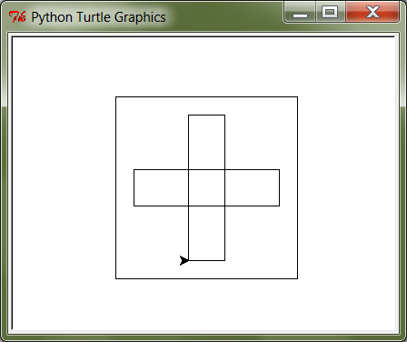

III. Alamprogrammid e. funktsioonid
===================================

Vahel juhtub, et sarnast tegevust tuleb korrata programmi mitmes eri kohas. Kuna tegevus ise on praktiliselt sama, saab probleemi muidugi lahendada vastavaid koodiridu kopeerides. Tegelikult on programmeerimises aga selleks ka teine, palju mugavam võimalus – nimelt alamprogrammid e. funktsioonid.

.. topic:: Terminoloogiast

    `Alamprogramm` on veidi üldisem nimetus, kuna `funktsioon` võib mõnes programmeerimiskeeles tähistada vaid teatud omadustega alamprogrammi. Samas, Pythonist rääkides võime kasutada neid sõnu siiski sünonüümidena.

.. index::
    single: funktsioon; defineerimine
    
Funktsiooni defineerimine ja kasutamine
---------------------------------------
Järgnevas näiteprogrammis **defineeritakse** funktsioon nimega ``tere``:

.. sourcecode:: python

    def tere():
        print("Tere")
        print("Kuidas läheb?")

Esimest rida, mis algab ``def``-iga, nimetame funktsiooni **päiseks**, järgnevad read, mis on tühikutega paremale nihutatud, moodustavad funktsiooni **keha**. 

.. note::
    
    Tühikute kasutamisel tuleb olla täpne. Soovitav on kasutada funktsiooni keha joondamiseks alati 4 tühikut, aga põhitingimuseks on praegu see, et iga rida funktsiooni kehas on joondatud sama kaugele.
    
Proovige seda käivitada. Kui kõik läks õigesti, ei ilmu ekraanile midagi. Nimelt on programmis antud juhul toodud vaid ühe tegevuse kirjeldus, kuid seal pole käsku seda (ega ühtegi teist) tegevust täita.

Sisuliselt me defineerisime uue käsu ``tere``, mille saamisel peab Python käivitama laused ``print("Tere")`` ja ``print("Kuidas läheb?")``. Kõik need "käsud", mida olete siiani kasutanud (nt. ``print`` ja ``sin``) on samuti kuskil defineeritud alamprogrammide e. funktsioonidena. Edaspidi kasutame sõna `käsk` asemel põhiliselt sõna `funktsioon`. 

Nagu ikka, tuleb funktsiooni (käsu) kasutamiseks kirjutada selle nimi koos sulgudega (antud juhul on sulud tühjad, kuna see funktsioon ei võta argumente). Programmeerijate kõnepruugis: funktsioon tuleb **välja kutsuda** (või *rakendada*). Proovige järgmist, täiendatud programmi:

.. sourcecode:: python

    def tere():
        print("Tere")
        print("Kuidas läheb?")
    
    tere() # funktsiooni väljakutse e. rakendamine e. aplikatsioon

.. note::

    Selle praktikumi põhiosas kirjutame funktsiooni definitsiooni koos väljakutse(te)ga samasse faili.
    
Tavaliselt pannakse alamprogrammidesse need laused, mida on vaja käivitada rohkem, kui ühel korral. Proovige programmi, kus funktsiooni ``tere`` on kaks korda välja kutsutud. Programmi käivitamisel peaks nüüd tulema kaks järjestikust tervitust.

.. note:: 

    Nagu eespool mainitud, funktsiooni kehas on ridade ees olevad tühikud olulised, selle järgi saab Python aru, kus lõpeb funktsiooni definitsioon ja algavad järgmised laused. Selles veendumiseks kustutage ``print("Kuidas läheb?")`` rea eest tühikud ära ning proovige siis programmi uuesti käivitada.

Ülesanne 1. Ruudu joonistamine
~~~~~~~~~~~~~~~~~~~~~~~~~~~~~~
Ka selles praktikumis kasutame meile juba varem tuttavat kilpkonna. Kirjutage funktsioon ``ruut()``, mis joonistaks kilpkonna abil ruudu (küljepikkusega 100).  Kasutage seda funktsiooni mitu korda, joonistades mitu ruutu erinevatesse kohtadesse.

.. hint:: 

    Tuletage meelde, mida tegid kilpkonna käsud ``up()`` ja ``down()``
    
.. hint::

    Kui kilpkonna rahulik tempo teid ärritab, siis andke talle käsk ``speed(10)``.

.. index::
    single: parameetrid; funktsiooni parameetrid
    single: funktsioon; parameetrid
    
Parameetrid
-----------
Täpselt sama tegevuse kordamist on tegelikult vaja siiski üpris harva. Pigem on tarvis teha midagi sarnast, kuid mitte päris identset. Näiteks võib olla vaja anda isikustatud tervitus, mis sisaldab ka tervitatava nime, mis on aga iga kord erinev. Seda saab teha, kasutades alamprogrammi **parameetreid**:

.. sourcecode:: python

    def tere(nimi):
        print("Tere " + nimi)
        print("Kuidas läheb?")
        
    tere("Kalle")
    tere("Malle")
    
Selles näites on funktsioonil ``tere`` parameeter nimega "nimi". Parameetri näol on sisuliselt tegu *muutujaga*, mille väärtus antakse ette funktsiooni väljakutsel. Konkreetsed väärtused kirjutatakse väljakutsel funktsiooni nime järel olevatesse sulgudesse. Antud juhul on parameetri väärtuseks esimesel väljakutsel "Kalle" ning teisel väljakutsel "Malle". Funktsioon töötab aga mõlemal juhul samamoodi – ta võtab parameetri väärtuse ning lisab selle tervitusele. Kuna aga väärtused on kahel juhul erinevad, on ka tulemus erinev.

.. index::
    single: funktsioon; argumendid
    single: argumendid; funktsiooni argumendid

Terminoloogia: Parameetrid vs. argumendid
~~~~~~~~~~~~~~~~~~~~~~~~~~~~~~~~~~~~~~~~~
Koos parameetritega räägitakse enamasti ka **argumentidest**. Argumendiks nimetakse funktsiooni väljakutses sulgudes antud avaldise väärtust, millest saab vastava parameetri väärtus. Parameetrid on seotud funktsiooni definitsiooniga, argumendid on seotud funktsiooni väljakutsega. Meie viimases näites on ``nimi`` funktsiooni ``tere`` `parameeter`, aga sõneliteraal ``"Kalle"`` on vastav `argument` funktsiooni väljakutses.

.. note::
    
    `Parameetri` vs. `argumendi` asemel võite mõnikord kohata ka väljendeid `formaalne parameeter` vs. `tegelik parameeter`.  

.. _param-vs-input:

Parameetrid vs. ``input``
~~~~~~~~~~~~~~~~~~~~~~~~~
Parameetritega funktsioon meenutab oma olemuselt programmi, kus on kasutatud ``input`` käsku -- mõlemal juhul on konkreetsed sisendandmed teadmata. Erinevus on selles, et kui ``input`` puhul on teada, et sisendandmed küsitakse kasutajalt, siis parameetrite kasutamisel jäetakse ka sisendi saamise viis lahtiseks. Eelnevas näites andsime funktsiooni väljakutsel parameetri väärtuseks sõneliteraalid, kuid seal oleks võinud kasutada ka muutujat:

.. sourcecode:: py3

    def tere(nimi):
        print("Tere " + nimi)
        print("Kuidas läheb?")
        
    sisestatud_nimi = input("Kuidas on sinu nimi? ")
    tere(sisestatud_nimi)

See näide demonstreerib parameetritega funktsioonide universaalsust -- vastavalt vajadusele võime taolist funktsiooni kasutada literaaliga või mõne muutujaga (mille väärtus võib olla saadud ``input``-ist).

.. note::

    Pange tähele, et eelviimasel real defineeritud muutuja nimeks oleksime võinud panna ka lihtsalt ``nimi``:
    
    .. sourcecode:: py3

        def tere(nimi):
            print("Tere " + nimi)
            print("Kuidas läheb?")
            
        nimi = input("Kuidas on sinu nimi? ")
        tere(nimi)
        
    See, et funktsiooni ``tere`` parameeter on samuti ``nimi``, ei aja Pythonit segadusse, kuna funktsiooni sisemus (sh. tema parameetrid) on ülejäänud programmist eraldatud. Taoline nimede "taaskasutamine" erinevates kontekstides on küllalt levinud, aga kui leiate, et see ajab teid ennast segadusse, siis võite kasutada alati erinevaid muutujanimesid.

Ülesanne 2. Parameetriseeritud ``ruut``
~~~~~~~~~~~~~~~~~~~~~~~~~~~~~~~~~~~~~~~~
Täiustage eespool mainitud ruudu joonistamise funktsiooni nii, et ruudu küljepikkuse saab määrata funktsiooni väljakutsel. Kasutage loodud funktsiooni, joonistades mitu erineva suurusega ruutu.
    

Mitu parameetrit
~~~~~~~~~~~~~~~~
Parameetreid (ja vastavaid argumente) võib olla ka rohkem kui üks. Proovige näiteks järgmist programmi:

.. sourcecode:: python

    def tere(nimi, aeg):
        print("Tere, " + nimi)
        print("Pole sind juba " + str(aeg) + " päeva näinud")
	
    tere("Kalle", 3)

Nagu näete, tuleb funktsiooni väljakutsel argumendid anda samas järjekorras nagu on vastavad  parameetrid funktsiooni definitsioonis. Teisisõnu, argumendi *positsioon* määrab, millisele parameetrile tema väärtus omistatakse.

.. note::

    Mõnede funktsioonide puhul on ühe parameetri väärtus tavaliselt sama ja seda on vaja vaid harvadel juhtudel muuta. Sellisel juhul on võimalik see "tavaline" väärtus funktsiooni definitsioonis ära mainida. Kui funktsiooni väljakutsel sellele parameetrile väärtust ei anta, kasutatakse lihtsalt seda vaikeväärtust. Seda võimalust demonstreerime eelmise näite modifikatsiooniga:

    .. sourcecode:: python

        def tere(nimi, aeg = "mitu"):
            print("Tere, " + nimi)
            print("Pole sind juba " + str(aeg) + " päeva näinud")
        
        tere("Kalle", 3)
        tere("Malle")
    
    Eelmises praktikumis juba nägime, et funktsioonil ``print`` on lisaks põhiparameetrile veel parameeter nimega `end`, millele on antud vaikeväärtus ``"\n"`` (so. reavahetus). See on põhjus, miks ``print`` vaikimisi kuvab teksti koos reavahetusega. Kuna selle funktsiooni definitsioonis kasutatakse Pythoni keerulisemaid võimalusi, siis ``print``-i väljakutsel ei olegi võimalik `end` väärtust määrata ilma parameetri nime mainimata, st. seda ei saa anda positsiooniliselt.

Ülesanne 3. Värviline ruut
~~~~~~~~~~~~~~~~~~~~~~~~~~
Kilpkonna "pliiatsi" värvi saab muuta funktsiooniga ``color``, andes sellele argumendiks sõne ingliskeelse värvinimega, nt. ``color('red')``. Peale seda teeb kilpkonn järgmised jooned nõutud värviga. 

.. note::

    Soovi korral vaadake täpsemat infot siit:
    http://docs.python.org/py3k/library/turtle.html#turtle.color

Lisage funktsioonile ``ruut`` uus parameeter joone värvi määramiseks. Katsetage.

.. index::
    single: funktsioon; väärtusega funktsioon
    single: väärtusega funktsioon
    single: return
    
Väärtusega funktsioonid
-----------------------
Funktsioonide ``ruut`` ja ``print`` puhul huvitas meid see **tegevus**, mida see funktsioon tegi (kilpkonna liigutamine või ekraanile kirjutamine). Seevastu, kui meenutate eelmist praktikumi, siis funktsioonide ``sin`` ning ``sqrt`` puhul huvitas meid vastava funktsiooni rakendamisel saadav **väärtus**.

Nii ``sin`` kui ``sqrt`` teevad argumentidega mingi arvutuse, ning **tagastavad** saadud väärtuse, mida võime nt. kasutada avaldises, salvestada muutujasse või vaadata käsureal. Taolisi funktsioone nimetame **väärtusega funktsioonideks** (õpikus kasutatakse väljendit `fruitful function`).

.. note ::

    Mõnedes keeltes nimetatakse alamprogramme, mis teevad midagi, *protseduurideks* ning väärtusega funktsioone lihtsalt *funktsioonideks*

Järgnev näide defineerib funktsiooni, mis arvutab ja tagastab ristküliku pindala. Seejärel kasutatakse seda funktsiooni konkreetsete argumentidega:

.. sourcecode:: python

    def ristkyliku_pindala(laius, korgus):
        return laius * korgus
        
    pindala = ristkyliku_pindala(4, 5)
    print("Pindala on: " + str(pindala))
    print("Pool pindalast on: " + str(pindala / 2))

Väärtusega funktsioonide puhul on oluline *võtmesõna* ``return`` -- sellele sõnale järgnev avaldis määrab funktsiooni väljakutse väärtuse.

.. note::
    
    Kuigi ka funktsioon ``print`` näib "tagastavat" oma argumendi (kuvades selle ekraanile), ei ole see siiski ``print`` funktsiooni tagastusväärtus: nt. kirjutades ``x = print("Tere")`` ei jõua sõne ``"Tere"`` muutujasse ``x``.

.. note:: 

    Kui päris täpne olla, siis tegelikult kõik Pythoni funktsioonid tagastavad midagi, isegi ``print`` ja ``ruut``. Need funktsioonid, mille eesmärk on vaid mingi tegevus, tagastavad alati suhteliselt ebahuvitava väärtuse ``None``. Selle väärtusega ei ole üldjuhul midagi peale hakata ning seepärast Python'i käsurida ka ei näita seda automaatselt. Mainitud nüanss on oluline vaid spetsiifilistel juhtudel -- käesolevas kursuses võib seda vabalt ignoreerida.

.. _return-vs-print:

``return`` vs. ``print``
~~~~~~~~~~~~~~~~~~~~~~~~
Eelnevalt märkisime, et nii funktsiooni parameetrid kui ``input`` on olemuselt sarnased, kuna mõlemad on seotud sisendi saamisega, kuid parameetrid on paindlikumad, kuna täpne sisendi saamise viis jäetakse lahtiseks.

Analoogselt võime võrrelda ``print`` ja ``return`` käsku -- mõlemad on seotud väljundi andmisega, kuid ``return`` on paindlikum, kuna *täpne tulemuse kasutamise viis jäetakse lahtiseks*. Kuigi ristküliku pindala näites me lõpuks ikkagi ``print``-isime saadud tulemuse, siis tänu ``return``-ile jäi meie funktsiooni definitsioon universaalseks ja see võimaldas meil tulemust kasutada ka teistes arvutustes.

.. note:: 
    Kui me oleks ``print``-imise teinud juba funktsiooni sees ...

    .. sourcecode:: python

        # NB! Ebasoovitav!
        def ristkyliku_pindala(laius, korgus):
            print(laius * korgus)

    ... siis see funktsioon oleks sobinud vaid neil juhtudel, kui me soovime arvutuse tulemust ainult ekraanil näidata, teistes arvutustes poleks me tulemust enam kasutada saanud.

Ülesanne 4. Tollid ja sentimeetrid
~~~~~~~~~~~~~~~~~~~~~~~~~~~~~~~~~~
.. note::
    Selle ülesandega saate harjutada ühte levinud võtet uute funktsioonide loomiseks

#. Kirjutage funktsioon, mis võtab argumendiks pikkuse tollides ning tagastab pikkuse sentimeetrites. Salvestage esialgu faili vaid funktsiooni definitsioon, ilma väljakutseta.
#. Testige loodud funktsiooni käsureal (käivitage programm IDLE-ga, ning kirjutage mõned väljakutsed). Kui funktsioon ei tööta õigesti, siis korrigeerige definitsiooni ja proovige uuesti.
#. Lõpuks kasutage funktsiooni programmis, mis küsib kasutajalt tema pikkuse tollides ja väljastab ekraanile vastava pikkuse sentimeetrites ning tema nn. "ideaalkaalu" (so. pikkus sentimeetrites - 100, nt. kui pikkus on 185cm, siis ideaalkaal on 85kg).

Ülesanne 5. Sõne dubleerimine
~~~~~~~~~~~~~~~~~~~~~~~~~~~~~
Kirjutage funktsioon ``dubleeri`` , mis võtab argumendiks sõne ning tagastab selle sõne dubleerituna niimitu korda, kui mitu tähte on esialgses sõnes:

.. sourcecode:: py3

    >>> dubleeri('xo')
    'xoxo'
    >>> dubleeri('Tere')
    'TereTereTereTere'

.. hint::

    Abiks on funktsioon ``len`` ja operaator ``*``

"Mugavusfunktsioonid"
~~~~~~~~~~~~~~~~~~~~~
Python'i ``math`` mooduli ``log`` funktsioon arvutab vaikimisi naturaallogaritmi. Selleks, et arvutada logaritmi mõne teise alusega, tuleb alus anda teiseks argumendiks, nt. ``log(8, 2)``. Kui meil on tihti tarvis arvutada just kahendlogaritmi, siis võime defineerida selle jaoks uue funktsiooni, mis kasutab oma definitsioonis tavalist ``log`` funktsiooni:

.. sourcecode:: py3

    from math import *

    def log2(x):
        return log(x, 2)

Nüüd on meil eraldi kahendlogaritmi arvutamise funktsioon, millele peame andma vaid ühe argumendi, nt. ``log2(8)``. Antud näites ei võitnud me sellega just palju, kuid keerulisemate funktsioonide väljakutsete puhul võib taoline trikk teha koodi märgatavalt lühemaks ja selgemaks.

Tingimuslause kasutamine funktsioonis
~~~~~~~~~~~~~~~~~~~~~~~~~~~~~~~~~~~~~
Funktsiooni definitsioonis (olgu väärtusega või ilma) saab kasutada tingimuslauset. Järgnev näide esitab absoluutväärtuse arvutamise funktsiooni:

.. sourcecode:: py3

    def abs_vaartus(arv):
        if arv < 0:
            tulemus = -arv
        else:
            tulemus = arv
        
        return tulemus

Kui võrdlete seda funktsiooni eelmises praktikumis näidatud absoluutväärtuse arvutamise programmiga, siis märkate, et erinevus on vaid sisendandmete saamises (parameeter vs. ``input``) ning tulemuse esitamises (``return`` vs. ``print``).

.. note:: 

    Tingimuslausega funktsioonis on mõnikord mugavam kasutada mitut ``return`` lauset. Sama funktsiooni saaksime panna kirja ka järgnevalt:
    
    .. sourcecode:: py3

        def abs_vaartus(arv):
            if arv < 0:
                return -arv
            else:
                return arv

Ülesanne 6. Kahest arvust suurim
~~~~~~~~~~~~~~~~~~~~~~~~~~~~~~~~
Kirjuta funktsioon, mis saab parameetritena kaks arvu ning tagastab neist suurima.

.. _milleks-funktsioonid:

Milleks funktsioonid?
---------------------
Vaatame üle peamised põhjused, miks on funktsioonid kasulikud.

.. index::
    single: DRY-printsiip
    
*DRY*-printsiip
~~~~~~~~~~~~~~~
Eelmises praktikumis anti koduülesanne pere sissetuleku arvutamiseks. Tõenäoliselt kasutasite programmis netopalga arvutamise valemit kahes kohas (vastavalt isa ja ema palga jaoks).

Kui taoline programm oleks reaalses kasutuses, siis nt. tulumaksuvaba miinimumi muutmise korral tuleks parandused teha kahes kohas. Antud näite puhul oleks see piisavalt lihtne, kuid reaalsetes programmides juhtub tihti, et vajalik parandus unustatakse mõnes kohas tegemata. Seetõttu propageeritakse programmeerimisel nn. **DRY-printsiipi** -- see tuleb ingliskeelsest väljendist *Don't Repeat Yourself*, millega tahetakse öelda, et sarnase koodi kordamist tuleks vältida.

Tuleb välja, et funktsioonid sobivad suurepäraselt *DRY*-printsiibi rakendamiseks -- selle asemel, et samasugust koodi kirjutada erinevatesse kohtadesse, saab selle koodi esitada funktsioonina, ning edaspidi piisab selle kasutamiseks vaid funktsiooni nime mainimisest. Kui midagi on vaja muuta, siis tehakse muudatus vaid funktsiooni kehas ja see mõjub igalpool, kus funktsiooni on kasutatud.

.. index::
    single: abstraktsioon
    
Üldistamine e. *abstraktsioon*
~~~~~~~~~~~~~~~~~~~~~~~~~~~~~~
Kui eri kohtades on vaja sarnast, kuid teatud variatsiooniga koodi (nt. ühel juhul arvutame netopalka ema, aga teisel juhul isa brutopalga põhjal), siis tulevad appi parameetrid, mis võimaldavad meil funktsiooni kehas jätta mõned detailid lahtiseks. Teisiti öeldes -- funktsiooni parameetrid võimaldavad meil kirjutada üldisema e. **abstraktsema** lahenduse, mida saab hiljem konkreetsete argumentidega täpsustada. Nt. netopalga arvutamise funktsioonis saame brutopalga esitada parameetrina, millele antakse väärtus alles konkreetse arvutuse käivitamisel.

.. index::
    single: modulaarsus
    single: must kast
    
Modulaarsus ja *musta kasti* metafoor
~~~~~~~~~~~~~~~~~~~~~~~~~~~~~~~~~~~~~~
Kolmas oluline põhjus tuleb paremini esile suuremate programmide puhul. Kui me koondame teatud alamülesande lahendamiseks vajalikud laused ühte funktsiooni (e. alamprogrammi), siis programmi põhiosas saame selle alamülesande kirja panna vaid vastava funktsiooni nime mainides. Eeldades, et funktsioonide nimed on hoolikalt valitud, piisab meile programmi põhiidee mõistmiseks vaid kasutatud funktsioonide nimede lugemisest -- funktsiooni sisu võime esialgu ignoreerida. Teisiti öeldes: me võime funktsioone soovi korral käsitleda maagiliste **mustade kastidena**, mis *kuidagimoodi* teevad seda, mis nende nimest võib välja lugeda.

Taolisi "musti kaste", mida on võimalik kasutada ilma nende täpset sisu teadmata, nimetatakse tihti *mooduliteks*, ning programme, mis on jagatud alamprogrammideks nimetatakse vastavalt **modulaarseteks**. Kuna Pythonis on sõnal *moodul* spetsiifilisem tähendus, siis meie seda terminit alamprogrammi jaoks ei kasuta.
    
Keskendumine vaid "mustade kastide" *tähendusele*, ignoreerides nende *ehitust*, vabastab osa meie aju töömälust ning võimaldab luua sellevõrra keerulisemaid programme. Kõige keerulisemad programmid on saanud võimalikuks vaid seetõttu, et lihtsatest mustadest kastidest on ehitatud keerulisemad mustad kastid, neist omakorda veel keerulisemad jne.

Kui *DRY*-printsiibi juures rõhutasime seda, et funktsioonid aitavad sama koodi kasutada korduvalt, siis modulaarsuse põhiidee on selles, et me saame funktsiooni kasutada ilma selle täpse sisu peale mõtlemata, toetudes vaid ta nimele. Seetõttu on uue funktsiooni loomine põhjendatud tihti ka siis, kui seda kasutatakse vaid ühes kohas.

Ülesanne 7. Pere sissetulek, ver.2
~~~~~~~~~~~~~~~~~~~~~~~~~~~~~~~~~~~~~
.. note::

    See ülesanne demonstreerib väga hästi *DRY*-printsiibi ning abstraktsiooni olemust.

Võtke aluseks eelmise praktikumi koduülesanne "Pere sissetulek". Muutke lahendust selliselt, et netopalga valem oleks programmis kirja pandud vaid ühes kohas.

.. index::
    single: import
    single: moodulid

Moodulid ja ``import``
----------------------
Pythoniga tuleb kaasa tuhandeid erinevaid funktsioone, lisaks kirjutavad Pythoni programmeerijad üle maailma igapäevaselt tuhandeid funktsioone juurde. Sellises situatsioonis on täiesti loomulik, et mitmele erinevale funktsioonile pannakse sama nimi. Selleks, et erinevatel funktsioonidel oleks siiski võimalik vahet teha, jagatakse need **moodulitesse**.

Eelmistes praktikumides kohtusite juba moodulitega ``math`` ja ``turtle``, ning nägite, et mooduli sisu muutub kättesaadavaks ``import`` käsuga, nt:

.. sourcecode:: py3

    from math import *

Selline variant ``import`` käsust on tegelikult soovitav vaid siis, kui teil on vaja moodulist palju erinevaid funktsioone. Kui te teate, et teil läheb moodulist tarvis vaid mõnda funktsiooni (nt. ``math`` moodulist funktsioone ``sin`` ja ``cos``), siis on soovitav kasutada ``import`` käsu varianti, kus näidatakse ära konkreetsed funktsioonide (või konstantide) nimed, mida tahetakse kasutada: 

.. sourcecode:: py3

    from math import sin, cos

Sellise variandi puhul ei teki segadust, kui tahate mõnd ``math`` moodulis defineeritud nime (nt. ``e``) kasutada mõne enda muutuja nimena.    

``import`` käsust on olemas veel üks variant, mis võimaldab moodulis olevaid funktsioone kasutada ainult koos mooduli nimega:

.. sourcecode:: py3

    >>> import math
    >>> math.sqrt(9)
    3.0
    
Ka selle variandi puhul ei pea oma muutujate nimede valimisel muretsema, kui imporditud moodulis on juba sama nime kasutatud -- antud näites võiksime vabalt luua uue muutuja nimega ``sqrt`` ja see ei läheks segamini funktsiooniga ``math.sqrt``.

.. note:: 
    ``import``-laused tuleks panna programmi algusesse. See pole Pythoni poolt range nõue, kuid oluline on see, et ``import``-lauset ei saa panna funktsiooni definitsiooni sisse.

.. topic:: Moodulite loomine

    Kõikide selle kursuse ülesannete puhul on aktsepteeritav, kui teie enda programm koosneb ainult ühest failist. Samas, reaalsete programmide juures on peaaegu alati tarvilik organiseerida programmi jaoks loodud funktsioonid eraldi moodulitesse.
    
    Uue mooduli loomine on Pythonis imelihtne -- funktsioonide definitsioonid tuleb lihtsalt salvestada tavalisse *py*-laiendiga faili. Mooduli nimeks saab seejuures tema failinimi ilma *py*-laiendita. Selleks, et neid funktsioone saaks kasutada teistes failides, tuleb seal teha sobiv ``import``, justkui ``math`` või ``turtle`` mooduli puhul. 
    
    Siit tuleb ka välja, miks esimeses praktikumis märgiti, et omaloodud faili nimeks ei tohiks panna `turtle.py`. Kui panna, siis hakatakse ``import turtle`` puhul funktsioone ``left()``, ``right()`` jt otsime uuest failist, kus neid aga pole.

    NB! Erinevalt standardmoodulitest, peab enda moodul olema üldjuhul samas kaustas, kus seda kasutav programm (täpsem info siit: http://docs.python.org/py3k/tutorial/modules.html#the-module-search-path)

.. index::
    single: meetodid
    

Meetodid
--------
Eelmises praktikumis nägime, et sõnede puhul kirjutati mõne funktsiooni nimi (nt. ``count``) sõne ja argumentide vahele, nt:

.. sourcecode:: py3

    sõna = "kukununnu"
    u_tähtede_arv = sõna.count("u")

Jääb mulje, et mingil põhjusel on üks funktsiooni argumentidest (antud näites ``sõna``) lihtsalt esile tõstetud. Tuleb välja, et Python seda umbes nii ka käsitleb.

Taolisi funktsioone nimetatakse **meetoditeks**. Lisaks sellele, et meetodite puhul kirjutame esimese argumendi meetodi nime ette, on neil tavaliste funktsioonidega võrreldes veel mõningaid erinevusi, millel me praegu ei peatu. Meetod on väga tähtis mõiste *objekt-orienteeritud programmeerimises*.

.. note::
    Meetodeid ei ole vaja kunagi ``import``-ida.

Koduülesanded
-------------

1. Ristkülik 
~~~~~~~~~~~~
Kirjutage funktsioon ``ristkylik``, mis võtab argumentideks kaks küljepikkust ja joonistab kilpkonnaga neile vastava ristküliku. Joonistage loodud funktsiooni kasutades järgnev kujund:

.. hint::

    Segaduse vältimiseks on soovitav funktsiooni töö lõppedes pöörata kilpkonn tagasi algsesse suunda.

2. Kolmnurga pindala
~~~~~~~~~~~~~~~~~~~~
Kirjutage funktsioon ``kolmnurga_pindala``, mis võtab argumentideks kolmnurga külgede pikkused, ning tagastab vastava kolmnurga pindala. Eeldame, et argumentide väärtused sobivad kolmnurga küljepikkusteks.

.. hint::

    http://en.wikipedia.org/wiki/Heron%27s_formula

Lisage programmi lõppu (peale funktsiooni definitsiooni) järgmised laused:

.. sourcecode:: py3

    print("a: 1, b: 1, c: 2**0.5, pindala: " + str(kolmnurga_pindala(1, 1, 2**0.5)))
    print("a: 3, b: 2, c: 2,      pindala: " + str(kolmnurga_pindala(3, 2, 2)))
    print("a: 3, b: 4, c: 5,      pindala: " + str(kolmnurga_pindala(3, 4, 5)))
    
Veenduge, et programmi käivitamisel saate järgmised tulemused:

.. sourcecode:: none

    a: 1, b: 1, c: 2**0.5, pindala: 0.49999999999999983
    a: 3, b: 2, c: 2,      pindala: 1.984313483298443
    a: 3, b: 4, c: 5,      pindala: 6.0

NB! tulemused võivad õige pisut ka erineda, sest erinevad Pythoni versioonid ümardavad erineva täpsusega.

3. Kodulaen
~~~~~~~~~~~
Kirjutage funktsioon, mis võtab argumentideks ostetava kinnisvara hinna, sissemakse suuruse ja laenuperioodi aastates ning tagastab intresside kogusumma, mis tuleb ostjal selle laenu eest pangale maksta. Lihtsuse mõttes eeldame, et igal aastal arvestatakse intress algse laenusumma põhjal.

Esimeses versioonis kasutage fikseeritud intressi -- 4% aastas.

Seejärel muutke funktsiooni selliselt, et kui sissemakse on väiksem kui 30% kinnisvara hinnast, siis on intress hoopis 6% aastas.

Lõpuks rakendage loodud funktsiooni programmis, mis küsib kasutajalt soovitud algandmed ja
väljastab antud kinnisvara soetamise kogukulu (sissemakse + laenusumma + intressid) ning eraldi ka intresside kogusumma.

Testige oma programmi ja kontrollige, kas saate järgnevad tulemused:

    * hind: 10000, sissemakse: 3000, aastaid: 10; kogusumma: 12800, intressid: 2800
    * hind: 10000, sissemakse: 2900, aastaid: 10; kogusumma: 14260, intressid: 4260
    * hind: 10000, sissemakse: 2900, aastaid: 0; kogusumma: 10000, intressid: 0

4. Sõnemeetodid
~~~~~~~~~~~~~~~
Tutvuge Pythoni erinevate sõnemeetoditega aadressil:  http://docs.python.org/py3k/library/stdtypes.html#string-methods

NB! Mõnda neist meetoditest läheb tarvis järgmise ülesande lahendamiseks.

.. note ::
    Nurksulud Pythoni funktsioonide dokumentatsioonis näitavad, et sellele parameetrile ei pea väljakutsel tingimata väärtust andma, sest tal on olemas vaikeväärtus. Nt. kui meetodi kirjeldus on kujul ``str.center(width[, fillchar])``, siis see tähendab, et seda võib kasutada kas 1 argumendiga (nt. ``kliendi_nimi.center(80)``) või 2 argumendiga (``kliendi_nimi.center(80, '~')``).

5. Nimede korrastamine
~~~~~~~~~~~~~~~~~~~~~~
Kirjutage funktsioon, mis võtab argumentidena eraldi eesnime ja perenime ning tagastab 
täisnime, kusjuures tulemuses peab mõlema nimeosa esitäht olema suur ning ülejäänud väiksed, hoolimata sellest, kas argumendid anti suur- või väiketähtedega (taolist funktsiooni saaks kasutada näiteks kliendi andmete sisestamise programmis). Eeldame praegu, et funktsiooni ei kasutata sidekriipsuga nimede jaoks, sest nende puhul ei tule tulemus korrektne.

Kirjutage programmi lõppu laused, mis demonstreerivad, et:

    * kui eesnimi on ``'uku'`` ja perenimi on ``'masing'``, siis tulemus on ``'Uku Masing'``
    * kui eesnimi on ``'UkU'`` ja perenimi on ``'maSINg'``, siis tulemus on ``'Uku Masing'``
    * kui eesnimi on ``'Uku'`` ja perenimi on ``'Masing'``, siis tulemus on ``'Uku Masing'``
    
Viimaks täiendage funktsiooni selliselt, et kui nimi siiski sisaldab sidekriipsu, siis tagastatakse sõne ``'viga: programm ei toeta sidekriipsuga nimesid'``, st:

    * kui eesnimi on ``'Aita-Leida'`` ja perenimi on ``'Kuusepuu'``, siis tulemus on ``'viga: programm ei toeta sidekriipsuga nimesid'``

.. index::
    single: kolmanda osapoole moodulid
    single: moodulid; kolmanda osapoole moodulid
    

Soovituslik lisaülesanne: Kolmandate osapoolte moodulid
~~~~~~~~~~~~~~~~~~~~~~~~~~~~~~~~~~~~~~~~~~~~~~~~~~~~~~~
Neid mooduleid, mis ei kuulu Pythoni standardteeki ja mida te pole ise kirjutanud, vaid internetist alla laadinud, nimetatakse tavaliselt *kolmandate osapoolte* mooduliteks.  Siinkohal demonstreerime ühe lihtsa kolmanda osapoole mooduli kasutamist.

Laadige alla moodul :download:`bingtrans <_static/bingtrans.py>`, mis võimaldab kasutada Microsoft Bing tõlketeenust (NB! salvestage ta nimega ``bingtrans.py``). Seejärel salvestage samasse kausta järgnev programm ja katsetage seda:

.. sourcecode:: py3
    
    from bingtrans import translate
    
    eesti_keeles = input("Palun sisesta eestikeelne sõna (või lause): ")
    ing_vaste = translate(eesti_keeles, 'et', 'en')
    print("Inglise keelne vaste: " + ing_vaste)

Me importisime moodulist ``bingtrans`` funktsiooni nimega ``translate``, mis võtab argumentideks tõlgitava teksti, lähtekeele koodi (eesti keele kood on ``'et'``) ning sihtkeele koodi. Proovige ka teisi keelekoode (nt. ``'ru'``, ``'fr'``, ``'ko'``).

Proovige nüüd kohandada antud näidet nii, et tõlgitavad sõnad või laused loetakse tekstifailist (vajadusel uurige failist lugemise näidet eelmise praktikumi materjalist).

.. note::
    Selle ülesandega tahtsime demonstreerida, et internetis on saadaval Pythoni mooduleid, mis võivad väga tehnilise programmeerimisülesande muuta väga lihtsaks. Selleks, et saada aimu, milliseid võimalusi veel leidub, soovitame külastada aadressi http://pypi.python.org/pypi
    
    Antud näites on tegemist on kohandatud versiooniga Byung Gyu Ahn'i poolt kirjutatud moodulist, mis asub aadressil https://github.com/bahn/bingtrans. Tavaliselt on kolmandate osapoolte moodulid pakendatud koos installeerimisskriptidega ja nende paigaldamine võib nõuda pisut tehnilist tööd. Vastavaid juhiseid saab huvi korral lugeda siit: http://docs.python.org/py3k/install/index.html

