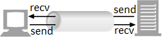

***************************
Programmidevaheline suhtlus
***************************

Ükski programm pole saar -- alati sõltub sinu poolt kirjutatud programmikood mingist koodist, mis on kellegi teise poolt kirjutatud. Kõige selgemalt viitavad sellele ``import``-laused, aga ka ilma nendeta sõltub su programm Pythoni sisseehitatud funktsioonidest ja virtuaalmasina koodist. Sellest hoolimata moodustub selliste sõltuvuste puhul programmi käivitamisel suhteliselt ühtne tervik -- **operatsioonisüsteemi protsess**, mille erinevad komponendid jagavad sama mälu ning saavad vastastikku funktsioone välja kutsuda.

Selles peatükis vaatame kahte viisi, kuidas panna omavahel suhtlema programme, mis elavad **erinevates protsessides** ja võivad olla kirjutatud erinevates programmeerimiskeeltes. Alamprotsesside skeem on tehniliselt väga lihtne, aga toimib vaid ühe masina piires. Pistikute kasutamisel võivad programmid asuda ka eri arvutites, aga nende kasutamisel peab rohkemate detailidega arvestama.  


Alamprotsessid
==============
Kui programm käivitab oma töö käigus teise programmi, siis algse programmi protsessi nimetatakse selles kontekstis *ülemprotsessiks* ja uue programmi protsessi *alamprotsessiks*. Kui uus programm on konsooliprogramm (st. mittegraafiline programm), siis saab ülemprotsess kergesti alamprotsessile sisendit anda ja selle väljundit lugeda. Teisisõnu, ülemprotsess saab alamprotsessiga käituda samamoodi nagu inimkasutaja.

Käivitamine ja väljundi lugemine
--------------------------------
Võtame esimeseks näiteks konsooliprogrammi ``ping``, mis testib, kas etteantud võrguaadress on kättesaadav. Inimkasutaja kasutaks seda programmi süsteemi käsureal umbes nii:

.. sourcecode:: none

    C:\Windows\System32>ping google.com
    
    Pinging google.com [2a00:1450:4010:c05::65] with 32 bytes of data:
    Reply from 2a00:1450:4010:c05::65: time=20ms
    Reply from 2a00:1450:4010:c05::65: time=20ms
    Reply from 2a00:1450:4010:c05::65: time=20ms
    Reply from 2a00:1450:4010:c05::65: time=20ms
    
    Ping statistics for 2a00:1450:4010:c05::65:
        Packets: Sent = 4, Received = 4, Lost = 0 (0% loss),
    Approximate round trip times in milli-seconds:
        Minimum = 20ms, Maximum = 20ms, Average = 20ms  

Esimesel real on näha kasutaja poolt sisestatud käsklus ``ping google.com`` ja peale seda tulevad programmi poolt väljastatud read. Kiri ``Sent = 4, Received = 4, Lost = 0`` näitab, et saime kõigile päringutele vastuse -- seega oli Google'i avaleht sel hetkel kättesaadav.

Pythonis on alamprogramme kõige lihtsam käivitada moodulis :py:mod:`subprocess` oleva funktsiooni :func:`run<subprocess.run>` abil. Järgnev näide demonstreerib ``ping``-i käivitamist ja selle väljundi uurimist:

.. sourcecode:: py3

    import subprocess
    
    vastus = subprocess.run(["ping", "google.com"], stdout=subprocess.PIPE,
                            universal_newlines=True)
    väljund = vastus.stdout 
    
    if "0% loss" in väljund:
        print("Aadress on kättesaadav!")
    else:
        print("Mingi jama ... Täpsem info:")
        print(väljund)

Selgitus:

* Funktsiooni ``run`` esimene argument on list, mille esimeseks elemendiks on käivitatava programmi nimi. Ülejäänud elemendid on programmi argumendid.
* ``stdout=subprocess.PIPE`` näitab, et me oleme programmi väljundist huvitatud.
* ``universal_newlines=True`` toob kaasa selle, et alamprotsessiga suhtlemine käib sõnede, mitte baidijadade abil.

.. admonition:: Harjutus 

    Muuda programmi nii, et kontrollitav aadress küsitakse kasutajalt. 

Sisendi andmine
---------------
Lisaks käsurea argumentidele ootavad osad programmid infot ka *standardsisendisse*. Standardsisend on see, kust Pythoni ``input`` käsk loeb kasutaja poolt sisestatud teksti.

Oletame, et me soovime kirjutada programmi, mis kontrollib, kas tudengi poolt kirjutatud Pythoni skript töötab õigesti. Ütleme näiteks, et tudengile anti ülesanne kirjutada programm, mis küsib kasutajalt temperatuuri celsiuse skaalal ja väljastab selle fahrenheiti skaalal ümardatuna 1 komakohani. Skripti käivitamiseks ja kontrollimiseks võiksime kirjutada sellise programmi:

.. sourcecode:: py3
    :emphasize-lines: 2,12-15

    import subprocess
    import sys
    
    testid = {
        0.0 : 32.0,
        -51 : -59.8,
        39  : 102.2
    }
    
    for celsius in testid:
        fahrenheit = testid[celsius]
        sisend = str(celsius) + "\n"
    
        vastus = subprocess.run([sys.executable, "teisendus.py"],
                                input=sisend, stdout=subprocess.PIPE,
                                universal_newlines=True)
        väljund = vastus.stdout
    
        if str(fahrenheit) not in väljund:
            print("VIGA! Sisendi", celsius, "korral ei leidnud väljundist oodatud vastust.")
        else:
            print("OK")

Selgitus:

* Pythoni skriptide käivitamiseks käsureal tuleb sisestada midagi sellist: ``python skripti_nimi.py``. Seetõttu oleksime võinud proovida ka anda ``run``-i esimeseks argumendiks ``["python", "lahendus.py"]``. Jama on selles, et kõigis süsteemides ei pruugi Python olla PATH-is ja mõnes süsteemis on Pythoni interpretaatori nimi midagi muud. Seetõttu kasutasime mooduli :py:mod:`sys` muutujat :py:data:`executable<sys.executable>`, mis annab parasjagu kasutatava Pythoni interpretaatori täpse tee ja nime.
* Testsisendi teisendasime me kõigepealt sõneks ja lisasime reavahetuse (see vastab kasutajapoolsele ENTER-i vajutusele)
 

.. admonition:: Harjutus

    Salvesta samasse kausta enda *teisendus.py* ja proovi, kas testprogramm jääb sinu lahendusega hakkama.

Vigade tuvastamine
------------------
Proovi eelmist programmi käivitada ka nii, et jooksvas kaustas pole testitavat skripti. Nagu näed, jätab meie testprogramm siis mulje, et skript leidus, aga töötas valesti. Põhjus on selles, et alamprotsessis juhtuvad vead (antud juhul skripti puudumine) ei tekita viga ülemprotsessis.

Kui soovime saada lihtsalt teada, kas alamprotsess jõudis õnnelikult lõpule või mitte, siis piisab, kui uurida funktsiooni ``run`` poolt tagastatud objekti attribuuti :py:attr:`returncode<subprocess.CompletedProcess.returncode>` -- kui see on ``0``, siis on kõik korras, kõik muud väärtused on veakoodid.

Kui tahame lisaks näha ka alamprotsessis antud veateateid, siis peame programmi käivitamisel ütlema, et oleme ka veavoost huvitatud (tavaline väljund ja veateated pannakse üldiselt erinevatesse voogudesse):

.. sourcecode:: py3
    :emphasize-lines: 15,18-22

    import subprocess
    import sys
    
    testnäited = {
        0.0 : 32.0,
        -51 : -59.8,
        39  : 102.2
    }
    
    for celsius in testnäited:
        fahrenheit = testnäited[celsius]
        sisend = str(celsius) + "\n"
    
        vastus = subprocess.run([sys.executable, "lahendus.py"],
                                input=sisend, stdout=subprocess.PIPE, stderr=subprocess.PIPE,
                                universal_newlines=True)
        väljund = vastus.stdout
    
        if vastus.returncode != 0:
            print("VIGA! Sisendi", celsius, "korral ebaõnnestus programmi käivitamine.",
                  "Veakood oli", vastus.returncode, "ja veavoo sisu oli järgmine:\n",
                  vastus.stderr)
        elif str(fahrenheit) not in väljund:
            print("VIGA! Sisendi", celsius, "korral ei leidnud väljundist oodatud vastust.")
        else:
            print("OK")


  
Klient-server skeem ja pistikud
===============================
Ülem- ja alamprotsessi skeem on lihtne, aga võimaluste poolest üpris piiratud -- kui me tahame teise programmi teenuseid kasutada, siis tuleb see igal kasutuskorral uuesti käivitada ja ta peab jooksma samas masinas.

Paindlikum lahendus on klient-server skeem, kus üks programm -- server e teenindaja -- on programmeeritud selliselt, et ta suudaks oma protsessi eluea jooksul abi pakkuda mitmele programmile -- kliendile. Selline lahendus võib teha süsteemi kiiremaks (programmi käivitamisele ei pea iga pöördumise korral aega kulutama) ja paindlikumaks (ühe pöördumise käigus kogutud infot saab kergesti ära kasutada teise pöördumise juures. Klient-server lahendused lubavad harilikult ka kliendi ja serveri paigutada eri masinatesse.

Kõige olulisem näide klient-server skeemist on brauser-veebiserver, kus üks veebiserveri protsess suudab oma eluaja jooksul teenindada mitut klienti (brauserit), kusjuures klientprotsess asub harilikult teises masinas.

Klient-server süsteemis moodustatakse harilikult kliendi ja serveri vahel suhtluskanal, mille otspunkte nimetatakse **pistikuteks** (ing k *sockets*). Kõikides levinud programmeerimiskeeltes on vahendid pistikute loomiseks ja nende kaudu suhtlemise korraldamiseks. Pythonis asub kõik vajalik standardteegi moodulis :py:mod:`socket`.

Server
------
Vaatame kõigepealt ühte lihtsat Pythonis kirjutatud serverit:

.. sourcecode:: py3

    # serverprogramm
    import socket
    import time
    
    # Paneme serveri kuulama porti 7482 (loodame, et see pole juba kasutuses).
    # "localhost" tähendab, et esialgu aktsepteerime vaid samast arvutist
    # tulevaid ühendusi.
    serveri_aadress=("localhost", 7842)
    kuulamise_pistik = socket.socket(socket.AF_INET, socket.SOCK_STREAM)
    kuulamise_pistik.bind(serveri_aadress)
    kuulamise_pistik.listen()
    
    # Kliendi teenindamise kood on lõpmatus tsüklis, kuna me tahame 
    # peale ühe kliendiga lõpetamist olla valmis järgmise kliendi jaoks.
    i = 1
    while True:
        print("Hakkan klienti ootama")
        suhtlemise_pistik, kliendi_aadress = kuulamise_pistik.accept()
        print("Sain just ühenduse kliendiga nr.", i)
        teade = "Tere, klient nr. {}! Kell on {}".format(i, time.strftime("%H:%M:%S"))
        suhtlemise_pistik.sendall(teade.encode("UTF-8"))
        print("Saatsin talle sellise teate:", teade)
        suhtlemise_pistik.close()
        i += 1

Serverites kasutatakse kahte tüüpi pistikuid: *kuulamispistikud* ja *suhtlemispistikud*. Antud näites luuakse funktsiooniga :py:func:`socket<socket.socket>` kõigepealt pistik, millele seejärel antakse meetodite :py:meth:`bind<socket.socket.bind>` ja :py:meth:`listen<socket.socket.listen>` abil **kuulamispistiku roll**.

.. admonition:: Serveri aadress

    Mida tähendab antud kontekstis serveri aadress? Koodist on näha, et see koosneb kahest komponendist -- hosti nimest ja pordi numbrist. Nime ``localhost`` tuleks kasutada siis, kui tahetatakse teendindada vaid samas arvutis olevaid kliente. Võrguklientide lubamiseks tuleb sinna panna arvuti nimi või IP-aadress. Selle teadasaamiseks võib kasutada funktsiooni :py:func:`socket.gethostname`.
    
    Kui mingi arvuti poole saaks pöörduda vaid IP-aadressi või hosti nime kaudu, siis saaks selles arvutis joosta vaid üks server. Selle probleemi lahendamiseks ongi serveri aadressi lisakomponendiks võetud üks number -- *pordi number*, mis eristab seda serverit teistest samas masinas jooksvatest serveritest.
    
    Numbrid, mis on väiksemad kui 1024, on reserveeritud kindlat tüüp serverite jaoks (näiteks veebiserverid kuulavad tavaliselt porti 80), seetõttu valisime oma näitesse ühe suurema numbri, mida ükski tuntud programm `ei paista kasutavat <https://en.wikipedia.org/wiki/List_of_TCP_and_UDP_port_numbers>`_.


Kui käivitad ülaltoodud programmi, siis näed, et programm jookseb kuni :py:meth:`accept<socket.socket.accept>` meetodi väljakutseni ja jääb siis ootele. Selleks, et server sellest kohast edasi jõuaks, peab mingi programm (st. klient) ühenduma porti 7482. 
Kui see juhtub, siis tagastatakse lisaks kliendi aadressile üks uus pistik -- **suhtlemispistik**, mille abil saab server kliendiga suhelda.

Antud näites seisneb suhtlus selles, et server saadab meetodi :py:meth:`sendall<socket.socket.sendall>` abil kliendile lihtsalt ühe teate. Kuna pistikuid kasutades käib suhtlus baitides, mitte sümbolites, siis teisendatakse teate tekst eelnevalt meetodiga :py:meth:`encode<str.encode>` baidijadaks (st. tüübiks ``bytes``).

.. admonition:: Terminoloogia

    Ametlikud terminid, mida professionaalid *kuulamispistiku* ja *suhtlemispistiku* asemel tegelikult kasutavad, on *serverpistik* (*server socket*) ja *klientpistik* (*client socket*). Need terminid aga pole paljude arvates hästi õnnestunud ja võivad tekitada segadust. Seetõttu räägime siin *kuulamispistikutest* ja *suhtlemispistikutest*.

Klient
------
Kust aga võtta klientprogramm, mis ühenduks näidatud porti? Me kirjutame selle ise:

.. sourcecode:: py3

    # klientprogramm
    import socket
    
    serveri_aadress=("localhost", 7842)
    suhtlemise_pistik = socket.socket(socket.AF_INET, socket.SOCK_STREAM)
    suhtlemise_pistik.connect(serveri_aadress)
    vastus = suhtlemise_pistik.recv(1024)
    print("Sain serverilt sellise vastuse:", vastus.decode("UTF-8"))

Siin luuakse jälle funktsiooni :py:func:`socket<socket.socket>` abil pistik, aga ``bind`` ja ``listen`` asemel kutsutakse välja meetod :py:meth:`connect<socket.socket.connect>`, millega määratakse sellele pistikule suhtluspistiku roll. Suhtluspistikust loetakse meetodi :py:meth:`recv<socket.socket.recv>` (lühend sõnast *receive*) abil mingi hulk baite (argument 1024 näitab, et ei soovita lugeda rohkem kui 1024 baiti), mis teisendatakse :py:meth:`decode<bytes.decode>` abil sõneks.

Kui sa nüüd käivitad klientprogrammi nii, et samal ajal serverprogramm käib, siis peaksid väljunditest nägema, et server sai oma kliendi kätte, saatis sõnumi ja jäi uut klienti ootama ning klient sai oma sõnumi kätte ja lõpetas töö.

.. admonition:: Kuidas käivitada mitut Pythoni programmi korraga?

    Mõni IDE-de (nt Thonny) lubab käivitada vaid ühte programm korraga -- teise programmi käivitamisel katkestatakse esimene programm. Sel puhul tuleks võtta kasutusele kaks IDE akent.
    
    Thonny puhul saab mitut akent lubada, kui valid Tools menüüst Options => General ja eemaldad linnukese valiku "Allow only single Thonny instance" eest). Alternatiivina võid installida endale eraldi `ametliku Pythoni distributsiooni <https://www.python.org/downloads/>`_, ning kasutada teise akna asemel sealset IDLE programmi.


Toru analoogia
--------------
Suhtluspistikute paremaks mõistmiseks võime kujutada ette, et kliendi :py:meth:`connect<socket.socket.connect>`-i ja serveri :py:meth:`accept<socket.socket.accept>`-i koostöös tekib kahe protsessi vahele virtuaalne toru ja suhtluspistikud on selle toru otsad.

Kuigi meie näites server ainult kirjutas sinna torusse (meetodiga :py:meth:`sendall<socket.socket.sendall>`) ja klient ainult luges sellest torust (meetodiga :py:meth:`recv<socket.socket.recv>`), siis tegelikult saavad mõlemad osapooled teisele kirjutada ja teise kirjutatut lugeda. Seetõttu oleks veel täpsem öelda, et suhtluspistikute vahelises torus on justkui kaks soont, üks kummagi suuna jaoks:



.. admonition:: Terminoloogiast

    Termini *toru* (ing k *pipe*) kasutamisel tuleb tegelikult olla ettevaatlik. Siin me kasutasime seda sõna üldises, kujundlikus tähenduses, aga sel sõnal on IT-s ka spetsiifilisem tähendus, mis tähistab enamasti ühendust ülem- ja alamprotsessi vahel. Sellele tähendusele viitab ka ülalpool kasutatud avaldis ``subprocess.PIPE``.

``recv`` nüansid
----------------
Eespool toodud näites tegime pistikust lugemise kohta ühe lihtsustuse, mida tõsises programmis ei saa lubada:

.. sourcecode:: py3

    # klientprogramm
    ...
    vastus = suhtlemise_pistik.recv(1024)
    ...

Meetod :py:meth:`recv<socket.socket.recv>` nõuab argumendiks täisarvu, mis näitab, mis on maksimaalne baitide arv, mida me soovime lugeda. Selle põhjal eraldab Python vastuse jaoks mälu. Kui server peaks saatma rohkem infot kui 1024 baiti (ladina tähtede ja UTF-8 kodeeringu puhul esitatakse üks täht ühe baidina), siis jääb osa saadetud infot kindlasti lugemata. Veel häirivam on aga see, et ka siis, kui server saadab vähem kui 1024 baiti -- näiteks 200 baiti -- võib jääda selle käsklusega osa infot lugemata.

Erinevate võrgutehnoloogia nüansside tõttu on ``recv`` programmeeritud nii, et ta loeb ja tagastab selle portsu vastusest, mis parasjagu võtta on. Isegi kui server saatis vastuse ühe portsuna, võib juhtuda, et kliendini jõuab see kahe portsuna. (Meie näites seda tõenäoliselt ei juhtunud, aga selleks tuleb valmis olla.) Kui ``recv``-i väljakutsumise hetkeks on kohale jõudnud vaid esimene ports, siis see väljakutse tagastabki ainult esimese portsu (või osa esimesest portsust, kui see ports on suurem kui ``recv`` argument). Ülejäänud portsude lugemiseks tuleb ``recv``-i kasutada lihtsalt mitu korda:

.. sourcecode:: py3

    # klientprogramm
    ...
    vastus = b"" # tühi baidijada
    while ...:
        vastus += suhtlemise_pistik.recv(1024)
    ...

Aga kuidas me teame, milline ports on viimane? 

Sellele probleemi lahendus sõltub valitud suhtlemise skeemist e protokollist:

#. Kui on ette nähtud, et üks pool saadab kogu info korraga ja rohkem tal teise poolega suhelda pole vaja, siis võiks ta peale ``sendall``-i pistiku sulgeda. Sel juhul peaks teine pool ``recv``-ma niikaua, kuni tulemuseks on tühi baidijada. See annab märku, et saatja on ühenduse sulgenud ja rohkem midagi ei tule.
#. Alternatiivina võib suhtlusprotokolli disainida nii, et iga sõnumi lõpus on spetsiaalne sümbol, bait, või sümboli/baidi jada. Siis kasutab lugeja ``recv``-i niikaua, kuni saab kätte vastava tähise. Selle kohta tuleb allpool, veebiserveri osas, ka näide. (Muideks, sama põhimõttega töötab meie vana tuttav :py:func:`input<input>` -- ta ootab ja loeb kasutaja sisendit niikaua, kuni saab kätte reavahetuse sümboli, mis tähistab kokkuleppeliselt ühe sisendi lõppu.)
#. Kolmanda võimalusena võib kokku leppida, et iga sõnum on täpselt *n* baidi pikkune. Sel juhul kasutab lugeja ``recv``-i niikaua, kuni õige arv baite on koos.

Meie lihtsa programmi korral, kus peale sõnumi saatmist server selle kliendiga rohkem suhelda ei soovinud, saame kliendi programmeerimisel vabalt kasutada esimest võimalust:

.. sourcecode:: py3
    :emphasize-lines: 8-14

    # klientprogramm
    import socket
    
    serveri_aadress=("localhost", 7842)
    suhtlemise_pistik = socket.socket(socket.AF_INET, socket.SOCK_STREAM)
    suhtlemise_pistik.connect(serveri_aadress)
    
    vastus = b""
    while True:
        ports = suhtlemise_pistik.recv(1024)
        if len(ports) > 0:
            vastus += ports
        else:
            break 
    
    print("Sain serverilt sellise vastuse:", vastus.decode("UTF-8"))

.. _lihtne_veebiserver:

Lihtne veebiserver
==================

.. note::

    Selle jaotuse eesmärk on demonstreerida pistikute kasutamist, tutvustades sealjuures HTTP põhimõtteid. "Päris" veebiprogrammide kirjutamiseks soovitame tutvuda mooduliga :py:mod:`http.server` või mõne veebiraamistikuga, mis kannab madala taseme detailide eest ise hoolt.
    

Proovime nüüd pistikute abil panna kokku ühe lihtsa veebiserveri:

.. sourcecode:: py3

    import socket
    import time
    
    serveri_aadress=("localhost", 7482)
    kuulamise_pistik = socket.socket(socket.AF_INET, socket.SOCK_STREAM)
    kuulamise_pistik.bind(serveri_aadress)
    kuulamise_pistik.listen()
    
    i = 1
    while True:
        print("Hakkan klienti ootama")
        suhtlemise_pistik, kliendi_aadress = kuulamise_pistik.accept()
        print("Sain just ühenduse kliendiga nr.", i)
    
        # Uurime kliendi käest, mida ta tahtis ...
        päring = b""
        while b"\r\n\r\n" not in päring: # kuni päringu (päise) lõpp pole veel loetud
            ports = suhtlemise_pistik.recv(1024)
            if len(ports) > 0:
                päring += ports
            else:
                break
                
        päringu_päis = päring.split(b"\r\n\r\n")[0].decode("ASCII")
        print("Päringu päis oli selline: \n" + päringu_päis)
    
        # Lihtsuse mõttes praegu me vastuse koostamisel päringut veel ei arvesta
        vastuse_päis = """HTTP/1.0 200 OK
    Content-Type: text/html; charset=utf-8"""
        
        vastuse_keha = """
        <html>
            <head>
                <title>Tere!</title>
            </head>
            <body>
                <h1>Tere, klient nr. {}!</h1>
                <p>Kell on {}</p>
            </body>
        </html>""".format(i, time.strftime("%H:%M:%S"))
        
        vastus = vastuse_päis + "\r\n\r\n" + vastuse_keha
        suhtlemise_pistik.sendall(vastus.encode("UTF-8"))
        print("Saatsin talle sellise teate:", vastus)
        suhtlemise_pistik.close()
        i += 1
    
Kui sa käivitad selle programmi ja avad brauseris aadressi http://localhost:7482/, siis peaksid nägema serveri poolt saadetud tervitust ja kellaaega.

.. admonition:: favicon.ico

    Serveri väljundit uurides märkad ilmselt, et kui sa pöördusid brauseri kaudu serveri poole ühe korra, siis server reageeris kaks korda, just nagu brauser oleks teinud kaks pöördumist. Tegelikult nii oligi -- lisaks sinu poolt soovitud pöördumisele tegi brauser omal algatusel veel ühe pöördumise, mille eesmärk oli saada teada, kas serveril on selle URL-i jaoks pakkuda ka mingi ilus ikoonike, mida aadressiribal näidata. 

.. admonition:: Port 80

    Harilikult kuulavad veebiserverid porti 80. Sel juhul ei pea URL-is pordi numbrit üldse mainima. Selles näites kasutasime teist porti, kuna port 80 võib olla mõne programmi (nt. Skype) poolt juba võetud. 

HTTP
----
Selleks, et kliendi ja serveri suhtlus toimiks, peavad nad alati arvestama mingi kindlaksmääratud suhtlusskeemi e *protokolliga*. Veebiserveri ja brauseri suhtluse määrab protokoll nimega `HTTP <https://en.wikipedia.org/wiki/Hypertext_Transfer_Protocol>`__. 

HTTP on põhiolemuselt on väga lihtne protokoll:

#. Klient proovib võtta serveriga ühendust. Kui server sellega nõustub, siis tekitatakse osapoolte vahele eespool kirjeldatud suhtustoru koos selle kasutamiseks vajalike suhtluspistikutega. 
#. Klient saadab oma suhtluspistiku kaudu serverile baidijada, mida nimetatakse *päringuks* (ing k *request*).
#. Server uurib päringu sisu ja saadab vastu omapoolse baidijada, mida nimetatakse *vastuseks* (ing k *response*).
#. Ühendus suletakse, suhtlustoru ja pistikud visatakse minema.

Nii päring kui vastus võivad koosneda kahest osast -- *päis* (ing k *head*) ja *keha* (ing k *body*). (NB! Siinkohal me ei räägi HTML-ist, ega ``<head>`` ja ``<body>`` elementidest).

Kui uurisid meie näiteserveri väljundit, siis nägid muuhulgas, milline võib olla brauseri poolt koostatud **päringu päis**:

.. sourcecode:: none

    GET / HTTP/1.1
    Host: localhost:7482
    Connection: keep-alive
    Pragma: no-cache
    Cache-Control: no-cache
    User-Agent: Mozilla/5.0 ... Chrome/54.0.2840.99
    Accept: */*
    Referer: http://localhost:7482/
    Accept-Encoding: gzip, deflate, sdch, br
    Accept-Language: en-US,en;q=0.8,et;q=0.6

Kõige tähtsam on päise esimene rida, mis näitab ära HTTP *meetodi* (antud näites `GET <http://www.w3schools.com/tags/ref_httpmethods.asp>`_), *tee* (antud näites ``/``) ning protokolli versiooni (antud näites ``HTTP/1.1``). Teiste päise elementide (ing k *headers*) kohta saad lugeda `siit <https://en.wikipedia.org/wiki/List_of_HTTP_header_fields>`__.

*GET*-päringu korral on **päringu keha** tühi, aga nt *POST*-päringu puhul sisaldab keha HTML vormi abil kogutud andmeid.

Meie näites on näha ka üks võimalik **vastuse päis**:

.. sourcecode:: none

    HTTP/1.0 200 OK
    Content-Type: text/html; charset=utf-8

Esimese reaga andis server teada, et ta oskab päringule vastata -- sellele viitab kood 200.  Ilmselt oled kohanud ka koodi 404, mis tähendab, et päringus näidatud tee kohta ei ole serveril midagi öelda. (Ülejäänud võimalikke vastusekoode näed `siit <https://en.wikipedia.org/wiki/List_of_HTTP_status_codes>`_.)

``Content-Type`` element annab infot selle kohta, kuidas tuleks tõlgendada **vastuse keha**. Antud juhul ütleb server, et vastuse keha on UTF-8 kodeeringus HTML tekst.

Nii päringu kui vastuse päise lõpus on alati baidid ``b"\r\n\r\n"``, mille järgi päist lugev osapool saab aru, et päis on kohale jõudnud.

Päringu tõlgendamine
--------------------
Meie veebiserver on hetkel kaunis igav, kuna vastus ei sõltu sellest, kuidas klient päringu tegi. Kui sa proovid järgmisi URL-e, siis näed, et kõik annavad sama tulemuse:

* http://localhost:7482/
* http://localhost:7482/uus_kirje.php?nimi=Peeter&lemmikloom=kala
* http://localhost:7482/pildid/maasikas.jpg

Kui aga uurid serveri väljundit, siis näed, et päringu päise esimene rida on igal korral erinev:

* ``GET / HTTP/1.1``
* ``GET /uus_kirje.php?nimi=Peeter&lemmikloom=kala HTTP/1.1``
* ``GET /pildid/maasikas.jpg HTTP/1.1``

Seda asjaolu ära kasutades saabki server vastata erinevatele päringutele erinevalt:

.. sourcecode:: py3

    ...
    
    päringu_read = päringu_päis.splitlines()
    esimene_rida = päringu_read[0]
    meetod, tee, versioon = esimene_rida.split()
    
    if tee.endswith(".jpg"):
        failinimi = ... # otsi õige fail üles
        f = open(failinimi, "b")
            suhtluspistik.sendall(f.read())
        f.close()
    elif ...:
        ...
    else:
        suhtluspistik.sendall(b"Ei oska reageerida sellele päringule")
        
    ...
    
    
Turvalisus
==========
Enne kui sa oma serveri avalikukuks teed, tee endale selgeks `põhilised võimalikud turvaprobleemid <https://en.wikipedia.org/wiki/Web_application_security>`__. Suurema kindluse saamiseks aga on soovitav kasutada isetehtud veebiserveri asemel mõnda tuntud veebiserverit ja -raamistikku. 

    
.. attention:: 

    **Isegi siis, kui su veebiserver on ainult sulle kättesaadav, peab olema ettevaatlik!** Pahalasel võib õnnestuda pöörduda su veebiserveri poole kaudselt. 
    
    Näide. Kui sa programmeerid oma serveri selliselt, et päring http://localhost:7482/kustuta?fail=/kaust/fail.txt kustutab näidatud faili, siis on võimalus, et pahalane saab su faile kustutada isegi siis, kui tal pole sinu arvutile mingit ligipääsu.
    
    Oletame, et su lemmikblogi kuvab külastajate poolt postitatud kommentaare selliselt, et kui postituses leidub URL lõpuga ".jpg", siis seda tõlgendatakse mingi pildi aadressina ja kuvatakse ```` elemendi abil. Kui nüüd pahalane postitab URL-i http://localhost:7482/kustuta?fail=/kaust/fail.txt&blaablaa.jpg, siis tekib postituse leheküljele element ````. Kui nüüd sina enda brauseriga külastad seda blogi ja su veebiserver samal ajal jookseb, siis su brauser pöördub sinu teadmata (aga tehniliselt võttes siiski sinu nimel) selle ohtliku aadressi poole.
    
    Sellist skeemi nimetatakse inglise keeles `cross-site request forgery <https://en.wikipedia.org/wiki/Cross-site_request_forgery>`__ ja seda on kasutatud näiteks `uTorrenti kasutajate ründamiseks <http://www.securityfocus.com/bid/28847/exploit/>`__. 


Kommentaarid
============
.. disqus::
    :disqus_identifier: programmidevaheline_suhtlus