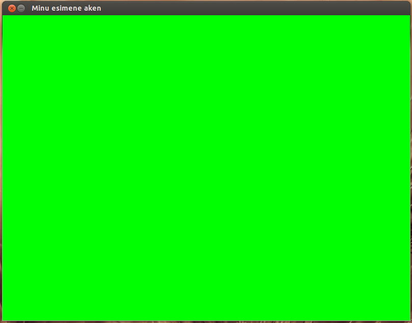

******
Pygame
******
(Kirjutanud Jaan Janno)

Pygame on teek ehk library, mille peamine eesmärk on arvutimängude programmeerimise lihtsustamine. Selle abil on võimalik suhteliselt lihtsasti tekitada graafikat ja heli ning kasutada erinevaid sisendseadmeid nagu näiteks klaviatuurid, hiired ning joystick'id. 

Tema erinevus teiste teekide kõrval, mida kursuse jooksul kasutanud oleme, on see, et Pygame ei ole Python'iga automaatselt kaasas. See tähendab, et on tarvilik teda eraldi installida.

Kuigi Pygame'i põhisuunaks on arvutimängud, on temaga võimalik ka palju muud huvitavat korda saata. Näiteks võib Pygame'i kasutada ka täiesti tavaliste programmide kasutajaliideste loomisel. Samuti on võimalik temaga kaasas olevaid audio-funktsioone edukalt mujal rakendada. See peatükk keskendub aga peamiselt siiski mängude loomisele.

Paketi paigaldamine
===================
Pygame'i saab paigaldada :ref:`pip-i abil <lisapaketid>`. Paketi nimeks on `pygame`, seega installimise käsk on ``pip install pygame`` (Windowsi puhul) või ``pip3 install pygame`` (Linuxi ja Mac-i puhul).

Kuidas Pygame toimib?
=====================
Pygame'i võib võrrelda kunstnikuga, kes animafilmi jaoks järjest uusi kaadreid joonistab:

* Iga kaader joonistatakse enne ekraanile kuvamist üleni valmis, kasutajani poolik pilt ei jõua.
*  Pealepoole jäävad need kujundid, mis viimasena kaadrile joonistati.
* Mida rohkem asju kaadrile joonistada, seda rohkem kulub aega.

Õnneks on Pygame võimeline palju kiiremini joonistama kui keskmine kunstnik ning ta joonistab alati täpselt seda, mida programmeerija käsib.

Pygame'i abiga tehtud mängu elutsükli ülesehitus on üldjuhul selline:

1. Kasutajalt kogutakse sisendid
2. Kui kasutaja soovib mängu sulgeda, siis mäng sulgub
3. Uuendatakse kõigi mängus olevate objektide andmeid. (Nt. Liikuva auto koordinaate kasvatatakse igas tsükli sammus tema kiiruse võrra.)
4. Joonistatakse mängus olevate objektide seisukorrale vastav pilt.
5. Valmis joonistatud pilt kuvatakse ekraanil.
6. Tagasi esimese punkti juurde.

Lisaks on võimalik mängule veel lisada ka muusikat ning heliefekte.

Esimene Pygame'i aken
=====================
Esimeseks eesmärgiks on meil lihtsa akna tekitamine, mille sisu värvime roheliseks. 
Nagu teistegi teekidega, mis kursuse jooksul kasutanud oleme, on ka Pygame'i tarvis esmalt importida, et tema funktsioone kasutada saaks.

.. sourcecode:: py3

    import pygame

Kui sellega tekkis viga, on Pygame arvatavasti installimata või installitud vale pythoni versiooni jaoks.

Pygame'i tööle rakendamiseks on veel vaja käsku:

.. sourcecode:: py3

    pygame.init()

Järgmisena tekitame akna pinna järgmise käsuga:

.. sourcecode:: py3

    ekraani_pind = pygame.display.set_mode( (640, 480) )

Eelnevas käsus defineeritud muutujat ``ekraani_pind`` kasutamegi hiljem joonistuspinnana, mida lõpuks kasutajale näitatakse. Argumendiks on pinna suurus - 640 on meie näite puhul akna laius ning 480 tema kõrgus.

Et meie aken ilusam välja näeks, lisame talle ka nime. Kasutame järgmist funktsiooni:

.. sourcecode:: py3

    pygame.display.set_caption("Minu esimene aken")

Seejärel värvime tekitatud pinna roheliseks:

.. sourcecode:: py3

    ekraani_pind.fill( (0,255,0) )

Eelnev funktsioon võttis sellise argumendi, mis koosneb kolmest arvust. Esimene neist punase värvi hulk, teine rohelise ning viimane sinise, kõik sakaalas 0-255. Kogu pind, millele antud funktsioon rakendatakse, värvitakse määratud värvi.

Seejärel on tarvis Pygame'ile öelda, et meile pilt on valmis ning et soovime seda kasutajale näidata. Selle jaoks kasutame käsku:

.. sourcecode:: py3

    pygame.display.flip()

Seejärel tekitame lõpmatu ``while True`` tsükli, mis igas sammus loeb kasutajalt sisendeid muutujasse event ning kontrollib seejärel, kas kasutaja soovib programmi sulgeda:

.. sourcecode:: py3

    while True: 
        event = pygame.event.poll() 
        if event.type == pygame.QUIT: 
            break

Muutujasse ``event`` omistatakse kogum kõigist sisenditest, mis meie programmi saabuvad (nt. Klaviatuurivajutused, hiireklikid jne.). Kontrollime, kas selles kogumis leidub sellist tüüpi sisend, mis soovib meie programmi sulgeda. Kui selline leidub, siis lõpetame tsükli.

Kui tsükkel on lõppenud, on tarvilik veel Pygame välja lülitada:

.. sourcecode:: py3

    pygame.quit()

Seega kokkuvõttes saime sellise koodijupi:

.. sourcecode:: py3

    import pygame
    pygame.init()
    ekraani_pind = pygame.display.set_mode( (640, 480) )
    pygame.display.set_caption("Minu esimene aken")
    ekraani_pind.fill( (0,255,0) )
    pygame.display.flip()
    while True: 
        event = pygame.event.poll() 
        if event.type == pygame.QUIT: 
            break
    pygame.quit()

Lõpptulemus peaks välja nägema umbes selline:

Harjutus. Akna suurus
---------------------
Muuda akna suurust selliselt, et tema laius oleks 800 ühikut ning kõrgus 600.

Harjutus. RGB
-------------
Uuri järgmiselt lehelt erinevaid RGB(red-green-blue) kujul värve ning muuda akna värv helesiniseks: http://zdoom.org/zdkb/zdoom3.html

Kujundite joonistamine
======================
Pygame pakub võimalust paljude erinevate kujundite hõlpsaks joonistamiseks. Vaatleme esimesena ristküliku joonistamise funktsiooni.
Selle jaoks on meil esmalt tarvis tekitada muutuja, mis joonistatava ristküliku andmeid sisaldaks. Seda on Pygame'i abiga lihtne teha:

.. sourcecode:: py3

    ristkylik1 = pygame.Rect(100, 0, 100, 100)

Argumentideks olid eelneval vastavalt: x koordinaat, y koordinaat, laius, kõrgus. Koordinaadid x ja y määravad ristküliku vasaku ülemise nurga asukoha. Selle sama ristküliku saame mingile pinnale joonistada järgneva käsu abil:

.. sourcecode:: py3

    pygame.draw.rect(surface, color, Rect)

Esimeseks argumendiks on pind, millele joonistada soovime. Argumendiks color on joonistatava ristküliku värv – samal kujul nagu eelnevalt kogu ekraani värvi määrasime, ehk näiteks ``(0, 3, 133)``. Kolmas argument on ristkülik samal kujul nagu enne muutuja ``ristkylik1`` määrasime.

Proovime need samad 2 funktsiooni lisada eelmises peatükis kirjutatud programmi sisse:

.. sourcecode:: py3

    import pygame
    
    pygame.init()
    
    ekraani_pind = pygame.display.set_mode( (800, 600) )
    pygame.display.set_caption("Minu esimene aken")
    ekraani_pind.fill( (0,255,0) )
    
    ristkylik1 = pygame.Rect(100,0,100,100) 
    pygame.draw.rect(ekraani_pind, (255,0,0), ristkylik1)
    pygame.display.flip()
    
    while True: 
        event = pygame.event.poll() 
        if event.type == pygame.QUIT: 
            break
    pygame.quit()
    
NB! Oluline on see, et ristkülik joonistada peale kogu ekraani roheliseks värvimist. Muidu joonistatakse meie ristkülik samuti rohelisega üle.

Koos joonistatud ristkülikuga peaks meie aken välja nägema selline:

Harjutus. Ristkülikud
---------------------

Paiguta ristkülik ekraani ülemisse vasakusse nurka ning muuda ta 2 korda suuremaks. Joonista veel teine ristkülik, mis esimese osaliselt kataks. Anna teisele ristkülikule mõni teine värv.

Piltide joonistamine ja sisse laadimine
=======================================
Et  Pygame'is pildifaili ekraanile joonistada, tuleb ta kõigepealt sisse laadida. Selleks saab kasutada käsku, mis pildi muutujasse loeb:

.. sourcecode:: py3

    pilt1 = pygame.image.load("pilt.png") 

Argumendiks pole vaja anda muud, kui pildi aadress. Kui pilt on pythoni skripti failiga samas kaustas, piisab vaid faili nimest.

Parim viis pildi sisse laadimiseks on salvestada pilt pythoni scripti faili lähedasse kausta ning tema asukoht argumenti lisada suhtelisel kujul (St. mitte kujul ``C:/mäng/pildid/pilt.jpg``, vaid nt. ``pildid/pilt.jpg`` kui pythoni fail on kaustas ``mäng``). See võimaldab hiljem lihtsasti faile uude kohta ümber tõsta ning teistega jagada (ilma aadresse ümber kirjutamata).

Toetatud on paljud erinevad pildiformaadid:
JPG, PNG, GIF, (animeerimata kujul), BMP, PCX, TGA (pakkimata kujul), TIF, LBM, PBM, PGM, PPM, XPM.

Sellese samasse pilt1 muutujasse laetud pildi saame mingile suvalisele pinnale joonistada järgmise käsuga:

.. sourcecode:: py3

    mingi_pind.blit(pilt1, (x, y))

Pinna mingi_pind asemele sobiks meil eelnevas näiteks lisada meie varem määratud pind ekraani_pind. Samuti on iga pilt eraldi pind, millele on võimalik joonistada. Seega võiksime pildile pilt1 veel mõne teise pildi samuti peale joonistada. Eelneva funktsiooni esimeseks argumendiks on pilt, mida joonistada. Teiseks argumendiks on koordinaadid pildi joonistamiseks. Nagu ristküliku joonistamise puhul, määravad x ja y koordinaadid pildi vasaku ülesmise nurga asukoha pinnal. 

Lisame need 2 käsku varem käsitletud programmijuppi:

.. sourcecode:: py3

    import pygame
     
    pygame.init() 
    ekraani_pind = pygame.display.set_mode( (800, 600) ) 
    pygame.display.set_caption("Minu esimene aken") 
    ekraani_pind.fill( (0,255,0) ) 
    ristkylik1 = pygame.Rect(100,0,100,100) 
    pygame.draw.rect(ekraani_pind, (255,0,0), ristkylik1) 
    
    pilt1 = pygame.image.load("pilt.png") 
    ekraani_pind.blit(pilt1, (120, 80)) 
    
    pygame.display.flip() 
    while True: 
        event = pygame.event.poll() 
        if event.type == pygame.QUIT: 
            break 
    pygame.quit()
    

Selle väljund võiks välja näha selline:

Harjutus. Pildi kuvamine
------------------------
Joonista või leia mingi suvaline pildifail, mis on ühes varem mainitud formaatidest ning proovi see sisse laadida ning ekraanile joonistada.

Harjutus. Veel üks pilt
-----------------------
Lae sisse veel teine pilt. Joonista see otse pildile ``pilt1``.

.. hint::

    ``pilt1.blit( ??, ??)``

Teksti joonistamine
===================
Pygame'is on võimalus ka sõne kujul olevate muutujate ekraanile kuvamiseks. See on aga selle poolest eriline, et teksti ei saa joonistada otse ekraanile, vaid kõigepealt on vaja tekstist tekitada pilt ning seejärel joonistame ekraanile hoopis selle pildi, milles tekst sisaldub.

Tekitame uue muutuja, milles hoiame teksti, mida ekraanile kuvada soovime:

.. sourcecode:: py3

    tekst = "Tere, Pygame!"

Kõigepealt tuleb paika seada sätted, millga tekst joonistatakse. Selleks on meil vaja luua uus muutuja, mis sisaldab selle fondi infot, mida kasutada tahame:

.. sourcecode:: py3

    meie_font = pygame.font.SysFont("Arial", 36)

Esimeseks argumendiks on soovitava fondi nimi ning teiseks argumendiks fondi suurus.

Nagu varem mainitud, et saa me oma teksti otse ekraanile joonistada, vaid esmalt peame tekitama pildi, millele on joonistatud meie tekst. Selleks kasutame funktsiooni:

.. sourcecode:: py3

    teksti_pilt = meie_font.render(tekst, False, (25,25,155))

Esimeseks argumendiks on sõne kujul muutuaja. Teises muutajas saab määrata, kas soovime teksti joonistades rakendada anti-aliast (). Kolmas argument on teksti värv RGB formaadis.

Selle pildi saame ekraanile kuvada täpselt samal viisil nagu eelmises peatükis pilti joonistasime:

.. sourcecode:: py3

    ekraani_pind.blit(teksti_pilt, (300, 30))

Kokku saime nüüd jälle veidi pikema koodijupi:

.. sourcecode:: py3

    import pygame
     
    pygame.init() 
    ekraani_pind = pygame.display.set_mode( (800, 600) ) 
    pygame.display.set_caption("Minu esimene aken") 
    ekraani_pind.fill( (0,255,0) )
     
    ristkylik1 = pygame.Rect(100,0,100,100) 
    pygame.draw.rect(ekraani_pind, (255,0,0), ristkylik1) 
    pilt1 = pygame.image.load("pilt.png") 
    ekraani_pind.blit(pilt1, (120, 80)) 
    
    tekst = "Tere, Pygame!" 
    meie_font = pygame.font.SysFont("Arial", 36) 
    teksti_pilt = meie_font.render(tekst, False, (25,25,155)) 
    ekraani_pind.blit(teksti_pilt, (300, 30)) 
    
    pygame.display.flip() 
    while True: 
        event = pygame.event.poll() 
        if event.type == pygame.QUIT: 
            break 
    pygame.quit()

Harjutus. Tekst
---------------
Joonista ühele varem sisse laetud piltidest peale mingi tekst. Proovi seda pilti omakorda joonistada mitmele kohale ekraanil.

Kommentaarid
============
.. disqus::
    :disqus_identifier: pygame