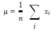

************
Statistikast
************
(Kirjutanud Allar Aav ja Andreas Suurkuusk)
 
.. warning::

    See peatükk on veel kontrollimata ja viimistlemata.

Järgnevalt vaatleme mõningaid lihtsamaid statistilisi näitajaid, milledeks on aritmeetiline keskmine, mediaan ja dispersioon.

Keskväärtus, dispersioon, standardhälve.
========================================

Dispersioon näitab kui palju tulemused erinevad(varieerivad) keskmisest. 
Näiteks kui katseseerias on kõigi katsete tulemus sama, siis katsete dispersioon on null. Mida suurem aga dispersioon on, seda enam erinevad katsete tulemused üksteisest.
Seega iseloomustab dispersioon tulemuste hajusust.
Arvutatakse alltoodud valemiga, kus :math:`x_i`  on keskväärtus, µ on konkreetne väärtus ja n on väärtuste koguarv.

Kirjapilt 

et dispersiooni iseloomustab andmete hajuvust ruudus-  see tuleneb andmete ühikust. Dispersiooni ruutjuur on standardhälve, mille sümbol on ...

Ülesanded
===========================

Ülesannete lahendamiseks laadige alla moodul "Thinkstats" http://thinkstats.com/thinkstats.py. Selles moodulis sisalduvad üldised valemid.
Neid funktsioone saab lugeda http://thinkstats.com/thinkstats.html

Lisaks tuleb alla laadida andmete failid aadressilt:

#.  Mine http://www.greenteapress.com/thinkstats/nsfg.html
#.  Kliki lingil "I accept these terms"
#.  Lae failid alla

Ülesanne 1
-----------
Kirjuta funktsioon, mis võtab sisendiks listi ja arvutab keskmise, dispersiooni ja standardhälbe.

Ülesanne 2
-----------
Taaskasutades koodi failidest ``survey.py`` ja ``first.py``, arvuta esiklaste ja teiste laste standardhälve. Kas paistab, et nende kahe grupi hajuvus on sarane? 
Kui suur on keskmiste erinevus võrreldes standardhälvete erinevusega? 

.. hint:: 

    Vaata faili first.py alamprog. „process“ 

.. hint::

    Lisan programmi tühja listi :
    
    .. sourcecode:: py3

        var=[]
        
    Seejärel lisan alamprogrammi „Process“ lõppu read:

    .. sourcecode:: py3
    
        table.var=(Var(table.lengths))    
        var.append(Var(table.lengths))

    Programmi lõppu lisan:

    .. sourcecode:: py3
    
        print("standardhälve on eskilastel:", var[0])
        print("standardhälve on teistel lastel:", var[1])

PMF
===========================
PMF on statistikas kasutatav mudel. Põhimõte on selles, et iga väärtusega on kaasas ka tõenäosus selle väärtusega elementi andmehulgast saada. 

``Pmf.py`` annab klassi mille nimeks on ``Pmf``. Kirjapilt on segane - ``Pmf`` on nii mooduli kui ka klassi nimi. Seega täielik klassi nimi on ``Pmf.Pmf``.
Vahel on nii, et ``Pmf``'i kasutatatakse ka muutuja tähistamiseks. 

``Pmf`` objekti loomiseks kasuta ``MakePmfFromList``-i, mis võtab sisendiks väärtuste listi.

Järgnevad näited on tehtud otse käsureale:

.. sourcecode:: py3

    >>> import Pmf
    >>> pmf = Pmf.MakePmfFromList([1, 2, 2, 3, 5])
    >>> print pmf
    <Pmf.Pmf object at 0xb76cf68c>
    
Objektid ``Pmf`` ja ``Hist`` on sarnaased. Mõlemas toimuvad funktsioonid ``Values`` ja ``Items`` samamoodi. Suurim erinevus on selles, et ``Hist`` kirjeldab väärtusi täisarvulise arvuga, ja Pmf loeb väärtusi float tõenäosustena.

Kui on vaja leida, millise tõenäosusega mingi väärtus esineb saab kasutada käsklust ``Prob``

.. sourcecode:: py3

    >>> pmf.Prob(2)
    0.4

Olemasolevat ``Pmf``-i saab modifitseerida lisades uue väärtuse koos tõenäosusega:

.. sourcecode:: py3

    >>> pmf.Incr(2, 0.2)
    >>> pmf.Prob(2)
    0.6
    või tõenäosust tehtega modifitseerides:
    >>> pmf.Mult(2, 0.5)
    >>> pmf.Prob(2)
    0.3

Kui ``Pmfi`` modifitseerida, ei pruugi tulemus normaliseeritud olla. See tähendab et kogutõenäosus ei ole enam 1. Selle kontrollimiseks saad kasutada käsklust ``Total``, mis tagastab kõikide tõenäosuste summa:

.. sourcecode:: py3

    >>> pmf.Total()
    0.9

Et normaliseerida kasuta käsklust ``Normalize``:

.. sourcecode:: py3

    >>> pmf.Normalize()
    >>> pmf.Total()
    1.0

``Pmf`` objektid võimaldavad kopeerimismeetodit kasutada, et mitte originaalset ``Pmf``-i muuta.

Ülesanne 3
-------------
Kirjuta programm- võttes sisendiks ``Pmf``-i väljastab üks keskväärtuse ja teine dispersiooni. 

.. hint:

    ..  image:: images/StatPilt3.png

    ..  image:: images/StatPilt4.png